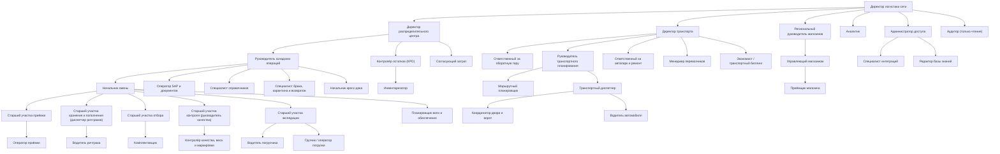

# Дерево подчинения (сгенерировано)

Подчинение не передаёт права.

```mermaid
flowchart TD
  logistics_director["Директор логистики сети"]
  dc_director["Директор распределительного центра"]
  transport_director["Директор транспорта"]
  wh_ops_head["Руководитель складских операций"]
  shift_supervisor["Начальник смены"]
  lead_receiving["Старший участка приёмки"]
  lead_storage["Старший участка хранения и пополнения (диспетчер ричтраков)"]
  lead_picking["Старший участка отбора"]
  lead_qc["Старший участка контроля (руководитель качества)"]
  lead_expedition["Старший участка экспедиции"]
  sap_doc_operator["Оператор SAP и документов"]
  mdm_specialist["Специалист справочников"]
  wave_planner["Планировщик волн и обеспечения"]
  receiving_operator["Оператор приёмки"]
  reach_driver["Водитель ричтрака"]
  forklift_driver["Водитель погрузчика"]
  picker["Комплектовщик"]
  qc_controller["Контролёр качества, веса и маркировки"]
  loader["Грузчик / оператор погрузки"]
  stock_controller["Контролёр остатков (КРО)"]
  inventory_auditor["Инвентаризатор"]
  returns_specialist["Специалист брака, карантина и возвратов"]
  tare_owner["Ответственный за оборотную тару"]
  crossdock_head["Начальник кросс-дока"]
  transport_planning_head["Руководитель транспортного планирования"]
  route_planner["Маршрутный планировщик"]
  dispatcher["Транспортный диспетчер"]
  yard_coordinator["Координатор двора и ворот"]
  driver["Водитель автомобиля"]
  fleet_manager["Ответственный за автопарк и ремонт"]
  carrier_manager["Менеджер перевозчиков"]
  region_manager["Региональный руководитель магазинов"]
  store_director["Управляющий магазином"]
  store_receiver["Приёмщик магазина"]
  billing_economist["Экономист / транспортный биллинг"]
  cost_approver["Согласующий затрат"]
  analyst["Аналитик"]
  access_admin["Администратор доступа"]
  integration_specialist["Специалист интеграций"]
  auditor_ro["Аудитор (только чтение)"]
  knowledge_editor["Редактор базы знаний"]
  logistics_director --> dc_director
  logistics_director --> transport_director
  dc_director --> wh_ops_head
  wh_ops_head --> shift_supervisor
  shift_supervisor --> lead_receiving
  shift_supervisor --> lead_storage
  shift_supervisor --> lead_picking
  shift_supervisor --> lead_qc
  shift_supervisor --> lead_expedition
  wh_ops_head --> sap_doc_operator
  wh_ops_head --> mdm_specialist
  shift_supervisor --> wave_planner
  lead_receiving --> receiving_operator
  lead_storage --> reach_driver
  lead_expedition --> forklift_driver
  lead_picking --> picker
  lead_qc --> qc_controller
  lead_expedition --> loader
  dc_director --> stock_controller
  stock_controller --> inventory_auditor
  wh_ops_head --> returns_specialist
  transport_director --> tare_owner
  wh_ops_head --> crossdock_head
  transport_director --> transport_planning_head
  transport_planning_head --> route_planner
  transport_planning_head --> dispatcher
  dispatcher --> yard_coordinator
  dispatcher --> driver
  transport_director --> fleet_manager
  transport_director --> carrier_manager
  logistics_director --> region_manager
  region_manager --> store_director
  store_director --> store_receiver
  transport_director --> billing_economist
  dc_director --> cost_approver
  logistics_director --> analyst
  logistics_director --> access_admin
  access_admin --> integration_specialist
  logistics_director --> auditor_ro
  access_admin --> knowledge_editor
```
