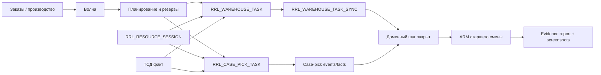

# Архитектурное решение: волна, ресурсы, факты ТСД и evidence-driven testing

## Статус

Принято для дальнейшей реализации WMS-процессов.

## Контекст

Система постепенно уходит от отдельных несвязанных задач к единому операционному процессу склада.

Ключевые уже реализованные элементы:

- `RRL_PICK_WAVE` управляет волной комплектации;
- `RRL_WAREHOUSE_TASK` хранит driver-facing задачи физического перемещения;
- `RRL_RESOURCE_*` описывает ресурсы склада и производства;
- `RRL_WAREHOUSE_TASK_SYNC` закрывает доменный шаг после выполнения складской задачи;
- `RRL_CASE_PICK_TASK`, `RRL_CASE_PICK_LINE` и case-pick event/fact контур закрывают коробочную сборку клиентских поддонов;
- нагрузочные и приемочные прогоны уже формируют runtime evidence: JSON, HTML, ARM/TSD screenshots.

Открытая архитектурная проблема: новые процессы должны проектироваться одинаково, иначе появятся параллельные контуры для отгрузки, производства, пополнения, комплектации и инвентаризации.

## Решение

### 1. Волна является центральным объектом процесса

Волна становится основным операционным документом для комплектации и связанных с ней движений.

Волну могут породить:

- заказы на отгрузку;
- производственные заказы;
- производственные волны пополнения;
- внутренние задачи пополнения, если они обслуживают сборку или выпуск.

Правило: если физическое действие выполняется ради комплектации, подачи в отгрузку или обеспечения производственной сборки, оно должно иметь связь с волной.

Практическая модель:

| Процесс | Центральный документ | Driver-facing задача |
|---|---|---|
| Пополнение ячейки отбора | `RRL_PICK_WAVE` | `RRL_WAREHOUSE_TASK.TASK_TYPE = REPLENISHMENT` |
| Подача полного паллета в грузовую зону | `RRL_PICK_WAVE` | `RRL_WAREHOUSE_TASK.TASK_TYPE = PICKING_MOVE` |
| Коробочная сборка клиентского поддона | `RRL_PICK_WAVE` | `RRL_CASE_PICK_TASK` |
| Производственная волна пополнения | производственная wave-модель | `RRL_WAREHOUSE_TASK` / production task |
| Готовая продукция в хранение | production completion domain | `RRL_WAREHOUSE_TASK.TASK_TYPE = FG_TO_STORAGE` |

Отгрузка остается бизнес-документом, но не должна вытеснять волну как операционный центр комплектации.

### 2. Все задачи людей и техники идут через ресурсную модель

Ресурсом является не только машина, но и человек, работающий на смене.

Типовые ресурсы:

- ричтрак;
- KIKA;
- погрузчик;
- тележка комплектовщика;
- комплектовщик;
- контролер;
- бригада погрузки;
- производственное оборудование: варка, фасовка.

Правило: задача не считается полноценно исполняемой, пока не понятно, каким ресурсом и в какой сменной сессии она выполняется.

Минимальный контракт исполнения:

- `RESOURCE_ID`;
- `RESOURCE_SESSION_ID`;
- `EQUIPMENT_ID`, если применимо;
- исполнитель/оператор;
- время получения, старта, паузы, завершения;
- план-факт события для Gantt и анализа загрузки.

Для `RRL_WAREHOUSE_TASK` эти поля уже существуют. Для case-pick задач и будущих производственных задач они должны использоваться аналогично.

### 3. Все факты ТСД синхронизируются в домен

ТСД не должен быть просто экраном ввода. Любой подтвержденный факт должен закрывать доменный шаг.

Два базовых канала:

- `RRL_WAREHOUSE_TASK_SYNC` для физических warehouse-task движений;
- case-pick events/facts для коробочной сборки клиентского поддона.

Правило: статус UI не является источником истины. Источник истины - сохраненный факт исполнения и доменная синхронизация.

Примеры:

| ТСД факт | Фактовая таблица | Доменный результат |
|---|---|---|
| Ричтрак завершил пополнение | `RRL_WAREHOUSE_TASK` + `RRL_WAREHOUSE_TASK_SYNC` | `RRL_PICK_WAVE_REPLENISH_TASK = DONE` |
| Ричтрак подал паллету в грузовую зону | `RRL_WAREHOUSE_TASK` + `RRL_WAREHOUSE_TASK_SYNC` | wave row готова к отгрузке |
| Комплектовщик подтвердил коробку/строку | `RRL_CASE_PICK_LINE` + event journal | строка собрана |
| Комплектовщик закрыл клиентский поддон | `RRL_CASE_PICK_TASK` + event journal | поддон готов к контролю/отгрузке по настройке склада |
| Водитель выполнил частично | parent/residual task | домен получает частичный факт и новую остаточную задачу |

### 4. Evidence-driven testing обязателен для каждого бизнес-процесса

Каждый новый бизнес-процесс должен поставляться не только кодом, но и доказательным пакетом.

Минимальный пакет:

- ТЗ/сценарий в `wiki/requirements/`;
- нагрузочный или функциональный runner в `tests/load/` или `tests/smoke/`;
- изолированное модельное состояние данных;
- отчет `report.json`;
- краткий `report.md`;
- HTML-презентация;
- ARM screenshot;
- TSD screenshot;
- список проверенных Oracle/API инвариантов.

Обязательные инварианты:

- нет HTTP/API ошибок;
- нет дублей задач там, где процесс идемпотентен;
- нет invalid Oracle objects;
- доменная синхронизация достигла `SYNCED`, если процесс использует `RRL_WAREHOUSE_TASK_SYNC`;
- физические и свободные остатки меняются на правильных этапах;
- UI показывает тот же статус, что и доменная модель.

## Целевая схема

## Тактический план внедрения

### Этап 1. Закрепить архитектурный контракт

- Считать этот документ обязательным чек-листом для новых WMS-процессов.
- В каждом новом ТЗ явно указывать:
  - центральную волну или причину исключения;
  - ресурсную модель;
  - ТСД-факт;
  - доменную синхронизацию;
  - evidence-пакет.

### Этап 2. Усилить текущий case-pick контур

- Добавить поэтапные live UI screenshots, а не только финальный ARM/TSD кадр.
- Добавить отдельный сценарий очереди пополнений одного SKU из 10 разных мест.
- Добавить доказательство free stock / physical stock по этапам.

### Этап 3. Унифицировать resource-fact модель

- Проверить, что `RRL_WAREHOUSE_TASK` и `RRL_CASE_PICK_TASK` сохраняют resource/session/equipment факты одинаково.
- Вывести plan-fact Gantt не только для ричтрака, но и для комплектовщиков.
- Для инвентаризационных задач из вычерков использовать отдельный resource type и настраиваемое автоназначение.

### Этап 4. Расширить доменную синхронизацию

- Для всех новых `TASK_TYPE` добавлять handler до вывода процесса в ТСД.
- Для case-pick событий добавить явную операционную инструкцию: какие события закрывают строку, поддон, контроль и отгрузочную готовность.
- Для ошибок синхронизации использовать retry/runbook по аналогии с warehouse-task sync.

### Этап 5. Сделать evidence обязательным release gate

- В каждом PR/пакете изменений указывать путь к `report.md`.
- Хранить screenshots в `runtime/test-evidence/<process>/`.
- Не считать процесс принятым без ARM/TSD evidence, если у него есть пользовательское выполнение.

## Ограничения

- Legacy `RRL_REMAINS` остается источником физического остатка до отдельной миграции WMS stock core.
- Wave-centered модель не отменяет документы `SHIPMENT` и production order; она задает операционный контур исполнения.
- Evidence screenshots являются доказательством UI-состояния, но бизнес-инварианты должны проверяться Oracle/API запросами.

## Связанные страницы

- [../requirements/wave_picking_tz.md](../requirements/wave_picking_tz.md)
- [../requirements/wave_case_pick_replenishment_tz.md](../requirements/wave_case_pick_replenishment_tz.md)
- [../requirements/case_pick_tsd_tz.md](../requirements/case_pick_tsd_tz.md)
- [../requirements/resource_management_module_tz.md](../requirements/resource_management_module_tz.md)
- [../requirements/warehouse_task_domain_sync_tz.md](../requirements/warehouse_task_domain_sync_tz.md)
- [../requirements/case_pick_wave_load_test_tz.md](../requirements/case_pick_wave_load_test_tz.md)
- [../runbooks/warehouse_task_domain_sync_operations.md](../runbooks/warehouse_task_domain_sync_operations.md)
