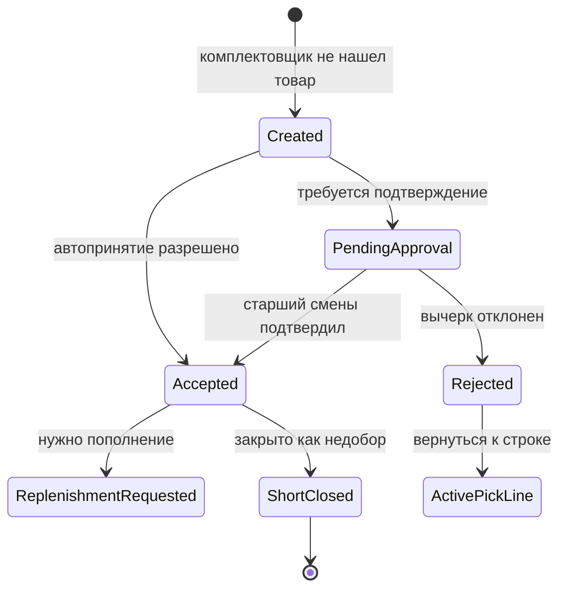

# ТЗ: ТСД покоробочной сборки клиентского поддона

Статус: проектирование отдельного исполнительского контура для комплектовщиков.

Дата: 2026-05-19.

Связанные документы:

- [Комплектация / Picking Planning](picking_planning_tz.md)
- [Сборка по волнам / Wave Picking](wave_picking_tz.md)
- [Пополнение ячеек отбора под покоробочную комплектацию волны](wave_case_pick_replenishment_tz.md)
- [Отдельный модуль управления ресурсами склада и производства](resource_management_module_tz.md)
- [API Method Library](../concepts/api_method_library.md)

## 1. Назначение

Нужен отдельный функционал ТСД для покоробочной сборки заказа комплектовщиком.

Это не ТСД ричтрака. Исполнитель - ресурс `CASE_PICKER`, физический рабочий ресурс - тележка `TROLLEY`. Комплектовщик входит в смену, получает одно или несколько заданий на сборку клиентских поддонов и идет вдоль ячеек отбора в назначенном порядке.

## 2. Основная Модель

Комплектовщику выдается складское задание на сборку клиентского поддона.

```text
Задание сборки поддона
  -> клиент
  -> заказ
  -> поддон / контейнер
  -> строки отбора
```

Строка отбора:

```text
артикул + ячейка отбора + плановое количество коробок + порядок обхода + статус
```

Один клиентский поддон всегда принадлежит одному клиенту и одному заказу.

Комплектовщик может одновременно выполнять:

- одно задание на один клиентский поддон;
- два задания на два клиентских поддона;
- три задания на три клиентских поддона, если работает на длинновильной тележке.

Каждый клиентский поддон остается отдельным заданием. Если комплектовщик везет два или три поддона, ТСД должен уметь переключать активный поддон/задание и правильно относить факт отбора к нужному клиентскому поддону.

Клиентский поддон маркируется `SSCC`. Идентификатор клиентского поддона создается при запуске волны, до выдачи задания комплектовщику.

`SSCC` клиентского поддона генерируется встроенным генератором при `wave launch`. Печать этикетки выполняется по настройке склада, но сам идентификатор уже должен существовать с момента запуска волны.

Емкость тележки для одновременной сборки одного, двух или трех клиентских поддонов должна определяться типом физического рабочего ресурса и типом клиентской тары. Для клиента по умолчанию используется евро-поддон с нормативным объемом `1,6 м3`, если для клиента не назначен другой разрешенный тип тары.

Проверка текущего кода от 2026-05-19:

- есть ресурсная модель `RRL_RESOURCE_TYPE`, где уже заведены `TROLLEY` и `CASE_PICKER`;
- есть клиентские правила укладки/товара с текстовым полем `PALLET_TYPE` в `RRL_CUSTOMER_PRODUCT_RULE` / `RRL_CUSTOMER_PRODUCT_STACK_RULE`;
- полноценного нормализованного справочника типов клиентской тары с привязкой к клиенту не найдено.

Вывод: `PALLET_TYPE` нужно расширить до полноценного нормализованного справочника клиентской тары. Это не новая сущность "поверх" существующего понятия, а развитие того же бизнес-понятия `PALLET_TYPE`: существующие текстовые значения становятся кодами/legacy-проекцией на справочник.

## 3. Не Сейчас: Pick By Line

На будущее нужен отдельный класс задач `PICK_BY_LINE`.

`PICK_BY_LINE` - это сборка не сразу под клиента, а агрегированная сборка нескольких клиентов:

1. Сначала комплектовщик собирает агрегированный заказ по строкам/артикулам.
2. Затем в отдельной зоне комплектации `pick-by-line` товар распределяется по клиентам.

Этот сценарий нужно держать в архитектуре, но не реализовывать в текущем инкременте ТСД клиентского поддона.

## 4. Вход В ТСД

Комплектовщик входит в ТСД через ресурсную смену:

```text
CASE_PICKER + TROLLEY + SHIFT + ZONE
```

Без активной `RRL_RESOURCE_SESSION` комплектовщик не попадает в рабочий экран ТСД.

Вход поддерживает:

- логин/пароль;
- сканирование ШК/кода сотрудника;
- сканирование или выбор тележки;
- проверку, что тележка не занята другой активной сессией.

## 5. Порядок Обхода Ячеек

Порядок обхода - отдельный объект, отличающийся от таблицы ячеек.

Принятое архитектурное уточнение: порядок обхода хранится как ранжированный список строк `RRL_PICK_ROUTE_CELL`, а не как таблица графовых связей. В строке хранится `PICK_SEQUENCE`; поля вида `FROM_CELL_ID` / `TO_CELL_ID` не используются. Следующая ячейка для ТСД определяется сортировкой активных строк маршрута по `PICK_SEQUENCE`.

Он строится поверх информации о ячейках отбора и нужен для того, чтобы управленческий персонал мог задавать:

- линейный обход;
- обход буквой `Z` между рядами;
- snake/S-образный обход;
- разные маршруты по зонам;
- разные маршруты по температуре;
- разные маршруты по типу товара;
- порядок, учитывающий тяжелый или хрупкий товар.

Тяжелый и хрупкий товар не должен автоматически переупорядочиваться алгоритмом в MVP. Это административная ответственность: оператор склада назначает ячейки и порядок обхода так, чтобы сборка была физически правильной.

## 6. Объект Порядка Обхода

Нужна отдельная подстраница администрирования порядка обхода.

Минимальные сущности:

```text
RRL_PICK_ROUTE
RRL_PICK_ROUTE_CELL
```

`RRL_PICK_ROUTE`:

- `PICK_ROUTE_ID`;
- `ROUTE_CODE`;
- `ROUTE_NAME`;
- `WARE_ID`;
- `ZONE_CODE`;
- `ROUTE_PATTERN`: `LINEAR`, `Z`, `SNAKE`, `MANUAL`;
- `ACTIVE`;
- `CREATED_AT`, `CREATED_BY`, `UPDATED_AT`, `UPDATED_BY`.

`RRL_PICK_ROUTE_CELL`:

- `PICK_ROUTE_CELL_ID`;
- `PICK_ROUTE_ID`;
- `WARE_ID`;
- `ZONE_CODE`;
- `CELL_ID`;
- `CELL_CODE`;
- `AISLE_NO`;
- `BAY_NO`;
- `LEVEL_NO`;
- `SIDE_CODE`;
- `PICK_SEQUENCE`;
- `DIRECTION_CODE`;
- `ACTIVE`.

Инварианты для ТСД:

- одна активная опубликованная/выбранная последовательность используется как источник порядка выдачи строк;
- комплектовщик не выбирает развилку маршрута: у строки есть только предыдущее и следующее место, вычисленные сортировкой;
- ручное изменение порядка на ТСД по умолчанию запрещено, чтобы не расходиться с опубликованным мастер-маршрутом;
- при отображении стрелок или подсказок `from/to` являются вычисленным представлением, а не сохраненными полями таблицы.

Поддержать два способа наполнения:

- загрузка из Excel;
- автоматическое назначение кнопкой, если таблица порядка пустая.

## 7. Настройки Склада Для Покоробочной Сборки

Нужна отдельная страница или отдельный блок настроек склада.

Настройки должны управлять поведением ТСД:

### 7.1. Подтверждение Отбора

Склад задает, что сканировать:

- ячейку отбора;
- артикул/ШК товара;
- коробку;
- поддон/контейнер;
- комбинацию этих действий.

Количество:

- по умолчанию комплектовщик подтверждает количество;
- настройкой можно разрешить инкремент количества каждым сканом коробки;
- настройкой можно разрешить ввод факта только при отклонении.

### 7.2. Нехватка В Ячейке Отбора

Если в pick face не хватает товара, поведение задается настройкой склада:

- ждать пополнения;
- пропустить SKU и вернуться позже;
- собрать частично;
- закрыть как дефицит;
- вызвать ричтрак голосом и уведомить старшего смены.

### 7.3. Ручное Изменение Порядка

Настройка склада определяет, может ли комплектовщик менять порядок на ТСД.

По умолчанию порядок жесткий и определяется только объектом порядка обхода.

### 7.4. Закрытие Поддона

Настройка склада определяет, когда задание сборки поддона считается завершенным:

- все строки собраны;
- поддон закрыт комплектовщиком;
- поддон сдан в зону консолидации;
- поддон прошел контроль.

По умолчанию поддон считается готовым только после контроля.

### 7.5. Контроль

Контроль может быть:

- внешний аудит / пересчет;
- весовой контроль.

Если контроль включен, нужно отдельное рабочее место контролера. Оно позволяет подтвердить поддон к отгрузке через пересчет или весовой контроль.

Весовой контроль уже имеет legacy-основу:

- `RRL_SBORKA_PALLET_ROWS` хранит строки поддона, количество, плановый вес строки и тару;
- `RRL_PALLET_WEIGHT2(PALLET_UID)` считает эталонный вес строк поддона с учетом веса коробов через `RRL_CARTON_WEIGHT2`;
- `RRL_TRIAL_BY_WEIGHT2(PALLET_UID, TRIAL_WEIGHT, WOOD_WEIGHT, USER_ID)` сравнивает фактический вес минус вес деревянного поддона с расчетным весом и пишет событие `WEIGHT_CHECK` в `RRL_SBORKA_PALLETS_HISTORY`;
- право `CHECK_WEIGHT` уже есть в seed-правах.

Новая сборка должна переиспользовать эту модель как источник эталонного веса: нормативный вес коробки/артикула плюс фактический вес деревянного поддона.

### 7.6. Печать Этикетки

Момент печати этикетки клиентского поддона задается настройкой склада.

Варианты:

- после сборки поддона;
- после контроля;
- вручную старшим смены/контролером.

По умолчанию: печатать после сборки поддона.

## 8. Статусы Задания Поддона

Рекомендуемые статусы задания сборки клиентского поддона:

- `NEW`;
- `ASSIGNED`;
- `IN_PROGRESS`;
- `WAIT_REPLENISHMENT`;
- `PARTIAL`;
- `PICKED`;
- `WAIT_CONTROL`;
- `CONTROL_IN_PROGRESS`;
- `CONTROLLED`;
- `READY_TO_SHIP`;
- `CANCELLED`;
- `FAILED`.

## 9. Статусы Строки Отбора

Рекомендуемые статусы строки:

- `NEW`;
- `ACTIVE`;
- `SKIPPED`;
- `WAIT_REPLENISHMENT`;
- `PARTIAL`;
- `PICKED`;
- `SHORT_PICKED`;
- `CANCELLED`;
- `FAILED`.

## 10. Товар Есть В Хранении, Но Не Опущен В Pick Face

Если товар физически есть на складе в ячейке хранения, но ричтрак еще не опустил его в ячейку отбора, строка отбора получает состояние:

```text
WAIT_REPLENISHMENT
```

Поведение ТСД зависит от настройки склада:

- ждать;
- пропустить и вернуться позже;
- собрать доступную часть;
- закрыть дефицит;
- уведомить старшего смены и/или вызвать ричтрак.

Важно: комплектовщик не должен подтверждать отбор из pick face, если товар еще не появился в ячейке отбора и настройка не разрешает частичный/дефицитный сценарий.

## 11. Справочник Типов Клиентской Тары / `PALLET_TYPE`

`PALLET_TYPE` должен стать полноценным нормализованным справочником типов клиентской тары.

Нужны сущности:

```text
RRL_PALLET_TYPE
RRL_CUSTOMER_PALLET_TYPE_RULE
```

`RRL_PALLET_TYPE`:

- `PALLET_TYPE_ID`;
- `PALLET_TYPE_CODE`: `EURO_PALLET`, `AMERICAN_PALLET`, `TROLLEY`, `CUSTOM`;
- `PALLET_TYPE_NAME`;
- `LOAD_UNIT_CLASS`: `PALLET`, `TROLLEY`, `CONTAINER`;
- `DEFAULT_VOLUME_M3`;
- `DEFAULT_WEIGHT_KG`;
- `LENGTH_MM`, `WIDTH_MM`, `HEIGHT_MM`;
- `DEFAULT_MAX_CLIENT_PALLETS`: для тележек может быть `1`, `2`, `3`;
- `ACTIVE`.

Стартовый seed:

- `EURO_PALLET`, объем `1,6 м3`, используется по умолчанию;
- `AMERICAN_PALLET`;
- `TROLLEY`.

`RRL_CUSTOMER_PALLET_TYPE_RULE`:

- `CUSTOMER_PALLET_TYPE_RULE_ID`;
- `CUSTOMER_ID`;
- `CUSTOMER_ADDRESS_ID`;
- опционально `CUSTOMER_STORE_MAP_ID` как техническая ссылка на магазин/точку, если адрес хранится через store map;
- `PALLET_TYPE_ID`;
- `IS_DEFAULT`;
- `VALID_FROM`, `VALID_TO`;
- `ACTIVE`.

`PALLET_TYPE` является свойством адреса клиента. Адрес принадлежит клиенту, поэтому правило всегда должно разрешаться через адрес. Клиентский уровень может использоваться только как источник дефолта при создании адреса, но runtime-выбор тары для волны должен брать активное свойство адреса.

Правило выбора:

1. Если у адреса клиента есть активный `IS_DEFAULT=1`, использовать его.
2. Если у адреса есть активный список разрешенных типов, оператор/волна выбирает из него.
3. Если у адреса правил нет, использовать `EURO_PALLET`.

Существующие текстовые `PALLET_TYPE` в клиентских правилах не удалять. Они должны ссылаться на `RRL_PALLET_TYPE.PALLET_TYPE_CODE` и постепенно стать совместимым текстовым кодом нормализованного справочника.

## 12. Передача Начатого Поддона Другому Комплектовщику

Передача начатого клиентского поддона другому комплектовщику разрешена.

Функция должна быть доступна в АРМ старшего смены до назначения/выдачи задания или во время выполнения, если нужно заменить исполнителя.

Минимальные правила:

- передавать можно только поддон в статусах `ASSIGNED`, `IN_PROGRESS`, `PARTIAL`, `WAIT_REPLENISHMENT`;
- передача требует активной `RRL_RESOURCE_SESSION` нового комплектовщика;
- факты уже собранных строк остаются на исходном исполнителе в журнале, но дальнейшие факты пишутся на нового исполнителя;
- в аудит пишется `TRANSFERRED`, старый ресурс, новый ресурс, причина и пользователь старшего смены;
- если ТСД старого исполнителя офлайн, сервер должен запретить конфликтующее закрытие поддона после передачи.

## 13. Пересортица И Ошибка Штрих-Кода

Если комплектовщик нашел товар, но сканированный ШК/артикул отличается от плановой строки, товар нельзя класть в клиентский поддон.

Правило:

- ТСД отклоняет скан и показывает, что товар не соответствует плановой строке;
- строка не закрывается и факт отбора не записывается;
- комплектовщик не может заменить плановый SKU найденным SKU;
- если ШК физически правильный, но отсутствует или ошибочен в базе, старший смены исправляет мастер-данные;
- после исправления мастер-данных комплектовщик повторяет обычное сканирование и комплектует через стандартный функционал;
- событие пересортицы/ошибки ШК пишется в журнал для старшего смены.

## 14. Вычерки

Вычерк - это ситуация, когда товар должен быть на складе или в ячейке отбора по данным системы, но комплектовщик его не нашел.

Вычерк отличается от планового дефицита:

- дефицит известен до отбора;
- вычерк появляется во время фактического отбора.

Примеры:

- система показывает остаток в pick face, но ячейка пуста;
- нужного артикула нет в ячейке;
- коробки физически повреждены;
- ШК товара не совпадает;
- товар есть в хранении, но не был опущен в pick face к моменту отбора;
- товар заблокирован фактически, но еще не отражен в системе.

На старте причина вычерка одна: `SHIFT_LEAD_CONFIRMATION_REQUIRED` - требуется подтверждение старшего смены.

## 15. Права На Вычерки

Нужны отдельные права:

- `case_pick_short_view` - просмотр вычерков;
- `case_pick_short_create` - создание вычерка комплектовщиком;
- `case_pick_short_approve` - подтверждение вычерка старшим смены/контролером;
- `case_pick_short_cancel` - отмена ошибочного вычерка;
- `case_pick_short_force_close` - принудительное закрытие строки с вычерком.

Базовое правило:

- комплектовщик может создать вычерк, если настройка склада это разрешает;
- старший смены или контролер должен подтверждать вычерк, если настройка склада требует подтверждения;
- без отдельного права комплектовщик не может окончательно закрыть заказ/поддон с критическим вычерком.

## 16. Жизненный Цикл Вычерка



## 17. Автоматическая Инвентаризационная Задача По Вычерку

Если настройка склада включена, подтвержденный вычерк автоматически создает задачу проверки остатка/инвентаризации.

Это отдельный класс задач инвентаризации. Рекомендуемый MVP-вариант:

```text
TASK_CLASS = INVENTORY
TASK_TYPE = INVENTORY_CHECK
TASK_SOURCE = CASE_PICK_SHORT
SOURCE_DOC_TYPE = CASE_PICK_SHORT
SOURCE_DOC_ID = CASE_PICK_SHORT_ID
```

Исполнитель инвентаризационной задачи - всегда отдельный ресурс инвентаризации. По настройкам склада этот ресурс может автоматически назначаться контролеру, кладовщику, старшему смены или отдельной инвентаризационной роли. Задача не должна назначаться комплектовщику текущей сборки.

Задача должна проверять физический остаток в ячейке отбора и, при необходимости, в связанных ячейках хранения.

Настройки склада:

- создавать инвентаризационную задачу по каждому подтвержденному вычерку;
- создавать только при превышении порога количества/стоимости;
- создавать только для критичных SKU;
- не создавать автоматически.

## 18. Данные Вычерка

Предлагаемая таблица:

`RRL_CASE_PICK_SHORT`

- `CASE_PICK_SHORT_ID`;
- `PICK_WAVE_ID`;
- `PICK_CONTAINER_ID`;
- `PICK_TASK_ID`;
- `PICK_WAVE_TASK_ID`;
- `CUSTOMER_ORDER_ID`;
- `CUSTOMER_ID`;
- `ARTICUL`;
- `CELL_CODE`;
- `PLANNED_QTY`;
- `PICKED_QTY`;
- `SHORT_QTY`;
- `REASON_CODE`;
- `REASON_TEXT`;
- `STATUS`: `CREATED`, `PENDING_APPROVAL`, `ACCEPTED`, `REJECTED`, `CANCELLED`, `SHORT_CLOSED`;
- `CREATED_BY`;
- `CREATED_AT`;
- `APPROVED_BY`;
- `APPROVED_AT`;
- `CANCELLED_BY`;
- `CANCELLED_AT`;
- `PAYLOAD_JSON`.

## 19. Настройки Вычерков

В настройках склада нужны параметры:

- разрешено ли комплектовщику создавать вычерки;
- требуется ли подтверждение старшего смены;
- можно ли автоматически закрывать строку как недобор;
- нужно ли автоматически создавать уведомление старшему смены;
- нужно ли автоматически инициировать проверку пополнения;
- можно ли продолжать сборку поддона после вычерка;
- блокирует ли вычерк закрытие поддона;
- блокирует ли вычерк отгрузку.

## 20. Офлайн-Работа ТСД

Офлайн-работа при потере Wi-Fi обязательна, но ее нужно проектировать как ограниченный режим с последующей серверной сверкой.

Что можно делать офлайн:

- продолжать уже выданные на устройство задания и строки;
- сканировать ячейку, товар, коробку, поддон/контейнер;
- накапливать факты отбора в локальной очереди с идемпотентными ключами;
- создавать черновик вычерка;
- фиксировать локальные события времени, пользователя, ресурса и устройства.

Что нельзя гарантировать офлайн:

- актуальность свободных и физических остатков;
- что поддон не был передан другому комплектовщику старшим смены;
- что строку не закрыл другой пользователь;
- что пополнение уже выполнено ричтраком;
- что дефицит/вычерк окончательно принят;
- что поддон можно окончательно закрыть к отгрузке, если требуется контроль или доменная синхронизация.

Правила синхронизации:

- каждый факт получает `OFFLINE_EVENT_ID`;
- сервер принимает факты идемпотентно;
- при конфликте сервер переводит строку/поддон в `SYNC_CONFLICT`;
- конфликт разбирает старший смены в административной части;
- вычерк, созданный офлайн, после синхронизации получает статус `PENDING_APPROVAL`;
- закрытие поддона офлайн допускается только как локальный статус `LOCAL_PICKED`, финальный серверный статус ставится после синхронизации.

Рекомендуемое ограничение MVP: офлайн доступен только для задач, уже загруженных после успешного входа в смену; новый вход в смену и получение новых заданий без сети не выполняются.

Максимальный период офлайн-работы - не дольше времени комплектации уже выданных заданий. После завершения выданных заданий ТСД должен требовать синхронизацию до получения новых заданий или окончательного серверного закрытия спорных поддонов.

## 21. Рабочий Экран ТСД

ТСД комплектовщика должен быть компактным.

Минимальные зоны:

- текущий поддон/контейнер;
- счетчик поддонов на тележке: `1 / 2 / 3`;
- текущая строка отбора;
- ячейка;
- артикул / наименование;
- плановое количество;
- фактическое количество;
- подсказка сканирования по настройке склада;
- кнопки: `Собрано`, `Частично`, `Нет товара`, `Пропустить`, `Назад`, `Дальше`.

Если порядок жесткий, кнопка `Дальше` не должна позволять перепрыгивать через обязательную строку без разрешенного сценария `SKIPPED` / `WAIT_REPLENISHMENT` / `SHORT_PICKED`.

## 22. API MVP

Минимальные endpoints:

- `POST /api/resources/sessions/tsd-login` - вход комплектовщика в смену;
- `GET /api/case-pick/tasks` - список заданий поддонов комплектовщика;
- `GET /api/case-pick/tasks/{task_id}` - карточка задания;
- `POST /api/case-pick/tasks/{task_id}/claim`;
- `POST /api/case-pick/tasks/{task_id}/start`;
- `POST /api/case-pick/tasks/{task_id}/lines/{line_id}/confirm`;
- `POST /api/case-pick/tasks/{task_id}/lines/{line_id}/skip`;
- `POST /api/case-pick/tasks/{task_id}/lines/{line_id}/short`;
- `POST /api/case-pick/tasks/{task_id}/close-pallet`;
- `GET /api/case-pick/shorts`;
- `POST /api/case-pick/shorts/{short_id}/approve`;
- `POST /api/case-pick/shorts/{short_id}/reject`;
- `GET /api/picking/routes`;
- `POST /api/picking/routes/import-excel`;
- `POST /api/picking/routes/{route_id}/auto-build`;
- `GET /api/admin/warehouses/{ware_id}/case-pick-settings`;
- `PATCH /api/admin/warehouses/{ware_id}/case-pick-settings`.

## 23. MVP Scope

В MVP реализовать:

1. ТЗ и настройку архитектуры.
2. Сущности задания клиентского поддона и строк отбора.
3. Вход комплектовщика в ТСД через ресурсную смену.
4. Объект порядка обхода и подстраницу администрирования.
5. Настройки склада по сканированию, факту, нехватке и закрытию поддона.
6. ТСД комплектовщика для одного, двух или трех клиентских поддонов.
7. Факт отбора строки.
8. `WAIT_REPLENISHMENT` для строк, где товар есть в хранении, но не опущен.
9. Вычерки с правами и подтверждением.
10. Справочник `PALLET_TYPE` как типы клиентской тары и привязку к клиенту.
11. Передачу начатого поддона другому комплектовщику через АРМ старшего смены.
12. Автоматическое создание инвентаризационной задачи по подтвержденному вычерку, если включена настройка склада.
13. Контур контроля поддона как настройку и будущий workflow.
14. Ограниченный офлайн-режим ТСД для уже выданных заданий.
15. Обработку пересортицы/ошибки ШК без подмены планового SKU.

## 24. Не В MVP

Не реализовывать сейчас:

- `PICK_BY_LINE`;
- автоматическую оптимизацию маршрута в реальном времени;
- автоматическое переупорядочивание тяжелого/хрупкого товара;
- голосовой отбор;
- полноценное рабочее место контролера;
- видеофиксацию вычерков;
- автоматический ML-подбор маршрута обхода.

## 25. Открытые Вопросы

Закрытые 2026-05-19 решения:

1. Клиентский поддон маркируется `SSCC`.
2. `SSCC`/ID клиентского поддона создается при запуске волны.
3. `PALLET_TYPE` расширяется до полноценного справочника типов клиентской тары.
4. Начатый поддон можно передать другому комплектовщику через АРМ старшего смены.
5. Стартовая причина вычерка одна: требуется подтверждение старшего смены.
6. Подтвержденный вычерк может создавать инвентаризационную задачу по настройке склада.
7. Весовой контроль переиспользует legacy-функции расчета веса поддона и `WEIGHT_CHECK`.
8. Печать этикетки задается настройкой склада, по умолчанию после сборки.
9. Офлайн-режим ТСД обязателен, но только для уже загруженных заданий и с серверной сверкой.
10. Пересортицу нельзя класть в клиентский поддон; мастер-данные исправляет старший смены, затем строка комплектуется обычным способом.
11. `PALLET_TYPE` является свойством адреса клиента.
12. Инвентаризационная задача по вычерку всегда назначается на отдельный ресурс; автоназначение контролеру/кладовщику/старшему смены задается настройкой склада.
13. Максимальный офлайн-период - не дольше времени комплектации выданных заданий.
14. Генератор `SSCC` клиентского поддона встраивается в `wave launch`.

Открытых вопросов по уточнению бизнес-ТЗ комплектации на текущий момент нет. Следующий шаг - проектирование runtime-схемы, API и экранов.
