# ТЗ: нагрузочное моделирование сборки волны комплектации

## Цель

Проверить, что WMS корректно моделирует и отображает полный процесс коробочной сборки волны:

- создание волны для 7 клиентов;
- создание клиентских поддонов;
- пополнение ячеек отбора под волну;
- запуск сборки после первичного пополнения;
- ход сборки комплектовщиками;
- дополнительное пополнение во время отборки;
- отображение этапов в ARM комплектации, ARM пополнения и ТСД.

## Исходная нагрузка

Одна волна комплектации:

| Клиент | Количество клиентских поддонов |
|---|---:|
| Клиент 1 | 8 |
| Клиент 2 | 9 |
| Клиент 3 | 10 |
| Клиент 4 | 11 |
| Клиент 5 | 12 |
| Клиент 6 | 13 |
| Клиент 7 | 15 |

Итого: 78 клиентских поддонов.

Каждый клиентский поддон моделируется отдельным `RRL_CASE_PICK_TASK` с собственным `SSCC`. В текущем runtime это достигается через 78 заказов, сгруппированных по 7 клиентам: один заказ соответствует одному клиентскому поддону.

Если базовый wave launch по части заказов создает `FULL_PALLET`, load-runner нормализует именно тестовую волну: для заказов без `RRL_CASE_PICK_TASK` он создает недостающий клиентский поддон и строку сборки, чтобы нагрузочный эксперимент всегда проверял 78 клиентских поддонов коробочной сборки. Это часть тестового стенда, а не изменение боевой бизнес-логики.

## Модельное состояние склада

Тест не должен опираться на случайные текущие остатки склада. Перед запуском создается изолированная модель склада с префиксом `LOAD-WAVE-*`.

Модель содержит:

- одну ячейку отбора под волну: `*-CASE-PF`;
- 78 исходных поддонов хранения: `LOAD-WAVE-*-SRC-0001..0078`;
- для каждого исходного поддона отдельную ячейку хранения: `*-SRC-001..078`;
- один тестовый артикул: `LOAD-WAVE-*-CASE-SKU`;
- 100 коробок товара на каждом исходном поддоне: этого достаточно, чтобы алгоритм пополнения мог зарезервировать источник под агрегированную потребность волны, но заказ на 1 коробку оставался коробочной сборкой, а не отбором полного паллета;
- норматив полного паллета у тестового артикула выставляется существенно больше заказа (`PALLET_MULTIPLE = 10000`), чтобы все 78 заказов создавали `CASE_PICK`, а не смешивались с `FULL_PALLET`;
- отдельную модельную партию для каждого исходного поддона через дату выпуска/годности в `RRL_PALLETS`;
- ожидаемое перемещение каждого исходного поддона из ячейки хранения в ячейку отбора как `REPLENISHMENT`.

Начальное состояние:

| Объект | Количество | Где хранится |
|---|---:|---|
| Ячейка отбора | 1 | `RRL_PICK_FACE`, `RRL_PICK_ROUTE_CELL`, `RRL_CELLS` |
| Поддоны хранения | 78 | `RRL_PALLETS`, `RRL_REMAINS` |
| Ячейки хранения | 78 | `RRL_CELLS` |
| Остаток в ячейке отбора | 0 | нет `RRL_REMAINS` в `*-CASE-PF` до пополнения |
| Ожидаемые пополнения | 78 | `RRL_PICK_WAVE_REPLENISH_TASK` и `RRL_WAREHOUSE_TASK` |

Каждый stage snapshot обязан сохранять краткое состояние модели склада:

- сколько поддонов еще находится в ячейках хранения;
- сколько пополнений уже закрыто;
- сколько строк сборки уже подтверждено;
- сколько задач синхронизировано в `RRL_WAREHOUSE_TASK_SYNC`.

## Проверяемый бизнес-процесс

```mermaid
flowchart LR
  A[Создать 7 клиентов и 78 заказов] --> B[Создать планы отбора]
  B --> C[Создать волну]
  C --> D[Рассчитать и запустить волну]
  D --> E[Создать пополнение ячеек отбора]
  E --> F[Ричтрак закрывает первую партию пополнений]
  F --> G[Комплектовщики начинают сборку]
  G --> H[Сборка 10/30/60/90 процентов]
  H --> I[Очередное пополнение в момент отборки]
  I --> J[Закрытие поддонов и контроль]
  J --> K[Итоговый отчет и evidence]
```



## Этапы фиксации

| Этап | Что фиксируем | Ожидаемый результат |
|---|---|---|
| `T0_FIXTURE` | Клиенты, заказы, планы | 7 клиентов, 78 планов |
| `T1_WAVE_CREATED` | Волна создана и наполнена планами | 1 волна, 78 планов в волне |
| `T2_LAUNCHED` | Запуск волны | Созданы `CASE_PICK` и строки пополнения |
| `T3_REPLENISHMENT_RELEASED` | Первичная партия пополнения | Есть driver-facing `RRL_WAREHOUSE_TASK` |
| `T4_REPLENISHMENT_DONE` | Ричтрак закрывает первичное пополнение | Часть пополнений `DONE/SYNCED` |
| `T5_PICKING_PROGRESS` | Комплектовщики собирают поддоны партиями | ARM показывает прогресс рейса |
| `T6_REPLENISH_DURING_PICKING` | Во время сборки выпускается следующее пополнение | Очередь пополнения уменьшается |
| `T7_FINAL` | Финальный итог | Поддоны собраны/закрыты, отчет сформирован |

## Нагрузочные метрики

Скрипт должен фиксировать:

- общее время сценария;
- количество HTTP-запросов;
- ошибки HTTP;
- latency по endpoint: `min`, `p50`, `p95`, `max`;
- количество `RRL_CASE_PICK_TASK`;
- количество `RRL_CASE_PICK_LINE`;
- количество созданных и закрытых replenishment warehouse tasks;
- количество `RRL_WAREHOUSE_TASK_SYNC` в `SYNCED`;
- количество дублей по warehouse tasks;
- количество invalid Oracle objects;
- состояние readiness после запуска и после пополнения.

## Evidence

Для каждого этапа формируются:

- JSON snapshot этапа;
- HTML evidence presentation;
- PNG screenshot HTML-слайда этапа, если доступен headless Edge/Chrome.
- live UI screenshots из raw ARM/TSD страниц, если запущены API `8088` и raw frontend `3000`.

Скриншоты должны показывать:

- административный этап процесса;
- прогресс рейсов и поддонов;
- блоки пополнения;
- действия ТСД/исполнителей как журнал этапа.

Отдельный live UI capture выполняется после основного прогона:

```powershell
python tests\load\wave\case_pick_live_ui_capture.py --report runtime/test-evidence/case-pick-wave-load/report.json --out-dir runtime/test-evidence/case-pick-wave-load/live-ui
```

Он открывает:

- `case-pick-management.html` как ARM диспетчера комплектации с реальными API-данными волны;
- `case-pick-tsd.html?evidence=1&scope=all` как компактный ТСД комплектовщика с реальными строками `RRL_CASE_PICK_TASK`.

Для headless-capture используется временный браузерный профиль и временная auth-redirect страница под origin raw UI. Пароль не сохраняется в репозиторий; Basic auth создается только на время снимка.

## Команда запуска

```powershell
$env:WMS_ORACLE_USER='RABAEV'
$env:WMS_ORACLE_PASSWORD='RABAEVWMS'
$env:WMS_ORACLE_DSN='127.0.0.1:1521/orcl'
python tests\load\wave\case_pick_wave_load_test.py --clients 7 --pallets 8,9,10,11,12,13,15 --report runtime/test-evidence/case-pick-wave-load/report.json
```

## Критерии приемки

- Создана одна волна с 7 клиентами и 78 клиентскими поддонами.
- Для каждого клиентского поддона создан `SSCC`.
- ARM `/api/case-pick/tasks?scope=all` видит рейс, поддоны, комплектовщиков, прогресс и блокирующие поддоны.
- Пополнение ячеек отбора создается до сборки и продолжает выпускаться во время сборки.
- После выполнения driver-facing задач доменная синхронизация достигает `SYNCED`.
- Итоговый отчет содержит stage snapshots и ссылки на скриншоты.
- Live UI evidence содержит как минимум `arm-case-pick-management.png` и `tsd-case-pick.png`.
