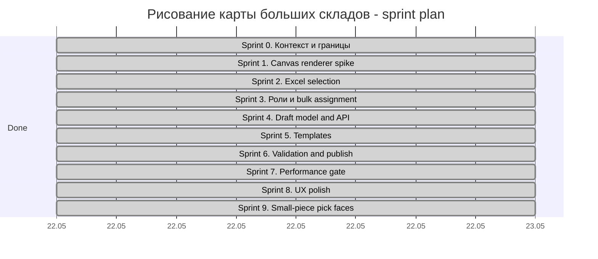

# ТЗ: рисование карты больших складов

Статус: постановка отдельного модуля.

Дата: 2026-05-22.

Рабочее название: **рисование карты больших складов**.

## 1. Цель

Нужно сделать отдельный легкий редактор 2D-карты склада, который позволяет завести большой физический склад в систему графически понятным способом, похожим на работу с ячейками Excel.

Редактор должен уверенно работать с layout масштаба:

- `35` аллей;
- `90` слотов в аллее;
- `6` уровней;
- до `18 900` адресуемых ячеек склада;
- обзорный режим, где на экране одновременно видна очень большая карта без торможения;
- рабочий режим, где пользователь может быстро выделить участок на `90-100` ячеек и назначить ему роль.

Главный принцип: карта должна быть легкой и плотной. На общем виде ячейки могут быть маленькими, но взаимодействие, выделение и назначение ролей не должны превращаться в тяжелую DOM-страницу.

## 2. Связанные Документы И Выводы Анализа

### `warehouse_digital_twin_codex_spec.md`

Дает требования к производительному рендеру:

- использовать WebGL/Canvas/SVG не как статичную картинку, а как интерактивную сцену;
- одинаковые объекты должны рендериться через `InstancedMesh` или другой оптимизированный подход;
- большой поток событий не должен блокировать UI;
- UI должен оставаться отзывчивым при большом количестве объектов.

Для нового редактора берем отсюда не digital-twin-семантику смены, а технический принцип: не рисовать тысячи ячеек отдельными DOM-элементами.

### `large_warehouse_minute_simulation_tz.md`

Дает масштаб склада и физическую модель:

- аллеи, слоты, уровни, ворота;
- ячейки отбора и хранения;
- проходы и поперечные маршруты;
- отдельные зоны накопления и отгрузки.

Для нового редактора масштаб увеличивается с `25 x 60 x 6` до `35 x 90 x 6`. Это означает, что модуль должен проектироваться сразу под десятки тысяч адресов, а не под декоративную карту.

### `warehouse_topology_pick_route_tz.md`

Дает правила топологии:

- карта склада является мастер-данными;
- ячейки имеют тип/роль;
- проходы, ворота, зоны накопления и pick-face должны быть отдельными физическими слоями;
- основной режим редактирования карты должен быть 2D;
- zoom/pan и выделение рамкой обязательны для работы с большими картами.

Для нового редактора берем модель физических ролей и 2D-редактирование, но отделяем его от редактирования порядка обхода. Новый модуль рисует склад, а не решает маршрутную задачу.

## 3. Границы Модуля

Входит:

- создание и редактирование большой 2D-карты склада;
- назначение ролей выделенным ячейкам;
- генерация адресов и уровней;
- сохранение черновика версии карты;
- проверка геометрических и ролевых инвариантов;
- экспорт карты в topology/domain слой после публикации.

Не входит:

- digital twin replay смены;
- движение комплектовщиков и техники;
- расчет маршрутов обхода;
- wave planning;
- ABC/Minimax-оптимизация;
- визуальная 3D-сцена склада.

## 4. Основная Модель Карты

Карта состоит из плотной 2D-сетки физических мест.

Базовая геометрия одной ячейки:

- физический размер: `800 x 1200 мм`;
- в UI это прямоугольная grid-cell;
- ориентация хранится явно: какая сторона смотрит в проход;
- для overview ячейка может быть отрисована как пиксель/тонкий прямоугольник без текста;
- для рабочего zoom ячейка показывает код, роль, уровень или агрегированное состояние.

Масштаб адресов:

```text
aisle_count = 35
slots_per_aisle = 90
levels = 6
addressable_cells = 35 * 90 * 6 = 18 900
```

Уровень `L1` обычно используется как pick-face или напольная роль. Уровни `L2..L6` чаще являются хранением, но редактор не должен жестко зашивать это правило: роль назначается пользователем или шаблоном.

## 5. Роли Ячеек

Пользователь может выделить одну или много ячеек и назначить роль.

Обязательные роли:

| Роль | Название в UI | Назначение |
|---|---|---|
| `PICK_FACE` | Ячейки отбора | Адреса коробочного/штучного отбора |
| `FRACTIONAL_PICK_FACE` | Дробные ячейки отбора | Одна физическая ячейка, разделенная на `2..9` логических мелкоштучных адресов |
| `STORAGE` | Ячейки хранения | Резервное хранение, паллетные места |
| `TRANSPORT_STAGING` | Транспортное накопление | Накопление паллет перед воротами |
| `FILM_WRAP` | На пленку | Места, куда ставится товар на обмотку пленкой |
| `GATE` | Ворота | Приемка/отгрузка/универсальные ворота |
| `AISLE` | Проходы | Рабочие и транспортные проходы |
| `EMPTY` | Пусто | Неразмеченная зона |
| `BLOCKED` | Недоступно | Колонны, стены, технические зоны |

Роль назначается bulk-операцией:

1. пользователь выделяет прямоугольник или набор ячеек;
2. выбирает роль из палитры;
3. редактор применяет роль ко всем выбранным ячейкам;
4. изменения попадают в undo/redo stack;
5. карта помечается как dirty draft.

## 6. UX: Excel-Подобная Работа

Редактор должен ощущаться как таблица:

- drag-frame выделяет прямоугольный участок;
- выделение хранит не только нормализованный прямоугольник, но и графическое начало/конец: начало - ячейка, в которой пользователь начал drag, конец - ячейка, где drag завершился;
- начало и конец выделения должны быть визуально различимы на карте, потому что от них зависит направление нумерации ячеек отбора;
- Shift/Ctrl добавляют отдельные участки к выделению, как в Excel: несколько раздельных областей должны оставаться независимыми, а не склеиваться в один большой прямоугольник;
- при переключении уровней `L1..L6` выделенные области сохраняются по координатам, чтобы пользователь мог быстро назначать правильные роли на разных уровнях;
- клик выбирает одну ячейку;
- двойной клик открывает инспектор ячейки;
- клавиши стрелок двигают активную ячейку;
- `Shift + стрелки` расширяют выделение;
- `Ctrl+A` выбирает текущий слой/видимый участок, а не всю карту без подтверждения;
- copy/paste ролей допустим внутри карты;
- undo/redo обязательны;
- назначение роли должно работать на `90-100` ячейках без задержки всей карты.

Не должно быть ощущения, что пользователь перетаскивает тысячи отдельных SVG/HTML-блоков. Карта должна вести себя как плотная рабочая сетка.

### 6.1. Context Help

Редактор сложный, поэтому каждый управляющий элемент должен иметь help без визуального шума:

- у каждой кнопки, поля, dropdown, переключателя, toolbar item, пункта меню и интерактивного элемента карты есть короткий tooltip;
- у сложных групп настроек есть маленький значок `?`, `i` или книги, который открывает контекстную help-карточку;
- help-карточка объясняет не экран целиком, а конкретное действие или группу: что делает элемент, когда его применять, какие есть риски;
- help не должен быть постоянным длинным текстом внутри панели и не должен уменьшать рабочую область карты;
- tooltip/help открывается по hover/focus или нажатию на значок и закрывается без нарушения выделения;
- у disabled/future элементов help объясняет причину недоступности;
- у каждого текста помощи есть стабильный `help_id`.

Обязательные help-группы:

- роли ячеек;
- выделение и режимы Shift/Ctrl;
- zoom/navigation;
- draft save/load;
- адресация отбора;
- дробные ячейки и пресеты дробления;
- publish/validation.

### 6.2. Format Painter / Копирование Формата

Редактор должен поддерживать Excel-подобный `Format Painter`: оператор выделяет область, нажимает иконку кисточки/метелочки `Скопировать формат`, затем выбирает место назначения и применяет `Вставить формат`.

Назначение: быстро перенести назначение и оформление зоны склада на другое место без ручного повторения ролей и параметров.

Workflow MVP:

1. пользователь выделяет исходный прямоугольник;
2. нажимает кнопку с иконкой кисточки/метелочки `Скопировать формат`;
3. редактор сохраняет `format_clipboard` и показывает режим format painter;
4. пользователь кликает целевую ячейку или выделяет целевую область;
5. кнопка `Вставить формат` применяет snapshot формата к цели;
6. изменение попадает в undo/redo stack;
7. `Esc` отменяет режим format painter.

Что копируется как формат:

- роль физической ячейки: `PICK_FACE`, `STORAGE`, `TRANSPORT_STAGING`, `FILM_WRAP`, `GATE`, `AISLE`, `BLOCKED`, `EMPTY`, `FRACTIONAL_PICK_FACE`;
- параметры дробления как шаблон: `fraction_type`, `split_preset`, `sub_level_count`, `sub_column_count`;
- визуальные/семантические flags ячейки, если они не являются уникальными идентификаторами;
- capacity/policy template для storage slots, если он задан как шаблон;
- локальная структура child slots как форма, но без уникальных адресов.

Что не копируется:

- `physical_cell_id`, `topology_cell_id`, `cell_slot_id`;
- `cell_code`, `logical_cell_code`, `slot_code`;
- остатки, резервы, задания, факты движения;
- published route rows и `PICK_SEQUENCE`;
- связи с воротами, камерами или внешними объектами, если пользователь явно не запускает отдельную команду клонирования objects.

Правила вставки:

- MVP поддерживает один исходный прямоугольник и вставляет его от целевой anchor-cell с теми же `width x height`;
- если цель выходит за границу карты, paste запрещается и показывает validation reason;
- если цель пересекает protected/published/dependency cells, paste требует explicit confirmation или запрещается по правам;
- если копируется дробная ячейка, создается такая же схема дробления, но логические адреса должны быть пересчитаны отдельной адресной командой;
- если копируется `GATE`/`TRANSPORT_STAGING`, копируется только role/shape, а не транспортные задания;
- paste может быть single-use, а будущий режим pinned painter может позволить вставлять формат несколько раз.

## 7. Zoom, Pan И Навигация

Обязательные механизмы:

- zoom wheel с привязкой к курсору;
- slider масштаба;
- кнопки `+`, `-`, `100%`, `Fit`;
- pan мышью/тачпадом;
- миникарта или overview-strip для перемещения по большому складу;
- быстрый переход к аллее/слоту/воротам по поиску;
- sticky toolbar инструментов рисования.

Уровни детализации:

| Масштаб | Поведение |
|---|---|
| Overview | показываются цветовые роли и крупные контуры, без подписей каждой ячейки |
| Working zoom | видны границы ячеек, выделение, роль, короткие коды |
| Detail zoom | виден полный адрес, уровень, параметры, warnings |

Текстовые подписи на `18 900` ячеек одновременно запрещены. Подписи включаются только по zoom, hover, selection или inspector.

## 8. Рисование Склада

Функции рисования:

- создать пустую карту с параметрами `аллеи`, `слоты`, `уровни`;
- нарисовать/сгенерировать регулярную сетку;
- выделить область и назначить `Ячейки отбора`;
- выделить область и назначить `Ячейки хранения`;
- выделить область и назначить `Транспортное накопление`;
- выделить область и назначить `На пленку`;
- выделить область и назначить `Ворота`;
- выделить область и назначить `Проходы`;
- стереть роль до `Пусто`;
- пометить область как `Недоступно`;
- применить шаблон аллеи к диапазону аллей;
- копировать разметку одной аллеи на другие аллеи.

Редактор должен поддерживать как ручное рисование, так и шаблоны:

- регулярные ряды хранения;
- pick-face только на `L1`;
- хранение на `L2..L6`;
- проходы между рядами;
- доковая зона с воротами и накоплением: ворота занимают `2` соседние ячейки по верхней границе выделения, а паллетоместа накопления под ними идут рядами по `2` ячейки до нижней границы выделенного участка;
- зона пленки рядом с отгрузкой или производственным контуром.

## 9. Адресация И Именование Ячеек Отбора

Для ячеек отбора нужен отдельный функционал адресации поверх назначения роли `PICK_FACE`.

Пользователь должен уметь выделить блок ячеек отбора и назначить:

- номер аллеи;
- номер ячейки отбора внутри аллеи;
- направление нумерации: от начала выделения к концу или от конца выделения к началу;
- сторону ячейки относительно прохода: `LEFT`, `RIGHT` или пусто/не указано;
- уровень `L1..L6`;
- маску автоматического имени/кода ячейки.

Выделение должно хранить два набора координат:

- `anchor_cell` - где пользователь начал выделение;
- `focus_cell` - где пользователь закончил выделение.

Нормализованный прямоугольник нужен для bulk-операций, но `anchor_cell -> focus_cell` нужен для порядка обхода и автонумерации. На карте начало и конец выделения должны быть видны графически, например маркерами `start` и `end`, разными углами рамки или стрелкой направления.

Назначение номера внутри аллеи:

- пользователь задает стартовый номер, например `1`;
- пользователь задает шаг, обычно `1`;
- пользователь выбирает порядок: `start_to_end` или `end_to_start`;
- редактор рассчитывает последовательность только внутри выделенного блока;
- при нескольких областях каждая область должна иметь понятный порядок, а операция должна показывать итоговое количество назначенных адресов.

Маска имени/кода должна быть настраиваемой, потому что на разных складах порядок частей адреса отличается.

Минимальные токены маски:

```text
{aisle}       номер аллеи
{pick_no}     номер ячейки отбора внутри аллеи
{level}       уровень
{side}        L/R/пусто
{sub_level}   подуровень мелкоштучной ячейки, если есть
{sub_column}  подстолбик мелкоштучной ячейки, если есть
```

Примеры масок:

```text
A{aisle}-{pick_no}-L{level}
{aisle}.{side}.{pick_no}.{level}
L{level}-A{aisle}-P{pick_no}
```

Acceptance для адресации:

- можно назначить аллею и номера ячеек отбора выделенному блоку;
- можно инвертировать порядок нумерации без повторного выделения;
- можно назначить `LEFT`, `RIGHT` или оставить сторону пустой;
- можно задать маску и увидеть preview первых/последних адресов до применения;
- validation ловит дубли итоговых `cell_code`;
- publish не должен выпускать `PICK_FACE` без адреса, если для склада включена обязательная адресация отбора.

## 10. Мелкоштучный Отбор Внутри Физической Ячейки

У части физических ячеек может быть роль мелкоштучного отбора. В рамках карты это отдельный вид ячейки: `FRACTIONAL_PICK_FACE`, в UI - `Дробная ячейка отбора` или `Мелкоштучная ячейка`.

Физически такая ячейка находится внутри одной складской ячейки `800 x 1200`, но логически содержит несколько разных ячеек отбора.

Если внутри физической ячейки только `1` логическое место, это не дробная ячейка, а обычная `PICK_FACE`.

Дробной/мелкоштучной считается ячейка, где внутри одного физического поля размещается от `2` до `9` логических ячеек отбора.

Типы дробной ячейки:

| Тип | Количество логических мест | Назначение |
|---|---:|---|
| `FRACTION_2` | 2 | Два товара/адреса внутри одного физического места |
| `FRACTION_3` | 3 | Три товара/адреса внутри одного физического места |
| `FRACTION_4` | 4 | Четыре товара/адреса внутри одного физического места |
| `FRACTION_5` | 5 | Пять товаров/адресов внутри одного физического места |
| `FRACTION_6` | 6 | Шесть товаров/адресов внутри одного физического места |
| `FRACTION_7` | 7 | Семь товаров/адресов внутри одного физического места |
| `FRACTION_8` | 8 | Восемь товаров/адресов внутри одного физического места |
| `FRACTION_9` | 9 | Девять товаров/адресов внутри одного физического места |

Для удобства UI должен предлагать готовые сетки деления рядом с кнопкой роли `Дробные ячейки отбора`.

Дефолт для `Дробные ячейки отбора`: `2 уровня`, то есть `fraction_cell_count = 2`, `sub_level_count = 2`, `sub_column_count = 1`.

Выпадающий список дробления для pick-face:

| UI label | fraction_cell_count | sub_level_count | sub_column_count | split_preset |
|---|---:|---:|---:|---|
| `2 уровня` | 2 | 2 | 1 | `PICK_2_LEVELS` |
| `3 уровня` | 3 | 3 | 1 | `PICK_3_LEVELS` |
| `2 по горизонтали` | 2 | 1 | 2 | `PICK_2_HORIZONTAL` |
| `3 по горизонтали` | 3 | 1 | 3 | `PICK_3_HORIZONTAL` |
| `2 x 2` | 4 | 2 | 2 | `PICK_2_BY_2` |
| `2 уровня x 3 по горизонтали` | 6 | 2 | 3 | `PICK_2_BY_3` |
| `3 уровня x 2 по горизонтали` | 6 | 3 | 2 | `PICK_3_BY_2` |
| `3 x 3` | 9 | 3 | 3 | `PICK_3_BY_3` |

Пункт `Прочие` может быть показан только как будущий режим пользовательской сетки. Пока пользовательская сетка не реализована, он должен быть неактивным и визуально блеклым/заштрихованным по общему правилу UI-заглушек.

Справочная матрица:

| Количество | Рекомендуемая сетка |
|---:|---|
| 2 | `1 x 2` или `2 x 1` |
| 3 | `1 x 3` или `3 x 1` |
| 4 | `2 x 2` |
| 5 | `1 x 5` или пользовательская сетка |
| 6 | `2 x 3` или `3 x 2` |
| 7 | пользовательская сетка |
| 8 | `2 x 4` или `4 x 2` |
| 9 | `3 x 3` |

Сетка нужна для визуального и адресного разбиения, но количество логических мест является главным параметром типа дробной ячейки.

Главный принцип: **физическая локация и логическая ячейка отбора не одно и то же**.

- физическая ячейка отвечает на вопрос: где стоит человек, тележка или тара, то есть куда физически прийти;
- логическая ячейка отбора отвечает на вопрос: из какого внутреннего места внутри физической ячейки взять товар;
- у нескольких логических ячеек отбора может быть один общий физический родитель;
- движение, расстояния и топология считают физическую ячейку;
- ассортимент, остатки pick-face, порядок отбора и адрес для ТСД считают логическую ячейку.

Требование:

- на карте такая зона может оставаться одной графической физической ячейкой;
- внутри нее можно назначить несколько логических pick-face адресов;
- для логических адресов задаются `sub_level` и `sub_column`;
- `sub_level` описывает вертикальное деление внутри физической ячейки;
- `sub_column` описывает горизонтальное/полочное деление внутри физической ячейки;
- каждая логическая подячейка получает собственный адрес по маске;
- родительская физическая ячейка должна быть связана со всеми дочерними логическими ячейками.
- порядок отбора внутри одной физической ячейки хранится отдельным числовым полем `pick_order number`;
- изменение `pick_order` меняет только порядок отбора и не меняет физическую геометрию, родителя, координаты и размер ячейки.

### 10.1. Модель Данных

Физическая ячейка карты:

```text
physical_cell_id
warehouse_map_draft_id
aisle
slot
level
role = PICK_FACE | FRACTIONAL_PICK_FACE | STORAGE | ...
fraction_type = FRACTION_2..FRACTION_9 | null
fraction_cell_count = 2..9 | null
split_preset = PICK_2_LEVELS | PICK_3_LEVELS | ... | null
sub_level_count
sub_column_count
physical_cell_code
x/y/width/height
```

Логическая ячейка мелкоштучного отбора:

```text
small_pick_face_id
physical_cell_id
logical_cell_code
sub_level
sub_column
pick_order number
side = LEFT | RIGHT | null
active
```

Связь:

```text
physical_cell 1 -> N small_pick_face
```

Физическая ячейка может быть:

- обычной ячейкой отбора без дочерних логических ячеек;
- родителем мелкоштучного/дробного отбора с несколькими дочерними логическими ячейками;
- обычной ячейкой хранения/проходом/воротами без мелкоштучных дочерних адресов.

Запрещено трактовать дочернюю мелкоштучную ячейку как отдельную физическую координату склада.

Инвариант типа:

```text
if fraction_cell_count is null or fraction_cell_count = 1:
  role must be PICK_FACE
  no fractional children are required

if fraction_cell_count between 2 and 9:
  role must be FRACTIONAL_PICK_FACE
  active child logical cells count must equal fraction_cell_count
```

### 10.2. Адрес И Порядок Отбора

У каждой логической мелкоштучной ячейки должен быть собственный `logical_cell_code`.

Адрес строится по маске из токенов:

```text
{physical_cell}
{aisle}
{slot}
{level}
{side}
{sub_level}
{sub_column}
{pick_order}
```

Примеры:

```text
{physical_cell}-SL{sub_level}-C{sub_column}
A{aisle}-S{slot}-L{level}-P{pick_order}
{aisle}.{slot}.{level}.{sub_level}.{sub_column}
```

Поле `pick_order number` является главным способом управлять порядком отбора внутри физической ячейки:

- можно задать порядок автоматически по `sub_level`, затем `sub_column`;
- можно задать порядок автоматически по `sub_column`, затем `sub_level`;
- можно вручную изменить `pick_order` у отдельных логических ячеек;
- можно массово перенумеровать выбранную физическую ячейку;
- сортировка отбора внутри родителя всегда идет по `pick_order`, затем по `logical_cell_code` как стабильный tie-breaker;
- смена `pick_order` не должна менять `logical_cell_code`, если пользователь явно не запускает пересчет кодов по маске.

Это снимает противоречие: логическая ячейка может менять место в порядке отбора, но физически остается внутри той же складской ячейки.

### 10.3. UI Поведение

На overview:

- показывается одна физическая ячейка;
- если внутри есть мелкоштучные адреса, показывается компактный маркер деления;
- количество логических адресов может отображаться как короткий бейдж, например `6`.

Визуальная метафора дробления:

- дробная физическая ячейка должна выглядеть как один внешний прямоугольник, разделенный внутренними линиями на части по выбранному пресету;
- внутренние линии являются визуальной подсказкой для оператора и не создают отдельные физические координаты склада;
- если пресет `3 x 3` / `FRACTION_9`, внутри прямоугольника рисуются `2` вертикальные и `2` горизонтальные линии;
- если пресет делит ячейку на `2` части, рисуется одна внутренняя линия пополам: вертикальная для горизонтального деления `1 x 2`, горизонтальная для деления по уровням `2 x 1`;
- если пресет `1 x 3`, рисуются `2` вертикальные линии;
- если пресет `3 x 1`, рисуются `2` горизонтальные линии;
- для `2 x 2` рисуется одна вертикальная и одна горизонтальная линия;
- для `2 x 3` рисуется `2` вертикальные и `1` горизонтальная линия;
- для `3 x 2` рисуется `1` вертикальная и `2` горизонтальные линии;
- на очень малом zoom renderer может заменить линии плотным маркером/бейджем, но на рабочем zoom линии дробления должны быть видны.

На working/detail zoom или в inspector:

- открывается таблица дочерних логических ячеек;
- видны `sub_level`, `sub_column`, `logical_cell_code`, `pick_order`, `side`, `active`;
- `pick_order` редактируется как число;
- доступна команда автонумерации;
- доступен preview итоговых адресов по маске;
- доступна проверка дублей до сохранения.

Для массового создания:

1. пользователь выбирает одну или несколько физических ячеек;
2. назначает вид `Дробная ячейка отбора`;
3. выбирает пресет дробления в выпадающем списке; если пользователь ничего не менял, применяется дефолт `2 уровня`;
4. задает или подтверждает `sub_level_count` и `sub_column_count`;
5. задает маску логического адреса;
6. задает порядок первичной нумерации;
7. редактор создает дочерние логические адреса;
8. карта остается легкой: overview не создает отдельный DOM-элемент для каждой дочерней ячейки.

### 10.4. API Контракт

Минимальные операции:

```text
POST  /api/admin/warehouse-map-drafts/{draft_id}/small-pick-faces/generate
PATCH /api/admin/warehouse-map-drafts/{draft_id}/small-pick-faces/{small_pick_face_id}
POST  /api/admin/warehouse-map-drafts/{draft_id}/small-pick-faces/renumber
POST  /api/admin/warehouse-map-drafts/{draft_id}/small-pick-faces/validate
```

Generate request:

```json
{
  "physical_cell_ids": [101, 102],
  "split_preset": "PICK_2_BY_3",
  "fraction_cell_count": 6,
  "sub_level_count": 2,
  "sub_column_count": 3,
  "code_mask": "{physical_cell}-SL{sub_level}-C{sub_column}",
  "order_mode": "SUB_LEVEL_THEN_COLUMN",
  "start_order": 1,
  "step": 1
}
```

Patch request:

```json
{
  "logical_cell_code": "A03-S014-L1-SL02-C01",
  "sub_level": 2,
  "sub_column": 1,
  "pick_order": 5,
  "side": "LEFT",
  "active": 1
}
```

Renumber request:

```json
{
  "physical_cell_id": 101,
  "order_mode": "COLUMN_THEN_SUB_LEVEL",
  "start_order": 10,
  "step": 10
}
```

### 10.5. Инварианты

Обязательные проверки:

- `small_pick_face.physical_cell_id` ссылается на существующую физическую ячейку;
- родительская физическая ячейка имеет роль `FRACTIONAL_PICK_FACE`;
- `fraction_cell_count` находится в диапазоне `2..9`;
- `sub_level_count * sub_column_count = fraction_cell_count`;
- количество активных дочерних логических ячеек равно `fraction_cell_count`;
- значение `1` не считается дробной ячейкой и должно оставаться обычной ролью `PICK_FACE`;
- `logical_cell_code` уникален в пределах draft/published topology;
- внутри одного `physical_cell_id` пара `sub_level + sub_column` не дублируется;
- `pick_order` хранится как `number`, допускает переназначение и сортируется численно, а не лексикографически;
- отрицательные и нулевые `pick_order` запрещены, если пользователь явно не включает специальный режим служебной сортировки;
- удаление физической ячейки запрещено, если у нее есть активные дочерние логические ячейки;
- перевод физической ячейки из `PICK_FACE` в другую роль требует удаления или деактивации дочерних мелкоштучных адресов;
- publish не создает отдельную геометрию для дочерних логических адресов.

Пример:

```text
physical_cell = A03-S014-L1
small_pick_faces:
  A03-S014-L1-SL01-C01
  A03-S014-L1-SL01-C02
  A03-S014-L1-SL02-C01
```

В UI это должно выглядеть компактно:

- на overview показывается одна физическая ячейка с маркером мелкоштучного деления;
- на detail zoom или в inspector показывается таблица подуровней/подстолбиков;
- массовое назначение подуровней/подстолбиков не должно создавать DOM-элемент на каждую подячейку в overview;
- validation ловит дубли логических адресов внутри родителя и между родителями.

Эта функциональность не должна блокировать базовый publish обычных `PICK_FACE`, но должна быть обязательной перед полноценной эксплуатацией мелкоштучного отбора.

## 11. Технологический Стек

Базовый frontend:

- `React`;
- `TypeScript`;
- `Vite`;
- `Zustand` или локальный reducer для editor state;
- `TanStack Query` для API-загрузки/сохранения;
- CSS modules или существующий CSS-подход админки.

Рендер карты:

- основной вариант: `Canvas 2D` или `WebGL/PixiJS`;
- допустимый вариант для экстремального масштаба: `Three.js InstancedMesh` с orthographic camera;
- SVG не использовать как основной слой для десятков тысяч ячеек;
- DOM-элементы допустимы только для toolbar, inspector, popover, selection info и HTML overlays.

Производительность:

- рендерить только видимый viewport или использовать instancing;
- хранить grid roles в компактных typed arrays или packed structures;
- применять bulk-изменения батчами;
- не пересоздавать `18 900` React-компонентов при каждом движении мыши;
- hover вычислять через координаты grid, а не через DOM hit-test тысяч элементов;
- selection rectangle считать математически;
- дорогие проверки выполнять debounce/chunked;
- импорт/экспорт больших карт выполнять chunked или через worker, если UI начинает блокироваться.

## 12. Backend/API

Нужен отдельный API-контур для draft-карт, чтобы не смешивать рисование с уже опубликованной topology.

Минимальные endpoints:

```text
GET    /api/admin/warehouse-map-drafts
POST   /api/admin/warehouse-map-drafts
GET    /api/admin/warehouse-map-drafts/{draft_id}
PATCH  /api/admin/warehouse-map-drafts/{draft_id}/cells
POST   /api/admin/warehouse-map-drafts/{draft_id}/bulk-role
POST   /api/admin/warehouse-map-drafts/{draft_id}/validate
POST   /api/admin/warehouse-map-drafts/{draft_id}/publish
```

Bulk-role request:

```json
{
  "selection": {
    "aisle_from": 1,
    "aisle_to": 10,
    "slot_from": 1,
    "slot_to": 90,
    "level_from": 1,
    "level_to": 1
  },
  "role": "PICK_FACE"
}
```

Публикация должна создавать или обновлять версию warehouse topology, но только после validation.

## 13. Данные И Хранение

Логическая модель:

- `WAREHOUSE_MAP_DRAFT` - черновик карты;
- `WAREHOUSE_MAP_CELL` - адресуемая ячейка или compact cell-role table;
- `WAREHOUSE_MAP_TEMPLATE` - шаблоны аллей/доков;
- `WAREHOUSE_MAP_CHANGE_LOG` - история bulk-операций;
- `WAREHOUSE_MAP_PICK_FACE_ADDRESS` - рассчитанные адреса ячеек отбора, аллея, номер, сторона, уровень, маска, направление нумерации;
- `WAREHOUSE_MAP_SMALL_PICK_FACE` - логические мелкоштучные pick-face внутри одной физической ячейки, включая `sub_level` и `sub_column`;
- publish adapter в существующие таблицы topology.

Для больших карт допустима компактная модель хранения:

- базовая сетка задается параметрами draft;
- роли хранятся sparse-ranges, если карта регулярная;
- развернутые cell rows создаются при публикации или по запросу видимого viewport;
- API должен уметь отдавать только viewport/range, а не всю карту, если это нужно для скорости.

## 14. Валидация

Проверки:

- карта имеет положительные `aisle_count`, `slots_per_aisle`, `levels`;
- нет неизвестных ролей;
- ворота не находятся внутри обычного хранения;
- проходы не пересекаются с pick-face/storage без явного override;
- транспортное накопление связано хотя бы с одними воротами;
- `FILM_WRAP` не конфликтует с воротами;
- опубликованная карта имеет адреса без дублей;
- `PICK_FACE` адреса не дублируются после применения маски;
- направление нумерации соответствует сохраненным `anchor_cell` и `focus_cell`;
- мелкоштучные логические адреса не конфликтуют с обычными физическими адресами; эта проверка обязательна после реализации Sprint 9 и не блокирует Sprint 6 publish обычных `PICK_FACE`;
- для `35 x 90 x 6` карта открывается и выделяется без зависания;
- bulk assignment `100` ячеек выполняется без полной перерисовки React-дерева.

## 15. Acceptance Criteria

Функционально:

- пользователь может создать карту `35 x 90 x 6`;
- пользователь может выделить `90-100` ячеек и назначить им роль;
- пользователь может назначить роли `PICK_FACE`, `STORAGE`, `TRANSPORT_STAGING`, `FILM_WRAP`, `GATE`, `AISLE`;
- пользователь может zoom/pan по карте;
- пользователь может сохранить draft и открыть его повторно;
- пользователь может назначить адресацию ячеек отбора: аллею, номер внутри аллеи, сторону, направление и маску имени;
- validation показывает ошибки до publish;
- publish создает пригодную topology-версию для дальнейших модулей.

Производительность:

- обзорная карта не тормозит на `18 900` ячейках;
- drag selection не просаживает UI до визуально заметного лага;
- hover и selection работают математически по координатам grid;
- нет React-компонента на каждую ячейку в основном render path;
- screenshot/VD дополняется численной проверкой: время bulk assignment, время первого render, количество отрисованных DOM nodes, FPS или frame budget.

Визуально:

- карта выглядит как плотная Excel-подобная сетка;
- цветовая легенда ролей понятна;
- на overview нет текстового шума;
- при zoom видны границы и коды;
- выделение участка видно поверх ролей;
- toolbar не перекрывает рабочую карту.

## 16. Evidence

Evidence сохраняется локально в `runtime/test-evidence/` и не обязан попадать в git.

Минимальный evidence-набор:

- скриншот overview `35 x 90 x 6`;
- скриншот выделения `90-100` ячеек;
- скриншот назначения ролей;
- скриншот выделения с видимыми началом и концом;
- скриншот preview адресов ячеек отбора по маске;
- численный отчет:
  - cell count;
  - visible cell count;
  - DOM node count основного canvas/editor;
  - first render time;
  - bulk role assignment time;
  - selection latency;
  - frame budget/FPS при pan и zoom.

## 17. Sprint Plan, Criteria And Tests

Каждый спринт закрывается только если выполнены два условия:

1. критерии работоспособности пройдены;
2. есть тест или измерение, которое доказывает прохождение критериев.

Скриншот сам по себе не является достаточным доказательством для performance или geometry behavior. Он дополняет численные проверки.

После закрытия каждого спринта нужно обновлять sprint Gantt в этом ТЗ: отмечать завершенные спринты, текущий спринт и следующие этапы. Gantt является картой движения проекта, а не доказательством качества; доказательства качества остаются в тестах и численных отчетах.

Если после завершения спринта все проверки пройдены и следующий этап можно начинать, в рабочем отчете нужно явно писать: `Предлагаю приступить к спринту <название спринта>.`



### Sprint 0. Контекст И Границы

Цель: отделить новый модуль от topology admin, digital twin и transport.

Критерии работоспособности:

- есть отдельное ТЗ `large_warehouse_map_drawing_tz.md`;
- модуль имеет отдельную страницу и не расширяет `TopologyAdminPage`;
- выбран основной стек: `React + TypeScript + Canvas 2D`;
- зафиксирован принцип replaceable renderer: модель и hit-test не завязаны на Canvas API.

Тесты и доказательства:

- wiki index содержит ссылку на ТЗ;
- wiki log содержит запись о постановке;
- grep/check показывает, что новый модуль находится в отдельном компоненте;
- `scripts/check-encoding.ps1` проходит после изменения markdown.

### Sprint 1. Canvas Renderer Spike

Цель: доказать, что `35 x 90 x 6` можно отрисовать легко.

Критерии работоспособности:

- страница `?page=warehouse-map` открывается;
- модель содержит `18 900` адресуемых ячеек;
- один уровень показывает `35 x 90 = 3150` ячеек;
- основной слой карты рисуется через Canvas, без React/DOM-элемента на каждую ячейку;
- overview не содержит текст на каждой ячейке;
- видны perf counters: render time, visible cells, DOM nodes.

Тесты и доказательства:

- `npm.cmd run build`;
- Playwright screenshot страницы;
- численный отчет из UI или smoke-script:
  - `cellCount = 18900`;
  - `visibleCells = 3150` на fit/overview одного уровня;
  - `DOM node count` существенно меньше количества ячеек;
  - `renderMs` фиксируется и не равен `NaN`;
- ручной smoke: открыть URL и увидеть карту/метрики.

### Sprint 2. Excel Selection

Цель: сделать выделение как в таблице.

Критерии работоспособности:

- клик выбирает одну ячейку;
- drag-frame выделяет прямоугольный диапазон;
- выделение `90-100` ячеек не тормозит карту;
- Shift/Ctrl добавляют несколько отдельных областей выделения, не склеивая их в одну большую область;
- переключение уровня сохраняет выделенные области и применяет их к текущему уровню;
- hover и selection считаются математически по координатам grid, а не через DOM hit-test;
- панель показывает диапазон `A..S..L`.

Тесты и доказательства:

- Playwright/Cypress или локальный browser smoke с drag по canvas;
- численная проверка selection:
  - выбранный диапазон соответствует координатам drag;
  - несколько Shift-диапазонов остаются несколькими областями;
  - `selectedCells` равен ожидаемому числу;
  - selection latency фиксируется;
- negative check: DOM node count не растет пропорционально размеру выделения;
- screenshot выделения `90-100` ячеек.

### Sprint 3. Палитра Ролей И Bulk Assignment

Цель: пользователь может рисовать склад ролями.

Критерии работоспособности:

- доступны роли `PICK_FACE`, `STORAGE`, `TRANSPORT_STAGING`, `FILM_WRAP`, `GATE`, `AISLE`, `BLOCKED`, `EMPTY`;
- выделенному диапазону можно назначить роль;
- счетчики ролей обновляются;
- bulk assignment `100` ячеек выполняется без заметного лага;
- изменения попадают в undo/redo stack;
- карта помечается dirty после изменения.

Тесты и доказательства:

- unit-test функции применения роли к диапазону;
- browser smoke: выделить `100` ячеек, назначить `AISLE`, проверить цвет и счетчик;
- численный отчет:
  - `bulkAssignmentMs`;
  - count роли до/после;
  - selected cell count;
- undo/redo test: после undo счетчики возвращаются, после redo снова меняются.

### Sprint 4. Draft Data Model And API

Цель: сохранить карту как черновик, не смешивая ее с опубликованной topology.

Критерии работоспособности:

- есть draft-модель карты;
- draft можно создать, открыть и сохранить;
- роли хранятся компактно;
- API умеет bulk-role update;
- API может отдавать весь draft или viewport/range;
- frontend повторно открывает сохраненный draft без потери ролей.

Тесты и доказательства:

- backend unit/service tests для create/get/bulk-role;
- API smoke:
  - `POST /api/admin/warehouse-map-drafts`;
  - `GET /api/admin/warehouse-map-drafts/{id}`;
  - `POST /bulk-role`;
  - повторный `GET` показывает измененные роли;
- frontend smoke: reload страницы сохраняет draft state;
- проверка payload size для `18 900` ячеек или sparse ranges.

### Sprint 5. Templates And Fast Drawing

Цель: склад можно набросать за минуты, а не разметить вручную `18 900` ячеек.

Критерии работоспособности:

- можно сгенерировать регулярную сетку `35 x 90 x 6`;
- шаблон `L1 = PICK_FACE`, `L2..L6 = STORAGE` работает;
- можно нарисовать проходы;
- можно нарисовать ворота и транспортное накопление;
- можно нарисовать зону `FILM_WRAP`;
- можно копировать шаблон одной аллеи на диапазон аллей.

Тесты и доказательства:

- unit-tests генератора шаблонов;
- проверка counts после применения шаблона;
- browser smoke: создать карту из шаблона, затем вручную переопределить участок;
- validation smoke: шаблон не создает неизвестных ролей и дублей адресов.

### Sprint 6. Validation And Publish To Topology

Цель: превратить draft в опубликованную topology-версию.

Критерии работоспособности:

- выделение хранит и показывает начало/конец для направления адресации;
- можно назначить аллею, номер ячейки отбора внутри аллеи, сторону `LEFT`/`RIGHT`/пусто и маску имени;
- preview показывает первые/последние адреса до применения;
- validation ловит дубли адресов после применения маски;
- validation ловит конфликты ролей;
- ворота не публикуются как storage;
- проходы не конфликтуют с pick/storage без override;
- транспортное накопление связано с воротами;
- publish создает topology version;
- опубликованная topology открывается downstream-модулями.

Тесты и доказательства:

- backend validation tests на happy/negative cases;
- browser/API smoke адресации: выделить блок, назначить маску, проверить направление `anchor_cell -> focus_cell`, затем инвертировать;
- duplicate-code negative test для маски;
- API smoke `POST /validate`;
- API smoke `POST /publish`;
- Oracle/API count check после publish:
  - количество cells;
  - количество gates;
  - количество staging/aisle roles;
  - отсутствие дублей адресов;
- открыть опубликованную topology в read-only/topology admin view.

### Sprint 7. Performance Gate

Цель: не принимать UI “на глаз”.

Критерии работоспособности:

- first render укладывается в согласованный budget;
- pan/zoom остаются отзывчивыми;
- selection `100`, `1000`, `5000` ячеек имеет измеряемое время;
- bulk role assignment `100`, `1000`, `5000` ячеек имеет измеряемое время;
- DOM node count не растет до тысяч из-за cells;
- нет полного React rerender на каждый mousemove.

Тесты и доказательства:

- automated perf smoke на локальном браузере;
- JSON/markdown report в `runtime/test-evidence/`;
- численные поля:
  - `cellCount`;
  - `visibleCells`;
  - `domNodeCount`;
  - `firstRenderMs`;
  - `panFrameBudgetMs`;
  - `zoomFrameBudgetMs`;
  - `selectionLatencyMs`;
  - `bulkAssignmentMs`;
- threshold failure должен считаться падением спринта.

### Sprint 8. UX Polish And Operator Workflow

Цель: сделать инструмент пригодным для оператора/администратора.

Критерии работоспособности:

- есть minimap или overview-strip;
- есть поиск адреса;
- есть fit selected;
- есть role filters;
- tooltip/inspector показывает адрес и роль;
- hotkeys документированы в tooltip/help;
- у сложных групп есть значок `?`/книга с контекстной help-карточкой;
- подсказки не перекрывают выделение и рабочую сетку;
- toolbar не перекрывает рабочую область;
- на overview нет текстового шума.

Тесты и доказательства:

- browser smoke по основным workflow;
- screenshot overview/working/detail zoom;
- keyboard smoke: arrows, shift selection, undo/redo;
- accessibility sanity: кнопки имеют title/label;
- help coverage smoke: у кнопок, полей и dropdown есть `help_id` или tooltip;
- visual check: help popover не ухудшает читаемость страницы и не перекрывает активное выделение;
- visual check text overflow/overlap на desktop и compact viewport.

### Sprint 9. Мелкоштучный Отбор

Цель: поддержать несколько логических ячеек мелкоштучного отбора внутри одной физической ячейки карты.

Критерии работоспособности:

- физической ячейке можно назначить отдельный вид `FRACTIONAL_PICK_FACE`;
- обычная ячейка с `1` логическим местом остается `PICK_FACE`, а не дробной;
- рядом с ролью `Дробные ячейки отбора` есть выпадающий список пресетов дробления;
- дефолт пресета для дробной ячейки отбора - `2 уровня`;
- можно выбрать тип дробления `FRACTION_2..FRACTION_9` через поддержанные пресеты;
- `fraction_cell_count` принимает только значения `2..9`;
- `sub_level_count * sub_column_count = fraction_cell_count`;
- количество активных дочерних логических ячеек равно `fraction_cell_count`;
- можно задать или подтвердить сетку `sub_level x sub_column`;
- каждая логическая подячейка получает собственный адрес по маске;
- каждая логическая подячейка хранит `pick_order number`;
- порядок отбора внутри физической ячейки можно переназначить изменением `pick_order` без изменения физической геометрии, родителя и `logical_cell_code`;
- overview остается одной физической ячейкой с компактным маркером деления;
- working/detail zoom рисует внутренние линии дробления по выбранному `sub_level x sub_column` пресету;
- `FRACTION_9 / 3 x 3` визуально содержит `2` вертикальные и `2` горизонтальные линии внутри одной физической ячейки;
- дробление на `2` визуально содержит одну линию пополам с ориентацией по пресету;
- inspector/detail zoom показывает подуровни и подстолбики;
- validation ловит дубли логических адресов, дубли `sub_level + sub_column` внутри родителя и несоответствие количества дочерних адресов `fraction_cell_count`.

Тесты и доказательства:

- unit-test генерации логических подячеек;
- unit-test дефолта `2 уровня` для роли `FRACTIONAL_PICK_FACE`;
- unit-test соответствия UI-пресетов `fraction_cell_count`, `sub_level_count`, `sub_column_count`;
- unit-test типов `FRACTION_2..FRACTION_9`, включая negative case для `1`, `0` и `10`;
- unit-test числовой сортировки `pick_order`, включая `2 < 10`;
- API smoke сохранения/загрузки мелкоштучной структуры;
- API smoke перенумерации `pick_order` без изменения `physical_cell_id` и `logical_cell_code`;
- browser smoke: включить дробную ячейку на физической ячейке, задать `FRACTION_6` / `2 x 3`, проверить `6` логических адресов;
- browser smoke: задать `FRACTION_9` / `3 x 3`, проверить `9` логических адресов, компактный marker на overview, `2` вертикальные и `2` горизонтальные внутренние линии на рабочем zoom;
- browser smoke: задать дробление на `2` и проверить одну внутреннюю линию пополам с правильной ориентацией;
- negative test: два одинаковых логических адреса дают validation error;
- negative test: `fraction_cell_count = 1` не создает дробную ячейку и остается обычным `PICK_FACE`;
- screenshot overview и detail/inspector.

## 18. Отличие От Topology Admin

`warehouse_topology_pick_route_tz.md` описывает администрирование topology и порядка обхода.

Новое ТЗ описывает более низкий и отдельный слой:

- Excel-подобное рисование физической карты;
- массовое назначение ролей;
- работа с десятками тысяч адресов;
- легкий viewport-renderer;
- подготовка карты к публикации в topology.

Это не должно перегружать текущий `TopologyAdminPage`. Новый модуль должен иметь собственную страницу, собственный state и собственный performance contract.

## 19. Checkpoint 2026-05-22: Canvas MVP

Первый инкремент реализации начат как отдельная React-страница:

```text
?page=warehouse-map
```

Файлы:

- `admin/wms_admin_frontend/src/components/LargeWarehouseMapPage.tsx`;
- подключение страницы в `admin/wms_admin_frontend/src/App.tsx`;
- стили в `admin/wms_admin_frontend/src/styles.css`.

Реализовано:

- Canvas 2D renderer;
- mock grid `35 x 90 x 6` (`18 900` адресуемых ячеек);
- показ одного выбранного уровня как `35 x 90 = 3150` ячеек;
- compact role storage через `Uint8Array`;
- zoom slider, `+`, `-`, `100%`, `Fit`;
- pan через `Alt + drag` или drag вне карты;
- drag-frame selection;
- назначение роли выделенной области;
- палитра ролей: `PICK_FACE`, `STORAGE`, `TRANSPORT_STAGING`, `FILM_WRAP`, `GATE`, `AISLE`, `BLOCKED`, `EMPTY`;
- perf counters: render time, visible cells, DOM nodes, bulk assignment time.
- Sprint 3 closed with repeatable smoke URL `?page=warehouse-map;smoke=sprint3`: it selects `100` cells, assigns `AISLE`, verifies dirty state and undo/redo restoration, and exposes `SMOKE PASS/FAIL` in the top bar.
- Sprint 4 started with local compact draft persistence: roles are encoded from `Uint8Array` to base64 and saved to `localStorage`, then loaded back with grid compatibility checks. API-backed drafts are still pending.
- Sprint 2 UX rule was refined after review: selection is now a list of independent Excel-like areas. `Shift/Ctrl + drag` adds a separate area, and switching `L1..L6` keeps the selected coordinates visible on the new level so the same physical range can be assigned different roles per level.
- Sprint 4 closed with a separate draft API under `/api/admin/warehouse-map-drafts`: create/list/get, compact `roles_base64` cell storage, patch full cell payload, bulk-role update for one or many selections, and draft validation. Live smoke created a `35 x 90 x 6` draft, changed `100` cells to `AISLE`, reloaded it, and validated `18 900` cells. Sprint 5 is now active.
- Sprint 5 closed with fast drawing templates in the Canvas editor: regular warehouse (`L1 = PICK_FACE`, `L2..L6 = STORAGE`), transport aisles, dock gates with staging, film-wrap zone, and copy-active-aisle-to-target-aisles. Repeatable smoke URL `?page=warehouse-map;smoke=sprint5` verifies non-zero role counts for every template role and checks aisle-copy behavior numerically before showing `SMOKE PASS`.
- Sprint 6 closed with pick-face addressing and runtime publish snapshot: selection now preserves and renders `anchor_cell`/`focus_cell`, the editor has an address assignment panel with aisle, start number, step, direction, side and code mask, the draft API generates pick-face addresses, validation catches duplicate `cell_code`, and publish writes a `PUBLISHED` topology snapshot under draft runtime storage. Repeatable smoke URL `?page=warehouse-map;smoke=sprint6` verifies address direction preview.
- Sprint 7 closed with repeatable performance gate URL `?page=warehouse-map;smoke=sprint7`: the smoke checks `18 900` total cells, `3 150` visible cells, low DOM node count, selection sizes `100/1000/3150`, finite render/select/bulk timings, and writes visual/numeric evidence under `runtime/test-evidence/`.
- Sprint 8 closed with operator UX polish: quick address search, `Fit selected`, role filters, aisle overview strip, active-cell inspector, and smoke URL `?page=warehouse-map;smoke=sprint8` verifying search/filter/inspector workflow.
- Sprint 9 closed with fractional/small-piece pick faces: the editor has the `FRACTIONAL_PICK_FACE` role, a small-piece panel for `FRACTION_2..FRACTION_9`, compact Canvas markers for divided cells, and smoke URL `?page=warehouse-map;smoke=sprint9`. The draft API now generates child logical pick faces, validates duplicate logical codes and parent-role/count/position invariants, rejects `fraction_cell_count = 1`, and renumbers numeric `pick_order` without changing the physical parent or `logical_cell_code`.

Текущий технический вывод:

- renderer не создает React/DOM-компонент на каждую ячейку;
- hit-test и selection считаются математически по координатам grid;
- первый скриншот MVP снят локально в `runtime/test-evidence/large-warehouse-map-mvp.png`; evidence-файлы временные и не обязательны к коммиту.
