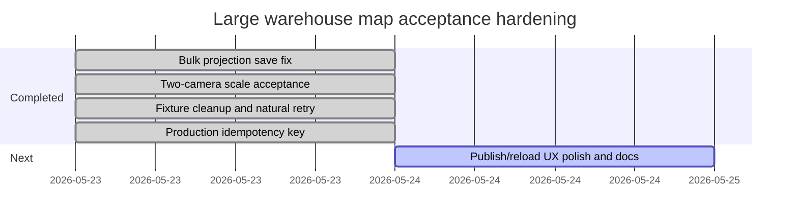

# Large Warehouse Map Operation Idempotency Result 2026-05-23

## Scope

This checkpoint hardens the warehouse-map save/publish chain so a repeated client request does not create duplicate canvas, topology, route, or publish rows after a timeout or lost response.

The accepted architecture rule is: large mass saves must not multiply operations by the number of cells, and retries must be keyed by an operation idempotency key instead of rerunning the heavy projection write.

## Implementation

- API request schemas now accept `idempotency_key` for:
  - `save-to-db`;
  - `projection/save-to-topology`;
  - `route/save-to-db`;
  - `publish-oracle`.
- `WarehouseMapDraftService` now resolves existing results by idempotency key before creating new Oracle rows:
  - canvas save: `RRL_WAREHOUSE_MAP_CANVAS.IDEMPOTENCY_KEY`;
  - topology projection: `RRL_WAREHOUSE_TOPOLOGY.IDEMPOTENCY_KEY`;
  - route save: `RRL_PICK_ROUTE.IDEMPOTENCY_KEY`;
  - publish: `RRL_WAREHOUSE_MAP_CANVAS.PUBLISH_IDEMPOTENCY_KEY`.
- Migration `043` adds the columns and unique active function-based indexes that enforce one live result per operation key.
- Added API smoke test `tests/load/warehouse_map/warehouse_map_operation_idempotency_smoke.cjs`.

## Oracle Migration

Migration files:

- `db/migrations/2026-05-17_feed_factory_traceability/043_apply.sql`;
- `db/migrations/2026-05-17_feed_factory_traceability/043_verify.sql`;
- `db/migrations/2026-05-17_feed_factory_traceability/043_smoke.sql`;
- `db/migrations/2026-05-17_feed_factory_traceability/043_smoke_cleanup.sql`;
- `db/migrations/2026-05-17_feed_factory_traceability/043_rollback.sql`.

Live apply note, `2026-05-23`:

- Target: `RABAEV@127.0.0.1:1521/orcl`.
- Apply: `Statements=3; Errors=0`.
- Verify before smoke: `Statements=6; Errors=0`.
- Smoke: `Statements=9; Errors=0`.
- Smoke cleanup: `Statements=5; Errors=0`.
- Final verify: `Statements=6; Errors=0`.

## Evidence

API idempotency smoke:

- Run: `20260522232321`.
- Warehouse: `0`.
- Created result: `canvas=41`, `topology=36`, `pick_route=123`.
- Retry checks:
  - topology retry returned the same `topology_id` and `idempotent=true`;
  - route retry returned the same `pick_route_id` and `idempotent=true`;
  - publish retry returned the same canvas/topology/route and `idempotent=true`.

Regression scale fixture:

- Run: `20260522232341`.
- Created result: `canvas=42`, `topology=37`, `pick_route=124`, cameras `58/59`.
- `5042` topology cells, `8` child slots, `200` route rows.
- Reload counters: `2` cameras, `1` camera link, `5042` topology cells, `8` slots, `1` route, `200` route rows.
- Oracle validation: `valid=true`, `storage_slot_route_rows=0`, `non_pick_cell_route_rows=0`.
- All `14/14` scale checks passed.

## Gantt Checkpoint

## Decision

The sprint is accepted. The save chain now has explicit production idempotency keys and live Oracle evidence. The remaining performance rule is architectural: any future mass operation that trends above a few seconds must be redesigned as a bulk operation before adding timeouts or retries.
