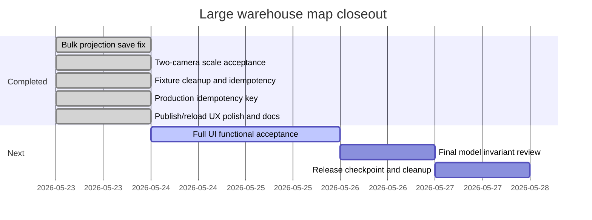

# Large Warehouse Map Publish/Reload UX Result 2026-05-23

## Scope

This checkpoint polishes the operator workflow for publishing a drawn warehouse map into Oracle and reloading the published warehouse state.

The UI goal is to make the chain explicit:

1. `Canvas DB`;
2. `Topology DB`;
3. `Route DB`;
4. `Publish Oracle`;
5. `Reload Oracle`.

## Implementation

- The Excel-like ribbon now exposes the full Oracle workflow in the publication group:
  - `Сохранить канвас`;
  - `Save topology`;
  - `Save route`;
  - `Publish Oracle`;
  - `Reload`.
- The left `Действия` block now duplicates the same publication chain and shows a compact step-state panel.
- The detailed `Oracle save/publish` block now shows:
  - step status;
  - Oracle ids for canvas, topology, and route;
  - operation idempotency keys;
  - publish validation and route-row count;
  - reload state after publish.
- UI actions now send stable operation idempotency keys to the API:
  - `WMAP-{ware_id}-{draft_id}-CANVAS`;
  - `WMAP-{ware_id}-{draft_id}-TOPOLOGY`;
  - `WMAP-{ware_id}-{draft_id}-ROUTE`;
  - `WMAP-{ware_id}-{draft_id}-PUBLISH`.
- The module instruction text and contextual `Oracle save/publish` help now explain idempotent retries and the correct workflow.
- Added UI smoke mode `smoke=sprint27-publish-ux` for visual acceptance.

## Evidence

Build and compile:

- `npm.cmd run build`: passed.
- Python compile for touched API schema/service files: passed.

Visual evidence:

- `admin/wms_admin_frontend/runtime/test-evidence/warehouse-map-sprint27-publish-ux.png`;
- `admin/wms_admin_frontend/runtime/test-evidence/warehouse-map-sprint27-publish-ux-full.png`.

Smoke:

- URL: `http://127.0.0.1:3000/?page=warehouse-map&smoke=sprint27-publish-ux`.
- Result: `SMOKE PASS`.
- Checks shown in the top chip:
  - `canvas=done`;
  - `topology=done`;
  - `route=done`;
  - `publish=done`;
  - `reload=done`;
  - `idempotency=visible`.

Backend regression:

- `tests/load/warehouse_map/warehouse_map_operation_idempotency_smoke.cjs` passed after the UI change.
- Run: `20260522234145`.
- Created result: `canvas=43`, `topology=38`, `pick_route=125`.
- Repeated topology, route, and publish calls returned the same ids with `idempotent=true`.

## Gantt Checkpoint

## Decision

The sprint is accepted. The operator can see the publication path, trigger every required save/publish/reload action from the ribbon and left action block, and the workflow is tied to production idempotency keys.
