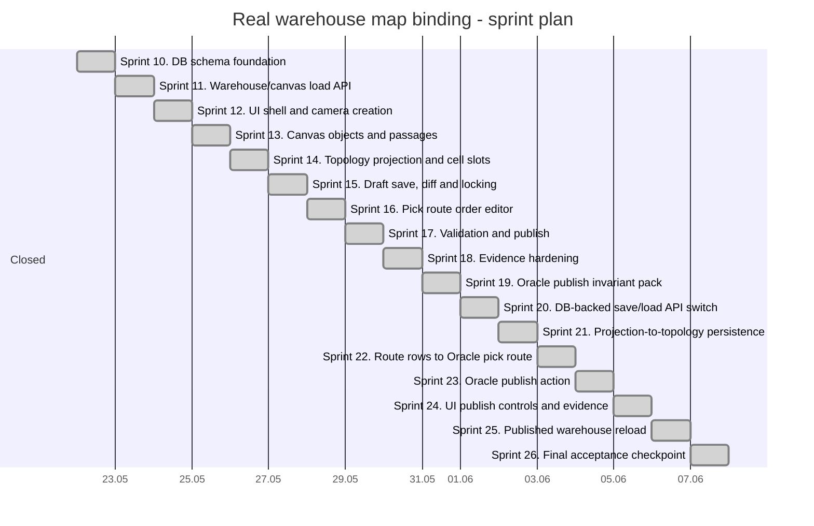

# ТЗ: привязка карты больших складов к реальным складам и порядку обхода

Статус: постановка следующего этапа после `рисование карты больших складов`.

Дата: 2026-05-22.

Рабочее название: **карта реального склада и порядок обхода**.

## 1. Цель

Нужно связать легкий Canvas-редактор карты больших складов с реальными складами, которые уже находятся в Oracle.

Пользователь должен:

- выбрать склад из базы;
- создать одну или несколько камер/помещений внутри выбранного склада;
- загрузить карту склада со всеми физическими ячейками, ролями, дробными ячейками, воротами, проходами и зонами;
- загрузить активный порядок обхода ячеек отбора;
- отредактировать карту и порядок обхода в том же Excel-подобном редакторе;
- нажать `Сохранить`, после чего изменения будут записаны в базу данных;
- отдельно опубликовать/активировать версию, если изменения должны стать рабочими для новых волн.

Главное отличие от предыдущего ТЗ: модуль больше не является изолированным runtime/json-draft редактором. Он становится DB-backed редактором мастер-данных склада.

Важное уточнение: **Canvas нужно сохранять как отдельный объект планировки**, а не восстанавливать каждый раз только из ячеек отбора. На карте склада могут быть проходы, стены, колонны, пустые зоны, связи между помещениями, подписи, измерительные линейки и другие объекты, которые не являются pick-face ячейками, но критичны для правильного маршрута и визуального понимания склада.

Один склад может состоять из нескольких физических камер/помещений. Каждая камера является отдельным кубоидом в координатах `x, y, z` и имеет собственный canvas. В будущем порядок обхода должен уметь связывать маршруты нескольких камер в один общий маршрут склада.

## 2. Связанные Документы

### `large_warehouse_map_drawing_tz.md`

Отсюда берем:

- Canvas 2D renderer;
- плотную сетку `35 x 90 x 6`;
- роли ячеек;
- bulk selection;
- уровень `L1..L6`;
- дробные ячейки отбора `FRACTIONAL_PICK_FACE`;
- расширение текущего требования: дробными могут быть не только ячейки отбора, но и ячейки хранения;
- требования к быстродействию и визуальному evidence.

### `warehouse_topology_pick_route_tz.md`

Отсюда берем только логику данных и инварианты порядка обхода:

- порядок обхода хранится как линейный список строк с числовым `PICK_SEQUENCE`;
- `RRL_PICK_ROUTE_CELL` не хранит граф `FROM -> TO`;
- стрелки/переходы являются вычисляемым представлением после сортировки строк по `PICK_SEQUENCE`;
- в одном активном маршруте ячейка или slot не должны повторяться;
- `PICK_SEQUENCE` должен быть уникальным внутри маршрута;
- split/fractional pick-face может входить в маршрут дочерним slot-адресом, но физический переход внутри одной ячейки не должен давать лишний пробег.

Не берем из соседней ветки:

- ее графический редактор топологии;
- старую SVG/визуальную карту;
- декоративную генерацию стрелок как источник истины;
- любые UI-решения, которые конфликтуют с легкой Canvas-картой.

## 3. Границы Модуля

Входит:

- выбор реального склада;
- загрузка и сохранение canvas-планировки склада;
- поддержка нескольких камер/помещений в одном складе;
- создание, настройка, дублирование и архивирование камер склада;
- хранение размеров камер и координат `x, y, z` в метрах;
- хранение проходов, расстояний между проходами и связей между камерами;
- загрузка активной/выбранной topology-версии;
- загрузка физической карты в Canvas-редактор;
- загрузка pick-route для склада;
- редактирование ролей, дробных ячеек, ворот, проходов и зон;
- редактирование порядка обхода поверх уже загруженной карты;
- сохранение изменений в Oracle;
- validation перед сохранением и перед публикацией;
- визуальное и Oracle/API evidence.

Не входит:

- ежедневное wave planning;
- расчет оптимального маршрута по заказам;
- ML/ABC-автооптимизация;
- цифровой двойник движения техники;
- автоматическая публикация без подтверждения администратора.

## 4. Базовый Принцип Сохранения

Кнопка `Сохранить` не должна незаметно менять рабочую опубликованную топологию, если по ней уже могут идти открытые волны.

Правило:

1. Если пользователь открыл опубликованную topology, первое изменение создает или открывает `DRAFT`-версию для этого `WARE_ID`.
2. `Сохранить` записывает текущий canvas, карту, камеры, проходы и порядок обхода в Oracle как черновик.
3. Рабочая опубликованная версия остается прежней до отдельного действия `Опубликовать`.
4. Новые волны используют только опубликованную активную версию.
5. Открытые волны и выданные задания продолжают жить на snapshot той topology/route, которая действовала при запуске.

Исключение: если пользователь редактирует уже черновую версию, `Сохранить` обновляет этот черновик.

## 5. Источники Данных

### Склады

Источник списка складов:

- существующий admin API `GET /api/admin/warehouses`;
- legacy Oracle table behind that API: склад имеет `WARE_ID`, название, признаки активности и настройки.

UI должен показывать только доступные пользователю склады, с учетом прав.

### Canvas Как Сохраняемый Объект

Canvas - это не производная картинка из pick-face ячеек, а отдельная сохраняемая модель планировки.

Canvas хранит:

- список камер склада;
- размер каждой камеры в метрах;
- координатную систему каждой камеры;
- визуальные объекты, которые не являются ячейками отбора;
- проходы и их ширину/расстояния;
- связи между камерами;
- параметры сетки ячеек;
- viewport/renderer metadata, необходимые для повторного открытия карты в том же виде.

Canvas не заменяет topology. Он является графическим и геометрическим источником планировки, из которого создается или обновляется WMS-проекция:

- `RRL_TOPOLOGY_CELL`;
- `RRL_TOPOLOGY_GATE`;
- `RRL_TOPOLOGY_ZONE`;
- `RRL_TOPOLOGY_AISLE`;
- route rows.

Правило: если объект нужен для отображения, измерения, маршрута или будущего редактирования, но не является WMS-ячейкой, он все равно должен сохраняться в canvas-модели.

### Создание Canvas Для Склада Без Canvas, Но С Существующими DB-Ячейками

Отдельный сценарий: склад уже есть в Oracle, ячейки отбора и хранения уже заведены в базе, но canvas-планировки еще нет.

Такой склад нельзя открывать как полностью пустую камеру и нельзя автоматически перекрашивать все поле в хранение. UI должен показать состояние `Нет canvas` и предложить мастер создания canvas:

1. `Пустая камера` - создает canvas/camera без WMS-ячееек, все поля по умолчанию `Недоступно`.
2. `Создать canvas из существующих ячеек` - строит draft-планировку из уже заведенных ячеек склада.
3. `Создать canvas из стандартного layout` - применяет шаблон к выделенной области и затем, при подтверждении, создает projection.

Источник существующих ячеек:

- сначала active/published `RRL_WAREHOUSE_TOPOLOGY` и `RRL_TOPOLOGY_CELL`, если такая topology уже есть;
- затем существующий legacy cell catalog склада, например `RRL_CELLS` и связанные справочники/настройки pick/storage, если topology еще не была создана;
- pick-route rows и split/fractional slot data подтягиваются только если они однозначно связаны с найденными cells/slots;
- остатки (`RRL_REMAINS`) не являются достаточным основанием для признания ячейки storage, если сама ячейка не заведена как storage/pick в мастер-данных.

Мастер bootstrap должен:

- показать счетчики найденных pick-face, storage, gates/passages, route rows, unknown/unplaced cells;
- дать выбрать камеру или создать новую камеру для размещения найденных ячеек;
- предложить orientation/layout mapping: направление аллей, шаг слотов, сторона `LEFT/RIGHT`, уровни, начальная координата;
- не менять опубликованную topology без draft/publish;
- сохранять связь с исходными DB IDs, чтобы route/order/stock references не потерялись;
- помещать нераспознанные или неразмещенные DB-ячейки в список `unplaced`, а не рисовать их как storage по догадке;
- требовать preview с числовыми счетчиками до применения;
- писать результат как DB-backed draft canvas/topology projection.

Критический инвариант: если роль существующей DB-ячейки не доказана исходными мастер-данными, на canvas она остается `Недоступно`/`UNKNOWN`, пока оператор явно не назначит роль.

### Камеры Склада

Камера склада - физический объем склада или помещения, который редактируется отдельным canvas.

Термин `камера` здесь означает не viewport браузера и не видеокамеру, а физический кубоид склада.

Один `WARE_ID` может иметь несколько камер:

```text
WARE_ID = 1
  CAMERA A: x=0,  y=0,  z=0, width=80m, depth=120m, height=12m
  CAMERA B: x=85, y=0,  z=0, width=40m, depth=90m,  height=10m
  CAMERA C: x=0,  y=130,z=0, width=60m, depth=50m,  height=8m
```

Обязательные атрибуты камеры:

| Поле | Назначение |
|---|---|
| `camera_id` | стабильный ID камеры |
| `ware_id` | склад |
| `canvas_id` | canvas этой камеры |
| `camera_code` | короткий код: `CAM-A`, `COLD-01`, `DRY-02` |
| `camera_name` | имя для UI |
| `origin_x_m`, `origin_y_m`, `origin_z_m` | начало камеры в общей системе склада |
| `width_m`, `depth_m`, `height_m` | размеры камеры |
| `grid_cell_width_m`, `grid_cell_depth_m` | базовая сетка, обычно `1.2 x 0.8` или `0.8 x 1.2` по ориентации |
| `levels` | количество уровней/ярусов в камере |
| `camera_kind` | `DRY`, `COLD`, `FREEZER`, `DOCK`, `SERVICE`, `MIXED` |
| `boundary_json` | границы камеры, nullable в MVP |
| `default_passage_width_m` | ширина прохода по умолчанию |
| `default_aisle_spacing_m` | расстояние между регулярными проходами |
| `status` | `DRAFT`, `ACTIVE`, `ARCHIVED` |

Камера должна быть прямоугольным кубоидом в MVP. Сложные формы допускаются позже через polygon boundary, но не должны ломать базовую модель.

### Создание Камеры

Создание камеры - отдельный пользовательский сценарий внутри выбранного склада.

Пользователь должен уметь создать камеру:

- из пустой формы;
- из шаблона;
- копированием существующей камеры;
- импортом из canvas/draft, если такая функция будет добавлена позже.

Минимальная форма создания камеры:

| Поле | Обязательность | Пример |
|---|---|---|
| `camera_code` | да | `CAM-A`, `DRY-01`, `COLD-02` |
| `camera_name` | да | `Основная сухая камера` |
| `camera_kind` | да | `DRY` |
| `origin_x_m` | да | `0` |
| `origin_y_m` | да | `0` |
| `origin_z_m` | да | `0` |
| `width_m` | да | `80` |
| `depth_m` | да | `120` |
| `height_m` | да | `12` |
| `levels` | да | `6` |
| `grid_cell_width_m` | да | `1.2` |
| `grid_cell_depth_m` | да | `0.8` |
| `default_passage_width_m` | да | `3.0` |
| `default_aisle_spacing_m` | нет | `3.2` |

Поведение формы:

- после выбора склада кнопка `Создать камеру` доступна, если есть права edit;
- если у склада нет canvas, создание первой камеры одновременно создает canvas header;
- `camera_code` должен быть уникальным внутри canvas/warehouse;
- размеры вводятся только в метрах;
- UI показывает предварительный прямоугольник камеры до сохранения;
- после сохранения камера появляется в selector камеры и может быть открыта сразу;
- создание камеры не создает автоматически WMS-ячейки, если пользователь не выбрал шаблон генерации ячеек;
- шаблон генерации ячеек должен быть отдельным шагом: `Создать камеру` и `Сгенерировать ячейки` не должны быть одной неявной операцией.

Шаблоны камеры MVP:

| Шаблон | Назначение |
|---|---|
| `EMPTY_RECTANGLE` | пустая камера только с размерами |
| `REGULAR_PICK_STORAGE` | регулярная камера с pick-face на `L1` и хранением на верхних уровнях |
| `DOCK_STAGING` | камера/зона ворот и накопления |
| `SERVICE_AREA` | служебная камера без ячеек отбора |

Копирование камеры:

- создает новую камеру с новым `camera_id` и `camera_code`;
- копирует canvas objects, passages, labels и шаблон ячеек, если пользователь включил соответствующие чекбоксы;
- не копирует published route rows как active route, а создает route draft preview только по явному действию;
- сохраняет метровую геометрию без пересчета через пиксели.

Архивирование камеры:

- запрещено, если на камеру ссылаются published cells, active route rows, stock или открытые задачи;
- в остальных случаях камера получает `ARCHIVED`, а objects/cells деактивируются в draft-версии;
- физический delete не используется.

### Проходы И Расстояния

Проход - отдельный объект canvas, а не только отсутствие ячеек.

Проход должен хранить:

- `passage_id`;
- `camera_id`;
- `passage_code`;
- геометрию на canvas: прямоугольник или polyline;
- `width_m`;
- расстояние/шаг между соседними проходами в метрах, если проходы сгенерированы регулярным шаблоном;
- тип: `PICK_AISLE`, `CROSS_AISLE`, `MAIN_TRANSPORT`, `DOCK_PASSAGE`, `SERVICE`;
- разрешенные ресурсы: picker, reachtruck, forklift, pedestrian-only;
- активность.

Расстояния должны задаваться в метрах и не должны выводиться из пикселей canvas. Пиксели - только отображение.

### Связи Между Камерами

Для будущего маршрута через несколько камер нужен отдельный объект связи:

- дверь;
- коридор;
- ворота;
- лифт/подъемник;
- переход через зону накопления;
- служебный проход.

Связь между камерами хранит:

- `camera_link_id`;
- `from_camera_id`;
- `to_camera_id`;
- `from_point_x_m`, `from_point_y_m`, `from_point_z_m`;
- `to_point_x_m`, `to_point_y_m`, `to_point_z_m`;
- `distance_m`;
- `travel_time_sec`;
- `direction`: `BOTH`, `FROM_TO`, `TO_FROM`;
- `allowed_resource_mask`;
- `active`.

Route editor в MVP может оставаться линейным, но если две соседние route rows находятся в разных камерах, validation должна проверить, что между камерами есть допустимая связь.

### Топология Склада

Основной источник карты:

- canvas header и камеры склада;
- `RRL_WAREHOUSE_TOPOLOGY`;
- `RRL_TOPOLOGY_ZONE`;
- `RRL_TOPOLOGY_AISLE`;
- `RRL_TOPOLOGY_CELL`;
- `RRL_TOPOLOGY_GATE`;
- `RRL_TOPOLOGY_CELL_GATE_DIST`;
- `RRL_TOPOLOGY_CHANGE_LOG`.

Если для склада нет topology:

- редактор должен показать состояние `Нет карты`;
- пользователь может создать новую карту из пустого шаблона или импортировать legacy-ячейки, если будет реализован отдельный import-adapter;
- импорт legacy `RRL_CELLS` не должен молча считаться опубликованной topology.

### Физические Ячейки И Дробные Логические Слоты

Обычные pick-face:

- физическая ячейка `RRL_TOPOLOGY_CELL` с типом/ролью `PICK_FACE`;
- адрес/код ячейки должен совпадать с published topology.

Обычные storage:

- физическая ячейка `RRL_TOPOLOGY_CELL` с типом/ролью `STORAGE`;
- адрес/код ячейки является обычным адресом хранения.

Дробная ячейка:

- физическая ячейка остается одной физической точкой на карте;
- внутри нее создаются `2..9` логических дочерних slot-адресов;
- дочерние slots могут быть отбором или хранением;
- дробление хранится как отдельный уровень данных, а не как несколько независимых физических ячеек.

Важно: дробность - это свойство физической ячейки и ее дочерних slots, а не только роль `FRACTIONAL_PICK_FACE`.

Типы дробления:

| Parent role | UI label | Child slot kind | Назначение |
|---|---|---|---|
| `PICK_FACE` / `FRACTIONAL_PICK_FACE` | Дробная ячейка отбора | `PICK_FACE_SLOT` | Несколько логических адресов отбора внутри одной физической точки |
| `STORAGE` / `FRACTIONAL_STORAGE` | Дробная ячейка хранения | `STORAGE_SLOT` | Несколько логических адресов хранения внутри одной физической ячейки |

### Пресеты Дробления И Дефолты

В UI у ролей дробления должен быть выпадающий список пресета рядом с кнопкой роли:

- рядом с `Дробные ячейки отбора` - список pick-face пресетов;
- рядом с `Дробные ячейки хранения` - список storage пресетов;
- выбор пресета меняет `fraction_cell_count`, `sub_level_count`, `sub_column_count` и `split_preset`;
- кнопка `Назначить выделению` применяет текущую роль вместе с выбранным пресетом;
- роли `Дробные ячейки отбора` и `Дробные ячейки хранения` не должны применяться как простая заливка роли без child slots: UI обязан запускать команду создания дробления с текущим пресетом;
- renderer не имеет права подставлять `3 x 3` как скрытый fallback для дробной ячейки без metadata; fallback для отбора - `2 уровня`, fallback для хранения - `1 / без дробления`;
- пункт `Прочие` можно показывать только как будущий пользовательский режим; пока он не реализован, он неактивен и визуально блеклый/заштрихованный.

Дефолты:

- для `Дробные ячейки отбора` дефолт `2 уровня`: `fraction_cell_count = 2`, `sub_level_count = 2`, `sub_column_count = 1`;
- для `Дробные ячейки хранения` дефолт `1 / без дробления`: это обычная `STORAGE`-ячейка без child slots; `FRACTIONAL_STORAGE` создается только после явного выбора `2 по горизонтали` или `3 по горизонтали`.

Pick-face пресеты:

| UI label | fraction_cell_count | sub_level_count | sub_column_count | split_preset |
|---|---:|---:|---:|---|
| `2 уровня` | 2 | 2 | 1 | `PICK_2_LEVELS` |
| `3 уровня` | 3 | 3 | 1 | `PICK_3_LEVELS` |
| `2 по горизонтали` | 2 | 1 | 2 | `PICK_2_HORIZONTAL` |
| `3 по горизонтали` | 3 | 1 | 3 | `PICK_3_HORIZONTAL` |
| `2 x 2` | 4 | 2 | 2 | `PICK_2_BY_2` |
| `2 уровня x 3 по горизонтали` | 6 | 2 | 3 | `PICK_2_BY_3` |
| `3 уровня x 2 по горизонтали` | 6 | 3 | 2 | `PICK_3_BY_2` |
| `3 x 3` | 9 | 3 | 3 | `PICK_3_BY_3` |

Storage пресеты:

| UI label | fraction_cell_count | sub_level_count | sub_column_count | split_preset |
|---|---:|---:|---:|---|
| `1 / без дробления` | 1 | 1 | 1 | `STORAGE_NONE` |
| `2 по горизонтали` | 2 | 1 | 2 | `STORAGE_2_HORIZONTAL` |
| `3 по горизонтали` | 3 | 1 | 3 | `STORAGE_3_HORIZONTAL` |

Для storage запрещены вертикальные и комбинированные дробления. Если UI использует общий список пресетов для pick/storage, недопустимые storage-пресеты должны быть неактивными, визуально блеклыми/заштрихованными и иметь tooltip с причиной.

### Canvas-Отрисовка Дробных Ячеек

Дробная ячейка отбора или хранения должна визуально показывать свое дробление прямо внутри внешнего прямоугольника физической ячейки.

Правило отрисовки:

- внешний прямоугольник всегда остается одной физической ячейкой;
- внутренние линии показывают выбранный `sub_level_count x sub_column_count` preset;
- это визуальная метафора, а не обязательное точное отражение реального деления места на полке;
- внутренние линии не создают новые `RRL_TOPOLOGY_CELL` и не влияют на расстояния/проходы;
- child slots остаются логическим уровнем данных под одной физической ячейкой.

Линии:

| Пресет | Визуальная отрисовка |
|---|---|
| `2 уровня` / `2 x 1` | одна горизонтальная линия пополам |
| `3 уровня` / `3 x 1` | две горизонтальные линии |
| `2 по горизонтали` / `1 x 2` | одна вертикальная линия пополам |
| `3 по горизонтали` / `1 x 3` | две вертикальные линии |
| `2 x 2` | одна вертикальная и одна горизонтальная линия |
| `2 x 3` | две вертикальные и одна горизонтальная линия |
| `3 x 2` | одна вертикальная и две горизонтальные линии |
| `3 x 3` / `FRACTION_9` | две вертикальные и две горизонтальные линии |

Для storage реально доступны только `1 / без дробления`, `2 по горизонтали` и `3 по горизонтали`. Поэтому storage-ячейка без дробления рисуется без внутренних линий, storage `2 по горизонтали` рисует одну вертикальную линию, storage `3 по горизонтали` рисует две вертикальные линии.

На малом zoom renderer может заменять внутренние линии компактным маркером или счетчиком дробления, чтобы не перегружать карту. На рабочем zoom, где оператор назначает или проверяет дробные slots, линии дробления должны быть видны.

Для совместимости UI может показывать отдельные роли:

- `FRACTIONAL_PICK_FACE` - дробная ячейка отбора;
- `FRACTIONAL_STORAGE` - дробная ячейка хранения.

Но DB-модель должна быть общей: одна физическая ячейка, набор дочерних slots, а не две разные несвязанные реализации.

Дробные pick-face:

- физическая ячейка имеет роль `FRACTIONAL_PICK_FACE`;
- дочерние логические ячейки хранятся отдельно как slot-уровень;
- slot имеет собственный `logical_cell_code`, `sub_level`, `sub_column`, `pick_order`;
- физические координаты, проход, ворота и расстояния наследуются от родительской ячейки.

Дробные storage:

- физическая ячейка имеет роль `FRACTIONAL_STORAGE` или `STORAGE` с `split_mode != NONE`;
- дочерние логические ячейки являются адресами хранения;
- slot имеет собственный `logical_cell_code`, `sub_level`, `sub_column`, `storage_order`;
- storage дробится только по горизонтали: `sub_level_count = 1`, `sub_column_count in (2, 3)`;
- дефолт storage `1 / без дробления` не создает child slots и остается обычной ролью `STORAGE`;
- у slot может быть собственная вместимость: объем, вес, количество паллет/коробов, ограничения по SKU/температуре/партии;
- остатки и задания размещения должны иметь возможность ссылаться на `storage_slot_id`, если товар лежит в дробной ячейке хранения;
- физические координаты, проход, ворота и расстояния наследуются от родительской ячейки.

Целевая DB-модель должна использовать обобщенную таблицу slot-ов, например `RRL_TOPOLOGY_CELL_SLOT`, или совместимый слой поверх существующих `RRL_TOPOLOGY_PICK_FACE_SLOT` / `RRL_PICK_FACE_SLOT`.

Обязательное правило: модель должна отделять:

- физическую ячейку;
- логический slot отбора;
- логический slot хранения.

Нельзя делать так, чтобы дробная storage-ячейка выглядела как несколько независимых физических `RRL_TOPOLOGY_CELL`: это сломает расстояния, проходы, route и визуальную геометрию.

### Порядок Обхода

Источник порядка обхода:

- `RRL_PICK_ROUTE`;
- `RRL_PICK_ROUTE_CELL`.

Инвариант:

- `RRL_PICK_ROUTE_CELL` хранит точки линейного порядка;
- `PICK_SEQUENCE` является Oracle `NUMBER`;
- renderer не придумывает порядок по координатам;
- UI сортирует строки маршрута по `PICK_SEQUENCE`;
- вычисленная стрелка `N -> N+1` не записывается в базу как отдельное ребро.

## 6. Основной Пользовательский Сценарий

1. Пользователь открывает страницу `Рисование карты больших складов`.
2. В верхней панели выбирает склад.
3. Система грузит:
   - паспорт склада;
   - список камер склада;
   - canvas каждой камеры или выбранной камеры;
   - список topology-версий;
   - активную опубликованную topology;
   - активный опубликованный pick-route;
   - все ячейки карты и роли;
   - дробные slot-ячейки;
   - ворота, проходы, зоны и distance metadata.
4. Canvas показывает карту склада.
5. Пользователь может переключаться между камерами склада или смотреть общий обзор камер.
6. Панель route показывает порядок обхода.
7. Пользователь редактирует canvas, карту или маршрут.
8. UI показывает dirty-state и diff: сколько canvas objects, камер, ячеек, slots, gates, route rows будет изменено.
9. Пользователь нажимает `Сохранить`.
10. Система выполняет validation и DB transaction.
11. После успешного сохранения черновик можно продолжать редактировать или отправить на публикацию.

## 7. UX Требования

### Верхняя Панель

Обязательные элементы:

- selector склада;
- selector камеры;
- selector topology-версии;
- selector route;
- статус версии: `DRAFT`, `VALIDATED`, `PUBLISHED`, `ARCHIVED`;
- кнопки `Загрузить`, `Сохранить`, `Проверить`, `Опубликовать`;
- индикатор dirty-state;
- счетчики: cameras, canvas objects, passages, cells, pick-face, fractional slots, gates, route rows.

Элементы без реализованного функционала должны иметь общий muted/hatched стиль заглушки.

### Загрузка Карты

После выбора склада:

- карта очищает старое состояние;
- новая карта и все камеры грузятся атомарно;
- selection сбрасывается, если выбран другой склад;
- zoom/pan могут сохраняться только если это та же topology и та же камера;
- при ошибке загрузки пользователь видит причину и retry.

### Редактирование Canvas И Камер

Пользователь должен уметь:

- создать камеру склада;
- задать размеры камеры в метрах;
- задать `origin_x_m`, `origin_y_m`, `origin_z_m`;
- открыть отдельный canvas камеры;
- нарисовать проходы как canvas objects;
- задать ширину прохода и расстояние между проходами в метрах;
- добавить объект, который не является ячейкой: стена, колонна, пустая зона, подпись, измерительная линия, служебный проход;
- связать две камеры через link object;
- сохранить canvas без потери объектов, которые не отражены в `RRL_TOPOLOGY_CELL`.

Визуально можно оставаться в 2D, но данные камеры должны быть 3D-aware: `z` и высота камеры сохраняются, а уровни ячеек связываются с высотными слоями.

### Единая Командная Модель

Все действия редактора должны быть описаны как команды, а не зашиты отдельно в toolbar, боковую панель и контекстное меню.

Одна команда должна иметь:

- `command_id`;
- `label`;
- `group`;
- `icon`;
- `help_id`;
- `help_short`;
- `help_details`;
- `enabled`;
- `disabled_reason`;
- `requires_selection`;
- `required_permission`;
- `handler`;
- `confirmation_required`;
- `danger_level`.

Эта модель нужна, чтобы один и тот же функционал был доступен:

- в верхней панели;
- в боковой панели;
- через hotkey, если он назначен;
- через контекстное меню правой кнопки мыши.

Если команда еще не реализована, но уже видна пользователю, она должна быть disabled и оформлена muted/hatched стилем по общему правилу заглушек.

Обязательные команды format painter:

- `format.copy` / `Скопировать формат`;
- `format.paste` / `Вставить формат`;
- `format.cancel` / `Отменить копирование формата`.

Эти команды должны использовать тот же command registry, undo/redo stack, validation, rights model и help-систему, что остальные команды редактора.

`format.copy` сохраняет в `format_clipboard` snapshot выбранного прямоугольника:

- roles физических ячеек;
- split/fraction presets;
- child-slot structure as template;
- storage capacity/policy template;
- cell-level semantic flags.

`format.copy` не сохраняет уникальную идентичность:

- DB IDs;
- physical/logical/slot codes;
- route rows и `PICK_SEQUENCE`;
- stock/reservations/tasks/facts;
- published dependencies.

`format.paste` применяет snapshot от целевой anchor-cell с тем же размером исходного прямоугольника. При конфликте с границами камеры, protected cells или dependency cells команда должна показать preview/validation reason до записи в draft.

### Context Help

У редактора должна быть единая контекстная help-система, чтобы оператор не угадывал смысл сложных кнопок, полей и режимов.

Требование:

- каждый command, toolbar button, sidebar button, field, dropdown, checkbox, menu item, inspector field и интерактивный элемент карты имеет `help_id`;
- короткая подсказка открывается по hover/focus;
- подробная помощь открывается через маленький значок `?`, `i` или книгу рядом с группой настроек, полем или сложной командой;
- любая подробная подсказка должна отвечать на пять вопросов:
  - что это за элемент;
  - какие данные он принимает на вход или от чего зависит;
  - что делает;
  - для чего существует;
  - краткая инструкция по применению;
- если объект сложный, popover может содержать расширенную инструкцию, но без постоянного текста внутри панели;
- одна и та же команда показывает одинаковый help в toolbar, sidebar и right-click menu;
- help может открываться из right-click menu, чтобы не занимать место в основной панели;
- disabled/future actions показывают help с причиной недоступности и следующим ожидаемым шагом;
- help не должен быть длинным постоянным текстом внутри панели;
- help должен открываться всплывающим popover поверх интерфейса, а не постоянной карточкой внутри боковой панели;
- popover не должен сдвигать layout, закрывать активную ячейку, рамку выделения, route row или критичные кнопки сохранения;
- help можно закрыть `Esc`, кликом вне карточки или потерей focus;
- на compact viewport help открывается по клику на значок и занимает ограниченную область с прокруткой внутри popover.

Визуальная метафора:

- `?` - помощь по конкретному элементу;
- книга - справка по группе/сценарию;
- `i` - короткое информационное пояснение без длинной инструкции.

Обязательные help-группы:

- выбор склада/canvas/камеры;
- создание камеры и размеры в метрах;
- роли ячеек;
- дробные ячейки отбора и хранения;
- split presets и визуальная сетка дробления;
- стандартные layouts;
- bootstrap canvas из existing DB cells;
- save/diff/publish/validation;
- порядок обхода и route rows;
- context menu и disabled actions.

### Контекстное Меню Правой Кнопки

Весь основной функционал редактора должен быть продублирован в контекстном меню правой кнопки мыши.

Меню должно быть контекстным:

- клик по пустой области камеры;
- клик по canvas object;
- клик по ячейке;
- клик по выделенной области;
- клик по route row/номеру порядка;
- клик по связи между камерами;
- клик по overview/миникарте.

Меню может быть древовидным, чтобы не раздувать первый уровень. Первый уровень должен оставаться коротким, а редко используемые операции уходят в подменю.

Рекомендуемая структура меню:

```text
Склад
  Сохранить
  Проверить
  Опубликовать
  Показать diff

Камера
  Создать камеру
  Настройки камеры
  Дублировать камеру
  Архивировать камеру
  Перейти к камере
  Связать с другой камерой

Canvas
  Добавить стену
  Добавить колонну
  Добавить подпись
  Добавить измерительную линию
  Добавить служебную зону
  Удалить/архивировать объект

Проходы
  Создать проход
  Задать ширину прохода
  Задать расстояние между проходами
  Создать регулярные проходы

Формат
  Скопировать формат
  Вставить формат
  Отменить копирование формата

Ячейки
  Назначить роль
    Ячейки отбора
    Дробные ячейки отбора
    Ячейки хранения
    Дробные ячейки хранения
    Транспортное накопление
    На пленку
    Ворота
    Проходы
    Недоступно
    Пусто
  Сгенерировать ячейки в камере
  Стереть роль
  Копировать роли
  Вставить роли

Дробная ячейка
  Создать дробную ячейку отбора
    Пресет: 2 уровня (default)
    Пресет: 3 уровня
    Пресет: 2 по горизонтали
    Пресет: 3 по горизонтали
    Пресет: 2 x 2
    Пресет: 2 уровня x 3 по горизонтали
    Пресет: 3 уровня x 2 по горизонтали
    Пресет: 3 x 3
    Прочие (disabled until custom grid is implemented)
  Создать дробную ячейку хранения
    Пресет: 1 / без дробления (default)
    Пресет: 2 по горизонтали
    Пресет: 3 по горизонтали
  Изменить подуровни/подстолбики
  Перенумеровать pick_order
  Перенумеровать storage_order
  Настроить вместимость storage slots
  Проверить дубли logical_cell_code / slot_code

Порядок обхода
  Построить
    Линейно
    Z-образно
    u-образно
    П-образно
    Вручную
  Вставить перед
  Вставить после
  Перенумеровать участок
  Исключить из маршрута
  Проверить маршрут

Вид
  Fit camera
  Fit selected
  Показать/скрыть слой
  Перейти к active route row
```

Правила контекстного меню:

- правый клик по выделенной области применяет команды к выделению;
- правый клик по невыделенной ячейке сначала делает эту ячейку active context, но не обязан сбрасывать старое выделение без явного действия;
- dangerous actions требуют подтверждения;
- disabled actions остаются видимыми с причиной в tooltip;
- меню закрывается после выполнения команды, кроме команд выбора роли/слоя, где допустим pin-mode;
- при компактном экране меню не должно выходить за границы viewport;
- все команды меню должны писать в тот же undo/redo stack, что и кнопки панели.

### Редактирование Карты

Сохраняется поведение из предыдущего ТЗ:

- Canvas renderer;
- bulk selection;
- Shift/Ctrl multi-area;
- уровни `L1..L6`;
- назначение ролей;
- дробные ячейки;
- undo/redo до сохранения;
- viewport не должен тормозить на десятках тысяч ячеек.

### Стандартные Layout Для Выделенного Участка

Стандартный layout - это команда над прямоугольным выделением, а не глобальная генерация всего склада. Команда доступна из контекстного меню:

```text
Выделение
  Стандартный layout
    Аллеи отбора/хранения
    Ворота + накопление
    Ворота + хранение
```

Все layout-команды работают в два шага:

1. `Preview` - UI показывает предложенный расклад, счетчики и остаток неиспользованной области.
2. `Apply` - оператор подтверждает, после чего изменения пишутся в undo/redo stack и draft.

#### Layout `Аллеи отбора/хранения`

Назначение: быстро создать регулярные аллеи, где есть проход, слева от прохода левые ячейки, справа правые ячейки.

Правила MVP:

- команда применяется к выделенному прямоугольнику;
- один модуль аллеи по ширине занимает `3` grid-columns:
  - левая колонка ячеек;
  - колонка прохода;
  - правая колонка ячеек;
- количество предложенных аллей равно `floor(selection_width / 3)`;
- если выделение `90` ячеек по высоте и `10` ячеек по ширине, preview предлагает `3` аллеи и показывает `1` неиспользованную колонку как `Недоступно`/резерв;
- проход создается как canvas passage object с `width_m = default_passage_width_m`, а не как storage cell;
- слева назначается side `LEFT`, справа side `RIGHT`;
- при `levels = 6` default-семантика:
  - `L1` слева/справа получает `PICK_FACE`;
  - `L2..L6` слева/справа получают `STORAGE`, если оператор не выбрал другой шаблон уровней;
  - проход на всех уровнях не становится ячейкой хранения;
- адресация pick-face и storage slots не генерируется молча: шаблон может предложить маску, но оператор должен подтвердить numbering/mask;
- route order не создается этим layout-шаблоном; порядок обхода остается Sprint 16.

Параметры шаблона:

- orientation: сверху вниз или снизу вверх;
- side naming: `LEFT/RIGHT`;
- levels count;
- pick level set, по умолчанию `L1`;
- storage level set, по умолчанию `L2..L6`;
- passage width in meters;
- optional aisle code mask.

#### Layout `Ворота + накопление` / `Ворота + хранение`

Назначение: быстро создать участок у ворот, где вдоль верхней границы выделения стоят ворота, а от ворот к нижней границе идут зоны хранения/накопления.

Правила MVP:

- команда применяется к выделенному прямоугольнику;
- верхняя граница selection является линией ворот;
- один воротный модуль занимает `2` соседние grid cells по верхней границе selection, а не одиночную cell;
- под каждым воротным модулем создаются паллетоместа накопления `TRANSPORT_STAGING` рядами по `2` соседние grid cells;
- накопление идет от строки сразу под воротами до нижней границы selection, без hardcode на `4` паллетоместа;
- если включен вариант `Ворота + хранение`, storage может заполнять только явно выбранный остаток, не занятый воротами/накоплением; MVP-кнопка `Ворота + накопление` storage не дорисовывает молча;
- между соседними воротами может оставаться `AISLE` или `Недоступно` по выбранному параметру;
- gate/staging/storage geometry хранится в метрах через canvas objects/passages, а не только через цвет клеток;
- шаблон не создает машины/транспортные задания; это только мастер-данные layout.

Параметры шаблона:

- gate count или gate module step;
- gate width, MVP default `2` grid cells;
- staging row width, MVP default `2` grid cells;
- staging depth, MVP default `до нижней границы selection`;
- optional storage mode для будущего `Ворота + хранение`;
- gate side, MVP: `TOP`;
- default gate code mask;
- whether remainder becomes `AISLE`, `BLOCKED`, or stays unchanged.

Ошибки preview:

- selection слишком маленькое для хотя бы одного модуля;
- selection crosses multiple cameras;
- выбранный уровень не совместим с requested layout;
- шаблон пытается перезаписать published/dependency-protected cells без draft;
- в выделении есть existing DB cells, которые оператор не разрешил перезаписать.

### Редактирование Порядка Обхода

Порядок обхода редактируется поверх карты, но источник истины - список route rows.

Пользователь должен уметь:

- включить режим `Порядок обхода`;
- видеть route rows в таблице/панели;
- выбрать участок pick-face ячеек;
- построить порядок для выбранного участка;
- вручную изменить `PICK_SEQUENCE`;
- вставить ячейку между существующими значениями без полной перенумерации;
- перенумеровать выбранный участок при необходимости;
- сохранить route draft в Oracle;
- проверить, что активный route не содержит дублей.

Поддерживаемые шаблоны MVP:

| Pattern | UI label | Назначение |
|---|---|---|
| `LINEAR` | Линейно | Прямой порядок внутри выбранного участка |
| `Z` | Z-образно | Чередование левой/правой стороны внутри аллеи |
| `U_SHAPE` | u-образно | Вход, обход через поперечный проход, выход |
| `P_SHAPE` | П-образно | Обход по форме русской `П`, без диагональной N-логики |
| `MANUAL` | Вручную | Только ручная перестановка |

`SNAKE` не включается в MVP, если его поведение не отличается доказуемо от `u-образно` или `П-образно`.

## 8. Семантика `Сохранить`

`Сохранить` должно выполнять одну транзакцию или управляемую последовательность с rollback при ошибке.

Сохраняется:

- canvas header;
- камеры склада;
- canvas objects;
- проходы с метровыми размерами;
- связи между камерами;
- topology header draft;
- cells;
- zones;
- aisles/passages;
- gates;
- staging/film-wrap/service roles;
- fractional pick-face slots;
- fractional storage slots;
- active route draft rows;
- audit/change log.

Не допускается:

- частично сохранить карту без route, если пользователь сохранял оба блока;
- удалить опубликованную ячейку физически, если на нее ссылается опубликованный route, stock, pick-face assignment или открытая задача;
- публиковать route, если он ссылается на ячейки другой topology;
- публиковать route, если в нем есть дубли `PICK_SEQUENCE`;
- менять активную published topology без явного publish.

Для удаления используется деактивация/архивация в новой версии, а не физический delete.

## 9. Validation

Перед сохранением:

- выбранный `WARE_ID` существует и доступен пользователю;
- canvas принадлежит выбранному складу;
- все камеры canvas принадлежат выбранному складу;
- `camera_code` уникален внутри склада;
- размеры камеры больше нуля;
- `origin_x_m`, `origin_y_m`, `origin_z_m` заданы в метрах;
- canvas objects не выходят за границы своей камеры, если для типа объекта не разрешен выход;
- проходы имеют положительную ширину `width_m`;
- расстояние между проходами хранится в метрах и не вычисляется из пикселей;
- связи между камерами ссылаются на существующие active камеры;
- новая камера имеет уникальный `camera_code`;
- архивирование камеры запрещено при active/published зависимостях;
- команды контекстного меню проверяют те же права и validation rules, что и кнопки панели;
- bootstrap canvas из existing DB cells не теряет исходные DB IDs;
- bootstrap не назначает storage/pick роль по догадке: роль должна прийти из topology/cell master data или быть явно назначена оператором;
- unplaced DB cells остаются в отдельном списке и блокируют publish, если их требуется разместить по правилам склада;
- standard layout preview не может пересекать несколько камер;
- layout `Аллеи отбора/хранения` должен иметь хотя бы один полный модуль `LEFT_CELL + PASSAGE + RIGHT_CELL`;
- layout `Ворота + накопление` должен иметь место под верхнюю линию ворот шириной `2` cells и хотя бы один ряд накопления шириной `2` cells;
- если соседние route rows находятся в разных камерах, между этими камерами есть active link;
- topology принадлежит выбранному складу;
- route принадлежит той же topology/warehouse;
- cell codes уникальны внутри topology;
- role values известны;
- pick-face имеет сторону или явно разрешенное пустое значение;
- fractional parent имеет `2..9` активных child slots;
- fractional parent имеет `sub_level_count * sub_column_count = child_slot_count`;
- storage parent с пресетом `STORAGE_NONE` не имеет child slots;
- storage parent с child slots имеет только горизонтальное дробление `1 x 2` или `1 x 3`;
- child slots не дублируют `logical_cell_code`;
- child slots не дублируют `sub_level + sub_column` внутри parent;
- storage child slots не дублируют `slot_code`;
- `STORAGE_SLOT` имеет корректные capacity fields, если они обязательны для склада;
- physical parent не смешивает `PICK_FACE_SLOT` и `STORAGE_SLOT`, если не включен явно разрешенный режим `MIXED`;
- stock/reservation/warehouse-task не ссылаются на архивный `STORAGE_SLOT`;
- route содержит только существующие active pick-face или slot rows;
- `PICK_SEQUENCE` уникален внутри route;
- одна физическая pick-face ячейка не повторяется в route, если route идет по физическим cells;
- один slot не повторяется в route, если route идет по slots;
- нет нескольких active published `PICK` route для одной topology;
- diff не содержит удаления ячеек с активными зависимостями.

Перед публикацией дополнительно:

- нет blocking validation errors;
- есть хотя бы один route для pick-face склада;
- нет route rows на архивные cells/slots;
- gate/staging роли валидны для outbound/inbound сценариев;
- Oracle invariant queries возвращают ноль нарушений.

## 10. API Контракт

### Existing API

Использовать:

- `GET /api/admin/warehouses`;
- `GET /api/admin/warehouse-topologies?ware_id=...`;
- `GET /api/admin/warehouse-topologies/{topology_id}/map`;
- `GET /api/admin/pick-routes?ware_id=...&topology_id=...`;

### New/Extended API

Минимально нужно добавить или расширить:

- `GET /api/admin/warehouse-map/warehouses/{ware_id}/state`
  - возвращает warehouse passport, active topology, active route, canvas header, cameras, passages, chamber links, cells, slots, gates, route rows, counters.
- `GET /api/admin/warehouse-map/warehouses/{ware_id}/canvases`
  - возвращает список canvas-версий склада.
- `POST /api/admin/warehouse-map/warehouses/{ware_id}/canvases`
  - создает новый canvas склада с первой камерой.
- `PATCH /api/admin/warehouse-map/canvases/{canvas_id}`
  - сохраняет canvas metadata, scale, renderer version, status.
- `POST /api/admin/warehouse-map/canvases/{canvas_id}/cameras`
  - создает камеру склада.
- `POST /api/admin/warehouse-map/cameras/{camera_id}/clone`
  - дублирует камеру с выбранными canvas objects/passages/cell template options.
- `PATCH /api/admin/warehouse-map/cameras/{camera_id}`
  - обновляет размеры, origin и настройки камеры.
- `POST /api/admin/warehouse-map/cameras/{camera_id}/archive`
  - архивирует камеру после dependency validation.
- `POST /api/admin/warehouse-map/cameras/{camera_id}/generate-cells`
  - генерирует WMS cells по шаблону камеры отдельным явным действием.
- `POST /api/admin/warehouse-map/warehouses/{ware_id}/bootstrap-canvas/preview`
  - строит preview создания canvas из existing topology/legacy DB cells, возвращает counts, mapping warnings и unplaced cells.
- `POST /api/admin/warehouse-map/warehouses/{ware_id}/bootstrap-canvas/apply`
  - создает DB-backed draft canvas/topology projection из подтвержденного preview existing DB cells.
- `POST /api/admin/warehouse-map/canvases/{canvas_id}/layouts/preview`
  - строит preview стандартного layout в выделенной области: `AISLE_PICK_STORAGE` или `TOP_GATES_STORAGE`.
- `POST /api/admin/warehouse-map/canvases/{canvas_id}/layouts/apply`
  - применяет подтвержденный layout к draft canvas; WMS cell/slot projection создается Sprint 14 или позже, если layout пока canvas-only.
- `PATCH /api/admin/warehouse-map/cameras/{camera_id}/objects`
  - сохраняет стены, колонны, подписи, проходы, служебные зоны и другие canvas objects.
- `PATCH /api/admin/warehouse-map/cameras/{camera_id}/passages`
  - сохраняет проходы, ширину и расстояния в метрах.
- `PATCH /api/admin/warehouse-map/canvases/{canvas_id}/camera-links`
  - сохраняет связи между камерами.
- `POST /api/admin/warehouse-map/warehouses/{ware_id}/drafts/from-active`
  - создает DB-backed draft из активного canvas/topology/route.
- `GET /api/admin/warehouse-map-drafts/{draft_id}`
  - возвращает полный draft state для Canvas editor.
- `PATCH /api/admin/warehouse-map-drafts/{draft_id}/cells`
  - сохраняет измененные cells/roles/coordinates.
- `PATCH /api/admin/warehouse-map-drafts/{draft_id}/fractional-slots`
  - сохраняет дробные child slots отбора и хранения, включая `split_preset`, `fraction_cell_count`, `sub_level_count`, `sub_column_count`;
  - для pick-face без указанного пресета применяет дефолт `PICK_2_LEVELS`;
  - для storage без указанного пресета применяет `STORAGE_NONE` и не создает child slots.
- `PATCH /api/admin/warehouse-map-drafts/{draft_id}/storage-slots`
  - сохраняет capacity/ограничения дробных storage slots, если они редактируются отдельной панелью.
- `PATCH /api/admin/warehouse-map-drafts/{draft_id}/route`
  - сохраняет route rows и `PICK_SEQUENCE`.
- `POST /api/admin/warehouse-map-drafts/{draft_id}/validate`
  - проверяет карту и route.
- `POST /api/admin/warehouse-map-drafts/{draft_id}/save-to-db`
  - фиксирует draft changes в Oracle draft tables/version.
- `POST /api/admin/warehouse-map-drafts/{draft_id}/publish`
  - публикует topology/route после validation.
- `GET /api/admin/warehouse-map-drafts/{draft_id}/diff`
  - показывает count изменений перед сохранением.
- `GET /api/admin/warehouse-map/commands?context=...`
  - возвращает доступные команды для toolbar/context-menu с правами, enabled state и disabled reason.

Payload карты должен оставаться компактным:

- canvas objects передаются как typed JSON records с координатами в метрах;
- камеры передаются отдельным массивом, чтобы не смешивать глобальный склад и локальный canvas;
- роли можно передавать как `roles_base64` или sparse diff;
- route rows передаются списком с `pick_route_cell_id`, `topology_cell_id`, `pick_face_slot_id`, `pick_sequence`, `cell_code`, `slot_code`;
- storage slots передаются списком с `cell_slot_id`, `topology_cell_id`, `slot_kind=STORAGE_SLOT`, `slot_code`, `sub_level`, `sub_column`, `storage_order`, `capacity`;
- для больших складов обязательна возможность range/viewport загрузки в будущем, но MVP может отдавать полный `18 900` state.

## 11. DB Требования

MVP должен работать с существующими topology таблицами:

- `RRL_WAREHOUSE_TOPOLOGY`;
- `RRL_TOPOLOGY_CELL`;
- `RRL_TOPOLOGY_GATE`;
- `RRL_PICK_ROUTE`;
- `RRL_PICK_ROUTE_CELL`;
- `RRL_TOPOLOGY_CHANGE_LOG`.

Если для DB-backed draft текущих таблиц недостаточно, нужно добавить миграцию:

- `RRL_WAREHOUSE_MAP_CANVAS` - header canvas-версии склада;
- `RRL_WAREHOUSE_MAP_CAMERA` - камеры/помещения склада как кубоиды `x,y,z,width,depth,height`;
- `RRL_WAREHOUSE_MAP_OBJECT` - canvas objects, которые не являются WMS-ячейками;
- `RRL_WAREHOUSE_MAP_PASSAGE` - проходы и их метровые параметры;
- `RRL_WAREHOUSE_MAP_CAMERA_LINK` - связи между камерами;
- `RRL_TOPOLOGY_CELL_SLOT` или совместимый generalized slot layer для дробных ячеек отбора и хранения;
- draft/session header для редактора;
- JSON/diff payload для несохраненных изменений или отдельные draft rows;
- optimistic lock поля: `SOURCE_TOPOLOGY_ID`, `SOURCE_ROUTE_ID`, `SOURCE_UPDATED_AT`;
- audit поля: `CREATED_BY`, `UPDATED_BY`, timestamps.

### Целевая Canvas DB-Модель

`RRL_WAREHOUSE_MAP_CANVAS`:

| Поле | Назначение |
|---|---|
| `CANVAS_ID` | ID canvas-версии |
| `WARE_ID` | склад |
| `TOPOLOGY_ID` | связанная topology-версия, nullable до публикации |
| `CANVAS_CODE` | код canvas |
| `CANVAS_NAME` | имя |
| `STATUS` | `DRAFT`, `VALIDATED`, `PUBLISHED`, `ARCHIVED` |
| `UNIT_CODE` | `METER` |
| `SCALE_PX_PER_M` | дефолтный UI scale |
| `RENDERER_KIND` | `CANVAS_2D`, позже `WEBGL` |
| `SOURCE_CANVAS_ID` | из какой версии cloned |
| `VERSION_NO` | номер версии |
| `ACTIVE` | активность |
| `CREATED_AT`, `CREATED_BY`, `UPDATED_AT`, `UPDATED_BY` | аудит |

`RRL_WAREHOUSE_MAP_CAMERA`:

| Поле | Назначение |
|---|---|
| `CAMERA_ID` | ID камеры |
| `CANVAS_ID` | canvas |
| `WARE_ID` | склад |
| `CAMERA_CODE` | код камеры |
| `CAMERA_NAME` | имя |
| `ORIGIN_X_M`, `ORIGIN_Y_M`, `ORIGIN_Z_M` | начало камеры в общей системе склада |
| `WIDTH_M`, `DEPTH_M`, `HEIGHT_M` | размеры кубоида |
| `GRID_CELL_WIDTH_M`, `GRID_CELL_DEPTH_M` | размер базовой grid cell |
| `LEVEL_COUNT` | количество уровней |
| `CAMERA_KIND` | тип камеры |
| `BOUNDARY_JSON` | будущие сложные границы |
| `DEFAULT_PASSAGE_WIDTH_M` | ширина прохода по умолчанию |
| `DEFAULT_AISLE_SPACING_M` | расстояние между регулярными проходами |
| `SOURCE_CAMERA_ID` | из какой камеры скопирована |
| `DISPLAY_ORDER` | порядок в UI |
| `ACTIVE` | активность |

`RRL_WAREHOUSE_MAP_OBJECT`:

| Поле | Назначение |
|---|---|
| `OBJECT_ID` | ID объекта |
| `CANVAS_ID`, `CAMERA_ID` | привязка |
| `OBJECT_KIND` | `CELL_BLOCK`, `WALL`, `COLUMN`, `PASSAGE`, `ZONE`, `LABEL`, `MEASURE`, `DOCK`, `SERVICE`, `BACKGROUND_REF` |
| `ROLE_CODE` | семантическая роль, если есть |
| `GEOMETRY_JSON` | координаты в метрах |
| `STYLE_JSON` | UI-стиль без бизнес-смысла |
| `TOPOLOGY_CELL_ID` | nullable mapping к WMS cell |
| `ZONE_ID`, `GATE_ID` | nullable mapping |
| `ACTIVE` | активность |

`RRL_WAREHOUSE_MAP_PASSAGE`:

| Поле | Назначение |
|---|---|
| `PASSAGE_ID` | ID прохода |
| `CANVAS_ID`, `CAMERA_ID` | привязка |
| `PASSAGE_CODE` | код прохода |
| `PASSAGE_KIND` | `PICK_AISLE`, `CROSS_AISLE`, `MAIN_TRANSPORT`, `DOCK_PASSAGE`, `SERVICE` |
| `GEOMETRY_JSON` | линия/полигон в метрах |
| `WIDTH_M` | ширина прохода |
| `AISLE_SPACING_M` | расстояние до соседнего регулярного прохода, если применимо |
| `ALLOWED_RESOURCE_MASK` | кто может двигаться |
| `ACTIVE` | активность |

`RRL_TOPOLOGY_CELL_SLOT`:

| Поле | Назначение |
|---|---|
| `CELL_SLOT_ID` | ID логического slot внутри физической ячейки |
| `TOPOLOGY_ID` | topology version |
| `TOPOLOGY_CELL_ID` | родительская физическая ячейка |
| `WARE_ID`, `CAMERA_ID` | склад и камера |
| `SLOT_KIND` | `PICK_FACE_SLOT`, `STORAGE_SLOT` |
| `SLOT_CODE` | логический адрес slot |
| `FRACTION_TYPE` | `FRACTION_2`..`FRACTION_9` или `CUSTOM` |
| `SPLIT_PRESET` | UI/validation preset, например `PICK_2_LEVELS`, `PICK_2_BY_3`, `STORAGE_2_HORIZONTAL` |
| `SUB_LEVEL_NO` | подуровень внутри физической ячейки |
| `SUB_COLUMN_NO` | подстолбик внутри физической ячейки |
| `PICK_ORDER` | порядок отбора внутри родителя, nullable для storage |
| `STORAGE_ORDER` | порядок размещения/просмотра внутри родителя, nullable для pick-face |
| `CAPACITY_QTY`, `CAPACITY_VOLUME_M3`, `MAX_WEIGHT_KG` | ограничения slot |
| `SKU_POLICY_JSON` | optional ограничения по SKU/партии/температуре |
| `ACTIVE` | активность |

Правила:

- для `PICK_FACE_SLOT` используется `PICK_ORDER`;
- для `STORAGE_SLOT` используется `STORAGE_ORDER`;
- оба порядка являются `NUMBER`, чтобы можно было вставлять новые slot-ы между существующими;
- `(TOPOLOGY_CELL_ID, SLOT_KIND, SUB_LEVEL_NO, SUB_COLUMN_NO)` уникален среди active slot-ов;
- `SLOT_CODE` уникален внутри topology среди active slots;
- для `PICK_FACE_SLOT` поддерживаются pick-face пресеты `PICK_*`, дефолт создания `PICK_2_LEVELS`;
- для `STORAGE_SLOT` поддерживаются только `STORAGE_2_HORIZONTAL` и `STORAGE_3_HORIZONTAL`; дефолт `STORAGE_NONE` не создает child slots;
- для `STORAGE_SLOT` всегда `SUB_LEVEL_NO = 1`, а `SUB_COLUMN_NO` находится в диапазоне `1..2` или `1..3`;
- одна физическая ячейка не должна одновременно иметь child slots разных `SLOT_KIND`, если явно не включен будущий режим `MIXED`.

`RRL_WAREHOUSE_MAP_CAMERA_LINK`:

| Поле | Назначение |
|---|---|
| `CAMERA_LINK_ID` | ID связи |
| `CANVAS_ID` | canvas |
| `FROM_CAMERA_ID`, `TO_CAMERA_ID` | камеры |
| `FROM_POINT_JSON`, `TO_POINT_JSON` | точки перехода в метрах |
| `LINK_KIND` | `DOOR`, `CORRIDOR`, `GATE`, `LIFT`, `STAGING_PASSAGE`, `SERVICE` |
| `DISTANCE_M` | длина перехода |
| `TRAVEL_TIME_SEC` | норматив времени |
| `DIRECTION` | `BOTH`, `FROM_TO`, `TO_FROM` |
| `ALLOWED_RESOURCE_MASK` | кто может двигаться |
| `ACTIVE` | активность |

Связь с topology:

- canvas object может иметь `TOPOLOGY_CELL_ID`, но не обязан;
- WMS cell обязана иметь `CAMERA_ID` или однозначную связь с камерой через canvas object;
- route row должен знать `CAMERA_ID` через cell/slot;
- stock/reservation/warehouse-task model должен уметь хранить ссылку на `CELL_SLOT_ID` для дробных storage-адресов;
- пересчет расстояния между route rows в разных камерах использует `RRL_WAREHOUSE_MAP_CAMERA_LINK`, а не геометрическую прямую по экрану.

Все Oracle schema changes должны быть:

- описаны в `wiki/database/`;
- представлены SQL migration under `db/migrations/`;
- проверены live Oracle verify script;
- записаны в wiki log.

## 12. Конкурентность И Безопасность

Нужно предусмотреть:

- optimistic locking: если topology/route изменились после загрузки, `Сохранить` возвращает conflict;
- optimistic locking для canvas и камер: если canvas изменился после загрузки, save возвращает conflict;
- права:
  - view: `WAREHOUSE_TOPOLOGY_VIEW`;
  - edit/save: `WAREHOUSE_TOPOLOGY_EDIT`;
  - publish: `WAREHOUSE_TOPOLOGY_PUBLISH`;
  - route edit: `PICK_ROUTE_ADMIN_EDIT` или общий topology edit, если принято;
- audit каждой save/publish операции;
- запрет publish при validation errors;
- защиту от случайного сохранения в другой `WARE_ID`.

## 13. Evidence И Проверки

Каждый закрытый sprint должен иметь:

- API smoke;
- Oracle verify query;
- browser screenshot;
- visual evidence для карты и route;
- numeric counters в UI;
- запись в wiki log;
- обновленную Gantt-диаграмму.

Минимальные evidence-файлы не включаются в commit по умолчанию: это временное runtime-доказательство.

## 14. План Реализации По Спринтам

Правило выполнения:

- перед стартом каждого спринта исполнитель явно пишет критерии приемки;
- спринт закрывается только после API/Oracle/browser evidence;
- после закрытия спринта обновляется Gantt;
- если проверки прошли и можно идти дальше, отчет заканчивается фразой `Предлагаю приступить к спринту <название спринта>.`;
- evidence-файлы хранятся как runtime-доказательства и не обязаны попадать в commit.

Принцип декомпозиции:

- один спринт - один узкий слой;
- DB schema и API contracts идут раньше UI;
- Canvas/camera model отделяется от topology projection;
- generalized `CELL_SLOT` делается до route editor, чтобы route сразу работал с `PICK_FACE_SLOT`, а storage references - с `STORAGE_SLOT`;
- publish делается последним, когда load/save/validate уже доказаны.



### Sprint 10. DB Schema Foundation

Цель: создать минимальную Oracle-модель, на которую можно опереть реальные склады, canvas, камеры, проходы и дробные slots.

Состав работ:

- добавить миграцию для `RRL_WAREHOUSE_MAP_CANVAS`;
- добавить миграцию для `RRL_WAREHOUSE_MAP_CAMERA`;
- добавить миграцию для `RRL_WAREHOUSE_MAP_OBJECT`;
- добавить миграцию для `RRL_WAREHOUSE_MAP_PASSAGE`;
- добавить миграцию для `RRL_WAREHOUSE_MAP_CAMERA_LINK`;
- добавить generalized slot layer `RRL_TOPOLOGY_CELL_SLOT` или совместимый слой;
- добавить sequences/indexes/check constraints;
- добавить verify SQL для основных инвариантов;
- обновить `wiki/database/`.

Ключевые инварианты:

- `camera_code` уникален внутри active canvas;
- размеры камеры и ширина прохода больше нуля;
- `SLOT_KIND` только `PICK_FACE_SLOT` или `STORAGE_SLOT`;
- `SLOT_CODE` уникален внутри topology среди active slots;
- один parent cell не смешивает `PICK_FACE_SLOT` и `STORAGE_SLOT`, если `MIXED` явно не включен;
- `PICK_ORDER` применяется только к `PICK_FACE_SLOT`;
- `STORAGE_ORDER` применяется только к `STORAGE_SLOT`.

Критерии приемки:

- migration apply проходит без SQL errors;
- verify script возвращает ноль нарушений;
- таблицы позволяют сохранить canvas с двумя камерами без topology cells;
- таблицы позволяют сохранить `PICK_FACE_SLOT` и `STORAGE_SLOT` под разными физическими ячейками;
- constraints запрещают очевидно плохие данные: нулевой размер камеры, нулевая ширина прохода, дубль `camera_code`.

Тесты:

- Oracle apply;
- Oracle verify;
- negative SQL/API probe for duplicate `camera_code`;
- negative SQL/API probe for invalid `SLOT_KIND`;
- negative SQL/API probe for mixed slot kinds in one parent.

Evidence:

- migration files;
- verify output;
- wiki/database update;
- short API/SQL smoke report.

### Sprint 11. Warehouse/Canvas Load API

Цель: дать backend API, который возвращает реальное состояние склада: warehouse passport, canvas, камеры, objects, passages, topology projection, slots и route summary.

Состав работ:

- `GET /api/admin/warehouse-map/warehouses/{ware_id}/state`;
- `GET /api/admin/warehouse-map/warehouses/{ware_id}/canvases`;
- `GET /api/admin/warehouse-map/canvases/{canvas_id}`;
- service layer для сборки state из Oracle;
- compact response shape для Canvas editor;
- counters: cameras, objects, passages, cells, pick slots, storage slots, gates, route rows;
- состояние `Нет карты`, если canvas/topology еще нет;
- права `WAREHOUSE_TOPOLOGY_VIEW`.

Response должен разделять:

- `warehouse`;
- `canvas`;
- `cameras`;
- `camera_links`;
- `canvas_objects`;
- `passages`;
- `topology_cells`;
- `cell_slots`;
- `routes`;
- `counters`;
- `warnings`.

Критерии приемки:

- API возвращает state для склада с canvas;
- API возвращает пустое, но валидное состояние для склада без canvas;
- response не смешивает физические cells и child slots;
- `STORAGE_SLOT` не попадает в route summary как pick route row;
- counters совпадают с прямыми Oracle count query;
- payload для базового `18 900` склада остается приемлемым для MVP.

Тесты:

- API smoke `GET /api/admin/warehouses`;
- API smoke `GET /api/admin/warehouse-map/warehouses/{ware_id}/state`;
- negative: склад без topology показывает пустое состояние без падения;
- authorization negative without view right;
- Oracle count comparison.

Evidence:

- API JSON sample;
- smoke report;
- wiki log update.

Sprint 11 close evidence, `2026-05-22`:

- Implemented `api/wms_api_server/app/routers/warehouse_map.py`.
- Implemented `api/wms_api_server/app/services/warehouse_map_service.py`.
- Registered router in `api/wms_api_server/app/main.py`.
- Added smoke script `tests/smoke/warehouse_map_state_api_smoke.py`.
- Smoke created temporary Oracle warehouses `-41111/-41112`, one canvas, two cameras, one camera link, one canvas object, one passage, one gate, two topology cells, one `PICK_FACE_SLOT`, one `STORAGE_SLOT`, and one route with both slot kinds.
- HTTP smoke hit `GET /api/admin/warehouses`, `GET /api/admin/warehouse-map/warehouses/{ware_id}/canvases`, `GET /api/admin/warehouse-map/warehouses/{ware_id}/state`, and `GET /api/admin/warehouse-map/canvases/{canvas_id}`.
- State counters matched direct Oracle counts.
- Empty warehouse returned `no_canvas` and `no_topology` warnings without failing.
- Route summary returned only the `PICK_FACE_SLOT` row and reported `route_rows_excluded_storage_slots = 1`.
- Cleanup left temporary warehouses/canvas/routes `0`, route storage-slot violations `0`, invalid Oracle objects `0`.

### Sprint 12. UI Shell And Camera Creation

Цель: подключить Canvas editor к реальным складам и дать пользователю создать камеру внутри выбранного склада.

Состав работ:

- selector склада в верхней панели;
- selector canvas/topology version;
- selector камеры;
- состояние `Нет карты`;
- wizard `Создать камеру`;
- создание canvas header при первой камере;
- `POST /api/admin/warehouse-map/warehouses/{ware_id}/canvases`;
- `POST /api/admin/warehouse-map/canvases/{canvas_id}/cameras`;
- `POST /api/admin/warehouse-map/cameras/{camera_id}/clone`;
- `POST /api/admin/warehouse-map/cameras/{camera_id}/archive`;
- unified command registry;
- right-click tree menu with the same commands as toolbar/panels.

UI creation form:

- `camera_code`;
- `camera_name`;
- `camera_kind`;
- `origin_x_m/y_m/z_m`;
- `width_m/depth_m/height_m`;
- `levels`;
- `grid_cell_width_m/depth_m`;
- `default_passage_width_m`;
- `default_aisle_spacing_m`.

Критерии приемки:

- пользователь выбирает склад и видит список камер;
- пользователь создает камеру через верхнюю панель;
- пользователь создает камеру через правый клик `Камера -> Создать камеру`;
- первая камера создает canvas header, если его не было;
- создание камеры не генерирует WMS cells автоматически;
- чисто пустая камера по умолчанию отображает все поля как `Недоступно`/unavailable; она не должна автоматически превращать поля в ячейки хранения;
- duplicate `camera_code` возвращает понятную ошибку;
- archive disabled при зависимостях и показывает `disabled_reason`;
- right-click menu использует те же `command_id`, права и enabled state, что toolbar.

Тесты:

- browser smoke create camera from toolbar;
- browser smoke create camera from context menu;
- API smoke clone camera;
- negative duplicate `camera_code`;
- negative archive with dependencies;
- screenshot evidence for empty warehouse and created camera.

Evidence:

- screenshot: no-map state;
- screenshot: camera wizard;
- screenshot: right-click menu;
- API smoke report.

Sprint 12 close evidence, `2026-05-22`:

- Added write endpoints:
  - `POST /api/admin/warehouse-map/warehouses/{ware_id}/canvases`;
  - `POST /api/admin/warehouse-map/canvases/{canvas_id}/cameras`;
  - `POST /api/admin/warehouse-map/cameras/{camera_id}/clone`;
  - `POST /api/admin/warehouse-map/cameras/{camera_id}/archive`.
- Added request schemas for canvas creation, camera creation, camera clone, and archive reason.
- Extended `LargeWarehouseMapPage` with real warehouse selector, canvas/camera selector, camera creation form, shared command registry, and right-click `Камера` menu.
- The UI creates a canvas header before the first camera when the selected warehouse has no canvas.
- Camera creation remains separate from WMS topology cell generation; Sprint 12 creates no `RRL_TOPOLOGY_CELL` rows.
- Accepted correction: an empty real camera defaults to unavailable cells, not storage cells; the user must explicitly draw roles or apply a template before cells become pick/storage/staging/passages.
- Added API smoke `tests/smoke/warehouse_map_camera_api_smoke.py`.
- Smoke created temporary warehouse `-41212`, created canvas/camera through HTTP, verified duplicate `camera_code = 409`, cloned a camera, archived the dependency-free clone, blocked archive of a camera with an active object dependency with `409`, and verified active/archived counts.
- Post-smoke cleanup left temporary warehouse/canvas/cameras `0` and invalid Oracle objects `0`.
- Frontend build passed with `npm.cmd run build`.
- Visual shell evidence captured: `admin/wms_admin_frontend/runtime/test-evidence/warehouse-map-sprint12-shell.png`.
- Browser smoke evidence captured: `admin/wms_admin_frontend/runtime/test-evidence/warehouse-map-sprint12-create-ui.png`; it used temporary warehouse `-41213`, created canvas `SMOKE-012-UI-41213`, created two cameras through the browser flow, displayed the right-click camera menu, and cleanup left UI smoke warehouse/canvas/cameras `0`.
- Empty-camera correction evidence captured: `admin/wms_admin_frontend/runtime/test-evidence/warehouse-map-sprint12-empty-camera-blocked.png`; the same browser smoke shows the empty camera grid as `Недоступно`, not as storage.

### Sprint 13. Canvas Objects, Passages And Camera Links

Цель: сделать canvas сохраняемой планировкой, а не только projection из ячеек.

Состав работ:

- создание/редактирование canvas objects:
  - wall;
  - column;
  - label;
  - measure;
  - service zone;
- создание/редактирование passages;
- `width_m` и `aisle_spacing_m`;
- создание/редактирование camera links;
- geometry in meters, not pixels;
- inspector для selected object/passage/link;
- undo/redo для canvas object commands;
- Excel-like format painter:
  - toolbar/context-menu command `Скопировать формат` with brush/broom icon;
  - `format_clipboard` for selected rectangle role/slot-format snapshot;
  - `Вставить формат` from target anchor-cell;
  - validation before overwriting protected cells;
  - undo/redo for paste;
- context help framework for commands/fields/groups:
  - stable `help_id`;
  - short tooltip on hover/focus;
  - `?`/book icon help popover for complex groups;
  - shared help text between toolbar, sidebar and context menu;
- дробные ячейки:
  - sidebar controls for pick split preset;
  - sidebar controls for storage split preset;
  - right-click menu commands for fractional pick and fractional storage;
  - shared popover help explaining physical cell vs child slots;
- context menu commands:
  - `Canvas -> Добавить стену`;
  - `Проходы -> Создать проход`;
  - `Камера -> Связать с другой камерой`;
  - `Выделение -> Стандартный layout -> Аллеи отбора/хранения`;
  - `Выделение -> Стандартный layout -> Ворота + накопление`;
  - `Выделение -> Стандартный layout -> Ворота + хранение`.
- canvas-level preview/apply для стандартных layouts без publish в WMS projection:
  - `AISLE_PICK_STORAGE`;
  - `TOP_GATES_STORAGE`.

Критерии приемки:

- можно добавить wall/column/label, сохранить и перезагрузить;
- можно добавить passage с `width_m`;
- можно задать расстояние между регулярными проходами;
- можно связать две камеры link object;
- можно применить layout `Аллеи отбора/хранения` к выделению `90 x 10`, preview показывает `3` аллеи и `1` резервную/недоступную колонку;
- можно применить layout `Ворота + накопление` к выделению: верхняя граница становится gates шириной `2` cells, а паллетоместа накопления идут рядами по `2` cells до нижней границы выделения;
- стандартный layout пишет изменения в undo/redo stack и использует тот же command registry, что toolbar/context menu;
- можно скопировать формат выделенного прямоугольника и вставить его в другое место от целевой anchor-cell;
- format painter копирует roles/split presets/slot structure template, но не копирует DB IDs, адреса, route rows, stock/reservations/tasks;
- paste format показывает validation reason, если цель выходит за границы камеры или пересекает protected/dependency cells;
- paste format пишет изменения в undo/redo stack;
- у команд, полей и dropdown есть `help_id` и короткая подсказка;
- у сложных групп `Камера`, `Проходы`, `Стандартный layout`, `Draft`, `Дробная ячейка` есть значок `?`/книга с help popover;
- help popover не перекрывает активное выделение и не ухудшает читаемость боковой панели;
- команды создания дробной ячейки отбора и дробной ячейки хранения доступны не только в боковой панели, но и в right-click меню;
- все geometry поля сохраняются в метрах;
- canvas object без `TOPOLOGY_CELL_ID` не теряется при reload;
- diff показывает измененные canvas objects/passages/links.

Тесты:

- API smoke save/reload wall/passage/label;
- API smoke save/reload camera link;
- negative passage `width_m <= 0`;
- negative object outside camera boundary if object kind forbids it;
- API/browser smoke layout `90 x 10 -> 3 aisles`;
- API/browser smoke top-gates layout: gate width `2` cells, staging rows width `2` cells, staging extends to selection bottom and does not stop after hardcoded `4` pallets;
- browser smoke format painter: copy `2 x 10` role pattern and paste to target anchor, verify role pattern equality and undo/redo;
- negative format painter: paste outside camera boundary is blocked with validation reason;
- negative format painter: copied pick/storage address codes and DB IDs are not duplicated;
- browser smoke add passage through context menu;
- browser smoke help: открыть tooltip/help-card у toolbar command, sidebar field и context-menu item;
- visual check help popover на compact viewport;
- browser smoke reload and compare object count.

Evidence:

- screenshot canvas objects;
- screenshot passage inspector;
- screenshot selected-area standard aisle layout;
- screenshot top-gates/storage layout;
- screenshot format painter source/target preview and pasted result;
- screenshot context help popover near complex sidebar group;
- API/Oracle count report.

Sprint 13 closure evidence, 2026-05-22:

- `admin/wms_admin_frontend/runtime/test-evidence/warehouse-map-sprint13-format-painter.png` - format painter role-pattern copy/paste.
- `admin/wms_admin_frontend/runtime/test-evidence/warehouse-map-sprint13-objects-passages.png` - canvas object, passage and camera link saved and reloaded.
- `admin/wms_admin_frontend/runtime/test-evidence/warehouse-map-sprint13-inspector.png` - inspector shows saved objects/passages/links.
- `admin/wms_admin_frontend/runtime/test-evidence/warehouse-map-sprint13-help.png` - command help-card is shown in the side panel without covering canvas.
- `admin/wms_admin_frontend/runtime/test-evidence/warehouse-map-sprint13-negative.png` - smoke includes `negativeWidth=true`, proving passage `width_m <= 0` is rejected.
- `npm.cmd run build` passed after Sprint 13 UI changes.

### Sprint 14. Topology Projection And Generalized Cell Slots

Цель: связать canvas/camera с WMS topology cells и сделать общую модель дробных slots для отбора и хранения.

Состав работ:

- генерация WMS cells внутри камеры отдельной командой;
- bootstrap/import canvas для склада, где DB-ячейки уже есть, но canvas еще нет;
- import из active topology или legacy cell catalog с сохранением исходных DB IDs;
- preview/apply mapping existing pick/storage cells into camera coordinates;
- unplaced/unknown DB cells как отдельный список, не как storage по умолчанию;
- projection standard layouts into WMS cells/slots after canvas-level preview is accepted;
- mapping canvas `CELL_BLOCK` -> `RRL_TOPOLOGY_CELL`;
- role projection:
  - `PICK_FACE`;
  - `FRACTIONAL_PICK_FACE`;
  - `STORAGE`;
  - `FRACTIONAL_STORAGE`;
  - `TRANSPORT_STAGING`;
  - `FILM_WRAP`;
  - `GATE`;
  - `AISLE`;
  - `BLOCKED`;
- создание `PICK_FACE_SLOT`;
- создание `STORAGE_SLOT`;
- UI dropdown split presets next to `Дробные ячейки отбора` and `Дробные ячейки хранения`;
- default split preset for pick-face: `2 уровня`;
- default split preset for storage: `1 / без дробления`;
- storage split presets limited to `2 по горизонтали` and `3 по горизонтали`;
- Canvas renderer draws internal split lines for fractional pick/storage cells according to `sub_level_count x sub_column_count`;
- редактирование `PICK_ORDER`;
- редактирование `STORAGE_ORDER`;
- capacity fields для storage slots;
- context menu:
  - `Дробная ячейка -> Создать дробную ячейку отбора -> пресет`;
  - `Дробная ячейка -> Создать дробную ячейку хранения -> пресет`;
  - `Настроить вместимость storage slots`.

Критерии приемки:

- физическая ячейка остается одной геометрической точкой;
- pick/storage дробление создается child slots, а не новыми physical cells;
- назначение `Дробные ячейки отбора` без ручного выбора пресета создает `2` pick slots по пресету `2 уровня`;
- назначение `Дробные ячейки хранения` без ручного выбора пресета не дробит ячейку и оставляет ее `STORAGE`;
- `FRACTIONAL_STORAGE` создается только при явном выборе `2 по горизонтали` или `3 по горизонтали`;
- правый клик не должен создавать дробную ячейку одним жестким режимом; для pick и storage он обязан показывать варианты пресетов и применять выбранный вариант;
- при выборе `3 x 3` создается 9 child slots только потому, что оператор явно выбрал этот пресет, а не из-за дефолта или fallback;
- storage-дробление не допускает вертикальные пресеты и комбинированные сетки;
- дробные pick/storage ячейки визуально показывают внутреннюю сетку дробления в пределах одного внешнего прямоугольника;
- `FRACTION_9 / 3 x 3` рисуется как одна физическая ячейка с `2` вертикальными и `2` горизонтальными внутренними линиями;
- дробление на `2` рисуется одной внутренней линией пополам: вертикальной для горизонтального деления и горизонтальной для деления по уровням;
- storage `2 по горизонтали` рисуется одной вертикальной линией, storage `3 по горизонтали` - двумя вертикальными линиями;
- `PICK_FACE_SLOT` и `STORAGE_SLOT` имеют разные semantics;
- existing DB pick/storage cells могут получить canvas координаты без потери legacy cell codes;
- склад с existing cells и без canvas получает draft canvas через bootstrap, а не через ручное пересоздание всех ячеек;
- unknown/unplaced cells не публикуются молча и видны в validation;
- layout `Аллеи отбора/хранения` создает physical cells/slots по уровням: default `L1 = PICK_FACE`, `L2..L6 = STORAGE`;
- layout `Ворота + накопление` создает gates/staging projection: gates шириной `2` cells, staging рядами по `2` cells до нижней границы selection;
- layout `Ворота + хранение` может добавлять storage только в явно выбранный остаток, не занятый воротами/накоплением;
- pick route не видит `STORAGE_SLOT` как pick point;
- stock/task layer получает возможность ссылаться на `CELL_SLOT_ID`;
- mixed slot kinds в одном parent запрещены без explicit `MIXED`;
- reload сохраняет parent cell и child slots.

Тесты:

- API smoke create `FRACTIONAL_PICK_FACE` with `PICK_FACE_SLOT`;
- API smoke create `FRACTIONAL_STORAGE` with `STORAGE_SLOT`;
- API/unit smoke default pick split `2 уровня -> 2 PICK_FACE_SLOT`;
- API/unit smoke default storage split `1 / без дробления -> 0 STORAGE_SLOT`;
- API/unit smoke storage split `2 по горизонтали -> 2 STORAGE_SLOT`;
- API/unit smoke storage split `3 по горизонтали -> 3 STORAGE_SLOT`;
- negative storage vertical preset rejected;
- Canvas unit/browser smoke split lines for pick `3 x 3`: `2` vertical and `2` horizontal internal lines;
- Canvas unit/browser smoke split lines for storage `2 по горизонтали` and `3 по горизонтали`;
- API smoke bootstrap warehouse with existing cells but no canvas;
- API smoke standard aisle layout projection `90 x 10 -> 3 aisles`;
- API smoke top-gates layout projection: gate width `2` cells, staging row width `2` cells, staging extends to selection bottom;
- API smoke patch storage slot capacity;
- negative mixed slot kinds in one parent;
- negative duplicate `SLOT_CODE`;
- negative bootstrap with unknown/unplaced required cells;
- browser smoke: inspector shows storage child slots under one physical parent.

Evidence:

- screenshot fractional pick parent;
- screenshot fractional storage parent;
- screenshot fractional `3 x 3` pick cell with `2` vertical and `2` horizontal split lines;
- screenshot fractional storage horizontal split lines;
- screenshot split preset dropdown for pick/storage defaults;
- screenshot bootstrap preview with counts/unplaced list;
- screenshot generated standard aisle projection;
- screenshot generated gate/storage projection;
- Oracle verify for slot uniqueness.

### Sprint 15. DB-Backed Draft Save, Diff And Locking

Цель: заменить runtime/json save на управляемый Oracle draft save для canvas, topology projection и slots.

Состав работ:

- create/open DB-backed draft from active canvas/topology/route;
- save canvas metadata;
- save cameras;
- save objects/passages/links;
- save topology cells;
- save generalized slots;
- save bootstrap mapping from existing DB cells to canvas/camera coordinates;
- save standard layout template metadata and generated object/cell counts;
- diff endpoint;
- optimistic lock for canvas/topology/route;
- audit/change log;
- rollback при ошибке;
- dirty-state на UI.

Критерии приемки:

- `Сохранить` пишет canvas/cameras/objects/passages/cells/slots в Oracle draft;
- reload открывает тот же draft;
- diff показывает count по группам:
  - cameras;
  - canvas objects;
  - passages;
  - camera links;
  - bootstrap/import mappings;
  - standard layout generated objects;
  - cells;
  - pick slots;
  - storage slots;
  - gates;
  - route rows;
- stale save возвращает conflict;
- metadata/canvas objects/passages/camera links сохраняются через тот же revision-lock;
- diff показывает, изменились ли metadata, objects, passages и camera links относительно base snapshot;
- команды из context menu сохраняются тем же механизмом;
- published version не меняется без publish.

Тесты:

- API smoke create draft from active;
- API smoke patch object/passage/cells/slots and reload;
- API smoke diff;
- browser smoke metadata/canvas object/passage/camera link patch, stale conflict and expanded diff;
- negative stale version conflict;
- browser smoke edit 100 cells plus passage plus storage slots, save, reload;
- Oracle verify draft counts.

Evidence:

- diff JSON sample;
- screenshot dirty/diff panel;
- screenshot metadata/object/passage/link diff panel;
- Oracle verify output.

Sprint 15.2 closure evidence, 2026-05-22:

- `admin/wms_admin_frontend/runtime/test-evidence/warehouse-map-sprint15-diff-locking.png` - cells diff and optimistic locking smoke.
- `admin/wms_admin_frontend/runtime/test-evidence/warehouse-map-sprint15-metadata-diff.png` - metadata, canvas object, passage and camera link diff with stale save rejection.
- Backend compile, frontend build, encoding check and `git diff --check` passed; `git diff --check` reports only existing LF/CRLF warnings.

### Sprint 16. Pick Route Load And Order Editor

Цель: загрузить порядок обхода и дать оператору редактировать `PICK_SEQUENCE` поверх canvas/camera/topology.

Критерии приемки:

- route rows грузятся из `RRL_PICK_ROUTE_CELL`;
- UI показывает route table sorted by `PICK_SEQUENCE`;
- карта показывает номера порядка на выбранном zoom;
- route row знает камеру через cell/slot;
- пользователь может выделить участок и построить `LINEAR`, `Z`, `u-образно`, `П-образно` или `MANUAL`;
- `SNAKE` отсутствует в MVP;
- дробные pick-face slots могут отображаться отдельными route rows;
- дробные storage slots не попадают в pick route, если они не являются pick-face slots.

Состав работ:

- route selector;
- route rows load;
- route table;
- map order labels;
- route row inspector;
- route build for selected area;
- manual sequence edit;
- insert between existing `PICK_SEQUENCE` values;
- route preview arrows computed from sorted rows, not stored as edges;
- context menu:
  - `Порядок обхода -> Построить`;
  - `Вставить перед`;
  - `Вставить после`;
  - `Перенумеровать участок`;
  - `Исключить из маршрута`.

Тесты:

- API smoke load active route;
- unit/API test sorting `PICK_SEQUENCE` as number: `2 < 10`;
- browser smoke route table and map order numbers;
- browser smoke manual reorder;
- negative route excludes `STORAGE_SLOT`;
- visual evidence selected route area.

Evidence:

- screenshot route table;
- screenshot route labels on map;
- API route JSON sample.

Sprint 16 closure evidence, 2026-05-22:

- `admin/wms_admin_frontend/runtime/test-evidence/warehouse-map-sprint16-route-editor.png` - browser smoke route table, route order labels on canvas, numeric `PICK_SEQUENCE` sorting and storage-slot exclusion.
- MVP route draft is stored in warehouse-map draft as `route_rows`; publish and DB route validation remain Sprint 17.
- `SNAKE` is not exposed in the route pattern selector or context menu.
- Backend compile and frontend build passed.

### Sprint 17. Route Save, Validation And Publish

Цель: сохранить route draft, проверить все инварианты и опубликовать новую рабочую версию.

Критерии приемки:

- ручная перестановка меняет `PICK_SEQUENCE`;
- вставка между строками возможна без полной перенумерации;
- save writes route rows to DB draft;
- validation ловит duplicate sequence;
- validation ловит duplicate cell/slot in route;
- validation ловит route row на отсутствующую или архивную cell.
- validation ловит переход между камерами без active camera link.
- validation ловит route row на `STORAGE_SLOT`, если маршрут типа `PICK` допускает только pick-face.
- validation ловит storage stock/task ссылку на архивный `STORAGE_SLOT`.
- publish доступен только после zero blocking errors;
- publish не меняет открытые задачи;
- new active topology/canvas/route грузятся через state API.

Состав работ:

- route save endpoint;
- route validate endpoint;
- full draft validate endpoint;
- publish endpoint;
- archive previous active version/route;
- Oracle invariant verify script;
- UI validation panel;
- UI publish confirmation.

Тесты:

- API smoke patch route rows;
- Oracle verify unique active route rows;
- negative duplicate `PICK_SEQUENCE`;
- negative duplicate `TOPOLOGY_CELL_ID` or `PICK_FACE_SLOT_ID`;
- negative cross-camera route without camera link;
- negative pick route with `STORAGE_SLOT`;
- browser smoke: reorder, save, reload, order preserved.
- API smoke validate + publish;
- Oracle verify:
  - one active published topology per warehouse/context;
  - one active published canvas per warehouse/context, если canvas versioning включен;
  - one active published pick route per topology;
  - no duplicate route sequence;
  - no duplicate route cell/slot;
  - route belongs to same topology and ware;
  - every route row belongs to a known camera;
  - cross-camera route transitions have active links;
  - active storage slot references point to active `STORAGE_SLOT`;
- browser smoke: reload warehouse after publish and see new active version;
- screenshot evidence before/after publish.

Evidence:

- validation JSON;
- Oracle invariant output;
- screenshot before/after publish;
- wiki/database update.

Sprint 17 closure evidence, 2026-05-22:

- `admin/wms_admin_frontend/runtime/test-evidence/warehouse-map-sprint17-route-validate-publish.png` - browser smoke with route validation, duplicate `PICK_SEQUENCE` rejection, valid route and publish result.
- MVP publish writes a local published draft artifact with route row count; Oracle route publish remains a later DB integration step after this draft contract is stable.
- Validation now blocks duplicate route sequences, duplicate route cells, route rows outside grid, storage-slot/storage-cell route rows and non-pick cells.
- Backend compile, frontend build, encoding check and `git diff --check` passed; `git diff --check` reports only LF/CRLF warnings.

### Sprint 18. Evidence Hardening And Performance Gate

Цель: закрепить проект как пригодный к дальнейшей реализации без раздувания контекста.

Состав работ:

- performance smoke для real warehouse state;
- browser screenshots:
  - warehouse selector;
  - camera wizard;
  - canvas objects;
  - context help popovers;
  - fractional storage slot inspector;
  - route editor;
  - publish validation;
- API smoke pack;
- Oracle verify pack;
- cleanup of temporary runtime evidence policy;
- final Gantt update;
- implementation checkpoint in wiki.

Критерии приемки:

- map state with `18 900` cells and slots remains responsive;
- DOM node count не растет пропорционально cells;
- right-click menu does not break selection/undo;
- help coverage exists for visible commands, fields and menu items;
- help popovers do not obscure the main map workflow on desktop or compact viewport;
- save/reload evidence exists;
- route validation evidence exists;
- wiki/index and wiki/log updated;
- all touched Russian text passes encoding check.

Тесты:

- frontend build;
- backend compile/tests;
- API smoke pack;
- Playwright screenshots;
- help coverage smoke;
- Oracle verify pack;
- encoding check.

Evidence:

- markdown evidence report;
- screenshots under runtime evidence;
- final sprint Gantt.

Sprint 18 closure evidence, 2026-05-22:

- `admin/wms_admin_frontend/runtime/test-evidence/warehouse-map-sprint18-hardening.png` - final browser smoke with performance metrics, route editor, validation/publish evidence and floating help popover.
- `admin/wms_admin_frontend/runtime/test-evidence/warehouse-map-sprint18-evidence-report.md` - local evidence report listing sprint screenshots and smoke checks.
- Smoke URL: `http://127.0.0.1:3000/?page=warehouse-map;smoke=sprint18-hardening`.
- Result: `SMOKE PASS`, `18 900` cells, `3 150` selected visible cells, DOM budget below `1000`, help coverage true, route rows visible.
- Oracle route publish/verify remains outside this MVP hardening slice because current publish writes a local draft artifact; the next DB integration slice must move the same contract into Oracle and add Oracle invariant checks.

### Sprint 19. Oracle Publish Invariant Pack

Цель: перенести границу validation/publish из runtime-draft слоя в Oracle-совместимый DB-контракт и зафиксировать route invariants для canvas/slot модели.

Состав работ:

- добавить migration `042` поверх таблиц `041`;
- добавить уникальность активного route row по `CELL_SLOT_ID`;
- добавить PL/SQL package `RRL_WAREHOUSE_MAP_API`;
- реализовать `VALIDATE_DRAFT(canvas_id, pick_route_id)`;
- реализовать `PUBLISH_DRAFT(canvas_id, pick_route_id, published_by)`;
- запретить публикацию маршрута, где storage slot или non-pick cell попадает в порядок отбора;
- добавить verify/smoke/cleanup scripts для живого Oracle.

Критерии приемки:

- `042_apply.sql` применяется на `RABAEV@127.0.0.1:1521/orcl` без SQL errors;
- `042_verify.sql` возвращает ноль нарушений route sequence/cell/slot uniqueness;
- smoke доказывает negative case: route row на `STORAGE_SLOT` делает draft invalid и publish падает;
- smoke доказывает positive case: после деактивации ошибочного row validation становится valid, canvas получает `PUBLISHED`, route получает `PUBLISHED`;
- cleanup удаляет smoke fixtures, финальный verify остается зеленым.

Тесты:

- Oracle connection smoke: `select user from dual`;
- `042_apply.sql`;
- `042_verify.sql`;
- `042_smoke.sql`;
- `042_smoke_cleanup.sql`;
- финальный `042_verify.sql`;
- UTF-8 encoding check.

Sprint 19 closure evidence, 2026-05-22:

- Connection smoke returned `RABAEV`.
- `042_apply.sql`: `Statements=6; Errors=0`.
- `042_verify.sql` before smoke: `Statements=7; Errors=0`.
- `042_smoke.sql`: `Statements=12; Errors=0`.
- `042_smoke_cleanup.sql`: `Statements=12; Errors=0`.
- Final `042_verify.sql`: `Statements=7; Errors=0`.
- First apply attempt found one script-runner compatibility issue: `show errors package ...` is not accepted by `OracleApply`; the migration now omits those SQL*Plus diagnostic lines.

### Sprint 20. DB-Backed Save/Load API Switch

Цель: дать редактору явный API-мост между runtime draft-store и Oracle canvas storage, не ломая текущую скорость Canvas-редактора.

Состав работ:

- добавить `POST /api/admin/warehouse-map-drafts/{draft_id}/save-to-db`;
- добавить `POST /api/admin/warehouse-map-drafts/load-from-db`;
- сохранять полный draft payload в `RRL_WAREHOUSE_MAP_CANVAS.RENDERER_STATE_JSON`;
- создавать или обновлять базовую `RRL_WAREHOUSE_MAP_CAMERA` под размер сетки;
- при load создавать новый runtime draft из Oracle payload;
- сохранить roles, metadata, objects, passages, camera links, fractional pick/storage slots и route rows;
- оставить существующий runtime draft-store совместимым до следующего слоя projection-to-topology.

Критерии приемки:

- через HTTP API можно создать draft, назначить pick cells, построить route, сохранить draft в Oracle canvas и загрузить обратно;
- загруженный draft проходит `validate`;
- route row count после загрузки равен исходному;
- Oracle canvas содержит `warehouse_map_draft_payload_version`;
- для canvas существует активная camera;
- `042_verify.sql` после smoke остается зеленым.

Тесты:

- Python compile для затронутых API/service/smoke files;
- service smoke `tests/smoke/warehouse_map_draft_db_switch_smoke.py`;
- HTTP smoke `tests/smoke/warehouse_map_draft_db_switch_http_smoke.py`;
- Oracle `042_verify.sql`;
- UTF-8 encoding check.

Sprint 20 closure evidence, 2026-05-22:

- Service smoke saved draft to Oracle canvas `12`, created camera `25`, loaded a fresh draft, preserved `8` route rows, and validation stayed `true`.
- HTTP smoke saved draft to Oracle canvas `13`, created camera `26`, loaded a fresh draft through `/load-from-db`, preserved `8` route rows, and validation stayed `true`.
- Direct Oracle smoke counters: `canvas_payload_count = 1`, `camera_count = 1`.
- Final Oracle `042_verify.sql`: `Statements=7; Errors=0`.

### Sprint 21. Projection-To-Topology Persistence

Цель: сохранить preview projection из Canvas draft в реальные Oracle topology tables без публикации и без смешивания с маршрутом обхода.

Состав работ:

- добавить `POST /api/admin/warehouse-map-drafts/{draft_id}/projection/save-to-topology`;
- создавать новую `RRL_WAREHOUSE_TOPOLOGY` в статусе `DRAFT`;
- записывать физические ячейки в `RRL_TOPOLOGY_CELL`;
- записывать дробные pick/storage child slots в `RRL_TOPOLOGY_CELL_SLOT`;
- проставлять `SLOT_LAYER_KIND` у физических родителей дробных ячеек;
- связывать сохраненный canvas с новой `TOPOLOGY_ID`;
- не создавать route rows в этом спринте;
- исправить default нового пустого draft: все ячейки по умолчанию `BLOCKED`, а не `PICK_FACE`.

Критерии приемки:

- service smoke сохраняет fractional pick cell, fractional storage cell и aisle в Oracle topology;
- HTTP smoke делает то же через настоящий API endpoint;
- в Oracle появляются `3` physical topology cells;
- в Oracle появляются `2` `PICK_FACE_SLOT` и `2` `STORAGE_SLOT`;
- canvas получает ссылку на созданную topology;
- storage slots не появляются в `RRL_PICK_ROUTE_CELL`;
- `042_verify.sql` остается зеленым.

Тесты:

- Python compile для API/service/smoke files;
- `tests/smoke/warehouse_map_projection_topology_smoke.py`;
- `tests/smoke/warehouse_map_projection_topology_http_smoke.py`;
- Oracle `042_verify.sql`;
- UTF-8 encoding check.

Sprint 21 closure evidence, 2026-05-22:

- Service smoke saved projection to topology `9`: `topology_cell_count = 3`, `pick_face_slot_count = 2`, `storage_slot_count = 2`, `storage_slots_in_route = 0`.
- HTTP smoke saved projection to topology `10`: `topology_cell_count = 3`, `pick_face_slot_count = 2`, `storage_slot_count = 2`, `storage_slots_in_route = 0`.
- Final Oracle `042_verify.sql`: `Statements=7; Errors=0`.
- Default empty draft role is now `BLOCKED`; this prevents an empty map from projecting every unedited cell as a pick-face.

### Sprint 22. Route Rows To Oracle Pick Route

Цель: сохранить draft route rows из Canvas editor в реальные Oracle `RRL_PICK_ROUTE` и `RRL_PICK_ROUTE_CELL`, используя уже сохраненную topology projection.

Состав работ:

- добавить `POST /api/admin/warehouse-map-drafts/{draft_id}/route/save-to-db`;
- создавать `RRL_PICK_ROUTE` в статусе `DRAFT`;
- записывать обычные pick-face route rows через `TOPOLOGY_CELL_ID`;
- записывать дробные pick-face route rows через `CELL_SLOT_ID`;
- отклонять storage cells/slots и non-pick cells;
- после записи проверять route через `RRL_WAREHOUSE_MAP_API.VALIDATE_DRAFT`;
- не выполнять publish в этом спринте.

Критерии приемки:

- service smoke строит маршрут по двум обычным pick cells и одной дробной pick-face ячейке;
- route сохраняется в Oracle как `3` active route rows;
- `2` rows связаны через `TOPOLOGY_CELL_ID`;
- `1` row связан через `PICK_FACE_SLOT`;
- `0` rows связаны со `STORAGE_SLOT`;
- Oracle validation возвращает `valid=true`;
- `042_verify.sql` остается зеленым.

Тесты:

- Python compile для API/service/smoke files;
- `tests/smoke/warehouse_map_route_oracle_smoke.py`;
- `tests/smoke/warehouse_map_route_oracle_http_smoke.py`;
- Oracle `042_verify.sql`;
- UTF-8 encoding check.

Sprint 22 closure evidence, 2026-05-22:

- Service smoke saved pick route `110`: `route_row_count = 3`, `physical_cell_rows = 2`, `pick_slot_rows = 1`, `storage_slot_rows = 0`, Oracle validation `valid=true`.
- HTTP smoke saved pick route `111`: `route_row_count = 3`, `physical_cell_rows = 2`, `pick_slot_rows = 1`, `storage_slot_rows = 0`, Oracle validation `valid=true`.
- Final Oracle `042_verify.sql`: `Statements=7; Errors=0`.

### Sprint 23. Oracle Publish Action

Цель: добавить рабочее API-действие публикации уже сохраненных canvas, topology projection и pick route в Oracle.

Состав работ:

- добавить `POST /api/admin/warehouse-map-drafts/{draft_id}/publish-oracle`;
- перед публикацией повторно вызывать `RRL_WAREHOUSE_MAP_API.VALIDATE_DRAFT`;
- вызывать `RRL_WAREHOUSE_MAP_API.PUBLISH_DRAFT(canvas_id, pick_route_id, published_by)`;
- переводить связанную `RRL_WAREHOUSE_TOPOLOGY` в `PUBLISHED`;
- сохранять результат Oracle publish обратно в runtime draft;
- оставить старый локальный `/publish` совместимым до UI-перехода.

Критерии приемки:

- service smoke проходит полный путь `save-to-db -> projection/save-to-topology -> route/save-to-db -> publish-oracle`;
- HTTP smoke проходит тот же путь через настоящий API endpoint;
- после publish `RRL_WAREHOUSE_MAP_CANVAS.STATUS = PUBLISHED`;
- после publish `RRL_WAREHOUSE_TOPOLOGY.STATUS = PUBLISHED`;
- после publish `RRL_PICK_ROUTE.STATUS = PUBLISHED` и `ACTIVE = 1`;
- Oracle validation возвращает `valid=true`;
- route содержит `0` storage-slot rows;
- `042_verify.sql` остается зеленым.

Тесты:

- Python compile для API/service/smoke files;
- `tests/smoke/warehouse_map_publish_oracle_smoke.py`;
- `tests/smoke/warehouse_map_publish_oracle_http_smoke.py`;
- Oracle `042_verify.sql`;
- UTF-8 encoding check.

Sprint 23 closure evidence, 2026-05-22:

- Service smoke published canvas `20`, topology `14`, pick route `113`: canvas/topology/route statuses are `PUBLISHED`, route row count `3`, storage-slot rows `0`, Oracle validation `valid=true`.
- HTTP smoke published canvas `21`, topology `15`, pick route `114`: canvas/topology/route statuses are `PUBLISHED`, route row count `3`, storage-slot rows `0`, Oracle validation `valid=true`.
- Final Oracle `042_verify.sql`: `Statements=7; Errors=0`.

### Sprint 24. UI Publish Controls And Evidence

Цель: вывести Oracle save/publish цепочку в UI редактора, не смешивая ее со старым локальным runtime publish.

Состав работ:

- добавить UI-команды `Save canvas DB`, `Save topology DB`, `Save route DB`, `Publish Oracle`;
- блокировать команды до появления нужных зависимостей: склад, API draft, Oracle canvas, topology, route rows;
- показывать Oracle draft links: `canvas_id`, `topology_id`, `pick_route_id`;
- показывать результат publish: canvas/topology/route statuses, route row count и validation;
- добавить visual smoke `smoke=sprint24-oracle-publish`;
- сохранить browser screenshot evidence.

Критерии приемки:

- UI показывает отдельную Oracle publish цепочку рядом с порядком обхода;
- `Publish Oracle` недоступен, пока нет сохраненных canvas, topology и route;
- после publish UI показывает `PUBLISHED` для canvas, topology и route;
- HTTP smoke доказывает настоящий `/publish-oracle` endpoint;
- visual smoke дает screenshot evidence;
- `042_verify.sql` остается зеленым.

Тесты:

- frontend build;
- backend Python compile;
- browser screenshot smoke `smoke=sprint24-oracle-publish`;
- `tests/smoke/warehouse_map_publish_oracle_http_smoke.py`;
- Oracle `042_verify.sql`;
- UTF-8 encoding check.

Sprint 24 closure evidence, 2026-05-22:

- Screenshot: `admin/wms_admin_frontend/runtime/test-evidence/warehouse-map-sprint24-oracle-publish.png`.
- Browser smoke chip: `SMOKE PASS`, canvas/topology/route statuses are `PUBLISHED`, route rows `3`.
- HTTP smoke published canvas `22`, topology `16`, pick route `115`: canvas/topology/route statuses are `PUBLISHED`, route row count `3`, storage-slot rows `0`, Oracle validation `valid=true`.
- Final Oracle `042_verify.sql`: `Statements=7; Errors=0`.

### Sprint 25. Published Warehouse Reload

Цель: доказать, что опубликованная карта склада читается обратно через рабочий warehouse state API как canvas + topology + pick route.

Состав работ:

- расширить отображение `Реальный склад` в UI: canvas status, topology status, route count, route rows и первые published routes;
- добавить visual smoke `smoke=sprint25-published-reload`;
- добавить HTTP smoke, который создает draft, сохраняет canvas/topology/route, публикует через Oracle, затем перечитывает `/api/admin/warehouse-map/warehouses/{ware_id}/state`;
- проверить, что route rows возвращаются из state API и storage-slot rows исключены.

Критерии приемки:

- `/warehouse-map/warehouses/{ware_id}/state` после publish возвращает canvas `PUBLISHED`;
- state возвращает topology `PUBLISHED`;
- state возвращает active pick route `PUBLISHED`;
- route содержит `3` rows;
- `route_rows_excluded_storage_slots = 0`;
- UI evidence показывает published reload;
- `042_verify.sql` остается зеленым.

Тесты:

- frontend build;
- backend Python compile;
- `tests/smoke/warehouse_map_published_reload_http_smoke.py`;
- browser screenshot smoke `smoke=sprint25-published-reload`;
- Oracle `042_verify.sql`;
- UTF-8 encoding check.

Sprint 25 closure evidence, 2026-05-22:

- HTTP smoke published canvas `23`, topology `17`, pick route `116`, then reloaded warehouse state: canvas/topology/route statuses are `PUBLISHED`, route row count `3`, state route rows `3`, excluded storage rows `0`.
- Screenshot: `admin/wms_admin_frontend/runtime/test-evidence/warehouse-map-sprint25-published-reload.png`.
- Final Oracle `042_verify.sql`: `Statements=7; Errors=0`.

### Sprint 26. Final Acceptance Checkpoint

Цель: закрыть рабочую цепочку ТЗ без расширения контекста и зафиксировать, что текущий slice дошел до end-to-end состояния.

Финальная проверяемая цепочка:

1. Canvas draft создается и редактируется в легком 2D editor.
2. Draft payload сохраняется в Oracle canvas.
3. Projection сохраняется в Oracle topology/cells/slots.
4. Pick route rows сохраняются в Oracle route tables.
5. Oracle package валидирует route invariants.
6. Oracle publish переводит canvas/topology/route в `PUBLISHED`.
7. Warehouse state reload читает опубликованные canvas/topology/route обратно.
8. UI показывает published reload как рабочее состояние склада.

Критерии приемки:

- Gantt показывает Sprints 19-26 закрытыми;
- все backend/frontend compile/build проверки зеленые;
- latest HTTP reload smoke зеленый;
- latest Oracle `042_verify.sql` зеленый;
- visual evidence для publish и reload существует;
- оставшиеся границы явно названы и не смешаны с текущим закрытым slice.

Тесты:

- frontend build;
- backend Python compile;
- `tests/smoke/warehouse_map_published_reload_http_smoke.py`;
- browser screenshot smokes for Sprint 24 and Sprint 25;
- Oracle `042_verify.sql`;
- UTF-8 encoding check;
- `git diff --check`.

Sprint 26 closure evidence, 2026-05-22:

- Final chain evidence exists for DB save/load, projection persistence, route save, Oracle publish and published reload in Sprints 20-25.
- Latest HTTP reload smoke: canvas `23`, topology `17`, pick route `116`, all `PUBLISHED`, route rows `3`, excluded storage rows `0`.
- Latest visual evidence:
  - `admin/wms_admin_frontend/runtime/test-evidence/warehouse-map-sprint24-oracle-publish.png`;
  - `admin/wms_admin_frontend/runtime/test-evidence/warehouse-map-sprint25-published-reload.png`.
- Latest Oracle `042_verify.sql`: `Statements=7; Errors=0`.
- Final checks: frontend build OK, backend Python compile OK, UTF-8 encoding OK, `git diff --check` has no whitespace errors.
- Post-check help audit: large warehouse map help popovers now cover real warehouse reload, roles, navigation, templates, draft/diff, route editor and Oracle save/publish; all `MAP_HELP` entries contain the five required blocks `Что это`, `Вход`, `Делает`, `Зачем`, `Как применять`; help closes by `Esc` and outside click.
- Module instruction follow-up: the UI has a topbar `Инструкция` button and direct URL flag `guide=module` that open a large modal guide with module purpose, screen structure, data objects, drawing workflow, fractional cells, draft/diff safety, Oracle save/publish, published reload, help rules and operational limits. Visual evidence: `admin/wms_admin_frontend/runtime/test-evidence/warehouse-map-module-instruction-modal.png`.

Оставшиеся границы после закрытого slice:

- production-grade UI сценарий выбора уже опубликованного склада может быть улучшен отдельным UX спринтом;
- cleanup/commit scope нужно делать отдельно, потому что в рабочем дереве есть unrelated legacy/untracked материалы;
- runtime evidence screenshots остаются временными и не обязаны входить в commit.

## 15. Definition Of Done

Этап считается завершенным, когда:

- можно выбрать реальный склад;
- можно создать камеру внутри выбранного склада;
- можно дублировать и архивировать камеру с validation зависимостей;
- canvas и камеры грузятся из Oracle;
- карта грузится из Oracle как canvas + topology projection;
- порядок обхода грузится из Oracle;
- можно сохранить объект canvas, который не является ячейкой отбора;
- можно создать и сохранить дробную ячейку хранения;
- остаток/задача/резервирование могут ссылаться на логический `STORAGE_SLOT`, а не только на физическую ячейку;
- основной функционал доступен через toolbar/panel и через правый клик;
- context menu использует те же команды, права, validation и undo/redo;
- пользователь может внести изменение в карту;
- пользователь может внести изменение в `PICK_SEQUENCE`;
- `Сохранить` переносит изменения в Oracle draft/version;
- reload показывает сохраненные данные;
- publish проходит только после validation;
- route может быть подготовлен к будущей связке нескольких камер через `camera_link`;
- runtime picking продолжает использовать published topology/route, а не визуальные догадки Canvas renderer-а.
