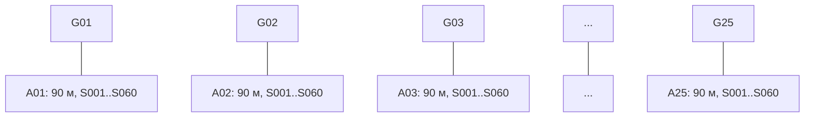
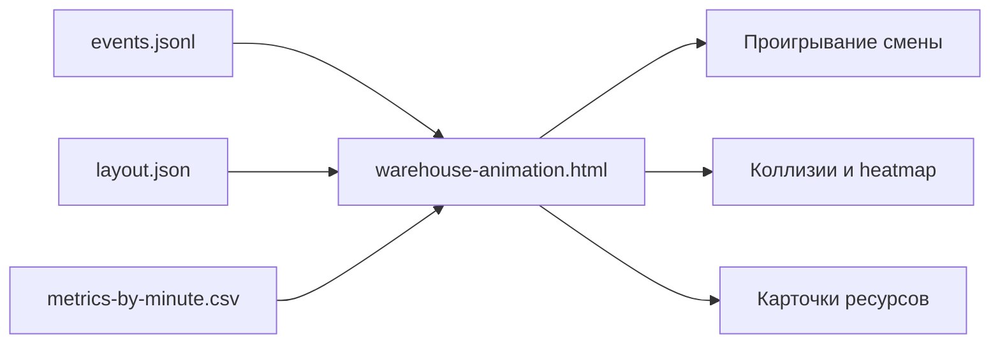

# ТЗ: большой поминутный тест реального склада и визуальная симуляция смены

## Цель

Сделать расширенный нагрузочный тест WMS, который моделирует не только корректность бизнес-процесса в системе, но и физическую работу склада: движение комплектовщиков, работу ричтраков, очереди, коллизии в проходах, ожидание пополнения, нехватку ресурсов и задержки отгрузки.

Результат теста должен показывать:

- как 50 клиентов проходят через 10 часовых волн;
- как создаются и выполняются задачи комплектации, пополнения и подачи паллет в зону отгрузки;
- где возникают реальные складские узкие места;
- какие волны и клиенты выходят за SLA;
- как меняются свободные и физические остатки;
- как система отслеживает это в ARM, TSD и evidence-отчете;
- как проигрывается "мультик" смены на отдельной странице с layout склада.

## Масштаб сценария

Смена длится 12 часов: `08:00-20:00`.

| Параметр | Значение |
|---|---:|
| Клиентов | 50 |
| Волн | 10 |
| Клиентов в одной волне | 5 |
| Клиентских паллет на клиента | 5-10 |
| Строк товара на клиентскую паллету | 20-30 |
| SKU в заказах | 1000 |
| Крупных клиентов с дополнительными моно-паллетами | 20 |
| Дополнительных моно-паллет на крупного клиента | 5-10 |
| Комплектовщиков | 10 |
| Водителей ричтраков | 5 |
| Длительность смены | 12 часов |

Ожидаемый объем генерации при фиксированном seed:

- 50 клиентов: `C001..C050`;
- 10 волн: `WAVE-SIM-01..WAVE-SIM-10`;
- примерно 250-500 клиентских паллет коробочной сборки;
- примерно 6 250-15 000 строк коробочной сборки;
- 100-200 дополнительных моно-паллет для крупных клиентов;
- 1000 SKU в заказах;
- модельное состояние склада, полностью обеспечивающее все заказы.

## Центр процесса

Центральный объект - волна комплектации.

Одна волна объединяет 5 клиентов и порождает:

- коробочную сборку клиентских паллет;
- пополнение ячеек отбора под коробочную сборку;
- прямую подачу моно-паллет/полных паллет в грузовую зону;
- задачи ричтраков;
- задачи комплектовщиков;
- события изменения свободных и физических остатков;
- события готовности клиента к отгрузке.


## Модель склада

### Layout

Для теста задается детерминированный layout:

| Параметр | Значение |
|---|---:|
| Аллей отбора/хранения | 25 |
| Длина аллеи | 90 м |
| Уровней хранения | 6 |
| Уровень 1 | отбор |
| Уровни 2-6 | хранение |
| Ячеек отбора | 1500 |
| Резервных ячеек хранения | 7500 |
| Ворот | 25 |
| Расстояние между слотами вдоль аллеи | 1.5 м |
| Слотов в аллее | 60 |

Адреса:

- аллеи: `A01..A25`;
- позиции: `S001..S060`;
- уровни: `L1..L6`;
- ячейка отбора: `A01-S001-L1`;
- ячейка хранения: `A01-S001-L2..L6`;
- ворота: `G01..G25`.

Каждые ворота находятся перед соответствующей аллеей. Координатная модель: начало аллеи и ворота `x = 0`, конец аллеи `x = 90`, расстояние между соседними аллеями по умолчанию `4 м`. Переход между аллеями идет через фронтальную транспортную зону у ворот.

Комплектовщики и ричтраки не могут перемещаться между рядами напрямую через стеллажи. Переход между аллеями считается только через:

- фронтальный проезд у ворот `x = 0`;
- пожарный проход в середине аллеи `x = 45`;
- задний обход склада `x = 90`.

При расчете маршрута выбирается кратчайший из этих U-образных вариантов. Это правило применяется одинаково для комплектовщиков и водителей ричтраков.



### Назначение ячеек отбора

Назначение ячеек отбора должно учитывать суммарный объем заказов и оптимизацию пробега.

Правило генератора:

1. SKU делятся на классы ABC:
   - `A`: 10% SKU дают около 60% коробочного объема;
   - `B`: 30% SKU дают около 30% объема;
   - `C`: 60% SKU дают около 10% объема.
2. SKU класса `A` получают фиксированные ячейки ближе к воротам и началу аллей.
3. SKU класса `B` получают фиксированные ячейки в средней зоне.
4. SKU класса `C` получают фиксированные или динамические ячейки дальше от ворот.
5. Часть свободных ячеек остается динамической под временное пополнение редких SKU и перегруз одного SKU в рамках одной волны.

Базовая настройка:

| Тип ячейки отбора | Количество | Назначение |
|---|---:|---|
| Фиксированные под SKU | 1000 | по одной основной ячейке отбора на каждый SKU |
| Динамические / overflow | 150 | срочное пополнение на лету, 10% ячеек отбора |
| Дублирующие для A-SKU | 200 | снижение коллизий и очередей |

В тестовом layout 10% ячеек отбора являются свободными dynamic/overflow ячейками и административно размещаются в конце каждой аллеи: последние 6 слотов из 60 в каждой аллее. Они не назначаются ни одному SKU заранее и не пополняются в плановом pre-wave режиме.

Правило использования dynamic/overflow ячеек:

- dynamic/overflow ячейка используется только в горящей ситуации;
- горящая ситуация возникает, когда комплектовщик пришел к fixed pick-face и товара не хватает, либо predictive lead-time для fixed pick-face уже стал критическим;
- если WMS видит свободную dynamic/overflow ячейку дальше по ходу маршрута, она может выпустить urgent-пополнение туда;
- если товар уже пополнен в такую dynamic/overflow ячейку и она находится дальше по маршруту, текущая строка отбора может быть переставлена с пустой fixed-ячейки на эту dynamic/overflow ячейку;
- после завершения волны/потребности dynamic/overflow назначение должно освобождаться.

Если один SKU должен быть спущен из нескольких мест, применяется принятая архитектура:

- создаются жесткие задачи на нужные источники;
- первая доступная задача выпускается в работу;
- остальные стоят в очереди;
- если есть свободная динамическая ячейка отбора, задача может быть сразу выдана ричтраку;
- если свободной динамической ячейки нет, задача ждет освобождения или снижения остатка до Minimax.

## Начальное наполнение склада

Тест не должен зависеть от текущих боевых остатков. Runner создает чистую модель с префиксом `SIM-YYYYMMDD-*`.

Для каждого из 1000 SKU создается:

- карточка SKU;
- норматив коробки: объем, вес, срок годности;
- партии товара;
- достаточный остаток под все заказы;
- остаток в ячейке отбора;
- резервные паллеты на уровнях хранения `L2..L6`.

Правило начального заполнения:

| Класс SKU | Остаток в отборе на T0 | Остаток в хранении |
|---|---:|---:|
| A | 60-100% емкости ячейки отбора | весь недостающий объем + страховой запас |
| B | 30-70% емкости ячейки отбора | весь недостающий объем + страховой запас |
| C | 0-40% емкости ячейки отбора | основной объем в хранении |
| SKU для моно-паллет | может отсутствовать в отборе | полные паллеты в хранении |

Для каждой паллеты хранения фиксируются:

- `UID_PALLET` / `Идентификатор паллеты`;
- SKU;
- партия;
- срок годности;
- количество коробок;
- объем;
- вес;
- ячейка хранения;
- доступность для резерва.

Инвариант модели: весь заказанный товар есть на складе в нужном объеме. Если в процессе возникает дефицит, это не дефицит товара, а операционный дефицит доступности: товар не успели спустить, ячейка отбора занята, ричтраки перегружены или комплектовщик ждет доступ к ячейке.

## Ресурсная модель

### Комплектовщики

Создается 10 ресурсов комплектовки:

| Ресурс | Скорость отбора, коробок/час | Тележка | Вместимость |
|---|---:|---|---:|
| P01 | 60 | T-01 | 1 поддон |
| P02 | 75 | T-02 | 1 поддон |
| P03 | 90 | T-03 | 1 поддон |
| P04 | 105 | T-04 | 2 поддона |
| P05 | 120 | T-05 | 2 поддона |
| P06 | 135 | T-06 | 2 поддона |
| P07 | 150 | T-07 | 3 поддона |
| P08 | 165 | T-08 | 3 поддона |
| P09 | 180 | T-09 | 3 поддона |
| P10 | 120 | T-10 | 2 поддона |

Скорость перемещения комплектовщика: `3 км/ч = 50 м/мин`.

Задание комплектовщика:

- один клиентский поддон, если тележка на 1 поддон;
- два клиентских поддона, если тележка на 2 поддона;
- три клиентских поддона, если тележка на 3 поддона.

### Ричтраки

Создается 5 ресурсов ричтрака:

| Ресурс | Водитель | Скорость операций | Скорость движения |
|---|---|---:|---:|
| RT01 | RTD01 | 15 операций/час | 10 км/ч |
| RT02 | RTD02 | 17 операций/час | 10 км/ч |
| RT03 | RTD03 | 18 операций/час | 10 км/ч |
| RT04 | RTD04 | 20 операций/час | 10 км/ч |
| RT05 | RTD05 | 22 операции/час | 10 км/ч |

Скорость движения ричтрака: `10 км/ч = 166.7 м/мин`.

Одна операция ричтрака:

- взять паллету из хранения;
- переместиться;
- опустить паллету в ячейку отбора или грузовую зону;
- подтвердить факт на TSD.

Длительность операции считается как максимум из двух значений:

- физический маршрут + технологическое время захвата/опускания/сканирования;
- норматив операции по ресурсу: `60 / операций_в_час`.

Так можно одновременно учитывать скорость движения и реальную производительность водителя.

### Смена и выход ресурса

Все исполнители работают только через ресурсные сессии:

- без активной `RRL_RESOURCE_SESSION` исполнитель не получает TSD-задачи;
- факт выполнения содержит ресурс, сессию, исполнителя и технику;
- план-факт ресурса попадает в Gantt и аналитику загрузки.

## Поминутная симуляция

Runner работает дискретно с шагом `1 минута`.

Каждую минуту он:

1. выпускает новые волны по расписанию;
2. создает или активирует задачи пополнения;
3. назначает комплектовщикам доступные паллеты;
4. назначает ричтракам доступные задачи;
5. двигает ресурсы по layout;
6. завершает операции, если истекло расчетное время;
7. обновляет факты TSD;
8. синхронизирует доменные события;
9. проверяет коллизии;
10. фиксирует метрики и события для evidence.

### Расписание волн

| Волна | Время запуска | Клиенты |
|---|---|---|
| WAVE-SIM-01 | 08:00 | C001-C005 |
| WAVE-SIM-02 | 09:00 | C006-C010 |
| WAVE-SIM-03 | 10:00 | C011-C015 |
| WAVE-SIM-04 | 11:00 | C016-C020 |
| WAVE-SIM-05 | 12:00 | C021-C025 |
| WAVE-SIM-06 | 13:00 | C026-C030 |
| WAVE-SIM-07 | 14:00 | C031-C035 |
| WAVE-SIM-08 | 15:00 | C036-C040 |
| WAVE-SIM-09 | 16:00 | C041-C045 |
| WAVE-SIM-10 | 17:00 | C046-C050 |

Оставшиеся часы смены используются для догонки хвоста, отгрузки, контроля и закрытия проблем.

## Модель коллизий

Тест обязан не только выполнить процесс, но и показать, где склад начинает замедляться.

| Код | Коллизия | Условие | Последствие |
|---|---|---|---|
| `PICK_FACE_QUEUE` | очередь к ячейке отбора | 2+ комплектовщика хотят взять товар из одной ячейки | ожидание доступа |
| `AISLE_CONGESTION` | перегруз прохода | в одном 10-метровом сегменте аллеи больше допустимого числа людей/техники | снижение скорости |
| `REACHTRUCK_BLOCK` | блокировка ричтраком | ричтрак выполняет опускание паллеты в зоне отбора | комплектовщики ждут безопасный доступ |
| `DYNAMIC_CELL_SHORTAGE` | нет свободной динамической ячейки | нужно спустить очередной поддон SKU, но свободной ячейки нет | задача ричтрака остается в очереди |
| `MINIMAX_WAIT` | ожидание Minimax | SKU пополняется только после снижения остатка до порога | комплектовщик ждет или пропускает строку |
| `REACH_RESOURCE_SHORTAGE` | нехватка ричтраков | очередь пополнений больше пропускной способности | задержка пополнения |
| `PICKER_RESOURCE_SHORTAGE` | нехватка комплектовщиков | активных клиентских паллет больше доступной емкости людей/тележек | задержка сборки |
| `DOCK_QUEUE` | очередь на ворота | клиент готов, но ворота или отгрузка заняты | задержка отгрузки |
| `SHIPMENT_RATE_LIMIT` | ограничение скорости отгрузки | больше 15 паллет клиента в час | паллеты ждут погрузки |

Для каждой коллизии сохраняется время начала/окончания, ресурс или ячейка, волна, клиент, SKU, причина, потерянные минуты и влияние на SLA.

## Отгрузка

Скорость отгрузки клиента: `15 паллет/час`.

Это означает:

- одна паллета грузится примерно `4 минуты`;
- клиент не считается полностью отгруженным, пока все его паллеты не прошли загрузку;
- если рейс клиента содержит больше 15 паллет, он занимает больше часа или должен быть разбит на несколько транспортных окон;
- ворота назначаются так, чтобы по возможности держать клиентов волны рядом с аллеями, где находятся их основные SKU.

## Проверяемые бизнес-процессы

### 1. Создание часовой волны

Проверить корректность включения 5 клиентов, создание клиентских паллет и SSCC, расчет строк, назначение маршрута отбора, назначение ворот и расчет потребности пополнения.

### 2. Пополнение ячеек отбора

Проверить создание задач `RRL_WAREHOUSE_TASK`, выбор источников хранения, немедленный спуск в свободные динамические ячейки, очередь жестких задач, выпуск по Minimax, факт TSD водителя, физическое перемещение остатка и синхронизацию в домен.

### 3. Коробочная сборка

Проверить выдачу задач комплектовщикам по вместимости тележки, порядок обхода, учет скорости отбора и ходьбы, ожидание пополнения, пропуск строк и возврат позже при соответствующей настройке склада, закрытие клиентской паллеты и контроль/готовность к отгрузке.

### 4. Моно-паллеты и прямая подача

Проверить создание задач на полный паллет, подачу в грузовую зону, связь паллеты с клиентом, рейсом и воротами, а также влияние моно-паллет на загрузку ричтраков и ворот.

### 5. Отгрузка клиентов

Проверить готовность клиента по всем паллетам, очередь на ворота, ограничение 15 паллет/час, фактическое время закрытия клиента и задержки из-за незакрытого поддона, нехватки пополнения или блокировки ворот.

## Метрики

| Метрика | Что показывает |
|---|---|
| `wave_completion_time` | время закрытия каждой волны |
| `client_ready_time` | когда клиент стал готов к отгрузке |
| `client_shipped_time` | когда клиент реально отгружен |
| `sla_delay_minutes` | опоздание клиента/волны |
| `picker_utilization` | занятость комплектовщиков |
| `picker_walk_minutes` | время ходьбы |
| `picker_pick_minutes` | время отбора |
| `picker_wait_minutes` | ожидание из-за коллизий/пополнения |
| `reachtruck_utilization` | занятость ричтраков |
| `reachtruck_queue_depth` | очередь задач ричтрака |
| `replenishment_wait_minutes` | ожидание пополнения |
| `collision_count_by_type` | количество коллизий по типам |
| `lost_minutes_by_type` | потерянные минуты по типам |
| `dock_queue_minutes` | ожидание ворот |
| `stock_invariant_status` | нет отрицательных физических/свободных остатков |
| `sync_status` | все нужные факты синхронизированы |

## Evidence и артефакты

Папка результата:

```text
runtime/test-evidence/warehouse-minute-simulation/<run-id>/
  report.json
  report.md
  timeline.csv
  events.jsonl
  layout.json
  generated-orders.json
  generated-stock.json
  metrics-by-minute.csv
  collision-report.csv
  evidence-presentation.html
  warehouse-animation.html
  screenshots/
    T00_initial_layout.png
    T01_wave_01_launched.png
    T02_first_replenishment.png
    T03_peak_congestion.png
    T04_mid_shift.png
    T05_reachtruck_queue.png
    T06_dock_queue.png
    T07_last_wave_launched.png
    T08_shift_finish.png
    ARM_*.png
    TSD_picker_*.png
    TSD_reachtruck_*.png
```

Обязательные снимки:

- до начала смены;
- после запуска каждой часовой волны;
- момент максимальной очереди ричтраков;
- момент максимальной коллизии комплектовщиков;
- момент ожидания пополнения в коробочной сборке;
- момент очереди на ворота;
- конец смены;
- ARM мониторинг волн;
- ARM управление комплектацией;
- ARM управление ресурсами;
- TSD комплектовщика;
- TSD ричтрака.

## Страница "мультика" склада

Нужно создать отдельную страницу визуализации:

```text
wiki-raw/wms_admin_ui_reference/warehouse-simulation.html
wiki-raw/wms_admin_ui_reference/warehouse-simulation.js
wiki-raw/wms_admin_ui_reference/warehouse-simulation.css
```

Страница читает `layout.json` и `events.jsonl` из evidence-папки или через локальный API.

На странице должны быть:

- top-down layout склада;
- 25 аллей длиной 90 метров;
- ворота `G01..G25`;
- ячейки отбора;
- зоны хранения;
- зона отгрузки;
- движущиеся комплектовщики;
- движущиеся ричтраки;
- отдельные визуальные иконки комплектовщиков и ричтраков, чтобы их было видно как людей/технику, а не только как точки;
- паллеты в пополнении;
- клиентские паллеты;
- наполненность каждой ячейки отбора: высота столбика пропорциональна остатку, низкий остаток уходит в красный/оранжевый цвет, заполненная ячейка - в зеленый;
- подсветка коллизий;
- тепловая карта очередей;
- таймлайн смены `08:00-20:00`.

Контролы:

- play/pause;
- скорость `x1`, `x5`, `x10`, `x60`;
- scrubber времени;
- выбор волны, клиента, SKU и ресурса;
- фильтры по типу события;
- слои: комплектовщики, ричтраки, пополнение, коробочная сборка, моно-паллеты, отгрузка, коллизии, heatmap.
- навигация по карте склада: кнопки `+` / `-`, сброс вида и перетаскивание мышью влево/вправо/вверх/вниз.

При клике на ресурс или паллету показывать статус, задачу, волну, клиента, SKU, откуда/куда, плановое и фактическое время, причину задержки и накопленные потерянные минуты.

Шлейф движения ресурсов не должен соединять точки напрямую через стеллажи. Каждый переход между рядами визуализируется как физический U-маршрут через один из разрешенных поперечных проходов: фронтальный проезд, пожарный проход или задний обход. Дополнительно можно показывать тонкий пунктир "начало-конец": короткий переход ближе к зеленому, длинный фактический маршрут ближе к красному.

Внизу страницы должен быть график производительности ресурсов и коллизий:

- загрузка комплектовщиков по времени;
- загрузка ричтраков по времени;
- очередь RTP / пополнений;
- минутные всплески потерь от коллизий;
- топ root-cause коллизий рядом с графиком.



## Runner

Предлагаемый файл:

```text
tests/load/wave/warehouse_minute_simulation_load_test.py
```

Аргументы:

```text
--clients 50
--waves 10
--clients-per-wave 5
--sku 1000
--pick-faces 1500
--pickers 10
--reachtrucks 5
--shift-start 08:00
--shift-hours 12
--seed 20260519
--mode model-only|integrated
--out-dir runtime/test-evidence/warehouse-minute-simulation
--screenshots
```

Режимы:

| Режим | Назначение |
|---|---|
| `model-only` | быстро строит digital twin, события, метрики, коллизии и мультик без записи всех поминутных событий в Oracle |
| `integrated` | создает реальные заказы, волны, задачи, TSD-факты и доменную синхронизацию через API/Oracle |

Рекомендация: сначала реализовать `model-only`, затем включить `integrated` для контрольных stage-точек, чтобы не перегружать Oracle миллионами поминутных событий.

## Текущий инкремент реализации

Статус: начат первый `model-only` слой цифрового двойника; добавлена premium control-tower визуализация.

Реализованные артефакты:

- `tests/load/wave/warehouse_minute_simulation_load_test.py` генерирует воспроизводимую модель склада, клиентов, волн, SKU, начальных остатков, ресурсов, поминутных событий, коллизий и отчетов без записи в Oracle.
- `wiki-raw/wms_admin_ui_reference/warehouse-simulation.html` проигрывает мультик склада по evidence-файлам `layout.json`, `events.jsonl`, `metrics-by-minute.csv`, `collision-report.csv`, `report.json`.
- `wiki-raw/wms_admin_ui_reference/warehouse-simulation.js` содержит replay engine, URL/config/file loaders, изометрический Canvas digital twin, фильтры по волне/зоне/типу коллизии, resource badges, motion trails, heatmap, callout-ы, RTP task panel, collision root-cause panel, route progress widget, KPI и timeline markers.
- `wiki-raw/wms_admin_ui_reference/warehouse-simulation.css` оформляет страницу как premium logistics control tower в текущем WMS PRO стиле.
- `tests/load/wave/warehouse_simulation_ui_contract_check.mjs` проверяет evidence-контракт для UI: layout, events, metrics, collision report и восстановление replay state.

Первый слой считается модельным прототипом: он нужен, чтобы закрепить формат событий и визуальное объяснение коллизий до подключения реального API/Oracle `integrated` режима.

Следующий инкремент добавил полноценную React-админку:

- `admin/wms_admin_frontend` создан как React + TypeScript + Vite проект.
- `front.bat` теперь запускает эту админку на `http://127.0.0.1:3000/`, если проект существует.
- Первый экран React-админки - цифровой двойник склада с тем же evidence/replay контрактом, изометрической сценой, RTP task queue, collision root-cause panel и timeline.

Следующий инкремент уточнил физику склада:

- Пополнение волны теперь планируется заранее, за `60` минут до запуска волны; для первой волны используется pre-shift подготовка как начальное условие.
- Ячейка отбора получила физическую емкость. Pre-wave top-up не может положить в ячейку отбора больше, чем помещается в адрес.
- Если спрос волны превышает емкость ячейки отбора, остаток не заливается заранее: создаются повторные/reactive задачи RTP по мере исчерпания адреса.
- Если комплектовщик пришел к пустой или недостаточной ячейке отбора, он не получает следующую строку. Его строка и маршрут остаются в ожидании пополнения.
- Ричтрак теперь учитывает технологическое время операции: снятие/захват паллеты `2-3` минуты, спуск в ячейку отбора `3` минуты, маневр убрать/поставить поддон у адреса `2-3` минуты, плюс подтверждение.
- Коробочное пополнение выделено в режим `CASE_REPLENISHMENT` с производительностью около `5` задач в час.
- Runner получил параметры производительности: `--replenishment-lead-minutes`, `--case-replenishment-per-hour`, `--pallet-drop-minutes`, `--pallet-exchange-minutes-min`, `--pallet-exchange-minutes-max`.
- В React-админке добавлена панель `Настройки модели`, чтобы во время просмотра мультика менять допущения по производительности операций и видеть forecast-множитель.
- Расчет расстояний заменен на U-образную маршрутизацию: переход между аллеями только через фронтальный проезд, пожарный проход в середине и задний обход.
- Добавлены новые evidence-события и коллизии: `PICK_FACE_EMPTY`, `PICK_FACE_EMPTY_AT_ARRIVAL`, `PICK_FACE_REPLENISHED_FOR_WAITING_PICKER`, `REACTIVE_REPLENISHMENT_PLANNED`, `ROUTE_COMPLETION_DELAY`, `ROUTE_COMPLETION_DELAYED`, `PALLET_STAGED_TO_DOCK`, `REACHTRUCK_CROSSING`, `REACHTRUCK_PICKER_PASS`, `PALLET_TO_DOCK_DELAY`.
- Подача собранного поддона к воротам фиксирует исполнителя: `staged_by=PICKER` или `staged_by=REACHTRUCK`.
- Пересечение двух ричтраков в одной аллее и проход ричтрака рядом с комплектовщиком считаются отдельными физическими коллизиями.

Следующий инкремент после восстановления контекста:

- Runner восстановлен после crash-checkpoint: добавлена недостающая проверка перегруженной/заблокированной зоны отбора для расчета замедления комплектовщика.
- Приоритет назначения комплектовщиков исправлен: сначала выдаются строки, которые можно собрать с доступным остатком, и только если таких строк нет, комплектовщик блокируется на пустом pick-face. Это убрало искусственный стоп всей волны из-за первой пустой ячейки.
- `report.json` и `report.md` получили блок `capacity_analysis`: коробочный спрос, выполненные коробки, сменная мощность комплектовщиков, спрос/мощность RTP, mix паллетного и коробочного пополнения.
- `report.json` получил `bottleneck_summary` с критическими причинами: нехватка комплектовщиков, нехватка RTP, очередь RTP, хвосты маршрутов и другие топ-потери.
- React-админка показывает карточку `Мощность смены` поверх digital twin: спрос/факт/мощность по комплектовке и RTP, а также короткие операторские bottleneck-чипы.
- React-админка получила нижний график `Производительность ресурсов и коллизии`: загрузка комплектовщиков, загрузка RTP, очередь RTP и накопленные потери минут по смене.
- Карта React digital twin стала навигационной: `+` / `-`, сброс вида, drag-pan мышью, кликабельность ресурсов и коллизий сохраняется в текущем масштабе.
- Ресурсы на карте получили визуальные иконки: комплектовщик и ричтрак; шлейф движения стал затухающим пунктиром со стрелками.
- Шлейф между рядами больше не идет напрямую через стеллажи: renderer раскладывает движение в U-маршрут через фронтальный проезд, пожарный проход или задний обход.
- Pick-face ячейки визуализируют наполненность: высота и цвет столбика меняются по расчетному остатку в текущую минуту.
- На низких экранах `1280x720` оверлеи адаптированы: route widget скрывается, настройки модели компактнее, пустая detail-card не показывается до выбора объекта.
- Свежий model-only run `SIM-20260520-000916-20260520` объясняет провал смены численно: `33830` коробок спроса против `14400` коробок мощности комплектовщиков (`x2.35`) и `1734` задачи пополнения против `1104` номинальных RTP операций (`x1.57`).

## API/Oracle инварианты

В интеграционном режиме runner обязан проверить:

- HTTP/API failed request count = `0`;
- Oracle invalid objects = `0`;
- нет отрицательных физических остатков;
- нет отрицательных свободных остатков;
- hard reservations не дублируются;
- completed warehouse tasks имеют sync-status `SYNCED`;
- completed replenishment tasks имеют запись в ledger физического перемещения;
- один и тот же pallet/source reservation не закрыт дважды;
- клиентская паллета не может быть отгружена до закрытия сборки/контроля;
- ричтрак не получает задачу без активной resource session;
- комплектовщик не получает задачу без активной resource session.

## Критерии приемки

Тест считается выполненным, если:

1. Генератор создает воспроизводимую модель по seed.
2. Созданы 50 клиентов, 10 волн, 1000 SKU и 1500 ячеек отбора.
3. Все заказы обеспечены товаром в модельном складе.
4. Симуляция проходит 12 часов с шагом 1 минута.
5. Возникают и фиксируются реальные операционные коллизии.
6. Отчет показывает, какие задержки вызваны нехваткой ричтраков, какие - комплектовщиками, какие - воротами, какие - layout.
7. Есть `report.json`, `report.md`, `timeline.csv`, `events.jsonl`, `collision-report.csv`.
8. Есть HTML-презентация результата.
9. Есть страница-мультик склада с проигрыванием событий.
10. Есть скриншоты ARM/TSD/анимации по ключевым этапам.
11. Все runtime-инварианты проходят или отчет явно показывает нарушение.

## Тактическая реализация

1. Описать генератор layout, клиентов, SKU, заказов и начальных остатков.
2. Реализовать `model-only` runner с дискретной симуляцией.
3. Добавить расчет маршрутов, ходьбы, отбора, операций ричтраков и отгрузки.
4. Добавить модель коллизий и потерянных минут.
5. Сформировать JSON/CSV evidence.
6. Сделать `warehouse-animation.html`.
7. Добавить скриншоты через Playwright.
8. Подключить интеграционные stage-точки к текущим API/Oracle процессам.
9. Сравнить модельные события с ARM/TSD состояниями.
10. Сформировать итоговую презентацию.

## Стратегическая цель

Этот тест должен стать не просто нагрузочным тестом, а прототипом операционного цифрового двойника склада.

Дальше на его основе можно:

- оценивать потребность в ричтраках и комплектовщиках до запуска смены;
- предсказывать SLA по волнам;
- сравнивать разные layout и маршруты отбора;
- проверять Minimax и динамические ячейки отбора;
- подбирать оптимальное расписание волн;
- видеть, какая часть задержки вызвана системой, а какая - физикой склада.

## Открытые настройки для калибровки

Перед первым промышленным прогоном нужно уточнить или оставить как параметры:

- ширина аллей и допустимое число людей/техники в сегменте;
- технологическое время сканирования коробки;
- технологическое время захвата/опускания паллеты ричтраком;
- правила запрета одновременной работы ричтрака и комплектовщика в одной зоне;
- реальные перерывы ресурсов;
- допустимая очередь на ворота;
- нужно ли моделировать контроль паллет отдельным ресурсом;
- нужно ли моделировать пересменку и задержку выхода людей.
