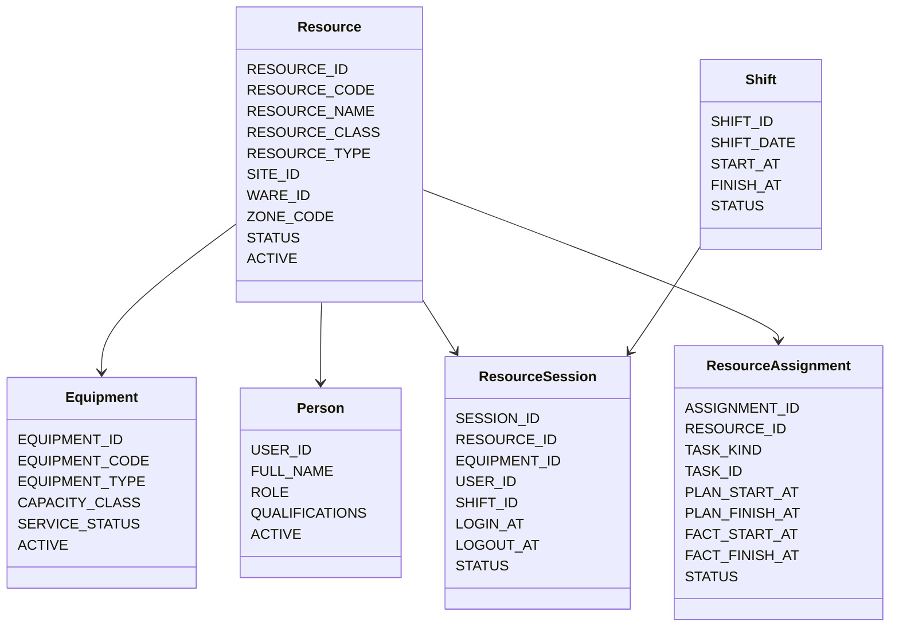
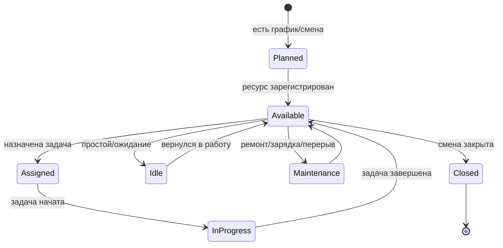

# ТЗ: отдельный модуль управления ресурсами склада и производства

Статус: техническое задание на отдельный модуль `Управление ресурсами`.

Дата: 2026-05-19.

Связанные документы:

- [Ресурсы склада, смены водителей и план-фактный Gantt](warehouse_resource_planning_tz.md)
- [Складские задания для водителей ричтраков](warehouse_tasks_reachtruck_tz.md)
- [Доменная синхронизация складских заданий](warehouse_task_domain_sync_tz.md)
- [Клиентский сценарий приемки волны](wave_client_e2e_acceptance_scenario.md)
- [API Method Library](../concepts/api_method_library.md)

## 1. Назначение

Нужно выделить самостоятельный модуль управления ресурсами. Он должен планировать, показывать и анализировать не только ричтраки, но все ресурсы, которые ограничивают выполнение складского и производственного процесса.

В модуль входят:

- складская техника: ричтраки, KIKA, погрузчики, тележки;
- персонал склада: водители, комплектовщики, бригады погрузки;
- производственное оборудование: варка, фасовка и другие производственные линии;
- связки ресурсов: водитель + ричтрак, комплектовщик + тележка, оператор + линия фасовки, бригада + зона погрузки.

Ресурсный слой не заменяет бизнес-документы. Волна, производственный заказ, заказ на отгрузку и `RRL_WAREHOUSE_TASK` остаются владельцами бизнес-работы. Модуль ресурсов отвечает на вопросы:

- кто доступен;
- на чем работает;
- в какой смене;
- в какой зоне;
- какой план загрузки;
- что фактически выполнено;
- где простой, перегруз, опоздание или конфликт.

## 2. Область MVP

MVP должен покрыть справочник ресурсов, смены, регистрацию ресурса в смене, вход в ТСД только через открытую сменную сессию, назначение складских задач на ресурс, плановый Gantt, фактический Gantt, план-фактный анализ нагрузки и raw UI страницу административной части в стиле приложенного дизайна.

Производственное оборудование в MVP может быть read-only ресурсом с планом и фактом. Управление технологическими параметрами варки/фасовки остается в MES-контуре.

## 3. Ресурсная Модель



## 4. Типы Ресурсов

| Класс | Тип | Пример | Что выполняет |
| --- | --- | --- | --- |
| `WAREHOUSE_EQUIPMENT` | `REACHTRUCK` | `RT-01` | Пополнение, спуск паллет, размещение выпуска |
| `WAREHOUSE_EQUIPMENT` | `KIKA` | `KIKA-01` | Внутренние перемещения, сырье в производство |
| `WAREHOUSE_EQUIPMENT` | `FORKLIFT` | `FL-01` | Погрузка, staging, перемещения |
| `WAREHOUSE_EQUIPMENT` | `TROLLEY` | `TR-01` | Комплектовщик с тележкой |
| `PERSON` | `CASE_PICKER` | `Иванов И.И.` | Покоробочный отбор |
| `TEAM` | `LOADING_TEAM` | `Бригада 1` | Погрузка фуры |
| `PRODUCTION_EQUIPMENT` | `COOKING` | `Варка-01` | Производственная операция варки |
| `PRODUCTION_EQUIPMENT` | `PACKING` | `Фасовка-01` | Производственная операция фасовки |

Комплектовщик является ресурсом. Его физический ресурс для работы - тележка. Поэтому для планирования используется связка `CASE_PICKER + TROLLEY + SHIFT + ZONE`.

## 5. Жизненный Цикл Ресурса



Для складского персонала регистрация происходит через ТСД или рабочее место диспетчера. Для производственного оборудования доступность может приходить из MES: смена, состояние линии, простой, ремонт, операция в работе.

## 6. Диспетчеризация Задач

`RRL_WAREHOUSE_TASK` остается физической задачей склада. Модуль ресурсов добавляет над ней планирование исполнителя.

Правила:

1. Водитель ричтрака не попадает в рабочий экран ТСД без активной сессии `водитель + техника + смена`.
2. Комплектовщик не попадает в рабочий экран ТСД без активной сессии `комплектовщик + тележка + зона`.
3. Техника не может иметь две активные сессии.
4. Сотрудник не может иметь две активные сессии в одной роли.
5. Задача не может быть одновременно назначена двум ресурсам.
6. Ресурс не получает задачу вне своей зоны/квалификации, кроме ручного назначения диспетчером.
7. Производственный ресурс получает плановые операции из MES, а факт возвращает в общий план-факт.

Примеры соответствия:

| Работа | Источник | Ресурс |
| --- | --- | --- |
| Пополнение ячейки отбора под волну | `RRL_WAREHOUSE_TASK.REPLENISHMENT` | `REACHTRUCK` |
| Спуск паллеты в грузовую зону | `RRL_WAREHOUSE_TASK.PICKING_MOVE` | `REACHTRUCK` / `FORKLIFT` |
| Размещение выпуска | `RRL_WAREHOUSE_TASK.FG_TO_STORAGE` | `REACHTRUCK` / `FORKLIFT` |
| Сырье в производство | `RRL_WAREHOUSE_TASK.RAW_TO_PRODUCTION` | `KIKA` / `FORKLIFT` |
| Покоробочный отбор | wave picking task | `CASE_PICKER + TROLLEY` |
| Варка | MES operation | `COOKING` |
| Фасовка | MES operation | `PACKING` |

## 7. Плановый И Фактический Gantt

Плановый Gantt показывает ожидаемую загрузку по ресурсам. Фактический Gantt показывает реальные интервалы.

```mermaid
gantt
    title План-факт ресурсов
    dateFormat  HH:mm
    axisFormat  %H:%M
    section RT-01 Иванов
    REPL-0456 план       :p1, 08:15, 90m
    REPL-0456 факт       :done, f1, 08:20, 82m
    STAGE-0781 план      :p2, 09:45, 70m
    section TR-01 Михайлов
    CASE-PICK план       :p3, 10:00, 180m
    section Варка-01
    PO-44 варка план     :p4, 08:00, 240m
    section Фасовка-01
    PO-44 фасовка план   :p5, 12:30, 180m
```



Цвета: зеленый - факт выполнен; синий - план; серая штриховка - план еще не начат; оранжевый - задержка или риск SLA; серый - простой, перерыв, ремонт.

## 8. Административная Страница

Страница должна следовать приложенному дизайну:

- фиксированное левое меню;
- верхняя панель с выбором склада/площадки, датой и обновлением;
- KPI карточки: активные ресурсы, доступно ресурсов, в работе, в простое, с опозданием SLA;
- вкладки: все ресурсы, ричтраки, KIKA, погрузчики, тележки, комплектовщики, бригады погрузки, варка, фасовка;
- таблица ресурсов: ресурс, тип, техника, оператор, смена, зона, статус, текущая задача, следующая задача, прогресс смены;
- блок `План-факт Gantt`;
- фильтры по зоне, статусу, типу ресурса и дате.

Страница raw-прототипа: [resource-management.html](../../wiki-raw/wms_admin_ui_reference/resource-management.html).

## 9. Целевая Схема Данных

Предлагаемые таблицы:

- `RRL_RESOURCE_TYPE` - типы ресурсов;
- `RRL_RESOURCE` - планируемый ресурс;
- `RRL_RESOURCE_EQUIPMENT` - физическая техника/оборудование;
- `RRL_RESOURCE_PERSON` - привязка к пользователю/сотруднику;
- `RRL_RESOURCE_QUALIFICATION` - квалификации;
- `RRL_RESOURCE_SHIFT` - смены;
- `RRL_RESOURCE_CALENDAR` - график работы, перерывы, ремонты;
- `RRL_RESOURCE_SESSION` - факт выхода на смену;
- `RRL_RESOURCE_ASSIGNMENT` - план/назначение задачи;
- `RRL_RESOURCE_FACT_EVENT` - журнал фактических событий;
- `RRL_RESOURCE_GANTT_SNAPSHOT` - кэш для тяжелых Gantt-запросов.

Интеграционные ссылки: `RRL_WAREHOUSE_TASK.TASK_ID`, `RRL_PICK_WAVE.PICK_WAVE_ID`, производственный заказ MES, производственная операция MES, заказ/отгрузка как контекст.

## 10. API

Справочники:

```text
GET  /api/resources
POST /api/resources
GET  /api/resources/{resource_id}
PATCH /api/resources/{resource_id}
GET  /api/resource-types
GET  /api/resource-equipment
POST /api/resource-equipment
```

Смены и сессии:

```text
GET  /api/resource-shifts
POST /api/resource-shifts
POST /api/resource-sessions/login
POST /api/resource-sessions/{session_id}/pause
POST /api/resource-sessions/{session_id}/resume
POST /api/resource-sessions/{session_id}/logout
POST /api/resource-sessions/{session_id}/heartbeat
POST /api/resource-sessions/tsd-login
```

Назначения и Gantt:

```text
GET  /api/resources/assignments
POST /api/resources/assignments/replan
GET  /api/resources/gantt/plan
GET  /api/resources/gantt/fact
GET  /api/resources/gantt/plan-fact
GET  /api/resources/load-analysis
```

ТСД/исполнение:

```text
GET  /api/warehouse-tasks
POST /api/warehouse-tasks/{task_id}/claim
POST /api/warehouse-tasks/{task_id}/start
POST /api/warehouse-tasks/{task_id}/complete
```

Важно: отдельный `dispatch?session_id=...` не является обязательным security gate. Водитель без смены не входит в ТСД вообще, поэтому сессия проверяется на этапе входа/открытия рабочего места. Дальше `session_id`, `resource_id` и `equipment_id` используются как контекст исполнения, назначения и план-фактного анализа.

Для ТСД вход поддерживается двумя способами:

- водитель вводит логин и пароль из `RUSERS`;
- водитель сканирует ШК/код ресурса, а техника сканируется или выбирается отдельно.

После успешного входа ТСД хранит `session_id`, `resource_id`, `equipment_id` и передает их в `assign/start/complete`, чтобы факт исполнения попал в `RRL_WAREHOUSE_TASK` и `RRL_RESOURCE_FACT_EVENT`.

## 11. Права

Новые права:

- `resource_management_view`;
- `resource_management_edit`;
- `resource_shift_view`;
- `resource_shift_edit`;
- `resource_session_view`;
- `resource_session_manage`;
- `resource_gantt_view`;
- `resource_gantt_replan`;
- `resource_dispatch_manage`;
- `warehouse_task_force_assign`.

## 12. Нагрузочные И Приемочные Проверки

Проверить:

1. Одновременный вход 20 сотрудников в смену.
2. Попытка двух сотрудников выбрать одну технику.
3. Попытка одного сотрудника открыть две активные сессии.
4. Массовая выдача 500 складских задач на 20 ресурсов.
5. Конкурентный claim одной задачи двумя ТСД.
6. Смешанная смена: ричтраки, комплектовщики, KIKA, погрузчики, варка, фасовка.
7. План-фактный Gantt на горизонте смены.
8. Задержка SLA и отображение в KPI.
9. Потеря heartbeat и перевод ресурса в простой/недоступен.
10. Закрытие смены с незавершенными задачами.

Критерии: нет двойной активной сессии на технику, нет двойного выполнения задачи, Gantt не показывает пересечения у одного ресурса, производственные и складские ресурсы видны в едином модуле, водитель/комплектовщик не входит в рабочий экран ТСД без активной сменной сессии, права и API-аудит применены, `Oracle invalid objects = 0`.

## 13. Инкременты Реализации

1. Документы и raw UI: оформить ТЗ, добавить raw-прототип страницы управления ресурсами, включить страницу в навигацию и README.
2. Справочники ресурсов: миграции таблиц `RRL_RESOURCE_*`, seed базовых типов, API чтения, права.
3. Смены и сессии: login/logout/heartbeat, запрет двойных сессий, отображение активных сессий.
4. ТСД shift gate: вход в рабочий экран только после `RRL_RESOURCE_SESSION`; `claim/start/complete` пишут `RESOURCE_ID`, `RESOURCE_SESSION_ID`, `EQUIPMENT_ID` как факт исполнения.
5. Gantt и план-факт: плановые интервалы, фактический журнал, расчет загрузки, простоя и SLA.
6. Производственные ресурсы: подключить варку и фасовку из MES-плана, показывать план/факт оборудования, учитывать простои и переналадки.

## 14. Definition Of Done

Модуль готов к пилоту, когда есть отдельная административная страница управления ресурсами; складские и производственные ресурсы видны в одном контуре; водитель/комплектовщик входит в рабочий экран ТСД только после регистрации в смене; техника и тележки не могут быть заняты двумя активными сессиями; `RRL_WAREHOUSE_TASK` назначается на ресурс без потери доменной логики волны/MES; есть плановый и фактический Gantt; есть план-фактный анализ нагрузки; есть нагрузочные тесты конкуренции; wiki, api-med и эксплуатационные материалы обновлены.
