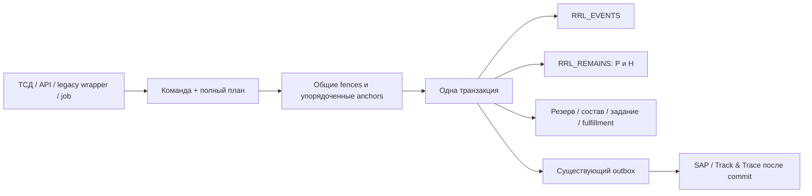

# ТЗ: единое ядро проводки и достоверные остатки NICORA

Редакция **2.0**, 7 октября 2026 года. Oracle 19c ORCL/orcl, существующая схема **RABAEV**.

Статус: спецификация для реализации. Эта редакция полностью заменяет 1.0–1.1. Правила конкуренции, количества и транзакции определены ниже; они не оставляются на усмотрение автора отдельного обработчика. Новое ядро ещё не установлено. Текущий код и режим старого триггера этим документом не изменены.

Реализация начата по поручению 08.10.2026: [actual checkpoint](../database/nicora_stock_posting_implementation.md). Очистка тестового остатка и foundation/математика установлены; physical executor остаётся старым до полного cutover. Этот последующий статус не означает выполнения всего ТЗ.

## 1. Результат и границы

После единого переключения всей системы любой подтверждённый товарный факт должен отражаться ровно один раз одновременно в физическом остатке, журнале, резерве, составе, исполнении задания и обязательствах внешнего обмена. Ошибка до фиксации не оставляет ни одного из этих изменений. Потеря ответа после фиксации не допускает повторного списания или прихода.

Сохраняются `RRL_REMAINS`, `RRL_EVENTS`, действующие паллеты, документы, задания, TMS и существующие регистры обмена. Новая схема NICORA, второй Oracle, второй количественный регистр остатков, второй TMS и распределённая транзакция с SAP/государственными сервисами не создаются. Новые служебные сущности допускаются только для идентичности операции, координации, версий и недостающих связей состава.

Область: приход, размещение, пополнение, отбор паллет/коробок/штук, упаковка и вложенные грузовые единицы, контроль/карантин, резервирование, погрузка, отгрузка, возврат, межскладское перемещение, производство/MES, списание, инвентаризация и исправления. План заказа, СТ, рейс, печать этикетки и выдача задания сами по себе не являются физическим приходом или расходом.

Шесть принятых владельцем принципов обязательны: одна явная команда Oracle; одна короткая транзакция; стабильный ID; минимальные согласованные блокировки; сохраняемый журнал и точная арифметика; асинхронные внешние системы при синхронной доступности. Подготовка идёт небольшими заданиями, **выпуск — одним cutover всех writers**.

## 2. Что подтверждено в текущей системе

Источники: [[../components/nicora_approved_code_analysis]], [[../components/nicora_capability_matrix_20261007]], [[../database/nicora_ni03_task_effect]], чтение live metadata RABAEV 07.10.2026. Метаданные не являются результатом бизнес-теста.

| Объект/путь | Установленный факт | Обязательное следствие для разработки |
|---|---|---|
| `RRL_REMAINS` | `CELL`, `UID_POLETA`, `REMAIN` допускают NULL; индекс `(CELL, UID_POLETA)` не уникальный; P/U-ограничение в проверенных metadata отсутствует | Ввести однозначный ключ и ограничения после разбора текущих данных; наличие индекса не доказывает уникальность |
| `RRL_PALLETS` | Уникальный индекс `UID_PALLET`; индекс `SSCC` не уникальный | Физическая идентичность определяется внутренним UID; SSCC нельзя использовать как безусловно однозначный ключ старых данных |
| `RRL_EVENTS` | Есть уникальный индекс `ID_EVENT`, но этого недостаточно для идентичности бизнес-команды | Сохранить старые ID и добавить связь operation/line/leg; новый ID_EVENT не разрешает повторить старое действие |
| `RRL_STOCK_RESERVATION` | PK `RESERVATION_ID`; количество, товар, UID, ячейка, источник/задание; FK на слот | Использовать этот регистр для канонического HARD; учесть родительский слот при конкуренции |
| `RRL_WAREHOUSE_TASK` | PK `TASK_ID`; FK на исходный/целевой слоты; NI03 добавил completion identity | Не создавать второй исполнитель задания; заменить его товарный путь общим контрактом |
| `RRL_WMS_RECEIPT_UNIT` | PK `(UID_PALLET, UNIT_ID)`, FK на паллету, количество физической единицы | Приёмка уже даёт состав; обеспечить сквозную идентичность единицы после разделения/перемещения |
| `RRL_CRPT_AGGREGATION_ITEMS` | В проверенном наборе metadata нет P/U/FK; текущая агрегация допускает вложенный SSCC | Доработать родительство/циклы/уникальность, а не объявлять готовой всю складскую матрёшку |
| `RRL_SYSTEM_SETTINGS` | Существующий PK `SETTING_KEY` и `SETTING_VALUE` | Общий флаг совместимости хранить здесь |
| `picking_service.py:_apply_case_pick_stock_fact` | Прямое `greatest(nvl(REMAIN,0)-fact_qty,0)`, выбор первой строки по ячейке/SKU | Удалить этот алгоритм: он скрывает недостачу и не доказывает конкретный источник/состав |
| `picking_service.py:_reserve_replenishment_sources` | Используется `LOCK TABLE RRL_STOCK_RESERVATION IN EXCLUSIVE MODE` | Заменить точной координацией выбранного товара; глобальная блокировка резерва в штатной проводке запрещена |
| `receiving.py`, `task_stock_move.py`, MES/legacy | Есть запись событий с товарным эффектом действующего триггера | Перевести на одну новую проводку; не отключать старый эффект раньше полного cutover |

Ссылки на исходники: [приёмка](../../api/wms_api_server/app/modules/inventory/infrastructure/receiving.py), [NI03 movement](../../api/wms_api_server/app/modules/inventory/infrastructure/task_stock_move.py), [NI03 reserve](../../api/wms_api_server/app/modules/inventory/infrastructure/task_reservation.py), [отбор/пополнение](../../api/wms_api_server/app/services/picking_service.py), [коробочный отбор](../../api/wms_api_server/app/services/case_pick_service.py), [outbox worker](../../api/wms_api_server/app/services/outbox_service.py).

Это исходная карта известных путей. До выпуска реестр всех активных writers должен содержать каждый Python/PLSQL/C#/ТСД/job/admin/import путь, его прежний SQL, новый адаптер, транзакционного владельца и владельца модуля. Непросмотренный путь не обозначается как переведённый. Подготовленная ниже матрица задаёт правило для реальных семейств таблиц, но не выдаётся за завершённую перепись каждого legacy statement.

## 3. Каноническая модель количества

### 3.1. Физическая идентичность и ключ

`RRL_REMAINS` остаётся единственным авторитетным количественным остатком. Ключ строки — **`(UID_POLETA, CELL)`**, оба поля NOT NULL. Ячейка однозначно принадлежит складу; если текущий справочник этого не обеспечивает, неоднозначность устраняется до cutover, а не компенсируется угадыванием склада в запросе.

UID обозначает однородную физическую долю товара: один SKU, партия, срок годности, владелец, базовая единица и совместимое состояние качества/владения. Эти свойства неизменны при обычном перемещении. Различающиеся доли представляются разными UID со связью происхождения. `OTHOD_NAKL_ID` — ссылка на основание, не часть физического ключа; один товар не умножается на количество накладных.

Паллета может иметь внутренний/legacy идентификатор. SSCC, SAP HU и внешний код — связанные aliases с установленной областью уникальности. Подпись пользовательского поля: «Идентификатор паллеты». Внешняя смешанная паллета содержит несколько физических долей; она не создаёт дополнительный суммарный количественный остаток поверх дочерних долей.

### 3.2. Количество, резерв и доступность

Для каждой строки `k`:

- `P(k)` — физическое количество `RRL_REMAINS.REMAIN` в базовой единице SKU;
- `H(k)` — сумма **неисполненных** действующих HARD-резервов этой физической доли/ячейки;
- `H_own(k,c)` — часть H, принадлежащая основанию команды c;
- `F(k,c)` — доступное для нового назначения количество с учётом допуска именно этого процесса.

Всегда: **`P >= 0`, `0 <= H <= P`**. Состояние качества не меняет физический P. Для однородного немаркированного товара `F=P-H`, если товар допущен; иначе `F=0`. Собственный резерв не вычитается второй раз при его исполнении.

Для помарочного товара F — сумма базовых количеств конкретных **пригодных и ещё не зарезервированных** единиц. Нельзя посчитать все пригодные единицы и затем вычесть резервы непригодных единиц. Количественный HARD сопровождается назначенными единицами либо явно предусмотренным атомарным назначением единиц под тем же stock lock перед исполнением; неизвестный состав не считается свободным.

Пример: P=10, H_own=8, H_other=2. Исполнение своих 8 законно при допуске: после него P=2 и H_other=2. Проверка `q <= P-H` для этой операции ошибочна. Новое независимое резервирование при тех же исходных данных получает F=0.

Пример: P=10, H=8; товар находится в ячейке карантина, недоступной для обычного использования. Физический остаток этой ячейки P=10, покрывающий резерв H=8, доступность F=0; обычное исполнение блокируется. Снятие/переназначение резерва выполняется отдельной законной командой. Нельзя обнулить P или молча снять H из-за недоступности ячейки.

**Решение владельца 07.10.2026:** карантин реализуется размещением в соответствующих ячейках хранения/отбора, которые исключены из обычного использования настройками ячейки. Отдельный дублирующий признак «карантин товара» не является источником этого ограничения. Единый eligibility contract исключает эти ячейки из обычного размещения, подбора источника пополнения, отбора и нового HARD-резервирования. Физическое наличие в них отображается в отчёте с причиной недоступности.

Специальная команда перемещения в карантин/из карантина разрешает физический вход/выход по основанию и правам, даже когда ячейка исключена из обычного подбора. Это типизированное разрешение именно карантинной операции, не обход всех cell guards. Перенос сохраняет количество и переносит действующий HARD вместе с физической долей либо явно оформляет его release/reallocate. Выход допускается только после разрешённого решения и перемещения в пригодную ячейку; нельзя сделать товар доступным только изменением SKU-флага, пока он остаётся в карантинной ячейке.

### 3.3. Единицы и точность

В новой проводке REMAIN — каноническое базовое количество, не одновременно «коробки» для одного writer и «штуки» для другого. Legacy readers/writers адаптируются к этому правилу. Смысл старых REMAIN/COUNT_EVENT/QTY по каждому источнику фиксируется в карте преобразования до переключения; неоднозначная старая единица запрещает cutover соответствующего товара.

Oracle NUMBER и Python Decimal; JSON передаёт десятичные количества строками. Float/double, арифметика количества в JavaScript и NLS-зависимое преобразование чисел запрещены в товарной команде. Версионированный коэффициент упаковки сохраняется в журнале операции; изменение карточки товара не пересчитывает прошлые факты.

Контракт допускает до 18 целых и 9 дробных знаков. Штучный товар требует целого базового количества; для массы/объёма допустимая шкала задаётся карточкой SKU. Промежуточное вычисление не должно терять значащие цифры. Итог, который нельзя точно представить на разрешённой шкале, отклоняется; скрытое округление колонкой NUMBER(p,s) запрещено. Старые NUMBER не сужать без разбора значений. При необходимости другой точности меняется версия контракта, а не отбрасываются цифры.

Коэффициент единиц хранится точной рациональной парой положительных целых numerator/denominator, каждое <=10^9, с версией. Для входной шкалы a и базовой шкалы b (0..9) проверяется целочисленная делимость `q_int*numerator*10^max(b-a,0)` на `denominator*10^max(a-b,0)`. Если остаток деления не 0 или результат превышает предел базового количества — ошибка. Такой расчёт укладывается в 38 значащих цифр NUMBER при установленных пределах входа и не округляет бесконечную дробь. Нестандартный коэффициент за этими пределами требует новой версии/профиля, не float fallback.

Весовая погрешность контроля и допуск заказа — отдельные бизнес-параметры; ими нельзя маскировать отрицательный остаток. Нулевое физическое движение не записывается как фиктивное списание; резерв/статус могут измениться командой без количественных legs.

## 4. Журнал, исходная точка и ограничения базы

### 4.1. Сохраняемый журнал

`RRL_EVENTS` сохраняется. Новые события получают `OPERATION_ID`, `LINE_NO`, `LEG_NO`, `BASE_QTY`, `BASE_UOM`, версию преобразования, причину/основание и ссылку на компенсируемый факт. `ID_EVENT` сохраняет текущую семантику идентификатора записи. Старые COUNT_EVENT и TYPE_EVENT не переписываются ради новой модели.

Новый journal mapping задаёт знак каждой стороны: приход +q; расход -q; внутреннее движение -q/+q. TYPE_EVENT является совместимым отображением типизированного действия, а не свободным числом, которым можно включить произвольный алгоритм. Если старый формат перемещения хранит две стороны в одной строке, его BASE_QTY даёт один q и две однозначно определённые стороны; если нужны разные UID/единицы — несколько связанных legs. Unique `(OPERATION_ID, LINE_NO, LEG_NO)` исключает повтор записи нового факта.

Исправления — новые REVERSE/CORRECT с причиной, правом и ссылкой. Проведённые строки не изменяются и не удаляются. Технические внешние статусы/доставка хранятся отдельно от неизменяемого товарного факта. Операция только резерва/статуса имеет сохраняемый результат и предметное событие, но не выдуманный физический расход.

### 4.2. Начальное состояние B0

Неполную legacy историю нельзя объявить полным источником восстановления. На cutover после закрытия writers создаётся неизменяемый снимок **B0** с SCN, количеством/единицами, UID/ячейкой, активными HARD, составом и связями исполнения. Далее для каждой физической доли:

`текущий P = B0 + сумма подписанных физических legs после B0`.

Снимок — архивная контрольная точка, не второй текущий writer. Контроль резервов отдельно: `H = сумма оставшихся BASE_QTY действующих канонических HARD`. Материализованный H обновляется в той же транзакции, а не ночной сверкой.

### 4.3. Минимальные ограничения

| Объект | Новое обязательное правило |
|---|---|
| `RRL_REMAINS` | Unique/PK `(UID_POLETA,CELL)`; NOT NULL ключ/P/H; CHECK P>=0, H>=0, H<=P; версии строки; H как синхронный агрегат канонического резерва |
| `RRL_PALLETS` | Стабильный UID и однозначные свойства физической доли; связь происхождения для разделений; родительские ключи не меняются/не удаляются при зависимых текущих фактах |
| `RRL_STOCK_RESERVATION` | Канонические `BASE_QTY`, `BASE_UOM`, remaining/consumed/released, версии; активный HARD привязан к точному stock key; исключены NULL/широкий резерв вместо физического покрытия |
| Новые операции | Unique operation_id; неизменяемое нормализованное содержимое/результат; связь journal/outbox; сохранение tombstone идентичности при архивировании |
| Новый журнал | Unique operation/line/leg; обязательная базовая величина/единица для новых физических фактов; старые nullable записи не превращаются молча в новые |
| Состав | Одна текущая физическая принадлежность единицы; один текущий родитель HU; запрет циклов; unique активного кода в его профильном namespace |
| Проекции отбора | Ссылка на канонический HARD; запрет второго независимого списания/резервирования по той же проекции |
| Связи/FK | Индексы на используемых дочерних FK; никаких штатных cascade delete физических фактов/операций/активных родительских ключей |

CHECK — последний барьер простых числовых инвариантов; совпадение H с суммой резерва, жизненный цикл и состав проверяет единое ядро. Ограничения ENABLED/VALIDATED после подготовки B0. NOVALIDATE или disabled guard не являются штатным решением для грязного остатка.

Дубли, NULL, отрицательные количества, неизвестные единицы, превышение HARD и неоднозначный состав разбираются в отдельном реестре аномалий с решением и происхождением. Запрещены автоматическое SUM дубликатов, удаление лишней строки по ROWID, `GREATEST(...,0)` и выдуманное восполнение маркировки. Решение по старым аномалиям не маскируется обычной проводкой новой системы.

## 5. Архитектура и владельцы

| Компонент | Ответственность |
|---|---|
| `RRL_STOCK_POSTING_API` | Типизированные POST/REVERSE/GET_OPERATION; права, версия, входной контракт; не универсальный SQL endpoint |
| Нормализация/планировщик | Канонический payload, смысловой hash, набор сторон движения, полный read/write/lock plan |
| Координатор | Общий порядок policy fences и row anchors, deadline, проверка отсутствия дозахвата |
| `RRL_STOCK_POSTING_CORE` | Единственный алгоритм P/H и journal mapping; проверка математики, количества и доступа к запланированным ресурсам |
| Обработчик состава | Физические единицы, вложенные HU, единственное родительство и версии |
| Закрытые доменные обработчики | Задание, residual, fulfillment, MES, slot claim; только в общей транзакции/плане |
| Unit of Work | Единственный COMMIT/полный ROLLBACK и ограниченный retry; один cursor/connection |
| Legacy bridge | Условный вызов того же core; не содержит второго stock algorithm |
| Existing outbox workers | Доставка обязательств после commit, dedup/retry/correlation |

Разделение на небольшие пакеты/модули по ответственности следует [[../architecture/nicora_modular_development_contract]]. Корректность количества авторитетно реализуется в Oracle; Python/React не поддерживают независимую копию правил. Доменные обработчики имеют фиксированные типы и перечисленный write set. Произвольные SQL callbacks, названия таблиц из payload, отдельные соединения/коммиты внутри handler запрещены.



## 6. Контракт команды и идемпотентность

Обязательные поля: версия контракта; стабильный operation_id; доверенный source_system; command_type; actor из проверенной сессии; документ/строка/действие и ожидаемые версии; task при применимости; конкретные sources/destinations; SKU/партия/владелец; quantity/unit; reservation references; unit/HU composition references; причина и original_operation_id для исправления. Actor/права не берутся из свободно присланной роли клиента.

Пример входа (типизированный смысл, не разрешение любого HTTP-клиента на складскую запись):

```json
{
  "contract_version": 2,
  "operation_id": "8b3af87a-36ab-4a2f-9077-2ae94a5e516c",
  "command_type": "REPLENISH",
  "source_document": {"type": "PICK_WAVE", "id": 401, "version": 3},
  "task": {"id": 12345, "version": 2},
  "lines": [{
    "line_number": 1,
    "stock_identity": "INTERNAL_PALLET_001",
    "from_cell": "STORAGE_01",
    "to_cell": "PICK_01",
    "quantity": "8",
    "unit": "BOX",
    "reservation_id": 9001,
    "reservation_action": "RELOCATE"
  }]
}
```

Нормализация фиксирует порядок независимых строк/кодов, Decimal, единицы, версии, смысл адресов/aliases и все параметры, влияющие на эффект. Перестановка равнозначного набора единиц не меняет смысл. Два разных факта не склеиваются. Hash хранится вместе с каноническим содержимым; совпадение digest не заменяет проверку содержимого. Correlation ID/транспортная попытка не превращаются в новый business ID.

Неизменяемый канонический **вход** отделён от сохранённых разрешённых identities/коэффициентов и результата первой проводки. Replay сравнивает вход с первоначальным входом, а не пересчитывает его по изменившейся карточке, новому alias или уже перемещённому составу. Read-only fast replay разрешён после проверки доступа, если обнаружен committed APPLIED с равным входом; он не приобретает новые бизнес-ресурсы и не меняет факт. Если APPLIED ещё не виден, применяется полный протокол новой попытки, где окончательная проверка ID выполняется под anchor. До неё предварительное планирование не отклоняет повтор только из-за текущего DONE или отсутствия прежней stock row.

Под operation anchor ядро сначала проверяет сохранённую операцию. Если она проведена с тем же смыслом — возвращает исходный результат **до повторной проверки текущего DONE/перемещённого товара**. Если смысл иной — OPERATION_CONFLICT. Если первая транзакция откатилась, второй вызов вправе выполнить исходную команду. Сохранённый результат содержит journal IDs, фактические quantities/versions, task/residual/fulfillment, outbox IDs и replay indicator.

APPLIED header, result и все эффекты фиксируются одной транзакцией. Незавершённый header может существовать только внутри неё; нельзя отдельно закоммитить «операция создана», а затем списывать товар. Неуспешная попытка диагностируется в техническом аудите и не становится проведённым фактом. APPLIED не равен ACCEPTED SAP/CRPT.

Смысловая идентичность сохраняется при архивировании: compact tombstone + доступ к исходному результату/содержимому. TTL-кэш не защищает от дубля спустя месяц. Operation ID не переиспользуется после очистки таблицы или смены клиента. Новые fragment UID и IDs обязательных сообщений детерминируются operation/line либо сохраняются в результате; повтор не создаёт новые физические доли.

## 7. Полный протокол транзакции

Oracle READ COMMITTED с явной координацией ниже. SERIALIZABLE сам по себе не заменяет правила ресурса/резерва и не выбран как штатный режим. Команда входит в **чистую транзакцию**: вызывающий код ещё не обновлял документ, задание, резерв или товар и не захватил их FOR UPDATE.

Последовательность одной попытки:

1. Проверить формат/права без товарного DML. Построить предварительный полный набор ресурсов и нормализованный вход чтениями без блокировки; это ещё не окончательная проверка остатка.
2. Получить shared admission и необходимые policy fences в порядке раздела 8. Выбрать все режимы заранее, не повышать S до X в ходе команды.
3. Получить **все** row anchors в едином порядке. Создание отсутствующего anchor тоже происходит в этом порядке. До завершения этого шага предметного DML нет.
4. Под operation anchor выполнить replay/conflict. Для новой операции перечитать актуальные документы, P/H, резерв, единицы, деревья, слоты и версии. Проверить, что предварительный набор полностью покрывает актуальный состав/все побочные writes.
5. Если обнаружен новый ресурс/родитель/дочерний элемент — откатить всю попытку и заново построить полный план. Запрещено дозахватывать «ещё одну» блокировку после начала применения.
6. Создать operation header внутри транзакции. Вычислить и проверить все результирующие P/H и состав **до применения**. Выполнить whitelisted changes: журнал, точные дельты остатка, резерв/единицы/слоты, задание/residual/fulfillment и обязательный outbox. Каждый write обязан соответствовать плану.
7. Проверить локальные инварианты затронутых физических долей, единиц, HARD, задания и комплектность обязательных сообщений. Сохранить неизменяемый APPLIED/result.
8. Владелец Unit of Work делает один COMMIT. Только после его успешного завершения клиенту возвращается подтверждённый APPLIED. До этого запрещены внешние HTTP/файловая отправка, ожидание печати, solver и длительная аналитика.
9. Любая ошибка до подтверждённой фиксации — полный ROLLBACK попытки, очистка доверенного контекста и locks. Повтор — только по правилам раздела 11.

Прикладной API отдаёт управление фиксацией одному UoW. Поддерживаемый Oracle wrapper является таким же владельцем для PL/SQL вызова. Репозитории/CORE/handlers/trigger не содержат COMMIT, SAVEPOINT, ROLLBACK, DDL, автономного изменения товара и не создают второй transaction gateway. Внутренние пакеты явно закрыты для самостоятельного вызова.

Для каждой stock row P и H изменяются **одним UPDATE**, одновременно: `REMAIN=REMAIN+delta_P`, `HARD_RESERVED_BASE=HARD_RESERVED_BASE+delta_H`, новая версия. Проверяются точный ключ, считанная версия и affected row count. Нельзя сначала уменьшить P, оставив старый H до следующего UPDATE: немедленный CHECK H<=P справедливо отклонит такое промежуточное состояние. Все нулевые/новые строки создаются под уже полученным UID anchor с итоговой согласованной парой P/H. Журнал, reserve rows и обе стороны переноса затем становятся видимыми вместе при commit.

Тождество агрегата H и canonical HARD поддерживается одной вычисленной дельтой на всех изменяемых строках резерва и остатка. Для каждой изменённой reservation проверяются прежняя версия/remaining и законный переход. Не требуется SUM всех исторических резервов перед каждым движением; полнота исходного B0 и отсутствие обходных writers являются предпосылками, независимая ограниченная сверка проверяет их сохранение.

Проверка чистого входа выполняется доверенным entrypoint (включая `DBMS_TRANSACTION.LOCAL_TRANSACTION_ID` без создания транзакции и состояние posting context), а не условием «пользователь обещал не менять документ». Вложенный posting допускается только как часть заранее построенного общего плана доверенного владельца, не как новая произвольная команда после DML. Аудит входящего API, требующий собственного commit, завершается до posting transaction; он не держит FK/locks на её будущих ресурсах.

## 8. Координация: конкретный механизм и порядок

### 8.1. Два вида защиты

**Policy fences** защищают редко меняющиеся правила: глобальный допуск/режим, SKU/UOM/маркировку, разрешения склада/ячейки. Обычная команда получает S; административное изменение того же правила — X. Поэтому операции разных паллет одной ячейки не блокируют друг друга только из-за чтения флага ячейки.

Реализация fences — ограниченная обёртка `DBMS_LOCK.REQUEST`, `S_MODE=4`/`X_MODE=6`, `release_on_commit=>TRUE`. Для policy keys заранее опубликованы стабильные уникальные числовые lock IDs из выделенного согласованного диапазона; никаких хеш-коллизий, общих IDs с чужими пользователями DBMS_LOCK или вызова ALLOCATE_UNIQUE в товарной транзакции. Новые ключи SKU/ячейки/доменного gate публикуются до первого posting при создании соответствующих metadata, в отдельной законченной подготовке. Добавление нового уникального ключа не требует остановки существующих движений. Замена mapping уже действующего ключа требует закрытого admission; его ID не переименовывается/не переиспользуется. Количество policy locks ограничено метаданными команды; DBMS_LOCK не используется по каждому из тысяч кодов единиц.

**Row anchors** в служебной `RRL_STOCK_GUARD` координируют изменяемые физические/предметные ресурсы. В таблице нет запасов: уникальный канонический resource key и версия/диагностика. Блокировка — точный `SELECT ... FOR UPDATE` строки. Anchor UID общий для **всех** команд, меняющих количество, резерв, качество/владение и назначенный состав этой доли, даже если новая строка резерва имеет другой RESERVATION_ID.

Отсутствующую запись anchor вставляют/захватывают в отсортированном порядке в той же транзакции. Конфликт уникальной вставки обрабатывается только для ожидаемого PK anchor: дождаться исхода конкурента, затем заблокировать существующую строку или повторить вставку после его rollback. Иные unique ошибки не проглатываются. Нет автономного commit создания anchors и нет `MERGE` как замены протокола.

Нулевые остатки/anchors нельзя удалять штатным posting: стабильный anchor защищает повторное создание и версии от ABA. Архивирование проходит при закрытом допуске соответствующей области с сохранением tombstone/version. ROWID не является длительной бизнес-идентичностью.

### 8.2. Порядок

Сначала fences: admission, затем остальные policy IDs по возрастанию; только затем anchors по таблице рангов. Внутри ранга порядок — **бинарные байты канонического ключа**, одинаковые для всех callers, независимо от NLS, source/target и порядка input lines.

| Ранг anchor | Канонический ключ | Назначение |
|---|---|---|
| 10 | OP + operation_id; original_operation_ids при компенсации | Повтор, расходование права на обратную операцию |
| 20 | ROW + table-id + immutable PK | Все изменяемые документные строки, task, plan/pick/case/fulfillment/production rows и их реально изменяемые parents |
| 30 | HU + внутренний immutable HU ID | Оба корня/все затронутые узлы дерева, родительство, версия состава |
| 40 | SLOT + warehouse + immutable slot/capacity-pool ID | Общая вместимость/занятость, включая отсутствующий claim |
| 50 | STOCK + UID физической доли | Все P/H этого UID в ячейках, изменение свойств/состава, создание новой доли |
| 60 | UNIT + namespace + physical unit ID | Единственность текущего владения/расположение/резерв единицы |
| 70 | ALIAS + профиль + внешний код; UNIQUE + имя ограничения + значение | Создание/перенос уникального SSCC/кода и других известных уникальных business keys |

Ключ кодируется версией формата, type и length-prefixed UTF-8 компонентами. Пустое и NULL не совпадают; нельзя склеить `A|BC` и `AB|C`, обрезать ключ или сортировать только его digest. Если длина превышает контракт — ошибка до DML, а не частичное значение. Resource keys строит сервер из действительных IDs, клиент их не выбирает.

До получения locks план включает parents, которые будут обновлены, aliases, UNIQUE/FK зависимости, counters, triggers и side effects. Общий изменяемый row обязан иметь **один и тот же** anchor в любой команде. Несовпадающие alias-ключи одного UID нормализуются к одному STOCK anchor. Под защищёнными anchors фактические строки перечитываются/при необходимости FOR UPDATE точными PK в детерминированном порядке. Bulk SQL разрешён только над уже покрытым набором; порядок исполнения одного UPDATE или cursor ORDER BY не заменяет координацию.

Обычный completion не блокирует всю волну или заказ только для чтения их статуса: допуск читается под shared policy/domain fence; реально обновляемая строка получает ROW anchor. Если completion увеличивает общий header counter, все такие команды сериализуются на этом конкретном header — это осознанная цена. Чтобы убрать её, counter вычисляется из строк либо используются отдельные строки результата. Отмена/закрытие всей волны захватывает X gate и затронутые строки до изменения. Любой handler, меняющий допуск документа, в том числе закрывающий его последним completion, выбирает X до начала locks. Нельзя повышать уже полученный S в середине применения или обещать независимость, одновременно изменяя общий header без координации.

Чтение mutable бизнес-состояния, от которого зависит допуск (например «волна отменена»), также покрывается fence или тем же ROW anchor; обычного SELECT недостаточно. Выбор для каждого такой: **S/X fence для gate без shared counter**, **ROW anchor для изменяемой строки**. Полный план явно содержит этот выбор; необозначенного mutable gate в реализации быть не должно.

### 8.3. Почему это защищает конкурирующий запас

Создание нового HARD и расход существующего P захватывают один STOCK anchor, а не только разные строки новых резервов. Вторая команда проверяет **уже зафиксированные** P/H после освобождения anchor первой. При P=10 две заявки HARD по 8 не могут обе пройти: второй доступно 2.

Отсутствующий destination — не «отсутствующая блокировка»: его UID anchor захвачен до INSERT RRL_REMAINS, а уникальный stock key исключает дубль. Несколько источников/получателей блокируются полной объединённой последовательностью. При A→B и B→A обе команды получают A, затем B; направление не меняет порядок. Все reserve release/promote/expiry и quality writers используют те же правила.

Для пересекающихся прикладных resources ожидания идут только к большему ключу в одном полном порядке; цикл в этом графе не образуется. Это свойство зависит от закрытого набора writers и полного плана. Внутренние SQL/FK/DDL/неадаптированный DBA могут дать отдельный deadlock; его защита — полный rollback, а не заявление, что ORA-00060 в Oracle невозможен.

## 9. Матрица реальных ресурсов и операций

Это обязательная матрица для реализации. Каждый новый handler перечисляет точные PK всех строк своего write set; новое семейство добавляется в неё до реализации. Запись вне полного плана завершается WRITE_PLAN_VIOLATION до изменения.

| Реальное семейство | Общий координатор и coverage |
|---|---|
| `RRL_REMAINS`, stock-свойства `RRL_PALLETS` | STOCK(UID) для всех ячеек/нового destination; базовые SKU/ячейка gates под S fence; full/split затрагивают все исходные/целевые UID |
| `RRL_STOCK_RESERVATION` | STOCK всех исходных/назначенных UID + ROW(RESERVATION_ID), документа/строки при изменении; новый резерв также STOCK, не только новый ID |
| `RRL_PICK_RESERVATION`, `RRL_PICK_WAVE_RESERVATION` | ROW их PK + STOCK канонических HARD; projection ссылается на тот же reservation, не второе H |
| `RRL_WAREHOUSE_TASK`, `RRL_WAREHOUSE_TASK_SYNC`, `RRL_WAREHOUSE_TASK_STOCK_MOVE` | ROW точных TASK_ID/SYNC_ID/связанных ledger keys; unique TASK_ID covered; task assign/start/cancel/sync используют общий gate/ROW с completion |
| `RRL_PICK_TASK`, `RRL_PICK_WAVE_TASK`, `RRL_PICK_WAVE_REPLENISH_TASK`, `RRL_PICK_PLAN_LINE`, `RRL_PICK_WAVE_DEMAND` | ROW затронутых PK; wave/plan gate S, их закрытие X; header ROW только при его DML; STOCK/reserve по каждой фактической доле |
| `RRL_CASE_PICK_TASK`, `RRL_CASE_PICK_LINE`, `RRL_CASE_PICK_SHORT`, `RRL_CASE_PICK_EVENT` | ROW line/task/event keys; конкретные sources, target fragments/HU, HARD и units; shortage report сам не уменьшает P |
| `RRL_SAP_SUPPLY_ORDER`, `RRL_SAP_SUPPLY_LINE`, `RRL_PRIHOD_NAKLAD`, `RRL_SAP_PALLET_RECEIPT` | ROW точных order/line/накладной, если обновляются; document gate; ALIAS SSCC; STOCK нового UID; UNIT импортируемого состава; OP receipt identity |
| `RRL_RECEIPT_SLOT_CLAIM`, `RRL_TOPOLOGY_CELL_SLOT`, общая pick-face capacity | SLOT конкретного слота/общего capacity pool; ROW claim/task; резерв ёмкости и занятость изменяются атомарно с проводкой |
| `RRL_WMS_RECEIPT_UNIT`, `RRL_CRPT_CODES`, `RRL_CRPT_AGGREGATION`, `RRL_CRPT_AGGREGATION_ITEMS` | HU всех изменяемых корней/узлов, STOCK физического состава, UNIT конкретных единиц/профильных кодов, ALIAS; writer регуляторных ответов, влияющих на допуск, соблюдает тот же протокол |
| Existing SBORKA/ST/заказ/fulfillment связи | ROW точных actual-content/fulfillment/СТ строк, HU/leaf STOCK; плановые строки не превращаются в дополнительный запас; существующее назначение рейса сохраняется |
| `RRL_PRODUCTION_ORDER` и writers `RRL_MES_PRODUCTION_API` | Production gate/точные ROW, входные и выходные STOCK, batch/units, HARD, обязательный outbox; никакого внутреннего второго commit |
| `RRL_EVENTS`, operation/result, `RRL_EVENT_OUTBOX`, `RRL_SAP_RECEIPT_OUTBOX` | OP, уникальные operation/line/leg/message keys и покрытые parents; inserts только доверенным владельцем; delivery status writer не перепроводит stock |
| Инвентаризация/качество/административная коррекция | ROW основания/строки, STOCK затронутых UID, UNIT/HU при partial, policy X если меняется общий gate; запрет «maintenance bypass» остатка |

Индексирование дочерних FK и запрет online удаления/изменения родительского PK уменьшают неявные TM конфликты. Точная dependency map действующих triggers/packages заполняется при переводе writer и прилагается к SQL миграции. Handler с неизвестным side effect не допускается к выпуску. Спецификация не разрешает обойти карту тем, что запрос исполняется из trusted context.

## 10. Правила эффекта по бизнес-командам

| Команда | Физический эффект и обязательные проверки |
|---|---|
| RECEIVE | +q только по разрешённому SAP заказу на поставку с адресатом текущий склад; конкретная строка/допуск количества; UID/партия/срок/единицы/марки; приёмная зона; создание putaway в той же транзакции. До приёмки ожидаемая поставка не входит в P |
| PUTAWAY/REPLENISH/MOVE | -q/+q между точными ячейками/долями; сохранение SKU/партии/владельца/состава. Full UID перемещается целиком, partial создаёт/использует отдельную однородную долю. Правила размещения/ёмкости проверяются актуально |
| RESERVE_HARD/PROMOTE | P не меняется; H+=q только при F>=q. SOFT не является физическим H; promotion уменьшает соответствующее soft obligation и создаёт HARD атомарно |
| RELEASE/EXPIRE | P не меняется; H-=неисполненная часть именно этого резерва. Worker срока использует stock coordinator; одновременное исполнение не вызывает двойного release |
| RESERVED_MOVE | Физический -q/+q; покрывающий HARD переносится к destination вместе с долей. Его нельзя оставить привязанным к пустому source либо потребить так, чтобы тот же товар стал доступен чужому заказу |
| RESERVED_ISSUE/CONSUME | q<=P и q<=H_own; P-=q и H_own-=q, чужой H сохраняется. Для выпуска MES расход и результат составляют одну определённую производственную команду |
| UNRESERVED_ISSUE | q<=P-H и точные пригодные units; чужое покрытие не расходуется. Ни отрицательного P, ни автоматического урезания q до доступного |
| CASE_PICK/PALLET_PICK | Перенос физической доли из pick/storage в actual leaf composition целевого HU в зоне отбора/сборки. Если заказ остаётся обеспеченным, его HARD/allocated binding переносится. Не просто уменьшение REMAIN без представления собранного товара |
| PACK/UNPACK/REPARENT | Количество P не создаётся/не пропадает; меняется дерево/связи фактических долей и единиц; roots/units защищены, версии контроля инвалидируются по изменённому составу |
| QUARANTINE_MOVE/RELEASE_FROM_QUARANTINE | -q/+q в/из карантинной ячейки по специальному основанию и правам; суммарный P сохраняется, доступность определяется текущей ячейкой. Partial перемещение отделяет физическую долю/units. HARD переносится либо освобождается явным действием; SKU-флаг не заменяет карантинную ячейку |
| LOAD/UNLOAD внутри склада | Склад сохраняет custody: staging/vehicle-loading location остаётся учтённой, без повторной свободной доступности. Назначение СТ рейсу не является новым количественным регистром |
| SHIP | Только подтверждённый переход за границу custody: -q и потребление собственного H/allocated obligation; проверены фактический состав, контроль, основание и транспортный факт. Повтор departure/close task не списывает второй раз |
| INTERWAREHOUSE_SEND/RECEIVE | SEND списывает доступность отправителя и создаёт сохраняемое transit obligation с составом; RECEIVE один раз потребляет его и приходует получателю. Manifest/количество в пути не прибавляется к доступному warehouse stock |
| RETURN | Новый +q по подтверждённой физической приёмке и ссылке на исходный факт; качество/помарочный статус определяют допуск, но P не скрывается. Возврат не редактирует старую отгрузку |
| INVENTORY_ADJUST/CORRECT | Основание, полномочие, фактическое измерение, expected stock version и сохраняемая дельта. Если после счёта были движения — отказ/повторный счёт или явное документированное согласование, не запись устаревшего абсолютного P |
| REVERSE | Новый обратный факт под anchors оригинала/текущего состава; возможен только при текущем физическом покрытии/допуске. Сумма уже обращённых частей оригинала не превышает его quantity |

Для переносов резерва действие в контракте явно `RELOCATE`, `CONSUME`, `RELEASE` или `NONE`; handler не выбирает его по произвольному совпадению названия задания. Popолнение для собственной волны может перенести покрытие из storage в pick face; subsequent pick использует именно перенесённый резерв. Цепь заданий имеет одну прослеживаемую идентичность покрытия.

Полное внутреннее перемещение доли может переносить покрытие нескольких владельцев, если процесс разрешает такое перемещение: все соответствующие HARD сохраняются и переносятся, чужой резерв не потребляется. Для partial без переноса заданного покрытия разрешено только незарезервированное пригодное количество. Нельзя физически переместить весь UID, оставив чужой HARD в старой ячейке, или счесть перенос чужого покрытия исполнением своего заказа.

Разрешённый остаток SAP поставки рассчитывается **по конкретной строке основания** из накопленного подтверждённого приёмочного количества и законных отмен этого факта, не из текущего P на складе и не из суммы копируемых UNIT_COUNT всех производных паллет. Перемещение, разделение и последующая отгрузка не освобождают лимит приёмки для повторного прихода. Две одновременные приёмки одной строки используют общий координатор её cumulative received quantity. Одинаковый SKU в разных строках заказа не объединяется без явного основания.

Уникальная текущая принадлежность units распространяется и на выход за складскую границу: warehouse, transit, external/returned custody различаются. В равенство warehouse P и состава входят только текущие warehouse units этой доли/ячейки; отгруженная единица сохраняет происхождение и статус, но не продолжает прибавляться к складскому P. Transit obligation связывает исходный SEND и разрешённые RECEIVE с сохраняемым remaining quantity/составом существующего транспортного документа; его consume/partial receive защищают тот же документный ресурс. У отправленного количества не может одновременно быть warehouse binding у отправителя и у получателя.

Partial пример: source P=10, H_own=10, перемещение 8 в pick face с RELOCATE. После него source P=2/H_own=2, target P=8/H_own=8; доступность для чужого заказа на обеих долях остаётся 0. Если это фактическое конечное потребление своих 8, итог другой: source P=2/H_own=2 без target stock. Эти действия нельзя смешивать одним «уменьшить резерв».

Соответствие производственных входов/выходов определяется рецептурой, выходом и отдельными единицами материалов/продукции. Нельзя требовать численное равенство килограммов сырья и штук готового товара или компенсировать отходы отрицательной строкой. Выход, отход, возврат материала и потери — типизированные legs с основанием.

## 11. Ошибки, взаимоблокировки, deadline и повтор

Общий протокол предотвращает прикладные циклы захвата. **Полный rollback является обязательной защитой количества при любой оставшейся взаимоблокировке.** ORA-00060 не означает, что Oracle откатил все ранее выполненные изменения бизнес-команды: UoW обязан явно откатить транзакцию целиком. Обработка ошибки внутри CORE не может вернуть success/продолжить дальнейшие writes.

| Ситуация | Поведение |
|---|---|
| Нехватка stock/HARD, чужое основание, blocked/expired, неизвестный состав | Полный rollback; объяснимая предметная ошибка, автоматический retry не меняет количество/основание |
| VERSION_CONFLICT | Rollback; вернуть актуальные версии. Нельзя автоматически подставить их в прежний смысловой payload |
| Изменился внутренний closure при проверке плана | Rollback; ограниченно перепланировать всю попытку с прежним operation_id/смыслом; не дозахватывать ресурс |
| ORA-00060, DBMS_LOCK deadlock, lock timeout | Rollback всей попытки; bounded retry с тем же ID после освобождения всех locks |
| Unique нового stock key | Не игнорировать; под общим UID anchor такого конфликта между штатными командами быть не должно. При нарушении — rollback и диагностика writer/плана |
| Потеря связи/timeout во время COMMIT | Результат неопределён, новый ID запрещён. GET_OPERATION/retry с прежним ID возвращает сохранённый факт либо безопасно дожидается исхода исходной транзакции |
| Не подтверждён rollback/cancel | Connection не возвращается в pool; изолируется/закрывается. Нельзя продолжить на ней следующий запрос |

Начальные параметры версии 2: до 3 попыток всего; jitter перед второй 50–200 мс, перед третьей 200–800 мс. Общий lock budget 3 с **на попытку**, request budget 30 с **на весь запрос**, без продления при каждой строке/каждом lock. Полная попытка с учётом обработки не может превысить оставшийся request budget. Истечение budget приводит к rollback; увеличивать его без анализа hot resource нельзя.

WAIT/NOWAIT применяется к точным row locks; SQL/unique/FK/table ожидания также ограничиваются deadline/call timeout владельца соединения. WAIT в SELECT не является универсальным timeout для всего DML. Обёртка DBMS_LOCK проверяет return code, не считает ненулевой результат успешным; повторное владение неожиданным lock свидетельствует о нарушении чистого входа. Бесконечный MAXWAIT запрещён.

Отмена driver call требует завершённого cleanup/rollback. Ответ «timeout» не выдается как утверждение «товар не проведён». GET_OPERATION с APPLIED — окончательный сохранённый результат; отсутствие committed header пока исходная транзакция может выполняться — **не доказательство неисполнения**. После исчерпания попыток клиент видит retryable busy/uncertain с operation_id и выполняет согласованный повтор этого ID.

Автоматический retry разрешён только технической целой попытки, а не изменения quantity, версии основания, чужого резерва или неподдержанного состава. Deadlock/timeout имеет trace ресурса/времени/attempt и владельца исправления; бесконечные повторы не заменяют исправления порядка.

## 12. Резервы и чтение доступности

Канонический физический HARD хранится в **существующем `RRL_STOCK_RESERVATION`**. `RRL_PICK_RESERVATION`, `RRL_PICK_WAVE_RESERVATION` и SOFT документы сохраняются как план/связанные проекции процесса; их числа не вычитаются независимо второй раз. На cutover устанавливается явное соответствие и ссылка projection→canonical HARD; неоднозначные старые пересечения разбираются, а не суммируются автоматически.

Материализованное `HARD_RESERVED_BASE` в RRL_REMAINS — агрегат канонического HARD, не третий регистр. Команды reserve/promote/relocate/consume/release меняют его и соответствующие строки резерва в одной транзакции под одним STOCK anchor. CHECK H<=P даёт последнюю числовую защиту; закрытый core обеспечивает тождество агрегата и источника.

Для подбора применяется единый eligibility contract: warehouse, cell gates (в том числе исключённые из использования карантинные ячейки хранения/отбора), custody/профильный допуск, срок и batch readiness, незавершённое putaway, права процесса, точный состав и чужой HARD. Используются существующие настройки и справочник ячеек; отдельная конкурирующая таблица допуска карантина не создаётся. Смысл имеющихся `BLOCKED_FOR_*` сопоставляется с каждой разрешённой операцией, а не одним условием «все флаги должны быть 0» даже для специального перемещения в карантин. Preview может читать без exclusive locks и устареть; проведение всегда перечитывает покрытие под locks. Кэш/реплика/аналитика не принимают окончательное решение о расходе.

Кандидаты подбираются FEFO/FIFO и требованиями клиента в ограниченном окне. Выбранные UID фиксируются полным планом. При изменении кандидатов — rollback/replan; нельзя внутри залоченной команды расширять выборку произвольными новыми источниками. Синхронно после commit следующий резерв получает актуальные P/H; не ждёт SAP/госответа/пересчёта ночью.

Read API количества/резерва/состава собирает согласованный снимок одним SQL либо согласованным SCN для нескольких SELECT. Последовательные READ COMMITTED SELECT разных таблиц без общего снимка могут показать промежуточно разные committed версии. Ответ содержит as_of/version, физический P, HARD, доступность и причину недоступности; blocked stock не исчезает из отчёта физического наличия.

## 13. Маркированный товар и вложенные грузовые единицы

Применимость и разрешённый способ сканирования настраиваются **в карточке SKU WMS**, с профилем/датой действия/версией: Честный знак (в том числе сигареты), ЕГАИС и другие Track & Trace. ARTMAS10 не объявляется источником локальной настройки маркировки. Товарный EAN/QR уникальной штуки/код агрегации — разные виды идентификаторов.

Разрешённая агрегация коробки/паллеты раскрывается в известный, актуальный и однозначный состав. Для сканирования штуки сохраняются уникальная физическая единица, её BASE_QTY и применимые профильные коды. Один предмет с несколькими профилями не становится несколькими предметами. Нет состава или законного профильного допуска — COMPOSITION_REQUIRED/REGULATORY_NOT_ALLOWED, не приблизительная проводка по SKU.

Текущая физическая принадлежность единицы должна иметь один авторитетный binding: unit→stock UID/location/leaf HU/неисполненный reserve. Приёмочные записи сохраняются как происхождение, не как вечное текущее местоположение. Если существующих колонок/связей недостаточно, добавляется минимальная metadata `RRL_STOCK_UNIT_BINDING` с unique physical unit ID и references на существующий источник; **без самостоятельного количества остатка**. BASE_QTY берётся из однозначной единицы/версии и не дублируется по профилям.

Складское текущее дерево HU использует существующие identities SSCC/SBORKA и единственную versioned current-parent связь. Государственная агрегация и исторический состав сохраняются как профильные/исторические проекции с ссылкой на физическую версию; не заводятся два независимых текущих дерева. При необходимости новая связь — metadata `RRL_STOCK_HU_PARENT` с unique CHILD_HU, запретом self-parent и контролем циклов ядром. Она связывает существующие HU IDs, не создаёт второй каталог паллет/SSCC.

Обязательные инварианты: один текущий родитель; отсутствие циклов; одна физическая принадлежность unit; нет повторного включения unit через два subtree; sum BASE_QTY фактических units равен количеству соответствующей физической доли для помарочного учёта; mixed HU суммируется по SKU/партии/владельцу/UOM, без общего бессмысленного «числа единиц» разных товаров.

Перенос HU захватывает предварительно все affected roots/nodes/STOCK/units. Под locks closure и версии перечитываются; concurrent reparent, split, picking, hold или ответ регулятора, меняющий допуск, не обходят план. Новое ребро проверяется относительно полного актуального дерева: если closure изменился, попытка откатывается. Обратное движение проверяет текущий состав, не восстанавливает прошлое дерево поверх последующих фактов.

Целая паллета в homogeneous движении сохраняет UID; частичный marked move указывает конкретные единицы и создаёт отдельную physical share для переносимого состава. Коробочный отбор в mixed customer HU сохраняет leaf stock каждого SKU/партии и прослеживаемость к source. `SBORKA` план без фактического binding не является доказательством нахождения товара на паллете.

## 14. Исполнение задания и fulfillment

DONE/частичное подтверждение — результат товарной команды, а не самостоятельный первый commit. Набор факта включает задание, количество, конкретные sources/targets, scan/unit proof, резерв и версию состава. Одновременно изменяются physical movement, HARD, actual HU, domain status, residual и обязательный exchange.

Частичное исполнение хранит каждый подтверждённый факт с operation_id; остаток задания рассчитывается из неисполненной части, а не уменьшением исходного плана повторно. Unique TASK_ID в существующем stock-move ledger не должен запрещать несколько законных partial facts: при доработке ledger получает связь operation/partial-sequence, сохраняя старые completed facts. Повтор одного partial не создаёт новый residual или новый completion.

Отмена, назначение, старт и completion защищают общую task row/gate, поэтому cancel не перезаписывает уже проведённый факт. Удалить задание с товарной историей нельзя. Непроведённый план отменяется без «возврата товара», проведённый эффект меняется только отдельной законной командой.

Fulfillment различает PLANNED и фактические PICKED/CONTROLLED/LOADED/SHIPPED/RECEIVED по существующей предметной модели. PLANNED assignment к СТ/рейсу сохраняется и не считается SHIPPED. Смена состава сбрасывает допуск прежнего контроля по версии. Доменный error не превращается в DONE с обещанием синхронизировать остаток позже.

Launch wave/promote/reserve/tasks должен использовать общий UoW и полный план; два commit между PL/SQL launch и Python enrichment запрещены. Общая система допуска и eligibility применяется к SAP PUTAWAY, MES, WAVE и case pick; отдельные текущие пути не получают исключения из инвариантов.

## 15. Глобальная совместимость и защита writes

Настройка в существующей `RRL_SYSTEM_SETTINGS`: **`STOCK_LEGACY_TRIGGER_ENABLED='0'` по умолчанию**. Область — вся прикладная система текущей базы/контейнера ORCL, все склады/пользователи/jobs. NULL, отсутствующая запись и неизвестное значение трактуются как OFF. Настройка по клиенту/складу/сессии запрещена. Она не обещает синхронизации между отдельными PDB/базами, которых проект не создаёт.

| Вызов | OFF=0 | ON=1 |
|---|---|---|
| Explicit POST | Одно ядро/один эффект | То же; внутренний journal INSERT не запускает второй эффект |
| Внешний legacy stock INSERT без подготовленного плана | LEGACY_STOCK_POSTING_DISABLED | LEGACY_PLAN_REQUIRED; ON не разрешает небезопасный старый алгоритм |
| Legacy wrapper: prepare→INSERT→finish с единым ID/планом | Отказ | Trigger вызывает тот же CORE, ровно один эффект, общая транзакция |
| Прямой DML остатка/состава/канонического HARD вне владельца | STOCK_WRITE_FORBIDDEN | STOCK_WRITE_FORBIDDEN |
| UPDATE/DELETE проведённого journal | JOURNAL_IMMUTABLE | JOURNAL_IMMUTABLE |

Защитные guards остаются enabled всегда; отключается условный legacy stock effect, а не защита. Прямой внешний INSERT при OFF не может молча сохранить событие без остатка. Настройку меняет только административная команда с отдельным правом, причиной, old/new/version и аудитом; при закрытом admission и завершённых writers. Cache session setting без гарантированной инвалидизации запрещён.

Legacy wrapper **до вставки события и до любого предметного DML** нормализует business action/ID, строит полный план, получает те же fences/anchors и устанавливает доверенный prepared manifest. Prepare/INSERT/finish исполняются на одном соединении в одной транзакции, предпочтительно одним PL/SQL блоком; autocommit/commit отдельного gateway call между ними запрещён. Manifest привязан к этому transaction owner. Trigger принимает только совпадающие с ним события. Для bulk legacy command manifest содержит все строки; after-statement/compound bridge использует готовый набор, не приобретает новые locks в порядке фактического INSERT.

CORE, вызываемый обычным trigger, не содержит transaction-control statements и не вызывает содержащие их subprograms. При исключении wrapper/UoW откатывает всю транзакцию. Сам trigger не делает автономный stock effect, savepoint или commit. Bridge не читает mutating RRL_EVENTS в row-level контексте, не создаёт рекурсию и не вставляет второе событие поверх уже вставленного legacy факта.

ID_EVENT — идентичность строки, не повторяемого бизнес-действия. Если legacy caller не предоставляет стабильный business key и полный план, он переписывается либо закрывается; включение ON не делает его корректным. Совместимость предназначена для подготовленных adapters и аварийного согласованного использования, не для произвольного SQL INSERT.

Trusted session context устанавливает только закрытый пакет. MODULE/ACTION, имя клиента, payload flag, знание operation_id и публичный SET_CONTEXT не дают bypass. Guard проверяет разрешённый type, transaction owner и покрытый write set, а не только булево «мы внутри ядра». Контекст очищается после успеха/ошибки/rollback и перед возвратом connection в pool. При ошибке очистки connection изолируется.

Права DBA/владельца схемы технически позволяют снять защиту; их ручной bypass вне регламентированного закрытого maintenance не входит в гарантию. Обычным приложениям не выдаются права отключать guards/менять packages/устанавливать произвольный context. Все законные admin quantity changes также идут через команды с журналом.

## 16. Внешний обмен и workers

Проводка записывает обязательства в **существующие** `RRL_EVENT_OUTBOX`/профильные outbox (в частности SAP receipt) по установленному mapping. Unique `(operation_id, destination, message_type, sequence)`/его эквивалент исключает повтор создания. Содержание соответствует зафиксированному факту и версии; нет второй независимой отправки того же обязательства из другого outbox.

Нет отправки в сеть внутри stock transaction и нет фиксации товара без обязательной outbox строки. Недоступность SAP/госAPI после commit не откатывает физическое наличие; исходящее сообщение повторяется. Если для допуска нужна предварительная внешняя проверка, используется сохранённое действующее подтверждение правильной версии либо команда отклоняется до факта; MOCK ACCEPTED не считается государственным подтверждением.

Доставка как минимум однократная; message_id/correlation обеспечивают dedup потребителя/адаптера. Операция после commit не обещает «ровно одну HTTP отправку». Worker: короткая lease transaction → commit → сеть → отдельная короткая result transaction. Lease locks не удерживаются в сети; SKIP LOCKED допустим для выбора очереди, не для пропуска обязательного stock source.

Callback, который меняет допуск единиц/качество, входит новым типизированным регуляторным действием под теми же STOCK/UNIT/policy guards. Callback только доставки изменяет delivery metadata и не трогает immutable stock fact. Порядок сообщений по документу/единице определяется сохраняемой sequence; retries не отправляют поздний необратимый факт раньше обязательного предшественника.

Записываются original request/response, external IDs, попытки/ошибки, сертификат/подпись по профилю, статус обязательства и причина retry. Нельзя исправлять local stock повторной отправкой исходного API запроса с новым operation_id.

## 17. Производительность и большие команды

Миллион движений за 8 часов — примерно 34,7 команды/с; десять миллионов — 347,2/с. Это расчёт среднего, не доказанная мощность. Отдельно оцениваются lines/units на команду, доля общих UID, пики, redo/commit, индексы, размер outbox и срок хранения journal/idempotency. «Миллионы в сутки» не являются причиной отказаться от точной синхронной доступности.

Штатно нет LOCK TABLE, общего exclusive mutex склада/остатков, SUM всего журнала на каждое движение, сканирования всей reservation table и блокировки всей ячейки из-за чтения её правил. Shared admission/policy не сериализуют обычные команды. Разные физические доли работают параллельно; один и тот же товарный ресурс закономерно сериализуется. Реальный общий slot/counter/дерево — оправданная точка конкуренции, она отражена в плане.

SQL использует binds, точные PK/stock keys, ограниченные candidate windows и bulk обработку известного состава. Индексы нужны на stock key, active reserve по UID/cell, operation IDs, единицах/родительстве, task links и claim keys. Последовательности событий без MAX+1; нет построчного сетевого обмена. Глобальные audit/statistics counters не обновляются в каждой stock transaction.

Начальные максимумы контракта: 200 товарных lines, 10 000 физических units, 4 MiB payload и 256 policy fences на команду. Лимиты — ограничения входа, не обещание времени выполнения. Манифест большего объёма делится **до** posting на согласованные физически самостоятельные команды с собственными IDs и явными состояниями частичного выполнения. Нельзя частично закоммитить одну физически неделимую паллету или вернуть общий success при незавершённом манифесте. Если паллета требует больше лимита, вводится утверждённый bounded профиль контракта; скрытое усечение состава запрещено.

Версия release задаёт измеримые профили small/unmarked, marked/HU, hot resource и смешанного потока; SLA не объявляется подтверждённым без измерения. Обязательная наблюдаемость: lock/SQL/commit p95/p99, attempts/deadlocks/timeouts, rejected stock, outbox lag, журнал/redo growth и reconciliation deviations. После согласованного значимого runtime case анализируются длинные SQL/SKV (`RRL_SQL_SLOW_LOG`, admin slow SQL, top SQL/API audit) с решением: rewrite/window/batch/index/stats либо backlog owner. В рамках подготовки этого ТЗ функциональные/нагрузочные прогоны не запускаются.

## 18. Сверка, восстановление и корректировки

Сверка проверяет B0+новый journal=P, canonical HARD=H, unit composition=P для помарочных долей, единственность HU parent/unit custody, journal/result/outbox completeness. Она выполняется на **одном согласованном SCN**, с зафиксированным cutoff и без смешивания снимков разных SELECT. Незавершённая транзакция не трактуется как расхождение. Окна ограничены UID/временем/partition и контрольными суммами; сверка не задерживает штатную проводку всей базы.

Найденное расхождение не «лечится» UPDATE REMAIN из отчёта. Закрывается admission затронутой области, сохраняются источники/SCN, определяется дефект writer/данных и оформляется проверяемая корректировка с правом/причиной. Журнал остаётся историей. Уровень freeze определяется ресурсом: один UID, дерево, документ или вся система при общем дефекте.

Отмена прихода после дальнейшего расхода не может отрицательно списать первоначальное количество: обратная команда проверяет текущий доступный состав, чужие резервы и уже компенсированные части. Отмена отгрузки без фактического возврата не создаёт свободный товар на складе. Inventory difference, затрагивающий активный HARD, требует законного release/reallocate или отказа; приоритет «подогнать цифру» не отключает H<=P.

Recovery учитывает committed operations и исходящие obligations. Не повторять journal поверх уже отражённого stock. Откат версии после новых фактов — закрытый режим, сохранение новых данных и forward fix либо согласованное восстановление/reconciliation. Старый trigger ON не является самостоятельным планом восстановления новой модели.

## 19. Один cutover всей системы

1. Подготовить kernel/constraints/guarded adapters и полный writer registry локально, без смешанного промышленного режима. Зафиксировать версии источников/SQL и карту старых единиц/резервов/trigger dependencies.
2. Закрыть admission API/ТСД/import/jobs/admin stock writes; получить exclusive admission fence, дождаться commit/rollback активных writers. Остановить вход до ожидания X, чтобы новые S holders не делали переключение бесконечным.
3. Создать recovery checkpoint и B0 на согласованном SCN, сохранить open tasks/HARD/units/outbox. Разобрать blocking anomalies и подтвердить однозначность ключей/единиц/состава; не заменять этот шаг очередным стендом Oracle.
4. Применить versioned migrations и заменить stock effect trigger thin bridge/guards. Установить глобальную настройку OFF=0. Все адаптированные writers и readers количества выпускаются вместе.
5. Под закрытым admission подтвердить новые constraints/compile/current metadata, карты адаптеров и отсутствие самостоятельного старого stock algorithm. Oracle DDL имеет собственную commit семантику: шаги установки не объявляются одной откатываемой business transaction.
6. Открыть admission только когда полный согласованный комплект готов. Перед открытием вернуть служебный контекст к чистому состоянию; не делать ad hoc INSERT старых событий на B0.

Прежние незавершённые задания получают документированное продолжение с новой identity/version, без повторного проведения завершённых фактов. Старый DONE без достоверного hash не получает выдуманный replay key. Если активный writer не переведён, вся система ещё не переключается; OFF не должен превращать часть склада в неработающую приёмку при якобы готовом release.

Миграции: stable ID, apply/rollback/verify, SQL в `db/migrations/`, mirror в `wiki/database/`, live verification после установки. GitHub публикация, второй instance и тестовые прогоны не входят в текущее поручение на подготовку ТЗ.

## 20. Обязательные сценарии приёмки будущей реализации

Это задания для будущей приёмки кода, **не заявления о проведённых тестах**. Во всех отказах до commit проверяется нулевой эффект всей команды; в успехах проверяются P/H/journal/units/task/outbox вместе, а не только HTTP 200.

| ID | Условие | Ожидаемый результат |
|---|---|---|
| A01 | Explicit RECEIVE при OFF и ON | Одинаковый один +q; одно задание/состав/обязательство, нет эффекта trigger второй раз |
| A02 | Legacy внешний INSERT при OFF | Ошибка, ни journal, ни товарного эффекта |
| A03 | Подготовленный/неподготовленный legacy при ON | Подготовленный соблюдает общий план/ядро; неподготовленный получает отказ |
| A04 | Один ID, тот же смысл, timeout после commit | Исходный сохранённый результат, без второго количества/residual/outbox |
| A05 | Один ID, другая quantity/unit/composition/основание | OPERATION_CONFLICT; первоначальный факт неизменен |
| A06 | Две заявки расхода по 8 при P=10/H=0 | Только одна проходит; итог P=2, вторая не урезается до 2 молча |
| A07 | Два разных новых HARD по 8 при P=10 | Один HARD=8, второй отказ; H<=P, разные reservation IDs не обходят общий stock lock |
| A08 | P=10, свой H=8, чужой H=2, исполнить свои 8 | P=2, чужой H=2, собственный H=0; своего покрытия не вычитают дважды |
| A09 | Попытка unreserved issue чужого HARD | Отказ; чужой запас/покрытие сохраняется |
| A10 | Частичное RELOCATE 8 из P=10/H_own=10 | Source 2/2, target 8/8; повтор и residual однократны |
| A11 | Два создания одной отсутствующей destination row | Один stock key, корректная сумма; rollback первой разрешает законную повторную вставку |
| A12 | A→B/B→A и три пересекающихся команды | Общий бинарный порядок полного набора, количество сохраняется, нет прикладного цикла |
| A13 | Разные UID одной ячейки | Параллельны под S policy, кроме конкретного общего slot/counter; нет общей exclusive блокировки cell |
| A14 | Общая ёмкость слота и два arrival/claim | Ёмкость не превышена; один общий capacity key защищает claims и физическое размещение |
| A15 | Ошибка после каждого шага journal/P/H/unit/task/outbox | Полный rollback, ни ложного DONE/APPLIED, ни потерянного source |
| A16 | ORA-00060 после ранее выполненного document update | Откатывается вся попытка, не только ошибочный SQL; retry с тем же ID |
| A17 | Истечение budget на row/UNIQUE/FK ожидании | Ограниченное ожидание, подтверждённый cleanup либо изоляция connection; частичный commit запрещён |
| A18 | Connection/context после exception | Следующий клиент не получает bypass/старые locks/чужую транзакцию |
| A19 | Одновременные cancel/start/complete одного task | Один законный переход; проведённый факт нельзя перезаписать cancellation |
| A20 | Caller предварительно обновил документ | Чистый entrypoint отклоняет неверное владение транзакцией; не допускает обратный порядок locks |
| A21 | Closure HU изменился после предварительного чтения | Полный rollback/replan; никаких late locks/пропущенных единиц |
| A22 | Nested HU move/reparent/partial pick/hold одновременно | Одно текущее родительство/custody, нет циклов/дублей, количества листьев сохранены |
| A23 | Два профильных кода одного физического предмета | P увеличивается на одну physical unit BASE_QTY, не на число профилей |
| A24 | Marked partial без конкретного состава | Отказ без потери количества/марок |
| A25 | P=10/H=8 в карантинной ячейке хранения/отбора | P=10/H=8/F=0; обычное размещение/подбор/резерв/отбор не используют ячейку; резерв не снят молча |
| A26 | Часть marked units blocked и часть reserved | F=sum eligible unreserved units; резерв blocked units не вычитается из пригодных второй раз |
| A27 | Коробочный отбор в mixed customer HU | Source уменьшается, actual leaf destination увеличивается; запас не пропадает до SHIP |
| A28 | LOAD, затем повтор SHIP/departure/close trip | LOAD не списывает дважды; SHIP один раз за границу custody; СТ не второй stock registry |
| A29 | Interwarehouse send/receive/retry | Нет одновременной доступности у отправителя/получателя; transit obligation потребляется один раз |
| A30 | REVERSE после дальнейшего расхода/partial reversals | Допустимая текущая компенсация либо отказ; cumulative reversal не превышает original |
| A31 | Инвентаризация и движение после счёта | Stale absolute count не перезаписывает новый P; версия/основание защищены |
| A32 | Смена коэффициента коробки/десятичное количество | Историческая операция сохраняет прежний factor; непредставимое/дробное piece количество отвергается |
| A33 | Прямой DML/изменение journal/непокрытый handler write | Guard/immutable/WRITE_PLAN_VIOLATION, без bypass при ON |
| A34 | SAP/госсервис недоступен, повтор delivery/callback | Local fact один; обязательство сохранено; нет ложного внешнего ACCEPTED или повторной проводки |
| A35 | Reserve expiry worker и completion конкурируют | Одна согласованная доля consume/release, H и P не расходятся |
| A36 | Policy X blocked cell/SKU marking и posting S | Согласованная версия допуска; posting не проводит по смеси старых и новых правил |
| A37 | Archive operation, поздний повтор через месяц | Tombstone/сохранённый результат предотвращает второй товарный эффект |
| A38 | Все writers и открытые задания на B0/cutover | Одно количественное ядро; legacy DONE не воспроизводится; новые P/B0/journal/H/units сходятся |
| A39 | Read report/reconciliation во время commit | Один snapshot/SCN; нет ложного расхождения из разных committed версий |
| A40 | Small/marked/hot-resource/sмешанный поток | Измеримые agreed SLA и lock/SQL/redo/outbox признаки; мощность не объявляется по одному среднему числу |
| A41 | QUARANTINE_MOVE и RELEASE_FROM_QUARANTINE, в том числе partial | Разрешённый специальный перенос сохраняет P/состав/HARD; обычный writer не получает bypass. Доступность возвращается после разрешённого выхода в пригодную ячейку |
| A42 | Повторное поступление по SAP строке после split/move/ship и параллельные приёмки | Лимит основан на cumulative receipt фактах строки, не текущем остатке/производных паллетах; двойной приход сверх разрешённого количества запрещён |

Ни один unsupported обязательный сценарий не считается реализованным из-за безопасного отказа. Наличие guard доказывает запрет обхода, а не наличие функционала приёмки/отбора/матрёшки. Приёмка реализации требует совместного выполнения функциональных и количественных условий. Текущая подготовка ТЗ не запускает эти сценарии без следующего поручения.

## 21. Каталог ошибок

| Код | Смысл и действие клиента |
|---|---|
| OPERATION_CONFLICT | ID уже означает другое действие; не заменять ID автоматически |
| STOCK_INSUFFICIENT / RESERVATION_CONFLICT | Недостаточное/чужое физическое покрытие; исправить основание или обеспечение |
| VERSION_CONFLICT | Получить состояние и явно подтвердить новое законное действие, не менять payload повторяемой команды молча |
| SOURCE_DOCUMENT_INVALID / ACCESS_DENIED | Нет допустимого основания/прав; исправить процесс |
| LOCATION_BLOCKED / CAPACITY_EXCEEDED | Актуальный допуск/ёмкость не разрешают факт |
| COMPOSITION_REQUIRED / REGULATORY_NOT_ALLOWED | Нет точного состава/профильного допуска |
| LEGACY_STOCK_POSTING_DISABLED / LEGACY_PLAN_REQUIRED | Использовать подготовленный adapter; автоматически ON не включать |
| STOCK_WRITE_FORBIDDEN / JOURNAL_IMMUTABLE / WRITE_PLAN_VIOLATION | Исправить writer/plan, обход запрещён |
| LOCK_TIMEOUT / DEADLOCK_RETRY / PLAN_CHANGED | Только полный bounded технический retry с прежним ID/смыслом |
| RESULT_UNCERTAIN | Сверить/retry прежний ID; новый ID запрещён до установления исхода |
| INTERNAL_POSTING_ERROR | Rollback/диагностика; не выдавать success и не скрывать SQLException |

Номера Oracle application errors выбираются после проверки занятого диапазона, коды не конфликтуют с legacy. Пользователь получает понятную причину/operation_id; технический stack, payload кодов и персональные данные доступны только в разрешённой диагностике. Existing HTTP process endpoints сохраняют свои роли; универсальный POST не предоставляет приёмщику право коррекции/списания.

## 22. Комплект разработки и определение завершения

Результат следующей реализации: модульное ядро/координатор, versioned contract/errors, полный before/after writer registry, однозначные ключи/constraints и канонические единицы/HARD, guarded explicit/legacy adapters, текущий состав/HU bindings, атомарные task/fulfillment handlers, существующий durable outbox, one-cutover/recovery runbook, SQL apply/rollback/verify и зеркала database.

Один функциональный участок за раз можно разрабатывать локально, но нельзя выпустить часть stock writers как окончательный переход всей системы. Числовая корректность не подтверждается только успешной компиляцией, наличием процедуры или отсутствие ORA-00060 в одном прогоне. До закрытия реализации нужны согласованные доказательства сценариев раздела 20 и отсутствие активного самостоятельного stock writer.

Новый MCP, skill, брокер и микросервис для этой архитектуры не требуются. Существующих Oracle/OracleApply, FastAPI UoW, модулей, очередей и wiki достаточно. Ресурсы разработки направляются прежде всего на создание перечисленных функций; полный набор проверок описан как критерии будущей приёмки, а не как разрешение начать дополнительные прогоны сейчас.

## 23. Основания технических решений и предел гарантии

Транзакционная атомарность, READ COMMITTED/row locks и необходимость полного rollback после deadlock опираются на [Oracle Data Concurrency and Consistency](https://docs.oracle.com/en/database/oracle/oracle-database/19/cncpt/data-concurrency-and-consistency.html). Ограничения WAIT и SQL ожиданий проверены по [Oracle SELECT](https://docs.oracle.com/en/database/oracle/oracle-database/19/sqlrf/SELECT.html).

Shared/exclusive policy fences, REQUEST/release_on_commit и запрет ALLOCATE_UNIQUE внутри posting основаны на [Oracle DBMS_LOCK](https://docs.oracle.com/en/database/oracle/oracle-database/19/arpls/DBMS_LOCK.html). Закрытый trusted context — [Oracle CREATE CONTEXT](https://docs.oracle.com/en/database/oracle/oracle-database/19/sqlrf/CREATE-CONTEXT.html). Trigger не может выполнять обычный transaction control: [Oracle Trigger Restrictions](https://docs.oracle.com/en/database/oracle/oracle-database/19/lnpls/trigger-restrictions.html).

Сообщение и local факт в одной транзакции, последующая доставка с dedup — [Transactional Outbox](https://docs.aws.amazon.com/prescriptive-guidance/latest/cloud-design-patterns/transactional-outbox.html). Применён паттерн, использование AWS не требуется.

Конкретные identities, ранги, математика P/H, metadata и границы команд — проектное решение NICORA на основе существующей схемы, а не обещание универсального «идеального WMS». Гарантия: при закрытом наборе writers, соблюдении полного протокола и Oracle transaction/constraints каждая проведённая команда сохраняет установленные инварианты; при техническом сбое сохраняется либо весь факт, либо предыдущая версия. Сам документ не заменяет код и не подтверждает измеренную мощность или отсутствие любого внутреннего Oracle deadlock.
