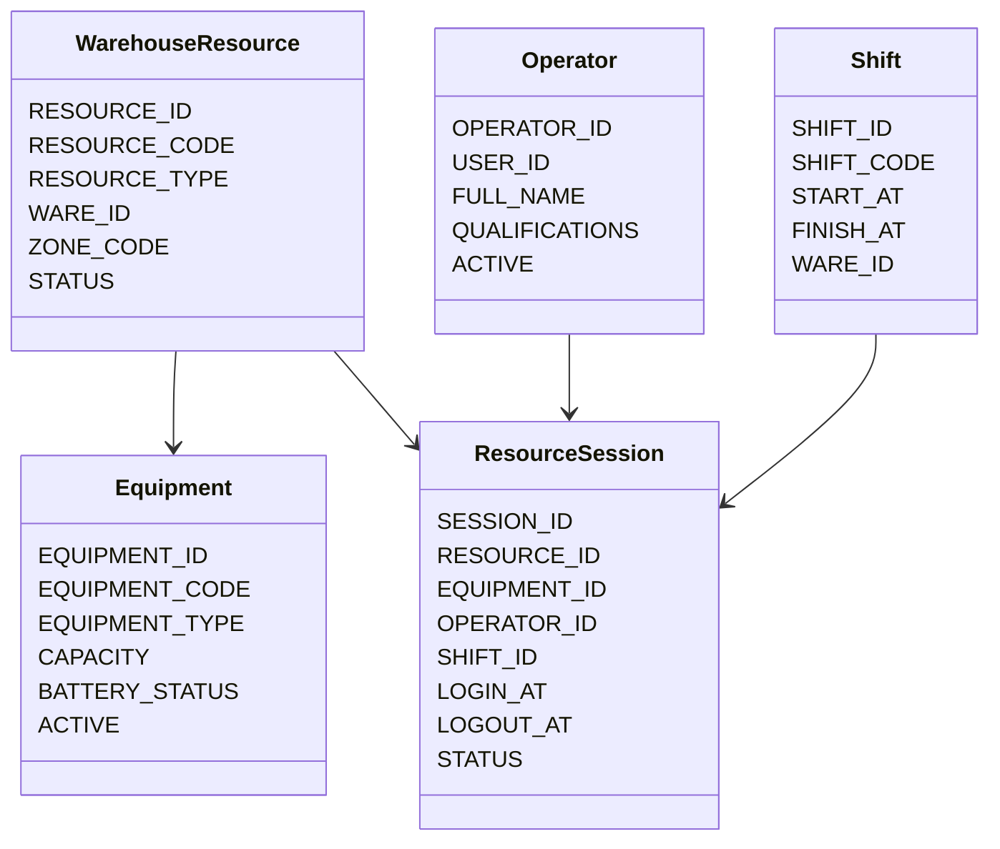
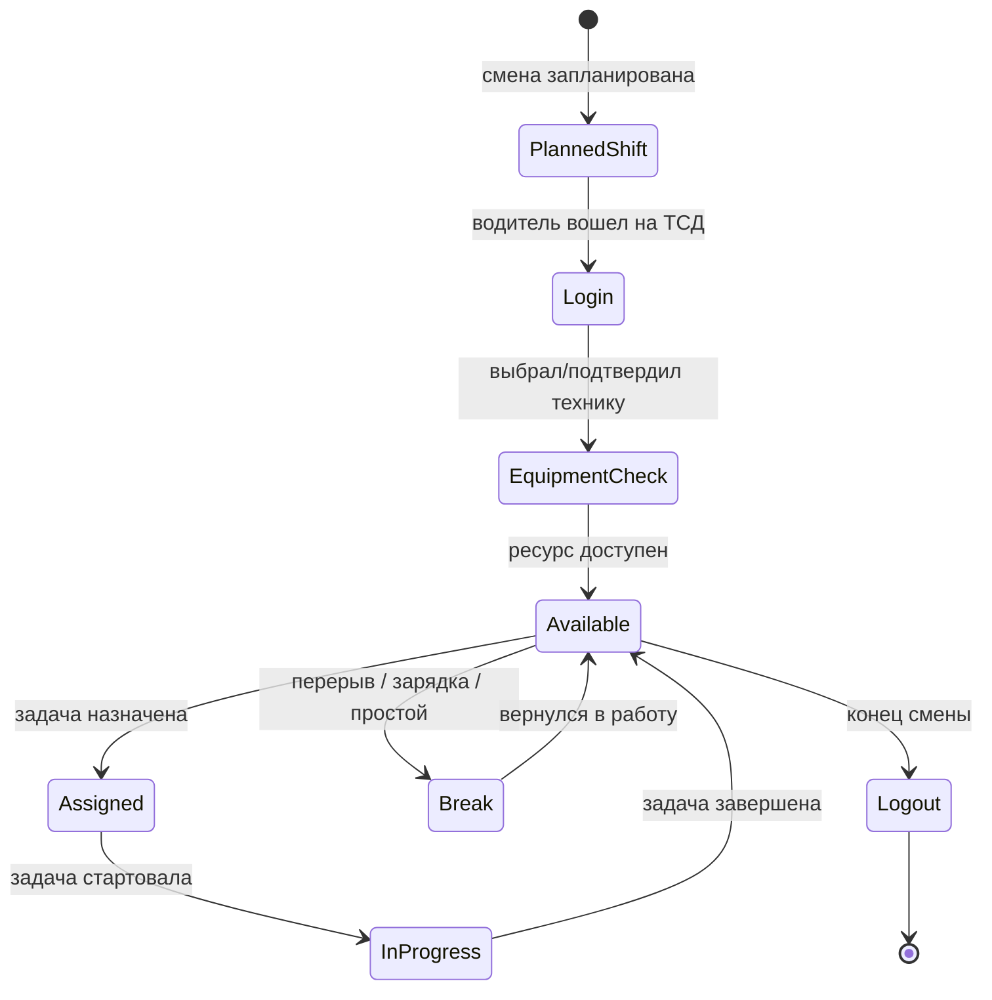
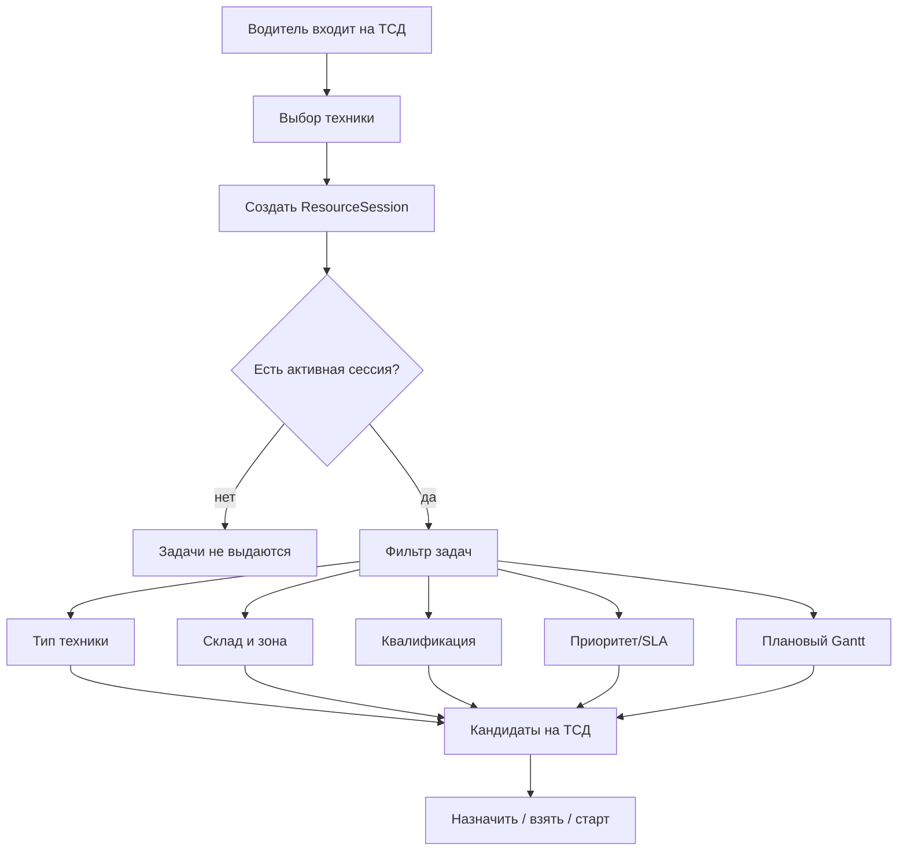

# ТЗ: ресурсы склада, смены водителей, планирование ричтраков и план-фактный Gantt

Статус: отдельное техническое задание на архитектуру ресурсов склада и выдачу заданий водителям после регистрации в смене.

Дата: 2026-05-19.

Связанные документы:

- [Складские задания для водителей ричтраков](warehouse_tasks_reachtruck_tz.md)
- [Современное терминальное приложение WMS](modern_terminal_app_tz.md)
- [Доменная синхронизация складских заданий](warehouse_task_domain_sync_tz.md)
- [Клиентский сценарий приемки волны](wave_client_e2e_acceptance_scenario.md)
- [API Method Library](../concepts/api_method_library.md)

## 1. Назначение

Нужно перестать воспринимать водителя ричтрака как просто текстовое поле `ASSIGNED_TO`.

Водитель и техника должны стать планируемыми ресурсами склада, похожими на производственное оборудование:

- есть физическая единица техники;
- есть персонал, который выходит на смену;
- есть календарь и расписание работы;
- есть плановая загрузка;
- есть фактическая загрузка;
- есть план-фактный анализ по времени, задачам, простоям и отклонениям.

После регистрации водителя в смене система должна понимать:

```text
какой водитель + на какой технике + в какой зоне + в какое время доступен для выполнения RRL_WAREHOUSE_TASK
```

Только после этого задания начинают попадать ему на ТСД.

## 2. Термины

| Термин | Значение |
| --- | --- |
| Складской ресурс | Планируемый ресурс склада: ричтрак, KIKA, погрузчик, человек, зона или связка человек + техника |
| Техника | Физическая единица оборудования: reachtruck, KIKA, forklift, pallet truck |
| Оператор ресурса | Водитель или сотрудник, который работает на технике в смене |
| Смена | Интервал работы персонала и техники |
| Сессия ресурса | Факт регистрации водителя на технике в конкретной смене |
| Плановый Gantt | Расписание задач по ресурсам до выполнения |
| Фактический Gantt | Реальные интервалы assign/start/complete/cancel/error |
| План-факт | Сравнение планового и фактического времени, очереди, простоя, перегруза и SLA |

## 3. Ресурсная Модель

Складской ресурс состоит из нескольких уровней.



Целевые типы ресурсов:

- `REACHTRUCK` - ричтрак для высотного хранения, пополнения, staging;
- `KIKA` - складская техника/рабочая единица для перемещений, если используется в терминологии склада;
- `FORKLIFT` - погрузчик;
- `PALLET_TRUCK` - электротележка;
- `CASE_PICKER` - человек/ресурс покоробочного отбора;
- `LOADING_TEAM` - бригада погрузки.

Важно: `RRL_WAREHOUSE_TASK` остается задачей физической работы. Ресурсный слой отвечает за то, кто, когда и чем эту работу выполняет.

## 4. Жизненный Цикл Водителя И Техники



Правила:

1. Водитель входит в ТСД своим пользователем.
2. Система определяет активную смену.
3. Водитель выбирает или сканирует технику.
4. Система проверяет:
   - техника активна;
   - водитель имеет квалификацию;
   - техника не занята другой активной сессией;
   - водитель не зарегистрирован в другой активной сессии;
   - зона/склад соответствуют смене.
5. Создается активная `ResourceSession`.
6. Только после этого водитель получает задания.
7. При выходе из смены новые задания не назначаются, активные задания должны быть закрыты, переданы или переведены диспетчеру.

## 5. Как Водитель Получает Задания

### 5.1. Базовый Принцип

ТСД не должен показывать все задачи склада всем водителям.

ТСД должен показывать:

- задачи, уже назначенные на текущую активную сессию;
- свободные задачи, которые подходят ресурсу по типу техники, зоне, квалификации и времени;
- аварийные задачи, если диспетчер явно дал право видеть шире.



### 5.2. Фильтры Выдачи

Задача попадает водителю, если:

- `RRL_WAREHOUSE_TASK.STATUS in ('PLANNED', 'ASSIGNED', 'IN_PROGRESS')`;
- задача не отменена и не закрыта;
- тип задачи разрешен типу ресурса;
- склад и зона задачи доступны ресурсу;
- водитель имеет нужную квалификацию;
- задача не закреплена за другим активным ресурсом;
- задача не конфликтует с текущей задачей ресурса;
- плановый старт задачи попадает в окно смены или разрешено брать backlog.

Примеры:

| Задача | Ресурс |
| --- | --- |
| `REPLENISHMENT` из высотной ячейки | `REACHTRUCK` |
| `PICKING_MOVE` полный паллет | `REACHTRUCK` или `FORKLIFT`, по настройке зоны |
| `FG_TO_STORAGE` | `REACHTRUCK` / `FORKLIFT` |
| `RAW_TO_PRODUCTION` | `KIKA` / `PALLET_TRUCK` / `FORKLIFT`, по маршруту |
| `CASE_PICK` | `CASE_PICKER`, не ричтрак |

## 6. Плановый Gantt

Плановый Gantt показывает, как система ожидает загрузить ресурсы.

Горизонт:

- текущая смена;
- день;
- неделя;
- выбранное окно волны/производственного плана.

Оси:

- вертикаль: ресурсы, техника, водители или связки `водитель + техника`;
- горизонталь: время;
- блоки: задачи `RRL_WAREHOUSE_TASK` или агрегированные рейсы.

```mermaid
gantt
    title Плановый Gantt ричтраков
    dateFormat  HH:mm
    axisFormat  %H:%M
    section RT-01 Иванов
    Пополнение WAV-01 SKU-A      :planned1, 08:10, 20m
    Паллет в грузовую зону       :planned2, after planned1, 15m
    Размещение FG                :planned3, after planned2, 18m
    section KIKA-02 Петров
    Сырье в производство         :planned4, 08:05, 25m
    Внутреннее перемещение       :planned5, after planned4, 12m
```



Плановые интервалы должны рассчитываться из:

- приоритета задачи;
- типа операции;
- расстояния от `FROM_CELL` до `TO_CELL`;
- зоны склада;
- норматива времени на тип операции;
- текущей очереди ресурса;
- рабочего календаря ресурса;
- перерывов и недоступности техники.

## 7. Фактический Gantt

Фактический Gantt строится из событий:

- `ASSIGNED_AT`;
- `STARTED_AT`;
- `FINISHED_AT`;
- `CANCELLED_AT`;
- `ERROR_AT`;
- pause/break/charge events будущего ресурсного слоя.

```mermaid
gantt
    title План-факт ричтрака RT-01
    dateFormat  HH:mm
    axisFormat  %H:%M
    section План
    Пополнение SKU-A             :p1, 08:10, 20m
    Паллет в грузовую зону       :p2, 08:30, 15m
    section Факт
    Пополнение SKU-A             :f1, 08:14, 31m
    Паллет в грузовую зону       :f2, 08:49, 12m
```



План-факт показывает:

- задача стартовала позже плана;
- задача шла дольше норматива;
- ресурс простаивал между задачами;
- ресурс был перегружен;
- часть задач ушла на другого водителя;
- очередь волны задержала readiness.

## 8. План-Фактный Анализ Нагрузки

Минимальные показатели:

| KPI | Формула / смысл |
| --- | --- |
| Плановая загрузка | сумма плановых минут / рабочее время смены |
| Фактическая загрузка | сумма фактических `IN_PROGRESS` минут / рабочее время смены |
| Простой | доступное время без задач |
| Ожидание задачи | время от `PLANNED` до `ASSIGNED` |
| Ожидание старта | время от `ASSIGNED` до `STARTED` |
| Выполнение | время от `STARTED` до `DONE` |
| Отклонение | факт минут - план минут |
| SLA breach | задача завершена позже целевого времени |
| Переназначения | сколько задач ушло на другого ресурса |

Группировки:

- по водителю;
- по технике;
- по типу задач;
- по волне;
- по зоне склада;
- по смене;
- по причине отклонения.

## 9. Целевая Схема Данных

### 9.1. Таблицы

Предлагаемые таблицы:

- `RRL_WMS_RESOURCE`;
- `RRL_WMS_EQUIPMENT`;
- `RRL_WMS_OPERATOR_QUAL`;
- `RRL_WMS_SHIFT`;
- `RRL_WMS_RESOURCE_CALENDAR`;
- `RRL_WMS_RESOURCE_SESSION`;
- `RRL_WMS_TASK_PLAN`;
- `RRL_WMS_TASK_FACT_EVENT`;
- `RRL_WMS_RESOURCE_GANTT_SNAPSHOT`.

### 9.2. `RRL_WMS_RESOURCE`

Ресурсная единица планирования.

Поля:

- `RESOURCE_ID`;
- `RESOURCE_CODE`;
- `RESOURCE_NAME`;
- `RESOURCE_TYPE`;
- `WARE_ID`;
- `ZONE_CODE`;
- `STATUS`;
- `ACTIVE`;
- `CREATED_AT`, `CREATED_BY`, `UPDATED_AT`, `UPDATED_BY`.

### 9.3. `RRL_WMS_EQUIPMENT`

Физическая техника.

Поля:

- `EQUIPMENT_ID`;
- `EQUIPMENT_CODE`;
- `EQUIPMENT_TYPE`;
- `SERIAL_NO`;
- `WARE_ID`;
- `HOME_ZONE_CODE`;
- `CAPACITY_CLASS`;
- `BATTERY_STATUS`;
- `SERVICE_STATUS`;
- `ACTIVE`.

### 9.4. `RRL_WMS_SHIFT`

План смены.

Поля:

- `SHIFT_ID`;
- `SHIFT_CODE`;
- `WARE_ID`;
- `SHIFT_DATE`;
- `START_AT`;
- `FINISH_AT`;
- `STATUS`;
- `CREATED_BY`.

### 9.5. `RRL_WMS_RESOURCE_SESSION`

Факт выхода водителя на смену и связки с техникой.

Поля:

- `SESSION_ID`;
- `SHIFT_ID`;
- `RESOURCE_ID`;
- `EQUIPMENT_ID`;
- `OPERATOR_USER_ID`;
- `LOGIN_AT`;
- `LOGOUT_AT`;
- `STATUS`: `ACTIVE`, `PAUSED`, `CLOSED`, `ERROR`;
- `CURRENT_TASK_ID`;
- `LAST_HEARTBEAT_AT`;
- `TERMINAL_ID`;
- `ZONE_CODE`.

Ограничения:

- один водитель не может иметь две активные сессии;
- одна техника не может иметь две активные сессии;
- закрытие смены невозможно, если есть активная задача без решения диспетчера.

### 9.6. `RRL_WMS_TASK_PLAN`

Плановый интервал выполнения задачи.

Поля:

- `TASK_PLAN_ID`;
- `TASK_ID`;
- `RESOURCE_ID`;
- `SESSION_ID`;
- `PLANNED_START_AT`;
- `PLANNED_FINISH_AT`;
- `PLANNED_DURATION_SEC`;
- `PLAN_STATUS`: `PLANNED`, `DISPATCHED`, `REPLANNED`, `CANCELLED`;
- `PLAN_REASON`;
- `CREATED_AT`, `CREATED_BY`.

### 9.7. `RRL_WMS_TASK_FACT_EVENT`

Фактические события выполнения.

Поля:

- `EVENT_ID`;
- `TASK_ID`;
- `SESSION_ID`;
- `RESOURCE_ID`;
- `EVENT_TYPE`: `ASSIGNED`, `STARTED`, `SCAN_PALLET`, `SCAN_FROM`, `SCAN_TO`, `COMPLETED`, `CANCELLED`, `ERROR`, `PAUSE`, `RESUME`;
- `EVENT_AT`;
- `EVENT_BY`;
- `PAYLOAD_JSON`.

## 10. Изменения В `RRL_WAREHOUSE_TASK`

Текущая таблица остается центральной.

Нужно добавить или логически поддержать поля:

- `RESOURCE_ID`;
- `RESOURCE_SESSION_ID`;
- `EQUIPMENT_ID`;
- `PLANNED_START_AT`;
- `PLANNED_FINISH_AT`;
- `ASSIGNED_AT`;
- `STARTED_AT`;
- `FINISHED_AT`;
- `DISPATCH_PRIORITY`;
- `ZONE_CODE`;
- `ESTIMATED_DURATION_SEC`;
- `PLAN_DEVIATION_SEC`.

Если прямое изменение таблицы нежелательно, эти поля можно хранить в `RRL_WMS_TASK_PLAN` и `RRL_WMS_TASK_FACT_EVENT`, а `RRL_WAREHOUSE_TASK` связать через `TASK_ID`.

## 11. API

### 11.1. Ресурсы И Смены

```text
GET  /api/wms-resources
POST /api/wms-resources
GET  /api/wms-equipment
POST /api/wms-equipment
GET  /api/wms-shifts
POST /api/wms-shifts
GET  /api/wms-resource-sessions
```

### 11.2. Регистрация Водителя

```text
POST /api/wms-resource-sessions/login
POST /api/wms-resource-sessions/{session_id}/heartbeat
POST /api/wms-resource-sessions/{session_id}/pause
POST /api/wms-resource-sessions/{session_id}/resume
POST /api/wms-resource-sessions/{session_id}/logout
```

Login request:

```json
{
  "operator_user_id": "ivanov",
  "equipment_code": "RT-01",
  "terminal_id": "TSD-17",
  "ware_id": 1,
  "zone_code": "A"
}
```

Login response:

```json
{
  "session_id": 101,
  "resource_id": 12,
  "equipment_id": 4,
  "shift_id": 55,
  "status": "ACTIVE",
  "allowed_task_types": ["REPLENISHMENT", "PICKING_MOVE", "FG_TO_STORAGE"]
}
```

### 11.3. Выдача Заданий На ТСД

```text
GET  /api/warehouse-tasks/dispatch?session_id=...
POST /api/warehouse-tasks/{task_id}/claim
POST /api/warehouse-tasks/{task_id}/assign
POST /api/warehouse-tasks/{task_id}/start
POST /api/warehouse-tasks/{task_id}/complete
POST /api/warehouse-tasks/{task_id}/cancel
```

Правило:

- без активного `session_id` endpoint dispatch возвращает пустой список или `403`;
- `claim/assign/start` должны проверять, что задача подходит текущему ресурсу;
- диспетчер может принудительно назначить задачу на ресурс через отдельное право.

### 11.4. Gantt И План-Факт

```text
GET  /api/wms-resources/gantt/plan
GET  /api/wms-resources/gantt/fact
GET  /api/wms-resources/gantt/plan-fact
POST /api/wms-resources/gantt/replan
GET  /api/wms-resources/load-analysis
```

Фильтры:

- `ware_id`;
- `shift_id`;
- `resource_id`;
- `equipment_id`;
- `operator_user_id`;
- `task_type`;
- `task_source`;
- `pick_wave_id`;
- `from_at`;
- `to_at`.

## 12. UI

### 12.1. Панель Старшего Смены

Добавить вкладку или раздел:

```text
Ресурсы смены
```

Должно быть видно:

- кто вышел на смену;
- на какой технике;
- статус: доступен, в задаче, перерыв, ошибка, закончил смену;
- текущая задача;
- очередь задач;
- плановая загрузка;
- фактическая загрузка;
- отклонения.

### 12.2. Плановый Gantt

Отображение:

- строки ресурсов;
- цвет задач по типу;
- плановые интервалы;
- перегрузки и простои;
- задачи без ресурса в отдельной строке `Unassigned`.

### 12.3. План-Фактный Gantt

Отображение:

- плановый бар тонкой линией;
- фактический бар поверх или ниже;
- цвет отклонения:
  - зеленый: в норме;
  - желтый: отклонение;
  - красный: SLA breach;
- tooltip с планом, фактом, задачей, волной, водителем, техникой.

### 12.4. ТСД Водителя

При входе:

1. Водитель вводит логин или сканирует бейдж.
2. Выбирает/сканирует технику.
3. Видит активную смену.
4. Нажимает `Начать смену`.
5. После этого получает список подходящих задач.

Экран должен показывать:

- текущую сессию;
- технику;
- смену;
- зону;
- текущую задачу;
- очередь следующих задач;
- кнопку `Пауза`;
- кнопку `Завершить смену`.

## 13. Диспетчеризация Задач

Стратегии назначения:

1. `PULL` - водитель сам берет следующую подходящую задачу.
2. `PUSH` - система назначает задачу на ресурс.
3. `DISPATCHER` - старший смены вручную назначает/переназначает.

Для MVP рекомендуется:

- `PULL` для ТСД;
- ручное назначение диспетчером;
- плановый Gantt как read-only расчет;
- автоматический `PUSH` после накопления статистики.

Приоритет задачи:

```text
score = business_priority + wave_urgency + due_time_weight + distance_weight + resource_affinity - conflict_penalty
```

Факторы:

- приоритет волны;
- срок готовности отгрузки;
- тип задачи;
- расстояние;
- зона ресурса;
- текущая очередь;
- квалификация;
- батарея/доступность техники;
- риск блокировки downstream процесса.

## 14. Интеграция С Волнами И MES

Ресурсный слой не меняет правило wave-first.

Для wave tasks:

- бизнес-владелец остается `PICK_WAVE`;
- физическая работа остается `RRL_WAREHOUSE_TASK`;
- ресурсный слой выбирает исполнителя и временной слот.

Для MES:

- raw supply и FG placement также попадают в `RRL_WAREHOUSE_TASK`;
- ресурсный слой может планировать их рядом с wave tasks;
- приоритеты MES и Wave должны сравниваться в общей очереди.

## 15. Права

Новые права:

- `wms_resource_view`;
- `wms_resource_edit`;
- `wms_shift_view`;
- `wms_shift_edit`;
- `wms_resource_session_view`;
- `wms_resource_session_manage`;
- `wms_gantt_view`;
- `wms_gantt_replan`;
- `warehouse_task_dispatch`;
- `warehouse_task_force_assign`.

Для водителя:

- `warehouse_task_view`;
- `warehouse_task_execute`;
- право на login в терминале может быть ролью `forklift_operator`.

## 16. События И Аудит

Логировать:

- вход в смену;
- выбор техники;
- heartbeat;
- паузу;
- возврат из паузы;
- выход;
- получение списка задач;
- claim/assign/start/complete/cancel;
- ручное переназначение;
- replan;
- нарушение SLA.

Каждое событие должно содержать:

- пользователя;
- `session_id`;
- `resource_id`;
- `equipment_id`;
- `task_id`, если есть;
- время;
- терминал;
- payload.

## 17. Нагрузочные Проверки

Сценарии:

1. `10` водителей одновременно логинятся на смену.
2. `10` единиц техники получают активные сессии.
3. `500` warehouse tasks распределяются по ресурсам.
4. `2` водителя пытаются взять одну задачу.
5. `2` водителя пытаются зарегистрироваться на одну технику.
6. Один водитель теряет связь, heartbeat истекает.
7. Диспетчер переназначает задачу во время выполнения.
8. Gantt пересчитывается на горизонте смены.
9. План-факт строится после массового выполнения.

Критерии:

- нет двойной активной сессии на технику;
- нет двойного выполнения одной задачи;
- dispatch не выдает неподходящие задачи;
- Gantt не содержит пересечений для одного ресурса;
- план-факт строится за приемлемое время;
- `Oracle invalid objects = 0`.

## 18. MVP Инкременты

### Инкремент 1. Справочники Ресурсов

- таблицы ресурсов, техники, смен;
- базовый API;
- права;
- raw UI список ресурсов.

### Инкремент 2. Login Водителя В Смену

- `POST /api/wms-resource-sessions/login`;
- выбор техники на ТСД;
- активная session;
- запрет двойной регистрации.

### Инкремент 3. Dispatch Задач На ТСД

- `GET /api/warehouse-tasks/dispatch?session_id=...`;
- фильтрация задач по ресурсу;
- claim/assign с проверкой session;
- ТСД показывает только подходящие задачи.

### Инкремент 4. Плановый Gantt

- расчет плановых интервалов;
- read-only UI;
- задачи без ресурса;
- базовые нормативы длительности.

### Инкремент 5. Фактический Gantt И План-Факт

- event journal;
- фактические интервалы;
- KPI загрузки;
- отклонения;
- отчет по смене.

### Инкремент 6. Автоматическая Диспетчеризация

- scoring задач;
- auto-assign;
- replan;
- рекомендации диспетчеру.

## 19. Definition Of Done

Функциональность считается готовой для пилота, когда:

- есть справочник техники и ресурсов;
- водитель может войти в смену и выбрать технику;
- активная техника не может быть выбрана двумя водителями;
- водитель без активной сессии не получает задания;
- ТСД показывает только подходящие задачи;
- claim/start/complete пишут resource/session факты;
- плановый Gantt показывает задачи по ресурсам;
- фактический Gantt показывает реальные интервалы;
- план-факт показывает загрузку, простой и отклонения;
- старые warehouse task сценарии `REPLENISHMENT`, `PICKING_MOVE`, `FG_TO_STORAGE`, `RAW_TO_PRODUCTION` продолжают работать;
- есть load-тест на конкуренцию водителей и задач;
- wiki, api-med и эксплуатационная инструкция обновлены.
