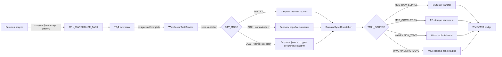
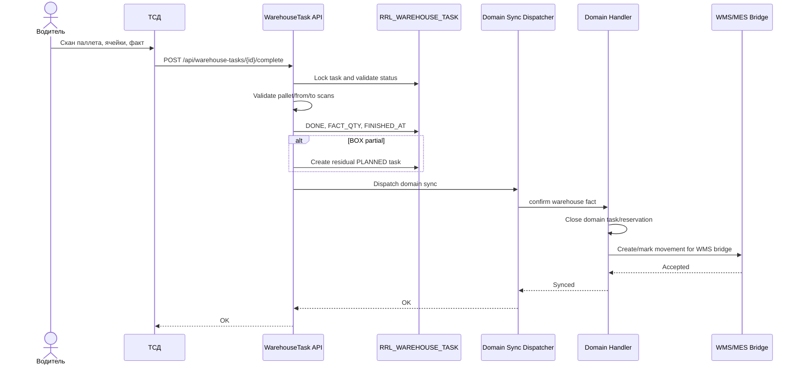
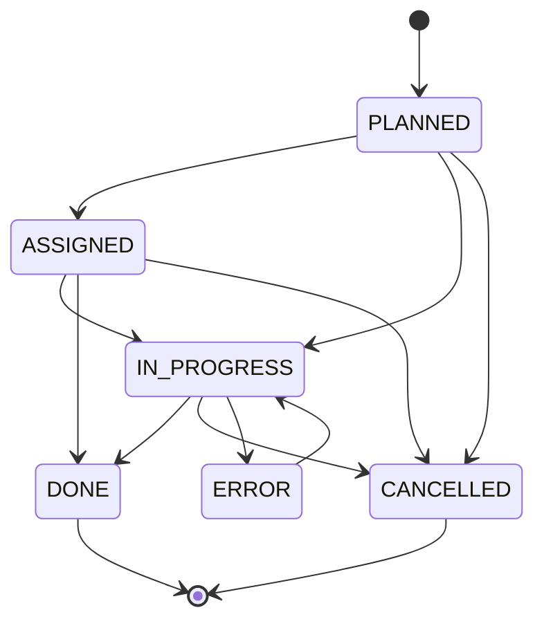
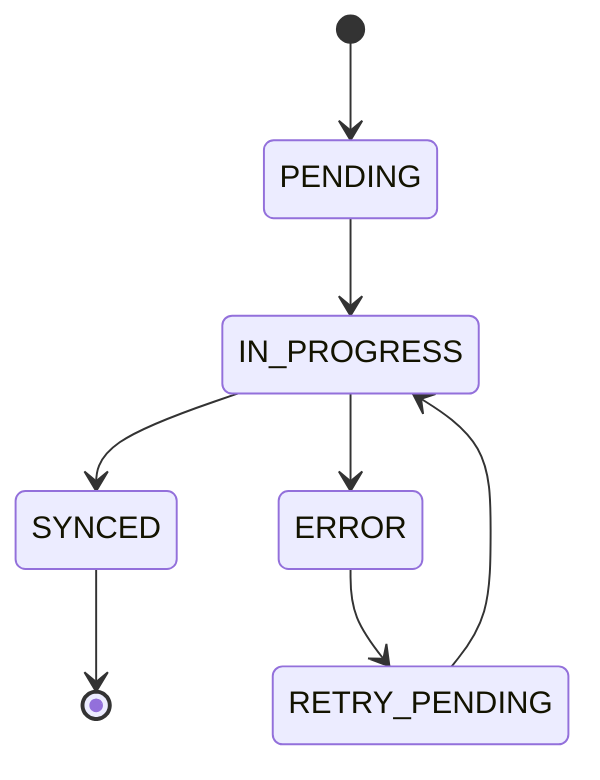
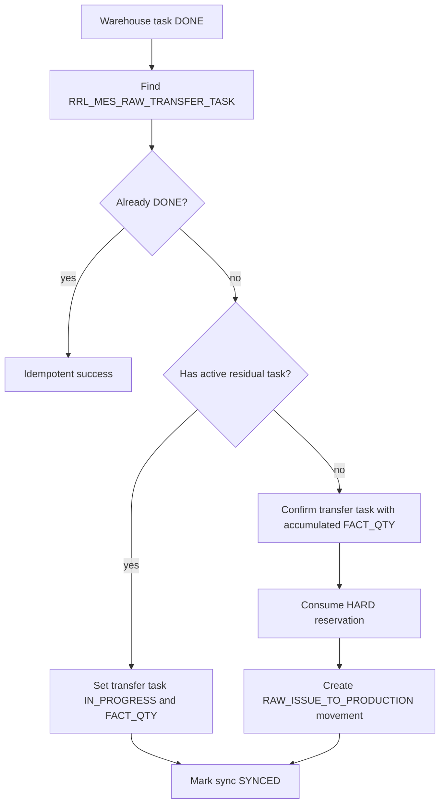
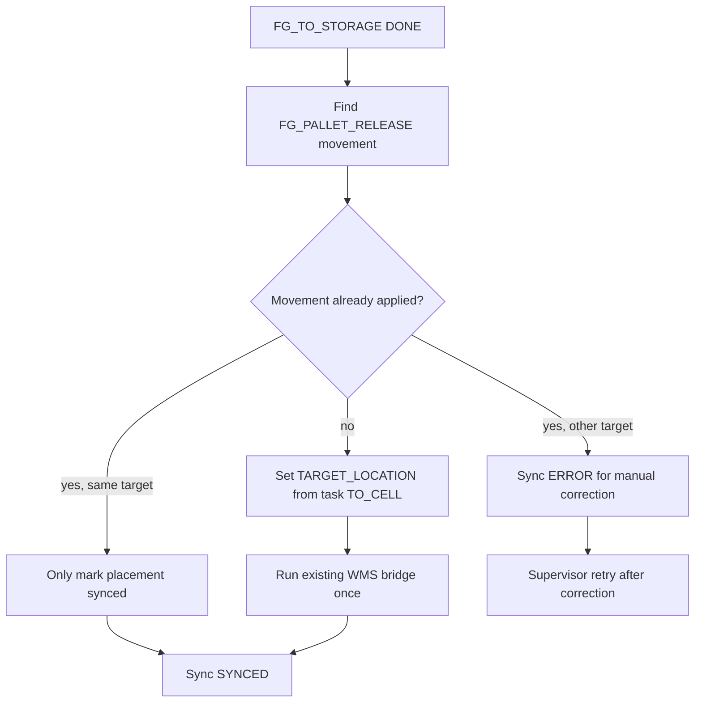
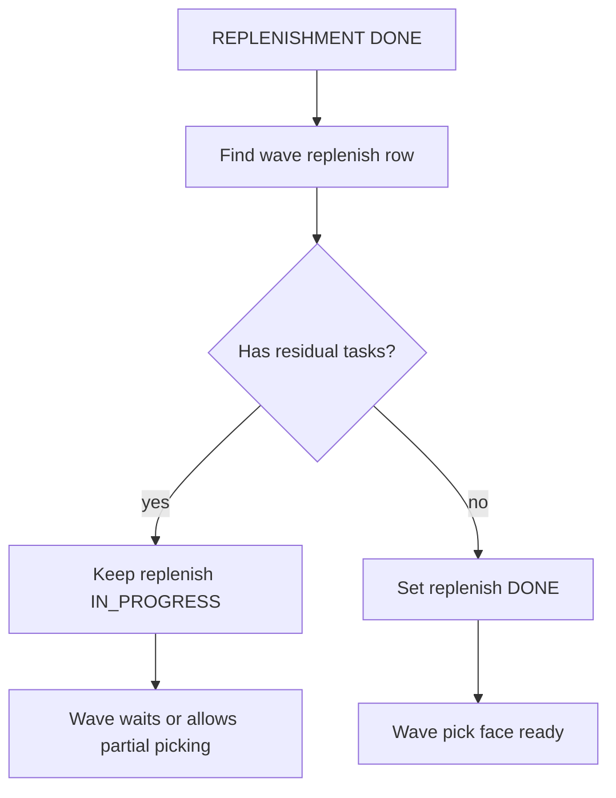
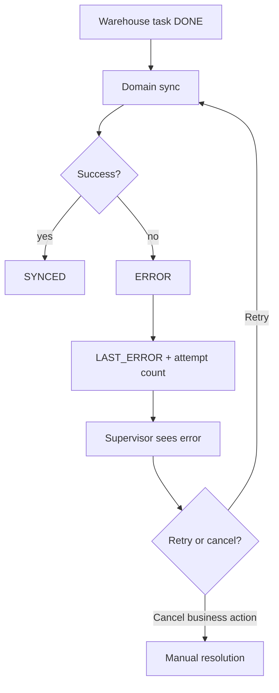

# ТЗ: доменная синхронизация складских заданий

## 1. Назначение

Доменная синхронизация нужна, чтобы факт, подтвержденный водителем ричтрака в `RRL_WAREHOUSE_TASK`, закрывал соответствующий бизнес-процесс.

Сейчас водительский факт уже фиксируется:

- задача берется в работу;
- проверяются сканы паллета и ячеек;
- задача закрывается как `DONE`;
- для `BOX` возможна частичная фактическая отработка с остаточной задачей.

Но этого недостаточно для производства, волны или отгрузки. Бизнес-документ должен узнать, что физическая работа выполнена, и выполнить свой доменный шаг: закрыть специализированную задачу, погасить резерв, создать movement, подготовить WMS bridge, обновить статус волны или производства.

## 2. Главный принцип

`RRL_WAREHOUSE_TASK` является физическим слоем исполнения, а не владельцем бизнес-процесса.

Правило:

- водитель подтверждает физический факт в `RRL_WAREHOUSE_TASK`;
- доменный обработчик читает `TASK_SOURCE`, `TASK_TYPE`, `SOURCE_DOC_TYPE`, `SOURCE_DOC_ID`, `SOURCE_TASK_ID`, `SOURCE_MOVEMENT_ID`;
- обработчик закрывает связанный бизнес-документ;
- старые остатки WMS меняются только через разрешенный WMS/MES bridge, а не прямым `update RRL_REMAINS`.

Ключевая цель: один физический факт должен породить ровно одно доменное закрытие.

## 3. Общая схема



## 4. Участники процесса

### Водитель ричтрака

Видит только физическую задачу:

- что взять;
- откуда взять;
- куда поставить;
- полный паллет или коробки;
- сколько коробок, если задача частичная.

Водитель не выбирает бизнес-процесс и не закрывает MES/волны вручную.

### Warehouse Task API

Отвечает за:

- права `warehouse_task_view` и `warehouse_task_execute`;
- проверку статуса задачи;
- проверку сканов;
- фиксацию `ASSIGNED`, `IN_PROGRESS`, `DONE`, `CANCELLED`;
- создание остаточной задачи при частичном `BOX`;
- запуск доменной синхронизации после успешного физического закрытия.

### Domain Sync Dispatcher

Единая точка маршрутизации после закрытия физической задачи.

Он не должен содержать доменную бизнес-логику внутри себя. Его задача:

1. Заблокировать warehouse task или доменный sync-key.
2. Проверить, что доменная синхронизация еще не выполнена.
3. Определить обработчик по `TASK_SOURCE` и `SOURCE_DOC_TYPE`.
4. Вызвать обработчик.
5. Записать результат синхронизации.

### Domain Handler

Обработчик конкретного бизнес-контура:

- MES raw supply;
- MES finished goods placement;
- wave replenishment;
- wave loading-zone staging;
- future production wave.

## 5. Последовательность закрытия



## 6. Статусы

### Warehouse task



### Domain sync state

Для надежной реализации нужен явный статус синхронизации. Он может быть отдельной таблицей или полями в `RRL_WAREHOUSE_TASK`. Рекомендуемый вариант: отдельная таблица `RRL_WAREHOUSE_TASK_SYNC`.



## 7. Рекомендуемая таблица синхронизации

`RRL_WAREHOUSE_TASK_SYNC`

Поля:

- `SYNC_ID`;
- `TASK_ID`;
- `TASK_SOURCE`;
- `SOURCE_DOC_TYPE`;
- `SOURCE_DOC_ID`;
- `SOURCE_TASK_ID`;
- `SOURCE_MOVEMENT_ID`;
- `SYNC_STATUS`: `PENDING`, `IN_PROGRESS`, `SYNCED`, `ERROR`, `RETRY_PENDING`;
- `SYNC_ATTEMPT`;
- `SYNC_KEY`;
- `LAST_ERROR`;
- `CREATED_AT`;
- `UPDATED_AT`;
- `SYNCED_AT`;
- `UPDATED_BY`.

`SYNC_KEY` должен быть идемпотентным ключом, например:

```text
TASK_SOURCE + TASK_TYPE + TASK_ID + SOURCE_TASK_ID + SOURCE_MOVEMENT_ID
```

Для доменных операций, где источник уже уникален, можно строить ключ от `SOURCE_TASK_ID` или `SOURCE_MOVEMENT_ID`, но `TASK_ID` все равно должен попадать в аудит.

## 8. Маршрутизация по источнику

| TASK_SOURCE | TASK_TYPE | SOURCE_DOC_TYPE | Обработчик | Цель |
|---|---|---|---|---|
| `MES_RAW_SUPPLY` | `RAW_TO_PRODUCTION` | `PRODUCTION_ORDER` | `RawSupplyTaskSyncHandler` | реализовано: закрыть задачу сырья, погасить резерв, создать `RAW_ISSUE_TO_PRODUCTION`; частичный факт оставляет MES-задачу `IN_PROGRESS` до закрытия residual task |
| `MES_COMPLETION` | `FG_TO_STORAGE` | `PRODUCTION_ORDER` | `FinishedGoodsStorageSyncHandler` | реализовано: подтвердить размещение выпущенного паллета без повторного выпуска продукции |
| `WAVE` | `REPLENISHMENT` | `PICK_WAVE` | `WaveReplenishmentSyncHandler` | реализовано: закрыть пополнение pick face, обновить волну |
| `WAVE` | `PICKING_MOVE` | `PICK_WAVE` | `WaveStagingSyncHandler` | реализовано: подтвердить спуск паллета в грузовую зону в рамках волны |
| `WAVE` | `RAW_TO_PRODUCTION` | `PRODUCTION_WAVE` | `ProductionWaveSupplySyncHandler` | будущая производственная волна снабжения |
| `MANUAL` | `OTHER` | любое | `ManualTaskSyncHandler` | только аудит, без доменного движения |

## 9. Процесс MES raw supply

### Бизнес-цель

Когда водитель переместил сырье в производственную ячейку, MES должен считать сырье выданным в производство.

### Шаги

1. `RRL_WAREHOUSE_TASK` закрыта как `DONE`.
2. Обработчик находит `RRL_MES_RAW_TRANSFER_TASK` по `SOURCE_TASK_ID`.
3. Проверяет, что специализированная задача не закрыта ранее.
4. Если задача `QTY_MODE = BOX` закрыта частично:
   - исходная MES-задача остается `IN_PROGRESS`;
   - `RRL_MES_RAW_TRANSFER_TASK.FACT_QTY` накапливает уже перемещенное количество;
   - остаток живет в новой `RRL_WAREHOUSE_TASK` с `PARENT_TASK_ID`.
5. Когда активных residual task больше нет, handler подтверждает MES raw transfer task суммарным фактом.
6. Hard reserve переводится в `CONSUMED`.
7. Создается `RRL_MES_MOVEMENT` типа `RAW_ISSUE_TO_PRODUCTION`.
8. WMS bridge получает movement и далее пишет `RRL_EVENTS`.

### Схема



## 10. Процесс FG_TO_STORAGE

### Бизнес-цель

Когда водитель поставил выпущенный паллет готовой продукции в целевую ячейку, MES должен видеть, что физическое размещение завершено.

### Шаги

1. Обработчик находит `RRL_MES_MOVEMENT` по `SOURCE_MOVEMENT_ID`.
2. Проверяет, что movement относится к `FG_PALLET_RELEASE`.
3. Записывает факт размещения:
   - если movement еще не применен к WMS, `TARGET_LOCATION = TO_CELL`;
   - если movement уже `APPLIED_TO_WMS`, проверяет совпадение `TARGET_LOCATION` и `TO_CELL`;
   - если movement уже применен в другую ячейку, sync становится `ERROR`, чтобы не создать тихое расхождение.
4. Не создает второй выпуск продукции.
5. Не меняет напрямую `RRL_REMAINS`.
6. Если WMS bridge еще должен выполнить перемещение из `MES_PRODUCTION` в `FG-A-01`, запускается существующий bridge `apply_mes_movements_to_wms` один раз.

### Схема



## 11. Процесс WAVE replenishment

### Бизнес-цель

Когда водитель пополнил ячейку отбора под волну, волна должна знать, что pick face готов к отбору.

### Шаги

1. Обработчик находит `RRL_PICK_WAVE_REPLENISH_TASK` по `SOURCE_TASK_ID`.
2. Если warehouse task закрыта полностью:
   - `RRL_PICK_WAVE_REPLENISH_TASK.STATUS = DONE`;
   - `QTY` фиксируется как плановое или фактическое количество.
3. Если warehouse task закрыта частично:
   - доменная строка не должна ошибочно стать полностью `DONE`;
   - исходная строка получает статус `IN_PROGRESS` или `PARTIAL`, если статус будет добавлен;
   - остаточная warehouse task продолжает физическое пополнение.
4. Когда все остаточные задачи закрыты, доменная строка становится `DONE`.
5. Волна может продолжить отбор только когда обязательные пополнения закрыты или разрешен частичный отбор.

### Схема



## 12. Процесс staging в грузовую зону

### Бизнес-цель

Когда водитель спустил паллет в грузовую зону, волна должна видеть, что товар физически готов к погрузке или дальнейшей операции.

Архитектурное уточнение: самостоятельного источника `SHIPMENT` для задач ричтрака не вводим. Управляющий документ - волна. Волна может быть создана по заказам на отгрузку или производственным заказам, но warehouse task ссылается на `PICK_WAVE`.

### Шаги

1. Оператор или автоматический сценарий выпускает staging-задания через `POST /api/picking/waves/{pick_wave_id}/staging/release`.
2. Warehouse task создается по строкам `RRL_PICK_WAVE_TASK` типа `FULL_PALLET` с:
   - `TASK_SOURCE = WAVE`;
   - `SOURCE_DOC_TYPE = PICK_WAVE`;
   - `SOURCE_DOC_ID = PICK_WAVE_ID`;
   - `SOURCE_TASK_ID = RRL_PICK_WAVE_TASK.PICK_WAVE_TASK_ID`;
   - `TASK_TYPE = PICKING_MOVE`;
   - `TO_CELL = грузовая зона`.
3. При назначении, старте и отмене физической задачи сервис синхронизирует статус связанной строки `RRL_PICK_WAVE_TASK`.
4. После `DONE` обработчик находит строку волны по `SOURCE_TASK_ID`.
5. При полном паллете переводит `RRL_PICK_WAVE_TASK` и связанную `RRL_PICK_TASK` в `DONE`, записывает факт и целевую грузовую зону.
6. Связанные резервы `RRL_PICK_RESERVATION` и `RRL_PICK_WAVE_RESERVATION` переводятся в `CONSUMED`.
7. Повторный release не создает дубль, если по той же строке волны уже есть неотмененная `PICKING_MOVE` warehouse task.

## 13. Идемпотентность

Доменная синхронизация должна быть идемпотентной.

Повторный вызов `complete` или retry sync не должен:

- повторно списывать сырье;
- повторно создавать movement;
- повторно переводить резерв в расход;
- создавать дублирующие остаточные задачи;
- закрывать волну дважды.

Правила:

- `DONE` и `CANCELLED` warehouse task нельзя закрыть повторно;
- sync handler должен проверять доменный статус перед изменением;
- movement создается с уникальным source key;
- таблица `RRL_WAREHOUSE_TASK_SYNC` хранит попытки и ошибки;
- retry разрешен только для `ERROR` / `RETRY_PENDING`.

## 14. Ошибки



Типовые ошибки:

- исходный документ не найден;
- исходный документ уже отменен;
- warehouse task закрыта частично, а домен не поддерживает частичное закрытие;
- резерв не найден;
- резерв уже погашен другой операцией;
- WMS bridge недоступен;
- movement уже существует с другим количеством;
- паллет уже находится в другой зоне по факту старого WMS.

## 15. API

MVP может оставить внешний контракт `POST /api/warehouse-tasks/{task_id}/complete`, но внутри endpoint должен:

1. Закрыть физическую задачу.
2. Создать остаточную задачу, если нужно.
3. Вызвать domain sync dispatcher.
4. Вернуть состояние:

```json
{
  "status": "ok",
  "task_id": 123,
  "warehouse_status": "DONE",
  "domain_sync_status": "SYNCED",
  "residual_task_id": 124
}
```

Если доменная синхронизация упала после успешного закрытия физической задачи, API должен вернуть понятную ошибку, но физический факт не должен теряться.

Рекомендуемое поведение для MVP:

- warehouse task закрывается транзакционно;
- sync row создается как `PENDING`;
- dispatcher пытается выполнить sync сразу;
- при ошибке sync row становится `ERROR`;
- оператор видит ошибку в диспетчерской;
- retry выполняется отдельной командой.

Будущие endpoints:

```text
GET  /api/warehouse-tasks/{task_id}/sync
POST /api/warehouse-tasks/{task_id}/sync/retry
GET  /api/warehouse-task-sync?status=ERROR
```

## 16. UI

### ТСД

ТСД должен показывать только результат физического действия:

- `Готово`;
- `Создан остаток`;
- `Факт принят, доменная синхронизация ожидает`;
- `Факт принят, ошибка бизнес-синхронизации`.

ТСД не должен показывать длинные технические ошибки. Длинная диагностика идет в диспетчерскую.

### Диспетчерская

`warehouse-tasks.html` должна показывать:

- `domain_sync_status`;
- `domain_sync_error`;
- `sync_attempt`;
- ссылку на исходный документ;
- ссылку на остаточную задачу;
- кнопку retry для права `warehouse_task_admin` или будущего `warehouse_task_sync_retry`.

## 17. MVP реализации

1. Добавить `RRL_WAREHOUSE_TASK_SYNC`. Реализовано миграцией `028`.
2. После `complete` создавать sync row. Реализовано для поддержанных target `WAVE / REPLENISHMENT / PICK_WAVE`, `WAVE / PICKING_MOVE / PICK_WAVE`, `MES_RAW_SUPPLY / RAW_TO_PRODUCTION / PRODUCTION_ORDER`, `MES_COMPLETION / FG_TO_STORAGE / PRODUCTION_ORDER`.
3. Реализовать dispatcher в backend service. Базовый dispatcher реализован.
4. Реализовать обработчик `WAVE / REPLENISHMENT`. Handler реализован.
5. Реализовать обработчик `MES_RAW_SUPPLY / RAW_TO_PRODUCTION`.
6. Реализовать обработчик `MES_COMPLETION / FG_TO_STORAGE`.
7. Реализовать обработчик `WAVE / PICKING_MOVE` для подачи полного паллета в грузовую зону.
8. Добавить retry endpoint.
9. Добавить отображение sync-status в диспетчерскую.
10. Добавить load test:
   - полный паллет;
   - коробки по плану;
   - коробки частично;
   - повторный retry;
   - ошибка доменного документа;
   - конкурентное закрытие.

## 18. Критерии приемки

Модуль считается готовым, если:

- закрытие warehouse task создает или обновляет sync row;
- повторный sync не создает дублей;
- `MES_RAW_SUPPLY` закрывает raw transfer task и резерв;
- `FG_TO_STORAGE` фиксирует физическое размещение без повторного выпуска продукции;
- `WAVE / REPLENISHMENT` корректно работает с остаточными задачами;
- `WAVE / PICKING_MOVE` закрывает full-pallet строку волны и погашает резервы;
- ошибка domain sync видна диспетчеру;
- retry исправляет временную ошибку;
- нагрузочный тест проходит без duplicate movements, duplicate reservations и lost residual tasks;
- Oracle invalid objects после миграции равны `0`.

## 19. Риски и открытые вопросы

- Нужно выбрать финальную модель хранения sync-state: отдельная таблица предпочтительнее, но можно начать с полей в `RRL_WAREHOUSE_TASK`.
- Для wave replenishment может понадобиться статус `PARTIAL` в `RRL_PICK_WAVE_REPLENISH_TASK`.
- Для старого WMS bridge нужно точно определить, какие движения уже созданы на момент `FG_PALLET_RELEASE`, чтобы не сделать двойное поступление.
- Для loading-zone staging сейчас утвержден wave-first вариант; отдельный shipment-source для ричтрака не вводится.
- Для production waves нужно решить, остаются ли legacy `MES_RAW_SUPPLY` задачи или они будут мигрировать в `SOURCE_DOC_TYPE = PRODUCTION_WAVE`.
