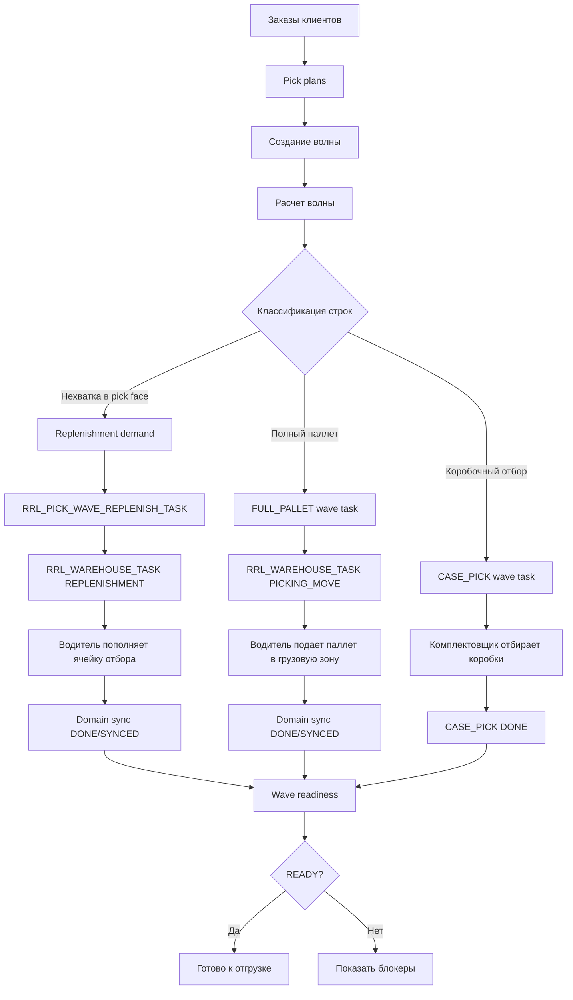
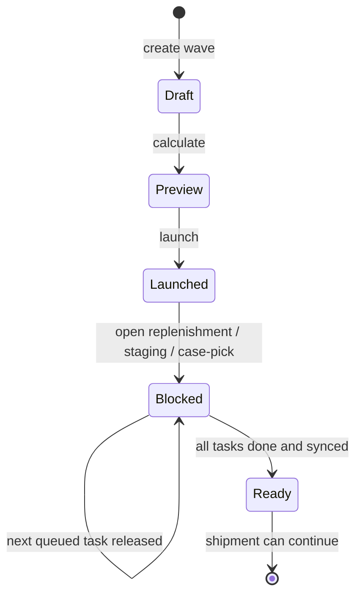

# ТЗ: клиентский сценарий приемки волны, пополнения, стеллажа и покоробочного отбора

Статус: отдельный сценарий клиентской приемки и будущей автоматизации.

Дата: 2026-05-19.

Связанные документы:

- [Пользовательские сценарии проверки волны](wave_user_scenarios_functional_tz.md)
- [Сборка по волнам / Wave Picking](wave_picking_tz.md)
- [Пополнение ячеек отбора под покоробочную комплектацию волны](wave_case_pick_replenishment_tz.md)
- [Складские задания для водителей ричтраков](warehouse_tasks_reachtruck_tz.md)
- [Доменная синхронизация складских заданий](warehouse_task_domain_sync_tz.md)
- [API Method Library](../concepts/api_method_library.md)

## 1. Назначение

Сценарий нужен для клиентской демонстрации и приемочного тестирования полного процесса комплектации:

1. Создание волны.
2. Пополнение ячеек отбора под волну.
3. Комплектация напрямую со стеллажа полным паллетом.
4. Покоробочная комплектация из ячейки отбора.
5. Финальная проверка readiness волны.

Главное архитектурное правило:

```text
Волна является управляющим документом.
Физические задания ричтрака живут в RRL_WAREHOUSE_TASK.
TASK_SOURCE = WAVE
SOURCE_DOC_TYPE = PICK_WAVE
```

Shipment, фура, маршрут и ворота являются контекстом волны, но не становятся отдельным источником ричтрак-задач в этом процессе.

## 2. Бизнес-Смысл

Клиент должен увидеть, что система различает три складских потока внутри одной волны:

- пополнение pick face, когда коробочного остатка не хватает;
- прямую подачу полного паллета со стеллажа в грузовую зону;
- обычный покоробочный отбор из ячейки отбора.

Все три потока должны сходиться в один контроль готовности:

```text
GET /api/picking/waves/{pick_wave_id}/readiness
```

Если есть незакрытое пополнение, staging, case-pick, shortage или ошибка доменной синхронизации, волна остается `BLOCKED`.

## 2.1. Отдельная Методика Доказательства Остатков

Этот сценарий проверяет не только статусы задач, но и изменение остатков по этапам процесса.

Нужно отдельно фиксировать два слоя:

1. Свободный остаток.
2. Физический остаток.

Свободный остаток - это то, что система может назначить новой операции:

```text
free_qty = physical_qty - active_hard_reservations - active_driver_tasks
```

Физический остаток - это фактическое размещение товара по ячейкам:

```text
physical_qty = остаток в ячейке после подтвержденного складского факта
```

Ключевое правило теста:

- при запуске волны и создании hard reservations меняется свободный остаток, но физический остаток еще не должен двигаться;
- при назначении или старте ричтрак-задачи физический остаток еще не должен двигаться;
- после `complete` ричтрака и успешного domain sync физический остаток должен измениться в source/target ячейках;
- после закрытия `CASE_PICK` физический остаток pick face должен уменьшиться на фактическое количество коробок;
- readiness должен объяснять, почему процесс еще не готов, если хотя бы один физический или доменный шаг не закрыт.

## 2.2. Обязательная Панель Старшего Смены До Тестирования

Перед проведением клиентского тестирования нужно организовать в сайтовой части приложения рабочее место старшего смены.

Назначение панели:

- показывать волну как процесс по этапам;
- показывать KPI по активным волнам, пополнениям, прямому отбору со стеллажа и коробочному отбору;
- показывать изменение свободных и физических остатков по SKU/ячейкам;
- показывать действия, которые параллельно выполняются на ТСД;
- давать визуальную базу для скриншотов на каждом этапе теста.

Raw-прототип панели:

```text
wiki-raw/wms_admin_ui_reference/shift-supervisor-wave.html
```

Целевые зоны панели:

| Зона | Что показывает |
| --- | --- |
| KPI верхнего уровня | активные волны, пополнения, задачи комплектации, прямой отбор, коробочный отбор, блокеры |
| Создание волны | параметры волны, заказы, маршрут, зона, тип отбора |
| Прогресс волны | `Создана -> Рассчитана -> Пополнение -> Комплектация -> Контроль -> Готово` |
| Остатки по этапам | физический и свободный остаток по source/pick/loading ячейкам |
| TСД-действия | assign/start/scan/complete для ричтрака и факт коробочного отбора |
| Блокеры/readiness | причины `BLOCKED` и финальный `READY` |

## 2.3. Протокол Фото- И Видеофиксации

Тестирование должно давать визуальное доказательство процесса.

Для каждого этапа нужно зафиксировать:

- скриншот панели старшего смены;
- скриншот или видео действия на ТСД;
- API/Oracle checkpoint, если этап меняет резервы или остатки;
- краткое текстовое объяснение: что изменилось и почему это правильно.

Рекомендуемые точки фиксации:

| Точка | Сайт старшего смены | ТСД | Что доказываем |
| --- | --- | --- | --- |
| `T0` до запуска | физические и свободные остатки исходные | нет действий | база для сравнения |
| `T1` запуск волны | свободные остатки уменьшились на hard reservations | нет действий | резервы не двигают физику |
| `T2` задача пополнения взята | задача у водителя, физика не изменилась | assign/start | старт задачи не двигает физику |
| `T3` пополнение закрыто | source физически уменьшился, pick face увеличился | scans + complete | факт ричтрака двигает физику |
| `T4` полный паллет подан | стеллаж уменьшился, грузовая зона увеличилась | `PICKING_MOVE complete` | прямой стеллажный поток закрыт |
| `T5` коробки отобраны | pick face физически уменьшился | `CASE_PICK complete` | коробочный факт списал pick face |
| `T6` readiness | `READY`, блокеров нет | нет действий | процесс готов к отгрузке |

Результат тестирования:

- HTML/Markdown отчет с этапами;
- набор скриншотов сайта по точкам `T0..T6`;
- видео или серия скриншотов ТСД;
- таблица изменения `free_qty` и `physical_qty`;
- заключение, что свободные и физические остатки менялись на правильных этапах.

## 3. Общая Диаграмма



## 4. Роли

| Роль | Что делает |
| --- | --- |
| Оператор волны | создает волну, добавляет планы, рассчитывает и запускает |
| Диспетчер склада | контролирует replenishment, staging, readiness и ошибки |
| Водитель ричтрака | выполняет `REPLENISHMENT` и `PICKING_MOVE` через ТСД |
| Комплектовщик | закрывает `CASE_PICK` по коробкам |
| Тестировщик | фиксирует API, Oracle, скриншоты и расхождения |

## 5. Тестовые Данные

Минимальная приемочная волна должна содержать три SKU.

| SKU | Складской поток | Настройка | Ожидаемая задача |
| --- | --- | --- | --- |
| `SKU-A` | Пополнение pick face | в pick face недостаточно коробок | `REPLENISHMENT` |
| `SKU-B` | Прямая комплектация со стеллажа | полный паллет подходит заказу | `FULL_PALLET` + `PICKING_MOVE` |
| `SKU-C` | Покоробочная комплектация | в pick face достаточно коробок | `CASE_PICK` |

Рекомендуемые данные:

- минимум `3` клиента;
- минимум `3` заказа;
- у одного клиента правило свежести `70%`;
- у второго клиента правило свежести `50%`;
- у третьего клиента правило свежести не задано;
- для `SKU-A` минимум `2` source pallets в разных ячейках хранения;
- для `SKU-B` один целый паллет в ячейке хранения;
- для `SKU-C` остаток в pick face достаточен для отбора.

## 6. Состояния И Контрольные Точки



Контрольные статусы:

- `RRL_PICK_WAVE.STATUS = LAUNCHED`;
- `RRL_PICK_WAVE_REPLENISH_TASK.STATUS = DONE` для выполненных пополнений;
- `RRL_PICK_WAVE_TASK.STATUS = DONE` для full-pallet и case-pick строк;
- `RRL_WAREHOUSE_TASK.STATUS = DONE`;
- `RRL_WAREHOUSE_TASK_SYNC.SYNC_STATUS = SYNCED`;
- `readiness.status = READY`.

## 6.1. Матрица Изменения Остатков По Этапам

| Этап | Событие | Свободный остаток | Физический остаток | Проверка |
| --- | --- | --- | --- | --- |
| `T0` | До запуска волны | исходный | исходный | baseline snapshot |
| `T1` | `launch wave` | уменьшается по hard reservations | без изменений | reservation rows active |
| `T2` | `assign/start` ричтрака | без изменений или дополнительно блокируется active task | без изменений | task status `ASSIGNED/IN_PROGRESS` |
| `T3` | `complete REPLENISHMENT` | source reservation consumed, pick face становится доступнее | source cell уменьшается, pick face увеличивается | sync `DONE/SYNCED` |
| `T4` | `complete PICKING_MOVE` | full-pallet reservation consumed | rack cell уменьшается, loading zone увеличивается | linked full-pallet task `DONE` |
| `T5` | `complete CASE_PICK` | reserved case-pick demand consumed | pick face уменьшается на факт коробок | case-pick task `DONE` |
| `T6` | readiness | нет блокирующих reservations/tasks | физика соответствует выполненным фактам | readiness `READY` |

Фиксация должна показывать, что свободный остаток может измениться раньше физического, потому что он учитывает резервы и активные задания. Физический остаток должен изменяться только после складского факта.

## 7. Детальный Сценарий

### 7.1. Создание Волны

Действия:

1. Создать или выбрать заказы клиентов.
2. Создать picking plans.
3. Создать волну.
4. Добавить plans в волну.
5. Выполнить расчет.

API:

```text
POST /api/picking/plans
POST /api/picking/waves
POST /api/picking/waves/{pick_wave_id}/plans
POST /api/picking/waves/{pick_wave_id}/calculate
GET  /api/picking/waves/{pick_wave_id}
```

Ожидаемый результат:

- волна создана;
- заказы привязаны к волне;
- preview показывает строки `FULL_PALLET`, `CASE_PICK`, replenishment demand и shortage;
- до запуска нет конфликтующих hard reservations.

### 7.2. Запуск Волны

Действия:

1. Оператор запускает волну.
2. Диспетчер открывает задачи и пополнения.
3. Диспетчер открывает readiness.

API:

```text
POST /api/picking/waves/{pick_wave_id}/launch
GET  /api/picking/waves/{pick_wave_id}/tasks
GET  /api/picking/waves/{pick_wave_id}/replenishment-tasks
GET  /api/picking/waves/{pick_wave_id}/readiness
```

Ожидаемый результат:

- hard reservations созданы;
- `SKU-A` получил replenishment demand;
- `SKU-B` получил full-pallet task;
- `SKU-C` получил case-pick task;
- readiness возвращает `BLOCKED`, пока задачи не выполнены.

### 7.3. Пополнение Ячейки Отбора

Действия водителя:

1. Взять `REPLENISHMENT`.
2. Сканировать идентификатор паллеты.
3. Сканировать ячейку источника.
4. Сканировать ячейку отбора.
5. Закрыть задачу.

API:

```text
GET  /api/warehouse-tasks?task_type=REPLENISHMENT
POST /api/warehouse-tasks/{task_id}/assign
POST /api/warehouse-tasks/{task_id}/start
POST /api/warehouse-tasks/{task_id}/complete
GET  /api/warehouse-tasks/domain-sync
```

Ожидаемый результат:

- `TASK_TYPE = REPLENISHMENT`;
- `TASK_SOURCE = WAVE`;
- `SOURCE_DOC_TYPE = PICK_WAVE`;
- `SOURCE_TASK_ID = RRL_PICK_WAVE_REPLENISH_TASK.PICK_WAVE_REPLENISH_TASK_ID`;
- source reservation становится `CONSUMED`;
- domain sync доходит до `SYNCED`;
- следующая queued/minimax строка выпускается только после разрешающего условия.

### 7.4. Комплектация Напрямую Со Стеллажа

Действия:

1. Оператор выпускает full-pallet staging.
2. Водитель берет `PICKING_MOVE`.
3. Сканирует паллет, ячейку хранения и грузовую зону.
4. Закрывает задачу.

API:

```text
POST /api/picking/waves/{pick_wave_id}/staging/release
GET  /api/warehouse-tasks?task_type=PICKING_MOVE
POST /api/warehouse-tasks/{task_id}/assign
POST /api/warehouse-tasks/{task_id}/start
POST /api/warehouse-tasks/{task_id}/complete
```

Ожидаемый результат:

- `FULL_PALLET` wave task связан с `PICKING_MOVE`;
- `FROM_CELL` = ячейка хранения;
- `TO_CELL` = грузовая зона;
- повторный staging release не создает дубль;
- linked wave task становится `DONE`;
- picking reservations становятся `CONSUMED`;
- domain sync доходит до `SYNCED`.

### 7.5. Покоробочная Комплектация

Действия комплектовщика:

1. Открыть `CASE_PICK`.
2. Сканировать ячейку отбора.
3. Указать фактическое количество коробок.
4. Закрыть строку.

API:

```text
GET  /api/picking/waves/{pick_wave_id}/tasks
POST /api/picking/waves/{pick_wave_id}/tasks/{pick_task_id}/complete
POST /api/picking/waves/{pick_wave_id}/replenishment/minimax-check
```

Ожидаемый результат:

- `CASE_PICK` становится `DONE`;
- факт количества записан;
- если используется отладочный режим `adjust_pick_face_stock = true`, тест моделирует снижение остатка pick face;
- Minimax может выпустить следующую задачу пополнения после снижения остатка ниже порога.

### 7.6. Финальная Readiness-Проверка

API:

```text
GET /api/picking/waves/{pick_wave_id}/readiness
```

Ожидаемый результат:

```json
{
  "status": "READY",
  "is_ready": true,
  "summary": {
    "open_replenishment_count": 0,
    "open_staging_count": 0,
    "open_case_pick_count": 0,
    "sync_error_count": 0,
    "shortage_count": 0
  }
}
```

Если readiness возвращает `BLOCKED`, блокеры должны объяснить причину:

- открыто пополнение;
- не подан полный паллет;
- не закрыта покоробочная строка;
- есть ошибка domain sync;
- есть shortage.

## 8. Negative-Проверки

| Проверка | Ожидание |
| --- | --- |
| Неверный идентификатор паллеты на ричтраке | задача не закрывается |
| Неверная ячейка источника | задача не закрывается |
| Неверная целевая ячейка | задача не закрывается |
| Повторный staging release | дубль `PICKING_MOVE` не создается |
| Закрытие при `BLOCKED` readiness | операция запрещена или показывает блокеры |
| Две волны берут один source pallet | `source_reservation_duplicates = 0` |
| Частичное закрытие `BOX` | создается residual task |
| Частичное закрытие `PALLET` | API отклоняет факт |

## 9. Oracle-Проверки

Проверить таблицы:

- `RRL_PICK_WAVE`;
- `RRL_PICK_WAVE_ORDER`;
- `RRL_PICK_WAVE_TASK`;
- `RRL_PICK_WAVE_REPLENISH_TASK`;
- `RRL_PICK_WAVE_RESERVATION`;
- `RRL_STOCK_RESERVATION`;
- `RRL_WAREHOUSE_TASK`;
- `RRL_WAREHOUSE_TASK_SYNC`;
- `RRL_PICK_WAVE_SHORTAGE`.

Контрольные SQL-условия:

```text
duplicate RRL_WAREHOUSE_TASK by SOURCE_TASK_ID = 0
duplicate active source reservations by UID_PALLET = 0
invalid Oracle objects = 0
all completed warehouse tasks have SYNCED domain sync
readiness final status = READY
```

## 10. Автоматизация

Целевой runner:

```text
tests/load/wave/wave_user_scenarios_load_test.py
```

Целевой режим:

```text
--scenario client-end-to-end
--with-replenishment
--with-full-pallet-staging
--with-case-pick
--with-negative-scans
--cleanup
```

До отдельного runner используются:

```text
tests/load/wave/wave_replenishment_load_test.py
tests/load/wave/wave_staging_load_test.py
```

## 10.1. Автоматизация Визуальной Фиксации

После реализации панели старшего смены в настоящем frontend нужно добавить Playwright-сценарий:

```text
tests/e2e/wave_client_e2e_visual.spec.ts
```

Сценарий должен:

1. Открыть панель старшего смены.
2. Сделать скриншот `T0`.
3. Запустить волну через API или UI.
4. Сделать скриншот `T1`.
5. Выполнить действия ТСД через UI ТСД или API.
6. После каждого факта сделать скриншоты `T2..T6`.
7. Сохранить отчет с подписями:
   - действие;
   - ожидаемое изменение free остатка;
   - ожидаемое изменение physical остатка;
   - фактическое изменение;
   - результат `OK/FAIL`.

Артефакты теста:

```text
runtime/test-evidence/wave-client-e2e/T0-before-launch.png
runtime/test-evidence/wave-client-e2e/T1-after-launch.png
runtime/test-evidence/wave-client-e2e/T2-reachtruck-started.png
runtime/test-evidence/wave-client-e2e/T3-replenishment-done.png
runtime/test-evidence/wave-client-e2e/T4-direct-rack-done.png
runtime/test-evidence/wave-client-e2e/T5-case-pick-done.png
runtime/test-evidence/wave-client-e2e/T6-ready.png
runtime/test-evidence/wave-client-e2e/report.md
```

## 11. Definition Of Done

Сценарий считается готовым, когда:

- есть отдельный тестовый fixture с тремя SKU;
- перед тестом открыта панель старшего смены в сайтовой части;
- сценарий можно показать на операторском UI и на ТСД ричтрака;
- по каждому этапу `T0..T6` есть скриншот административной панели;
- по действиям водителя и комплектовщика есть видео или серия скриншотов ТСД;
- отчет объясняет изменение свободного и физического остатка по каждому этапу;
- пополнение pick face закрывается через `REPLENISHMENT`;
- прямой стеллажный поток закрывается через `PICKING_MOVE`;
- покоробочный поток закрывается через `CASE_PICK`;
- readiness в конце возвращает `READY`;
- negative-проверки не дают ложных закрытий;
- `RRL_WAREHOUSE_TASK` и `RRL_STOCK_RESERVATION` не имеют дублей;
- `RRL_WAREHOUSE_TASK_SYNC` доходит до `SYNCED`;
- cleanup тестовых данных оставляет `LOAD-WAVE-* = 0`.
