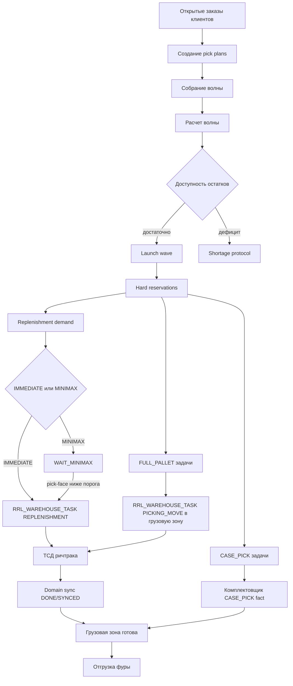
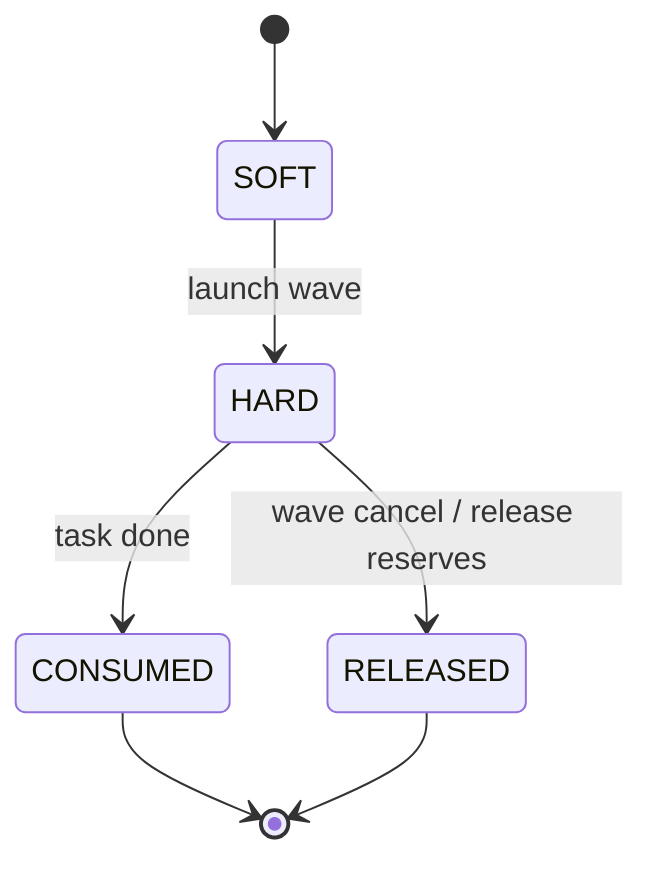
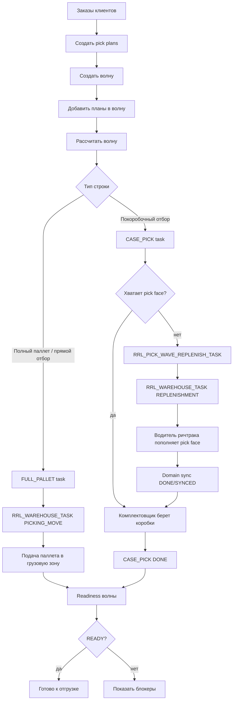

# ТЗ: пользовательские сценарии проверки волны, резервов, ричтраков и отгрузки фуры

Статус: техническое задание на функциональную проверку и последующую автоматизацию.

Дата: 2026-05-19.

Связанные документы:

- [Сборка по волнам / Wave Picking](wave_picking_tz.md)
- [Пополнение ячеек отбора под покоробочную комплектацию волны](wave_case_pick_replenishment_tz.md)
- [Складские задания для водителей ричтраков](warehouse_tasks_reachtruck_tz.md)
- [Доменная синхронизация складских заданий](warehouse_task_domain_sync_tz.md)
- [API Method Library](../concepts/api_method_library.md)

## 1. Назначение

Нужно проверить продукт не только техническими unit/load сценариями, а как пользовательский складской процесс:

1. Собрание волны из заказов.
2. Запуск волны комплектации с проверкой резервов, ричтраков и коллизий пополнения.
3. Отгрузка фуры.

Главное правило архитектуры сохраняется:

```text
Волна является управляющим документом комплектации.
Ричтрак-задачи для пополнения и грузовой зоны идут через RRL_WAREHOUSE_TASK.
TASK_SOURCE = WAVE
SOURCE_DOC_TYPE = PICK_WAVE
```

Заказ на отгрузку и фура являются контекстом выполнения волны, но не заменяют `PICK_WAVE` как источник ричтрак-задачи.

## 2. Общая схема процесса



## 3. Роли

- Оператор волны: выбирает заказы, рассчитывает и запускает волну.
- Диспетчер склада: смотрит пополнения, staging, ошибки, retry.
- Водитель ричтрака: выполняет `REPLENISHMENT` и `PICKING_MOVE` на ТСД.
- Комплектовщик: подтверждает `CASE_PICK` факт.
- Оператор отгрузки: проверяет готовность грузовой зоны и закрывает отгрузку фуры.
- Тестировщик: фиксирует фактические API/Oracle результаты и скриншоты.

## 4. Сквозные проверки

Во всех сценариях обязательно проверять:

- API audit пишет вызовы;
- Oracle invalid objects = `0`;
- нет дублей `RRL_WAREHOUSE_TASK` по одному `SOURCE_TASK_ID`;
- hard reservations не остаются зависшими после `DONE` или отмены;
- `RRL_WAREHOUSE_TASK_SYNC` доходит до `SYNCED` для поддержанных handlers;
- повторный API-вызов release/complete не создает повторных доменных фактов;
- пользователь видит понятный статус: рассчитано, запущено, пополняется, готово к отбору, готово к отгрузке, ошибка.

## 5. Сценарий 1. Собрание волны из заказов

### 5.1. Бизнес-цель

Оператор должен собрать волну из набора открытых заказов клиентов и увидеть preview до запуска:

- какие заказы войдут;
- какие строки будут собираться полным паллетом;
- какие строки пойдут в покоробочный отбор;
- где есть дефицит;
- какие резервы будут созданы после запуска.

### 5.2. Предусловия

В тестовой базе должны быть:

- минимум `3` открытых заказа клиентов;
- минимум `2` клиента;
- минимум `3` артикула;
- один артикул подходит под полный паллет;
- один артикул идет в `CASE_PICK`;
- один артикул имеет потенциальный дефицит pick face;
- для части клиентов заданы требования по остаточному сроку годности, например `70%` и `50%`.

### 5.3. Пользовательский поток

1. Оператор открывает экран волн.
2. Фильтрует открытые заказы по складу, дате отгрузки, маршруту или вручную выбирает заказы.
3. Создает новую волну.
4. Добавляет выбранные pick plans или заказы в волну.
5. Нажимает `Рассчитать`.
6. Система показывает preview.
7. Оператор проверяет:
   - количество заказов;
   - количество клиентов;
   - full-pallet строки;
   - case-pick строки;
   - дефициты;
   - будущие пополнения;
   - будущие staging-задачи.

### 5.4. API

Минимальный API-путь:

```text
POST /api/picking/plans
POST /api/picking/waves
POST /api/picking/waves/{pick_wave_id}/plans
POST /api/picking/waves/{pick_wave_id}/calculate
GET  /api/picking/waves/{pick_wave_id}
GET  /api/picking/waves/{pick_wave_id}/tasks
GET  /api/picking/waves/{pick_wave_id}/replenishment-tasks
GET  /api/picking/waves/{pick_wave_id}/reservations
```

### 5.5. Oracle-проверки

Проверить:

- `RRL_PICK_WAVE`: создана волна, статус после расчета не `CANCELLED`;
- `RRL_PICK_WAVE_ORDER`: заказы привязаны к волне;
- `RRL_PICK_WAVE_LINE`: строки рассчитаны;
- `RRL_PICK_WAVE_TASK`: есть `FULL_PALLET` и `CASE_PICK`, если остатки позволяют;
- `RRL_PICK_WAVE_DEMAND`: сформирована потребность по pick face;
- `RRL_PICK_WAVE_SHORTAGE`: дефициты записаны, если есть;
- на этапе preview hard reservations еще не должны занимать физический остаток, если текущая реализация не запускает wave.

### 5.6. Критерии приемки

- Оператор может собрать волну из нескольких заказов.
- Preview показывает понятную картину full-pallet, case-pick, replenishment и shortage.
- Заказы сверх лимитов клиентов/строк/паллет не запускаются без отдельного права.
- Повторное добавление одного pick plan в ту же волну не создает дубль.

## 6. Сценарий 2. Запуск волны комплектации, резервы, ричтраки и коллизии пополнения

### 6.1. Бизнес-цель

После запуска волны система должна:

- создать hard reservations;
- не дать другим волнам забрать тот же остаток;
- создать задачи ричтрака на пополнение pick face;
- создать задачи ричтрака на подачу полного паллета в грузовую зону;
- корректно выдержать коллизии, когда один артикул нужно пополнить много раз.

Обязательная коллизия:

```text
Один артикул требует коробочного отбора в таком объеме,
что пополнение pick face должно выпускаться 10 раз.
```

Это может быть достигнуто через:

- `MINIMAX` с малой емкостью pick face и порогом релиза;
- или через несколько доменных строк пополнения по одному SKU;
- или через цикл: CASE_PICK факт снижает остаток, Minimax выпускает следующую задачу.

### 6.2. Предусловия

Для теста нужен контролируемый артикул:

- `ARTICUL = LOAD-WAVE-COLLISION-SKU`;
- в хранении минимум `10` паллет-источников или один крупный источник, если сценарий допускает частичный `BOX`;
- pick face настроен на малую емкость;
- `REPLENISHMENT_METHOD = MINIMAX`;
- `REPLENISHMENT_QTY_MODE = FILL_TO_VOLUME` или `FULL_PALLET`, в зависимости от варианта проверки;
- trigger <= один слой;
- в волне есть case-pick потребность, превышающая емкость pick face примерно в `10` циклов.

### 6.3. Пользовательский поток

1. Оператор запускает рассчитанную волну.
2. Система создает hard reservations для:
   - full-pallet отбора;
   - case-pick задач;
   - source pallets для released replenishment.
3. Оператор открывает пополнения волны.
4. Для `IMMEDIATE` строки сразу видны `RRL_WAREHOUSE_TASK REPLENISHMENT`.
5. Для `MINIMAX` строки сначала в `WAIT_MINIMAX`.
6. Комплектовщик подтверждает `CASE_PICK` факт.
7. Система пересчитывает pick-face free stock.
8. При достижении порога выпускается следующая ричтрак-задача.
9. Водитель ричтрака выполняет задачу через ТСД:
   - `assign`;
   - `start`;
   - scan pallet;
   - scan from cell;
   - scan to cell;
   - `complete`.
10. Handler закрывает доменную строку пополнения и гасит source reservation.
11. Цикл повторяется до `10` пополнений по одному SKU.

### 6.4. Проверка ричтраков

Для каждой задачи `REPLENISHMENT`:

- `TASK_SOURCE = WAVE`;
- `SOURCE_DOC_TYPE = PICK_WAVE`;
- `TASK_TYPE = REPLENISHMENT`;
- `SOURCE_TASK_ID = RRL_PICK_WAVE_REPLENISH_TASK.PICK_WAVE_REPLENISH_TASK_ID`;
- `UID_PALLET` заполнен;
- `FROM_CELL` заполнен;
- `TO_CELL` = pick face;
- `QTY_MODE = PALLET` или `BOX`;
- после `complete` статус `DONE`;
- `RRL_WAREHOUSE_TASK_SYNC.SYNC_STATUS = SYNCED`.

Для full-pallet staging:

- release через `POST /api/picking/waves/{pick_wave_id}/staging/release`;
- создается `PICKING_MOVE`;
- повторный release не создает дубль;
- параллельный release не дает `ORA-00001` наружу;
- после выполнения `RRL_PICK_WAVE_TASK.STATUS = DONE`.

### 6.5. Проверка резервов

Проверить жизненный цикл:



Oracle-проверки:

- до запуска нет конфликтующих hard reservations;
- после запуска есть `HARD` по конкретным паллетам/ячейкам;
- source reservation пополнения создается до warehouse task;
- после успешного `REPLENISHMENT` reservation становится `CONSUMED`;
- после успешного `PICKING_MOVE` picking reservations становятся `CONSUMED`;
- отмена волны до физического старта переводит активные reservations в `RELEASED`;
- нет активных hard reservations на один и тот же pallet/qty в двух активных волнах.

### 6.6. Коллизии

Обязательные negative/concurrent проверки:

1. Две волны одновременно пытаются взять один и тот же паллет.
   - Ожидание: только одна получает hard reservation, вторая получает shortage или альтернативный паллет.
2. Два оператора одновременно нажимают staging release.
   - Ожидание: дублей `PICKING_MOVE` нет.
3. Один SKU выпускает 10 пополнений.
   - Ожидание: создаются 10 доменных строк и 10 source reservations; одновременно активна только первая конфликтующая водительская задача для fixed pick face, а остальные ждут `QUEUED` / `WAIT_MINIMAX`.
   - Если есть свободная неприкрепленная dynamic/generic ячейка отбора, следующая часть поддонов сразу выпускается водителю в эту ячейку и не ждет Minimax fixed-ячейки.
   - Нет дублей по `SOURCE_TASK_ID`, нет зависших reservations, все выполненные sync rows `SYNCED`.
4. Водитель сканирует неправильный паллет.
   - Ожидание: API возвращает бизнес-ошибку, задача остается открытой.
5. Водитель закрывает `BOX` частично.
   - Ожидание: создается residual warehouse task с `PARENT_TASK_ID`.
6. Водитель пытается частично закрыть `PALLET`.
   - Ожидание: API отклоняет частичный факт.

### 6.7. API/load автотест

Нужен новый сценарий или расширение существующих:

```text
tests/load/wave/wave_user_scenarios_load_test.py
```

Минимальные режимы:

```text
--scenario assemble-wave
--scenario launch-reserves-reachtruck
--scenario replenishment-collision-10x
--scenario truck-shipment
```

Для текущих уже реализованных частей можно переиспользовать:

- `tests/load/wave/wave_replenishment_load_test.py`
- `tests/load/wave/wave_staging_load_test.py`

### 6.8. Критерии приемки

- Волна запускается и создает корректные hard reservations.
- Ричтрак-задачи создаются только в `RRL_WAREHOUSE_TASK`.
- `10` пополнений одного SKU не создают дублей и не оставляют зависших hard reservations.
- Повторные и параллельные release-команды идемпотентны.
- Все выполненные ричтрак-задачи имеют `DONE/SYNCED`.
- Неверные сканы не закрывают задачи.

## 7. Сценарий 3. Отгрузка фуры

### 7.1. Бизнес-цель

После выполнения волны товар должен быть физически готов в грузовой зоне, а оператор должен отгрузить фуру:

- проверить, что все full-pallet задачи поданы в staging/loading zone;
- проверить, что case-pick задачи выполнены;
- проверить, что пополнения не блокируют отбор;
- подтвердить загрузку фуры;
- закрыть отгрузочный шаг без прямого ручного изменения остатков.

### 7.2. Архитектурное правило

`SHIPMENT` не становится владельцем ричтрак-задач.

Фура и shipment document должны ссылаться на волну:

```text
SHIPMENT -> PICK_WAVE -> RRL_WAREHOUSE_TASK
```

Для ричтрака остается:

```text
TASK_SOURCE = WAVE
SOURCE_DOC_TYPE = PICK_WAVE
TASK_TYPE = PICKING_MOVE
TO_CELL = грузовая зона
```

### 7.3. Недостающий доменный слой

Сейчас реализован runtime для подачи full-pallet в грузовую зону через `PICKING_MOVE`.

Для полноценной отгрузки фуры нужно отдельное ТЗ/инкремент на shipment lifecycle. Минимальные сущности-кандидаты:

- `RRL_SHIPMENT`;
- `RRL_SHIPMENT_WAVE`;
- `RRL_SHIPMENT_LOAD_UNIT`;
- `RRL_SHIPMENT_EVENT`;
- `RRL_SHIPMENT_DOCUMENT`;

Минимальные статусы shipment:

- `DRAFT`;
- `PLANNED`;
- `LOADING`;
- `LOADED`;
- `DISPATCHED`;
- `CANCELLED`;
- `ERROR`.

### 7.4. Пользовательский поток

1. Оператор открывает экран отгрузки.
2. Выбирает фуру или создает shipment по маршруту/воротам/дате.
3. Привязывает одну или несколько волн.
4. Система показывает готовность:
   - full-pallet staged;
   - case-pick done;
   - replenishment done;
   - shortages;
   - sync errors;
   - Mercury/CRPT readiness, если применимо.
5. Оператор переводит shipment в `LOADING`.
6. На погрузке сканируются паллеты/короба.
7. Система сверяет сканы с волной и reservations.
8. После подтверждения все load units получают статус `LOADED`.
9. Оператор закрывает фуру как `DISPATCHED`.
10. Событие уходит в WMS bridge/outbox/traceability.

### 7.5. Проверки готовности перед загрузкой

Фура не должна быть закрыта, если:

- есть незакрытые `REPLENISHMENT`;
- есть незакрытые `PICKING_MOVE`;
- есть `CASE_PICK` не `DONE`;
- есть `RRL_WAREHOUSE_TASK_SYNC` в `ERROR`;
- есть shortage по обязательной строке;
- есть active hard reservations без linked done task;
- required regulatory data не готова, если товар регулируемый.

### 7.6. API MVP для будущего инкремента

Кандидаты:

```text
POST /api/shipments
GET  /api/shipments
GET  /api/shipments/{shipment_id}
POST /api/shipments/{shipment_id}/waves
GET  /api/shipments/{shipment_id}/readiness
POST /api/shipments/{shipment_id}/start-loading
POST /api/shipments/{shipment_id}/load-units/{load_unit_id}/scan
POST /api/shipments/{shipment_id}/dispatch
POST /api/shipments/{shipment_id}/cancel
```

### 7.7. Oracle-проверки

Будущий shipment-инкремент должен проверять:

- shipment связан с wave;
- все load units имеют источник из wave task/reservation;
- pallet/SSCC не погружен дважды;
- dispatch невозможен при незакрытых задачах;
- dispatch создает trace/outbox событие;
- audit фиксирует оператора и время.

### 7.8. Критерии приемки

- Оператор видит готовность фуры по волне.
- Нельзя закрыть отгрузку при незавершенной комплектации.
- Скан паллета сверяется с ожидаемыми wave tasks.
- Повторный скан одного паллета не создает дубль погрузки.
- Закрытие фуры создает единый факт `DISPATCHED`.
- Старые остатки меняются только через согласованный WMS bridge.

## 8. Итоговый Definition Of Done

Пакет пользовательских сценариев считается готовым, когда:

- есть ручной чек-лист для каждого из трех сценариев;
- есть автоматизированный load/smoke сценарий хотя бы для сценариев 1 и 2;
- сценарий 2 покрывает коллизию `10` пополнений одного SKU;
- staging release проверен под параллельными запросами;
- shipment readiness описан и не противоречит wave-first архитектуре;
- все найденные ошибки фиксируются в wiki/log и закрываются отдельными инкрементами;
- после прогонов `Oracle invalid objects = 0`;
- cleanup тестовых данных оставляет `LOAD-WAVE-* = 0`.

## 9. Клиентский Сквозной Сценарий: Волна, Пополнение, Стеллаж, Коробка

Статус: сценарий клиентской приемки для демонстрации полного процесса комплектации.

Детализированный отдельный документ: [Клиентский сценарий приемки волны, пополнения, стеллажа и покоробочного отбора](wave_client_e2e_acceptance_scenario.md).

Цель: показать клиенту не внутренние таблицы, а рабочий складской маршрут от создания волны до готовности комплектации.

Сценарий должен одновременно проверить четыре процесса:

1. Создание волны.
2. Пополнение ячеек отбора под волну.
3. Комплектация напрямую со стеллажа.
4. Покоробочная комплектация из ячейки отбора.

### 9.1. Схема Процесса



### 9.2. Тестовые Данные

Нужно подготовить одну волну с минимум тремя строками:

| Строка | Назначение | Ожидаемое поведение |
| --- | --- | --- |
| SKU-A | Пополнение pick face | В pick face не хватает остатка, создается `REPLENISHMENT` |
| SKU-B | Комплектация напрямую со стеллажа | Создается `FULL_PALLET` / `PICKING_MOVE` из хранения в грузовую зону |
| SKU-C | Покоробочная комплектация | Создается `CASE_PICK`, коробки отбираются из pick face |

Дополнительно для приемки желательно:

- для SKU-A иметь несколько source pallets в разных ячейках;
- для SKU-A сделать deficit так, чтобы хотя бы одна строка пополнения была водительской;
- для SKU-B иметь целый паллет, который не должен идти через pick face;
- для SKU-C иметь достаточный остаток в pick face, чтобы сценарий отличался от SKU-A;
- для одного клиента задать `MIN_SHELF_LIFE_PERCENT = 70`, для второго `50`, для третьего оставить без настройки.

### 9.3. Роли В Сценарии

- Оператор волны: создает и запускает волну.
- Водитель ричтрака: выполняет пополнение pick face и прямую подачу паллета со стеллажа.
- Комплектовщик: закрывает покоробочный `CASE_PICK`.
- Диспетчер: смотрит readiness и блокеры.
- Тестировщик: фиксирует скриншоты, API-ответы и Oracle-проверки.

### 9.4. Шаги Клиентской Приемки

#### Шаг 1. Создание Волны

Действия:

1. Создать или выбрать заказы клиентов.
2. Создать pick plans.
3. Создать волну.
4. Добавить планы в волну.
5. Нажать `Рассчитать`.

Ожидаемый результат:

- волна создана;
- заказы видны в составе волны;
- preview показывает `FULL_PALLET`, `CASE_PICK`, replenishment demand и shortage, если он есть;
- hard reservations еще не должны конфликтовать с другими волнами до запуска.

API:

```text
POST /api/picking/plans
POST /api/picking/waves
POST /api/picking/waves/{pick_wave_id}/plans
POST /api/picking/waves/{pick_wave_id}/calculate
GET  /api/picking/waves/{pick_wave_id}
```

#### Шаг 2. Запуск Волны

Действия:

1. Оператор нажимает `Запустить`.
2. Диспетчер открывает задачи волны.
3. Диспетчер открывает readiness волны.

Ожидаемый результат:

- создаются hard reservations;
- создаются `RRL_PICK_WAVE_TASK`;
- создаются доменные `RRL_PICK_WAVE_REPLENISH_TASK`;
- часть replenishment rows может быть `RELEASED`, часть может быть `QUEUED` / `WAIT_MINIMAX` / `WAIT_FREE_CELL`;
- readiness должен быть `BLOCKED`, пока есть незакрытые replenishment, staging или case-pick задачи.

API:

```text
POST /api/picking/waves/{pick_wave_id}/launch
GET  /api/picking/waves/{pick_wave_id}/tasks
GET  /api/picking/waves/{pick_wave_id}/replenishment-tasks
GET  /api/picking/waves/{pick_wave_id}/readiness
```

#### Шаг 3. Пополнение Ячейки Отбора Под Волну

Действия:

1. Водитель ричтрака берет задачу `REPLENISHMENT`.
2. Сканирует идентификатор паллеты.
3. Сканирует ячейку источника.
4. Сканирует ячейку отбора.
5. Закрывает задачу.

Ожидаемый результат:

- водительская задача имеет `TASK_TYPE = REPLENISHMENT`;
- `TASK_SOURCE = WAVE`;
- `SOURCE_DOC_TYPE = PICK_WAVE`;
- `SOURCE_TASK_ID` ссылается на `RRL_PICK_WAVE_REPLENISH_TASK`;
- после закрытия `RRL_WAREHOUSE_TASK.STATUS = DONE`;
- `RRL_PICK_WAVE_REPLENISH_TASK.STATUS = DONE`;
- `RRL_WAREHOUSE_TASK_SYNC.SYNC_STATUS = SYNCED`;
- source reservation становится `CONSUMED`;
- если есть следующая queued/minimax строка, она выпускается только после разрешающего условия.

API:

```text
GET  /api/warehouse-tasks?task_type=REPLENISHMENT
POST /api/warehouse-tasks/{task_id}/assign
POST /api/warehouse-tasks/{task_id}/start
POST /api/warehouse-tasks/{task_id}/complete
GET  /api/warehouse-tasks/domain-sync
```

#### Шаг 4. Комплектация Напрямую Со Стеллажа

Действия:

1. Оператор выпускает full-pallet staging.
2. Водитель ричтрака берет `PICKING_MOVE`.
3. Сканирует паллет, ячейку хранения и грузовую зону.
4. Закрывает задачу.

Ожидаемый результат:

- для строки создан `FULL_PALLET` wave task;
- водительская задача имеет `TASK_TYPE = PICKING_MOVE`;
- `FROM_CELL` = ячейка хранения;
- `TO_CELL` = грузовая зона;
- повторный staging release не создает дубль;
- после закрытия linked `RRL_PICK_WAVE_TASK.STATUS = DONE`;
- picking reservations по этому паллету становятся `CONSUMED`;
- sync доходит до `SYNCED`.

API:

```text
POST /api/picking/waves/{pick_wave_id}/staging/release
GET  /api/warehouse-tasks?task_type=PICKING_MOVE
POST /api/warehouse-tasks/{task_id}/assign
POST /api/warehouse-tasks/{task_id}/start
POST /api/warehouse-tasks/{task_id}/complete
```

#### Шаг 5. Покоробочная Комплектация

Действия:

1. Комплектовщик открывает `CASE_PICK`.
2. Сканирует ячейку отбора.
3. При необходимости сканирует паллет/остаток.
4. Указывает фактическое количество коробок.
5. Закрывает строку отбора.

Ожидаемый результат:

- `CASE_PICK` закрывается фактическим количеством;
- если `adjust_pick_face_stock = true` в отладочном сценарии, тест моделирует снижение остатка pick face;
- Minimax может выпустить следующую задачу пополнения после снижения остатка ниже порога;
- readiness перестает блокироваться по `CASE_PICK`, когда все строки закрыты.

API:

```text
GET  /api/picking/waves/{pick_wave_id}/tasks
POST /api/picking/waves/{pick_wave_id}/tasks/{pick_task_id}/complete
POST /api/picking/waves/{pick_wave_id}/replenishment/minimax-check
```

#### Шаг 6. Финальная Готовность

Действия:

1. Диспетчер открывает readiness.
2. Проверяет блокеры.
3. Если блокеров нет, фиксирует готовность волны к отгрузке.

Ожидаемый результат:

- `GET /api/picking/waves/{pick_wave_id}/readiness` возвращает `READY`;
- `open_replenishment_count = 0`;
- `open_staging_count = 0`;
- `open_case_pick_count = 0`;
- `sync_error_count = 0`;
- `shortage_count = 0`.

Если readiness возвращает `BLOCKED`, клиент должен увидеть понятную причину:

- не выполнено пополнение;
- не подан полный паллет;
- не закрыта покоробочная строка;
- ошибка domain sync;
- shortage.

### 9.5. Обязательные Negative Проверки

1. Водитель сканирует неправильный идентификатор паллеты.
   - Ожидание: задача не закрывается.
2. Водитель сканирует неправильную ячейку источника.
   - Ожидание: задача не закрывается.
3. Водитель сканирует неправильную целевую ячейку.
   - Ожидание: задача не закрывается.
4. Повторно нажать staging release.
   - Ожидание: дубль `PICKING_MOVE` не создается.
5. Попытаться закрыть волну/отгрузку при `BLOCKED` readiness.
   - Ожидание: операция запрещена или явно показывает блокеры.
6. Две параллельные волны пытаются взять один source pallet.
   - Ожидание: `source_reservation_duplicates = 0`.

### 9.6. Oracle-Проверки

Проверить таблицы:

- `RRL_PICK_WAVE`;
- `RRL_PICK_WAVE_ORDER`;
- `RRL_PICK_WAVE_TASK`;
- `RRL_PICK_WAVE_REPLENISH_TASK`;
- `RRL_PICK_WAVE_RESERVATION`;
- `RRL_STOCK_RESERVATION`;
- `RRL_WAREHOUSE_TASK`;
- `RRL_WAREHOUSE_TASK_SYNC`;
- `RRL_PICK_WAVE_SHORTAGE`.

Контрольные условия:

```text
duplicate RRL_WAREHOUSE_TASK by SOURCE_TASK_ID = 0
duplicate active source reservations by UID_PALLET = 0
invalid Oracle objects = 0
all completed warehouse tasks have SYNCED domain sync
readiness final status = READY
```

### 9.7. Автоматизация

Сценарий должен лечь в единый runner:

```text
tests/load/wave/wave_user_scenarios_load_test.py
```

Минимальные режимы:

```text
--scenario client-end-to-end
--with-replenishment
--with-full-pallet-staging
--with-case-pick
--with-negative-scans
--cleanup
```

До появления отдельного runner можно покрывать части сценария текущими тестами:

```text
tests/load/wave/wave_replenishment_load_test.py
tests/load/wave/wave_staging_load_test.py
```

## 10. Ближайший план реализации проверок

1. Сделать общий test runner `wave_user_scenarios_load_test.py`.
2. Реализовать режим `assemble-wave`.
3. Реализовать режим `launch-reserves-reachtruck`.
4. Реализовать режим `replenishment-collision-10x`.
5. Реализовать режим `client-end-to-end`: волна + replenishment + direct rack/full-pallet + case-pick + readiness.
6. Зафиксировать shipment readiness как read-only проверку поверх текущей волны.
7. После появления shipment tables/API реализовать сценарий `truck-shipment`.
